# Mermaid Architecture 작성

공통 규칙은 [mermaid-common.md](mermaid-common.md)에 있고 SKILL.md가 두 파일을 함께 읽게 안내한다. 서버·클라우드·저장소·기술 스택을 아이콘과 함께 설명할 때 `architecture-beta`를 사용한다. 구성은 Mermaid 원문으로 관리하고, 기존 배치를 정확히 유지해야 하는 도식은 블로그의 고정 배치 기능을 함께 사용한다. 문법은 [Mermaid Architecture](https://mermaid.js.org/syntax/architecture.html)를 참고한다.

## 목차

- 구성과 배치를 정하는 순서
- 기본 작성 예시: 문법, 그룹 연결, 자동 배치의 한계
- 아이콘·색상·크기: `ken:` 아이콘 목록, 선 분류 `kind`, 크기 상수
- 기존 고정 배치 수정: 배치 파일 표, JSON 항목
- 새 프로젝트에 재사용
- 아이콘 출처

## 구성과 배치를 정하는 순서

1. 원본 도식과 현재 코드·Compose·배포 워크플로를 대조한다. 사용자, 실행 환경, 외부 서비스, 저장소와 배포 도구를 목록으로 만든다.
2. 각 연결이 요청, 데이터 접근, 산출물 전달, 운영 제어 중 무엇인지 정한다. 자동·수동 배포, 평상시·확장 시 동작도 구분한다.
3. 실제 포함 관계에 맞게 영역을 나눈다. 클라우드 안의 VM, VM의 Compose, 외부 DB를 같은 경계로 합치지 않는다. 그룹은 같은 기술 이름을 모으기 위한 장식이 아니다.
4. 전체 구성을 한 장에 배치한다. 기존 도식을 변환할 때는 원본의 영역과 연결을 유지하고, 배포는 위쪽·실행은 가운데·운영 제어는 아래쪽처럼 읽는 순서를 잡는다.
5. 노드에는 짧은 제품명과 작은 아이콘을 사용한다. 긴 설명은 오른쪽 캡션이나 도식 아래 역할 표에 둔다. 선이 아이콘·이름·그룹 제목을 관통하지 않게 한다.

전체도를 런타임·배포 도식으로 임의 분할하거나, 원본에 있던 VPN·레지스트리·수동 운영 단계를 생략하지 않는다. 원본과 현재 구현이 다르면 확인한 차이를 본문에 명시한다.

## 기본 작성 예시

```mermaid
architecture-beta
    group host[Application host]
    group app(ken:docker)[Docker Compose] in host
    group storage[External data]
    service browser(ken:user)[Browser]
    service api(ken:spring)[Spring Boot] in app
    service db(ken:mysql)[MySQL] in storage
    browser:R -[HTTP]-> L:api
    api:R -[SQL]-> L:db
```

`group`은 영역, `service`는 구성 요소이며 `in`으로 소속을 지정한다. 연결점은 위 `T`, 아래 `B`, 왼쪽 `L`, 오른쪽 `R`이다. `a:R --> L:b`는 a의 오른쪽에서 b의 왼쪽으로 향하는 연결이다. 라벨은 `a:R -[HTTP]-> L:b`처럼 적는다.

`a:R --> L:b{group}`은 b가 속한 그룹 경계로 연결한다. 실제로 그룹 전체를 대상으로 하는 배포·제어일 때 사용하고, 특정 서비스 호출과 구분한다. 양방향 선은 실제 요청·응답을 함께 표현한다는 설명이 있을 때 사용한다. 고정 배치는 현재 단방향 연결을 기준으로 검증하므로 양방향 문법을 그대로 옮기지 않는다.

**자동 배치는 그룹이 겹치고 노드가 그룹 밖으로 나가는 등 품질이 낮다(2026-10-07 시험).** 문서에서 중요한 구성도(인프라·시스템 구조)는 고정 배치로 그리고, 로고가 필요 없는 계층·흐름은 flowchart로 그린다. 자동 배치에서 `align row`·`align column`을 사용할 수 있지만 선언 순서와 방향 지정만으로 원하는 좌표가 보장되지는 않는다. 정렬 조건을 과도하게 추가하기 전에 영역과 연결을 단순하게 정리한다.

## 아이콘·색상·크기

블로그의 `ken:` 팩은 필요한 SVG를 번들에 포함한다. 원격 Iconify/CDN 팩은 본문에서 불러오지 않는다. 기본 아이콘 `cloud`, `database`, `disk`, `internet`, `server`도 사용할 수 있다.

| 용도 | 사용할 수 있는 `ken:` 이름 |
| --- | --- |
| 소스·빌드 | `git`, `github`, `github-actions` |
| 애플리케이션 | `spring`, `kotlin`, `fastapi`, `playwright`, `nodejs`, `nextjs`, `nestjs` |
| 데이터 | `mysql`, `redis`, `neo4j`, `rds`, `postgresql`, `google-sheets` |
| 실행 환경·진입점 | `docker`, `caddy`, `proxmox`, `fargate`, `alb`, `vpn`, `google-cloud`, `wireguard` |
| 배포·제어 | `ecr`, `cloudwatch`, `eventbridge`, `lambda`, `route53` |
| 사용자·디스크 | `user`, `disk` |

아이콘 추가 시 [SVG 팩](../../../../src/main/resources/web/shared/architecture-icons.json)과 [허용 목록](../../../../src/main/resources/web/shared/mermaid-architecture.ts)을 함께 수정한다. 원본 너비·높이와 종횡비를 보존하고 출처·라이선스를 확인한다. 없는 아이콘을 임의의 외부 팩 이름으로 참조하지 않는다.

영역 색상과 다크 모드 대응은 공용 렌더러가 관리한다. 로고는 흰 타일에 놓고 이름 뒤에는 배경판을 둔다. 본문에 임의 CSS를 넣지 않는다. 고정 배치의 연결선은 다음 분류를 사용한다.

| `kind` | 표시 | 뜻 |
| --- | --- | --- |
| `read` | 파랑 굵은 실선(3px) | 독자 열람 |
| `runtime` | 회색 계열 실선 | 요청·실행·데이터 접근 |
| `delivery` | 초록 점선 | 빌드·산출물 전달 |
| `control` | 보라 점선 | 제어·운영 반영 |
| `reference` | 회색 계열 점선 | DNS 등 보조 조회 |

자동 배치의 선에 위 색상이 자동 적용되는 것은 아니다. 각 도식에서 사용하는 의미를 범례로 설명한다.

서비스 로고는 `ARCHITECTURE_ICON_SIZE=36`px, 타일은 44px다. `ARCHITECTURE_LAYOUT.iconSize=48`px는 이름 줄바꿈과 자동 배치를 위한 영역이며 실제 로고 크기와 구분한다. 자동 배치 글자는 13px다. 이 값은 공통 설정이므로 바꾸면 기존 아키텍처도 확인한다. 고정 배치의 제목·캡션 크기는 [배치 렌더러](../../../../src/main/resources/web/shared/mermaid-reference-layout.ts)의 `label` 호출에서 관리한다.

## 기존 고정 배치 수정

| 원고 주석 | 배치 파일 | 원고 |
| --- | --- | --- |
| `%% layout: vowser-infrastructure` | [Vowser JSON](../../../../src/main/resources/web/shared/vowser-architecture-layout.json) | [Vowser](../../../../content/posts/project-8d420603-48bb-4e29-8983-e08a6e649f80.md) |
| `%% layout: ken-blog-infrastructure` | [ken-blog 인프라 JSON](../../../../src/main/resources/web/shared/ken-blog-architecture-layout.json) | [ken-blog 대문·아키텍처](../../../../content/posts/doc-340352c9-5fde-4bae-bc0b-4ecd744719a8.md) |
| `%% layout: ken-blog-system` | [ken-blog 시스템 구조 JSON](../../../../src/main/resources/web/shared/ken-blog-system-layout.json) | [ken-blog 아키텍처](../../../../content/posts/doc-340352c9-5fde-4bae-bc0b-4ecd744719a8.md) |
| `%% layout: vowser-system` | [Vowser 시스템 구조 JSON](../../../../src/main/resources/web/shared/vowser-system-layout.json) | [Vowser 아키텍처](../../../../content/posts/doc-fd568125-2806-4210-a0b2-e4bf2d1b509e.md) |
| `%% layout: npr-infrastructure` | [npr 인프라 JSON](../../../../src/main/resources/web/shared/npr-infrastructure-layout.json) | [npr 대문·아키텍처](../../../../content/posts/doc-71ac4b10-9f99-4251-893d-a57dd46ad334.md) |
| `%% layout: npr-system` | [npr 시스템 구조 JSON](../../../../src/main/resources/web/shared/npr-system-layout.json) | [npr 아키텍처](../../../../content/posts/doc-71ac4b10-9f99-4251-893d-a57dd46ad334.md) |

주석은 `architecture-beta` 다음 줄에 둔다. Mermaid 초기화 전에 원고와 배치의 일치를 검증하고, 렌더링 후 검증된 SVG에 좌표·선 경로·설명을 적용한다. 다른 Mermaid 뷰어는 구성과 연결을 읽을 수 있지만 이 사이트의 배치 주석과 `ken:` 팩을 자동 제공하지 않는다.

| JSON 항목 | 수정할 내용 |
| --- | --- |
| `width`, `height` | 범례와 설명을 포함한 전체 크기 |
| `groups` | 그룹 ID별 `[x, y, width, height, 표시 제목]` |
| `services` | 서비스 ID별 `[x, y, 설명]`; 이름·로고는 원문에서 가져옴 |
| `members`, `parents` | 서비스·그룹 소속; 최상위는 빈 문자열 |
| `sourceGroups`, `sourceEdges` | 원고의 그룹·연결 선언을 공백 정규화한 한 줄 문자열 목록 |
| `edges` | `source`, `target`, `groupTarget`, 경로 `points`, 선 분류 `kind`, 문구 `label`, 문구 좌표 `at` |
| `legend` | 범례 항목의 `kind`, `title`. 범례는 도식 오른쪽 아래 상자에 자동 배치되므로 좌표를 넣지 않음. 상자 높이만큼 오른쪽 아래를 비워 둠 |

그룹·연결 문구나 방향이 바뀌면 원고, `sourceGroups`·`sourceEdges`, 실제 표시 제목·문구·경로를 함께 갱신한다. 공백과 선언 순서는 정규화하지만 문구·아이콘·방향·중복 개수는 검사한다. 검증 목록만 바꿔 낡은 번역이나 연결 경로를 그대로 두지 않는다.

`points`는 출발점부터 화살표 끝까지의 SVG 좌표다. 마지막 구간이 화살표 방향을 결정하므로 원문의 대상·입출력 방향과 함께 확인한다. 아이콘 크기만 줄이는 것과 영역·선 좌표를 재배치하는 작업은 구분한다.

## 새 프로젝트에 재사용

1. 위 기본 예시로 사실에 맞는 원문을 작성한다. 자동 배치로 충분하면 `layout` 주석 없이 사용한다.
2. 위치를 고정해야 하면 기존 JSON을 형식 참고용으로 복사하고, 해당 프로젝트의 노드·소속·연결·표시 문구·좌표로 전부 교체한다.
3. 배치 렌더러의 `REFERENCE_LAYOUTS`에 새 JSON과 고유 이름을 등록한다. 기존 프로젝트 이름을 재사용하지 않는다.
4. 원고에 등록한 이름의 `%% layout: ...` 주석을 한 번만 넣는다. 주석만 추가해서 새 배치가 만들어지지는 않는다.
5. [Mermaid 검사](../../../../.github/pages/mermaid.test.mjs)를 참고해 원고·배치 일치와 잘못된 연결·배치 선택의 거부를 확인한다. 필요한 경우 해당 회귀 검사를 추가한다.
6. 공통 가이드의 화면 확인 절차에 따라 전체도, 밝은·어두운 테마, 모바일과 확대를 확인한다. 원본과 노드·관계 수를 대조하고, 새 배치 이름과 근거 자료를 이 문서에 기록한다.

## 아이콘 출처

기존 로고는 `@iconify-json/logos` 1.2.10(CC0), Caddy·Proxmox는 `@iconify-json/simple-icons` 1.2.98(CC0), 사용자·디스크는 `@iconify-json/lucide` 1.2.139(ISC)에서 가져왔다. Lucide 고지는 [라이선스 파일](../../../../src/main/resources/web/public/licenses/lucide.txt)에 있으며 `/licenses/lucide.txt`로 배포한다. 단색 아이콘의 `currentColor`는 고정 색으로 치환했다.

ECR·ALB·VPN은 [AWS Architecture Icons](https://aws.amazon.com/architecture/icons/)의 2026-07-31 패키지에서 가져왔다. 원본 도형·색상을 유지하고 사용하지 않는 ID·제목·XML 접두사만 정리했다. 로고는 기술·서비스를 식별하는 용도로 사용한다.

Node.js(`nodejs`)는 `@iconify-json/logos`의 `nodejs-icon`(CC0)을 2026-10-07 Iconify API에서 가져왔다.

NestJS·PostgreSQL·Google Cloud는 `@iconify-json/logos`(CC0), Next.js(`nextdotjs`)·WireGuard·Google Sheets(`googlesheets`)는 `@iconify-json/simple-icons`(CC0)에서 2026-10-09 Iconify API로 가져왔다. 단색 아이콘의 `currentColor`는 각 브랜드 색(Next.js `#000000`, WireGuard `#88171A`, Google Sheets `#34A853`)으로 치환했다.
