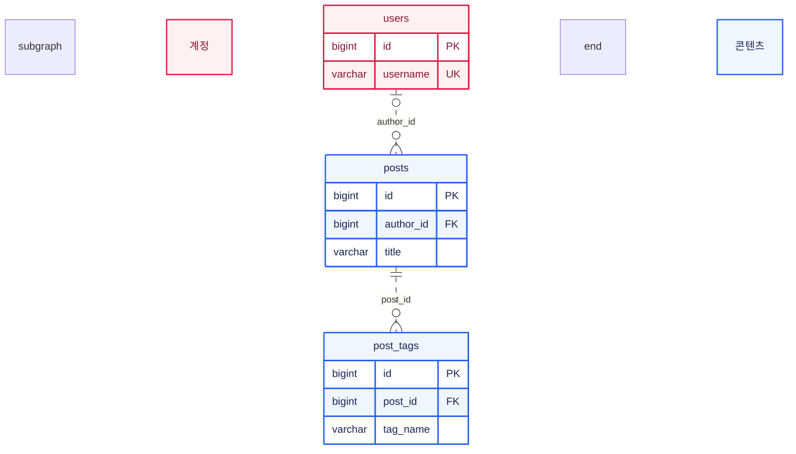

# ERD 작성

[Mermaid 공통 가이드](mermaid-common.md)를 먼저 읽는다. 이 문서는 테이블 관계를 `erDiagram`으로 그릴 때 확인할 사실, 표기와 글의 구성을 설명한다. 기본 문법은 [Mermaid ERD 문서](https://mermaid.js.org/syntax/entityRelationshipDiagram.html)를 참고하되, 블로그의 고정 버전과 렌더러에서 동작하는지 확인한다.

## 스키마를 먼저 확인

- 실제 테이블명, PK·FK·UK, FK의 nullable 여부, 복합 키와 삭제 규칙을 확인한다. 테이블 이름이나 업무상 연관성만 보고 FK를 만들지 않는다.
- JPA 엔티티·생성 DDL·운영 스키마를 대조한다. Spring Session처럼 JPA 밖에서 관리하는 테이블도 범위에 포함되는지 확인한다. 생성 DDL과 운영 DB가 같다고 가정하지 않는다.
- 현재 사용하는 모델인지, 운영 DB의 모든 보존 테이블까지 포함하는지 명시한다. 제외한 과거 테이블·외부 파일 저장소는 본문에서 설명한다.
- 물리 ERD는 실제 FK를 선으로 표시한다. 코드에서만 사용하는 논리적 연결은 별도 설명으로 남긴다. 논리 모델을 그릴 경우에는 그 범위를 먼저 명시한다.

ken-blog의 근거는 [도메인 코드](../../../../src/main/java), [영속성 ADR](../../../../docs/ADR/ADR_persistence.md), [기존 ERD 원고](../../../../content/posts/post-f9235d74-4d5b-4705-8f59-ba3511bd50e9.md)를 함께 읽는다.

## 전체도와 상세 설명

글 위쪽에는 전체 ERD를 한 장으로 둔다. 역할별 그룹을 만들고, 전체도에는 PK·FK와 관계를 이해할 주요 컬럼을 우선 표시한다. 아래에는 같은 색상을 사용하는 부분 ERD와 테이블 설명을 둔다. 확대를 지원하므로 처음부터 모든 컬럼을 크게 표시할 필요는 없다.

테이블 설명에는 다음을 적는다.

| 항목 | 설명할 내용 |
| --- | --- |
| 책임 | 어떤 데이터를 저장하며 누가 읽고 변경하는가 |
| 식별자·고유 제약 | PK, 단일·복합 UK, 외부에 노출되는 식별자 |
| 관계 | FK 대상, 선택 관계, 연결 테이블의 역할 |
| 업무 규칙 | 상태·순서·범위, DB와 애플리케이션 중 검사하는 위치 |
| 수명 | 삭제·연결 해제 시 동작, 보존하는 데이터 |

## 관계 표기

선의 양 끝은 각각 상대 행에 연결될 수 있는 개수를 뜻한다. 왼쪽과 오른쪽에서 기호의 순서가 달라진다.

- 정확히 하나: 왼쪽 `||`, 오른쪽 `||`.
- 없거나 하나: 왼쪽 `|o`, 오른쪽 `o|`.
- 없거나 여러 개: 왼쪽 `}o`, 오른쪽 `o{`.
- 하나 이상: 왼쪽 `}|`, 오른쪽 `|{`.

물리 스키마에서는 부모의 키가 자식의 PK에 포함되는 식별 관계에 `--`, 별도 PK를 갖는 비식별 관계에 `..`을 사용한다. nullable과 선 종류는 서로 다른 기준이다. 삭제 CASCADE 여부만으로 식별 관계를 결정하지 않는다.

예를 들어 `users |o..o{ posts : author_id`는 글의 작성자가 없거나 한 명이고, 사용자는 글을 0개 이상 가질 수 있다는 뜻이다. 필수 작성자 FK라면 왼쪽을 `||`로 바꾼다. FK가 존재한다는 사실만으로 부모에게 반드시 자식이 하나 이상 있다고 표시하지 않는다.

컬럼은 `타입 이름 키` 순서로 적는다. 기본 키는 `PK`, 외래 키는 `FK`, 고유 키는 `UK`이며 한 컬럼에 여러 역할이 있으면 `PK, FK`처럼 적는다. 복합 PK·UK의 묶음은 본문에 정확한 컬럼 조합을 설명한다.

## 작성 예시

다음은 문법을 설명하기 위한 가상 게시판 스키마다. `posts.author_id`는 nullable이고, `post_tags.post_id`는 필수 FK이며 두 자식 테이블 모두 별도 `id` PK를 갖는다.

블로그는 ERD를 ELK로 배치한다. 원문에 별도 배치 설정을 넣지 않는다. 역할별 `subgraph`에는 제목을 붙이고 테이블과 그룹에 같은 클래스를 지정한다.

## 색상과 선 정리

ken-blog에서 쓰는 역할 색상은 콘텐츠 파랑, 탐색 청록, 기술 스택 보라, 이미지 주황, 계정·인증 분홍, 운영 상태 회색이다. 같은 글의 전체도·상세도에서 이 대응을 유지한다. 새 프로젝트는 그 프로젝트의 역할에 맞는 색 대응을 먼저 정한다.

ERD 범례 상자에는 관계 표기만 넣는다: `%% legend: solid=식별 관계; dotted=비식별 관계; zero=없을 수 있음; many=여러 개`. 영역 색은 그룹 제목이 이미 이름을 보여 주므로 범례에 넣지 않는다(D-038).

교차선이 많으면 그룹·방향과 컬럼 수를 조정한다. 전체도의 실제 FK를 빼거나 관계를 바꿔 선을 줄이지 않는다. 상세도에서 다른 영역의 관계를 생략했다면 범위를 설명하고 전체도로 연결한다. 다대다 관계가 실제 연결 테이블로 구현되어 있으면 해당 테이블과 양쪽 FK를 표시한다.

## 검증

- 범위에 포함한 테이블 수와 목록, FK 대상과 nullable, PK·UK를 근거 자료와 대조한다.
- `PK, FK`와 복합 고유 제약의 설명이 실제 스키마와 일치하는지 확인한다.
- 고립된 테이블을 임의의 FK로 연결하지 않았는지 확인한다.
- 전체도·상세도의 색상과 관계가 일치하는지 확인한다.
- [공통 화면 확인 절차](mermaid-common.md#작성-후-확인)에 따라 실제 렌더링과 확대를 확인한다.
