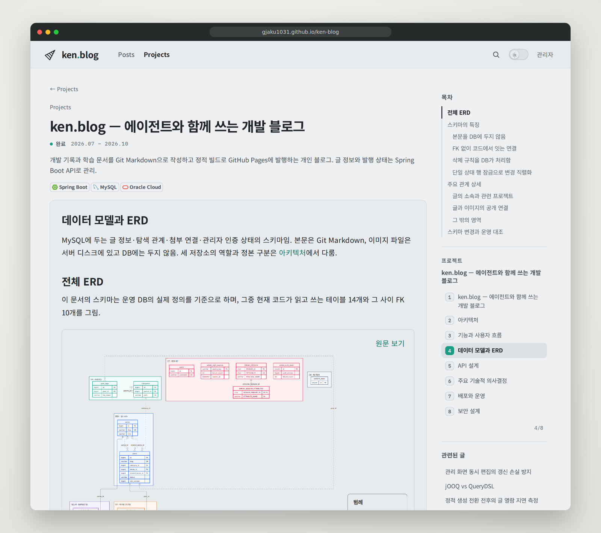
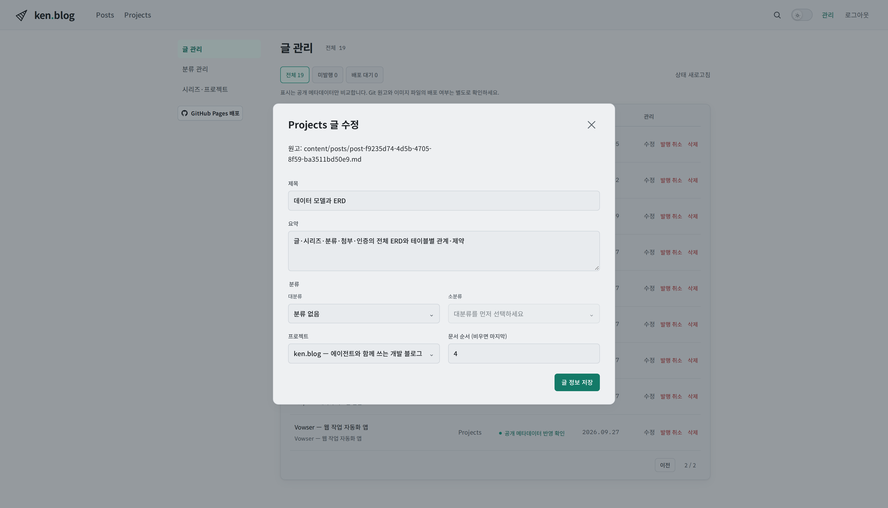
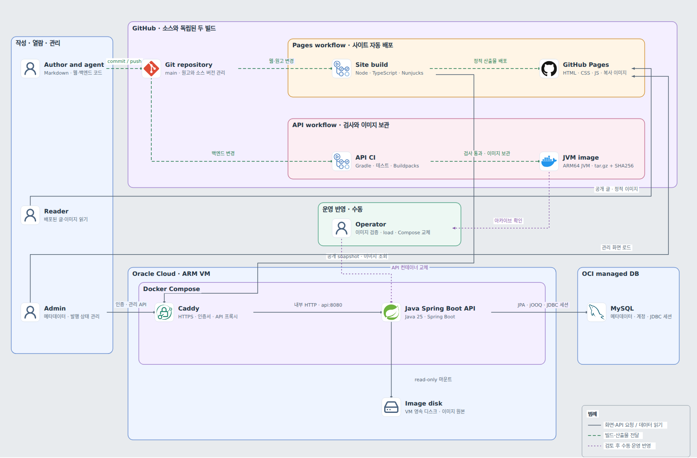

# ken.blog

프로젝트 경험과 학습 문서를 한곳에서 관리하는 개인 블로그. 원고는 이 저장소의 Markdown이고, 공개 화면은 빌드 시 정적 페이지로 만들어 GitHub Pages에 배포함.

- 블로그: https://gjaku1031.github.io/ken-blog/
- 프로젝트 소개(대문): https://gjaku1031.github.io/ken-blog/post/project-06840552-43a2-4870-83a9-d3e848c71d7e/

## 화면

<picture>
  <source media="(prefers-color-scheme: dark)" srcset="docs/images/readme/reader-dark.png">
  
</picture>

설계 문서 화면. 프로젝트 문서를 정한 순서로 읽고, 도식은 확대 보기로 세부를 확인함.

<picture>
  <source media="(prefers-color-scheme: dark)" srcset="docs/images/readme/admin-dark.png">
  
</picture>

관리 화면의 글 정보 편집. 본문은 Git 원고에서 고치고, 웹에서는 제목·요약·분류·소속·순서만 다룸.

## 핵심 문제와 결정

| 문제 | 결정 |
| --- | --- |
| P1 변경 추적성: 사람과 에이전트가 함께 고치는 원고의 변경을 검토하고 이력을 추적해야 함 | Git Markdown을 본문 정본으로 두고, API에는 본문 경로를 두지 않음 |
| P2 열람 성능: 해외 리전의 1코어 VM에서도 본문이 빠르게 보이고, 독자 요청이 서버 부하가 되지 않아야 함 | 공개 페이지를 빌드 시 정적 생성해 GitHub Pages로 제공 |
| P3 발행 일관성: Git 원고·DB 글 정보·디스크 이미지가 서로 다른 시점의 자료로 섞이지 않아야 함 | 공개 데이터의 revision을 빌드 전후로 비교하고, 검증을 통과한 산출물만 배포 |

대안과 대가, 검증은 [주요 기술적 의사결정](https://gjaku1031.github.io/ken-blog/post/doc-267e2237-7f38-4ea1-b04b-7c51d456c2b4/)에 있음.

## 아키텍처

<picture>
  <source media="(prefers-color-scheme: dark)" srcset="docs/images/readme/architecture-dark.png">
  
</picture>

- **열람**: 독자는 GitHub Pages의 정적 HTML을 읽음. 본문 표시에 API 요청이 필요 없음
- **관리**: Pages의 관리 화면이 Caddy를 거쳐 Spring Boot API를 호출하고, API가 MySQL과 이미지 디스크를 다룸
- **빌드**: Node 빌더가 Git 원고와 API의 공개 스냅샷·이미지를 모아 페이지를 만들고 Pages에 배포함. API 이미지는 CI가 만들고 운영자가 검토 후 교체함

구성 요소와 일관성 보장 범위는 [아키텍처](https://gjaku1031.github.io/ken-blog/post/doc-340352c9-5fde-4bae-bc0b-4ecd744719a8/)에 있음.

## 기술 스택

Java 25 · Spring Boot 4.1 · MySQL · Node 24 · TypeScript · Mermaid 12 · GitHub Actions · Docker Compose · Caddy

## 저장소 구조

| 경로 | 내용 |
| --- | --- |
| `src/main/java` | Spring Boot API. 기능별 패키지(`post`, `series`, `category`, `attachment`, `stack`, `auth`)와 빌드용 스냅샷·배포 실행(`pages`) |
| `src/main/resources/web` | 공개 사이트·관리 화면의 TypeScript·템플릿·CSS와 Markdown·Mermaid 렌더러 |
| `content/posts` | 게시 원고(Markdown). 파일 이름이 글 주소 |
| `.github/pages` | 정적 사이트 빌더와 Node·브라우저 테스트 |
| `.github/workflows` | CI(API 검사·이미지), Frontend 검사, Pages 배포 |
| `deploy` | 운영 Compose·Caddy 설정, 이관 SQL, 배포 절차와 검증 스크립트 |
| `docs` | 설계 결정 기록(ADR), 코드·주석 컨벤션, 실험 자료 |

## 실행과 검증

필요한 도구: JDK 25, Node 24, Docker.

```sh
# API: 빌드와 격리 MySQL 통합 테스트(Testcontainers가 Docker로 MySQL을 띄움)
./gradlew build

# 사이트: 타입 검사, 빈 데이터로 사이트 빌드, Node 테스트
npm ci
npm test

# 브라우저 테스트(모의 데이터로 공개·관리 화면 검사)
npx playwright install chromium
npm run test:browser
```

로컬에서 API를 띄우려면 `.env.example`을 `.env`로 복사해 DB 계정을 채운 뒤 아래를 실행함. 관리자 계정과 인증 상태 행은 [새 DB 설치](deploy/API-RELEASE.md#새-db-설치) 절차로 만듦.

```sh
./gradlew bootBuildImage --imageName=ken-blog-api:jvm
docker compose up -d   # MySQL과 API, API는 127.0.0.1:18081
```

CI는 push마다 바뀐 경로에 맞춰 API 검사(빌드·통합 테스트·MySQL TLS·사이트 간 인증·이미지 기동 검사), Frontend 검사, Pages 배포를 실행함. 운영 API 교체는 [API 배포 절차](deploy/API-RELEASE.md)를 따름.

## 문서

블로그의 프로젝트 문서가 설계 설명의 원본임.

1. [프로젝트 소개](https://gjaku1031.github.io/ken-blog/post/project-06840552-43a2-4870-83a9-d3e848c71d7e/)
2. [아키텍처](https://gjaku1031.github.io/ken-blog/post/doc-340352c9-5fde-4bae-bc0b-4ecd744719a8/)
3. [기능과 사용자 흐름](https://gjaku1031.github.io/ken-blog/post/doc-4cfccbd2-1972-4ad8-893a-6a8bf45744e1/)
4. [데이터 모델과 ERD](https://gjaku1031.github.io/ken-blog/post/post-f9235d74-4d5b-4705-8f59-ba3511bd50e9/)
5. [API 설계](https://gjaku1031.github.io/ken-blog/post/doc-6bf82223-5b13-49ae-894b-5da5a0de6ddf/)
6. [주요 기술적 의사결정](https://gjaku1031.github.io/ken-blog/post/doc-267e2237-7f38-4ea1-b04b-7c51d456c2b4/)
7. [배포와 운영](https://gjaku1031.github.io/ken-blog/post/doc-aaa3ec9d-c135-4bc6-a1cd-398a3493480c/)
8. [보안 설계](https://gjaku1031.github.io/ken-blog/post/doc-b707888f-a270-4aef-a617-f3345644a3f3/)

관련 글: [정적 생성 전환 전후의 글 열람 지연 측정](https://gjaku1031.github.io/ken-blog/post/post-c342d140-8026-4137-8761-b5c3eecddc2c/) · [실험과 성능 검증](https://gjaku1031.github.io/ken-blog/post/post-b46d1115-97ad-4d25-a9d9-1801b56857db/) · [관리 화면 동시 편집의 갱신 손실 방지](https://gjaku1031.github.io/ken-blog/post/post-4dec2178-4af1-4ecc-9d61-7ce99cff4819/) · [jOOQ vs QueryDSL](https://gjaku1031.github.io/ken-blog/post/post-e0973871-5ba5-473d-ae69-735e6914a2a7/) · [JPA 엔티티를 원본으로 jOOQ 타입 생성](https://gjaku1031.github.io/ken-blog/post/post-f69cf0bb-68a1-4b72-b6c9-6aea1ed04db9/) · [이미지 응답의 간헐적 연결 종료와 동기 스트리밍 전환](https://gjaku1031.github.io/ken-blog/post/post-f95ad3b1-cfc3-4e4f-8c57-06ddbfd87d9d/)

저장소 문서: [설계 결정 기록(ADR)](docs/ADR/README.md) · [코드 컨벤션](docs/convention/CODE.md) · [주석 컨벤션](docs/convention/COMMENTS.md)

## 작업 방식

1인 프로젝트로, 에이전트와 역할을 나눠 만듦.

- **본인**: 문제 정의, 설계 대안 비교와 결정, 검증 기준 수립과 결과 판정, 운영 배포. 코드는 에이전트가 쓰고 본인은 결과를 검토해 채택 여부를 판정함
- **Claude**: 설계안 초안·대안 조사, 작업 계획, 화면 디자인
- **Codex**: 기능 구현·테스트, 문서 초안 작성·교정

역할 상세는 [프로젝트 소개](https://gjaku1031.github.io/ken-blog/post/project-06840552-43a2-4870-83a9-d3e848c71d7e/)에 있음.
