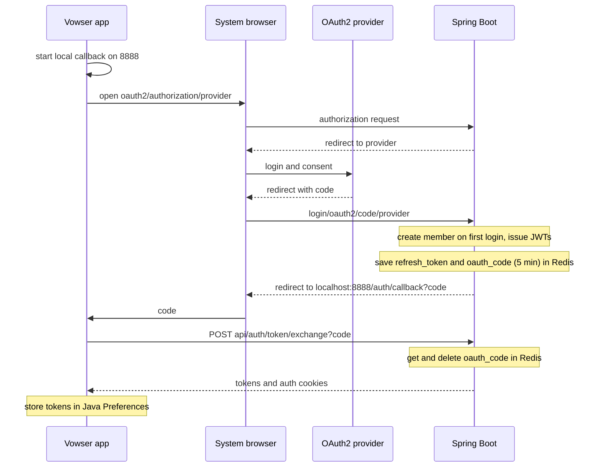

브라우저 조작이 사용자 PC에서 일어나 대상 사이트의 비밀번호·인증 수단은 서버로 오지 않음(P3). 서버가 지키는 것은 Vowser 계정의 토큰과 회원 정보이고, 사용자 사이에 공유되는 경로가 다른 사용자의 PC에서 실행된다는 점이 이 서비스에만 있는 위험임. 배포 경계는 [아키텍처](/ken-blog/post/doc-fd568125-2806-4210-a0b2-e4bf2d1b509e/)에서 정의함.

## 위협 모델

| 구분 | 내용 |
| --- | --- |
| 지킬 대상 | Vowser 계정 토큰, 회원 정보(이름·휴대폰 번호·생년월일), 접근성 프로필, 사용자가 대상 사이트에 입력하는 값, 경로를 실행하는 사용자 PC |
| 공격자 가정 | 인터넷의 익명 사용자, 경로를 등록하는 다른 사용자. 서버 운영자는 신뢰함 |
| 고려한 공격 | 로그인 코드·토큰 탈취와 재사용, 다른 사이트에서 보내는 요청, 인증 없는 API 호출, 공유 경로를 통한 개인정보 노출·악성 동작 |
| 범위 밖 | 대상 사이트 자체의 보안, 사용자 PC 안의 다른 프로그램·악성 코드, 외부 관리형 서비스(Redis Cloud·Neo4j Cloud·RDS)의 내부 보안 |

## 위협별 대응

| 위협 | 대응 | 검증 | 남은 위험 |
| --- | --- | --- | --- |
| 대상 사이트 비밀번호 노출 | 실행기를 사용자 PC에 두고, 기록 시 비밀번호·이메일·아이디로 분류된 칸의 값은 저장하지 않음 | 코드 검토로 확인, 자동 테스트 없음 | 칸 분류가 `type`·`name`·`placeholder` 속성 휴리스틱이라 분류를 벗어난 칸은 막지 못함 |
| 공유 경로를 통한 개인정보 노출 | 20자 이하의 검색어·일반 텍스트만 입력값으로 저장 | 코드 검토로 확인, 자동 테스트 없음 | `type="text"`인 이름·전화번호 칸의 값이 경로와 선택자(`input[value='…']`)에 저장되어 다른 사용자에게 공유됨 |
| 악성 경로 실행 | 실행 중 클릭 대상을 강조하고 인증 단계에서 멈춤 | 대응 없음 | 경로 저장 API가 인증 없이 열려 있어 누구나 경로를 등록할 수 있음. 실행기는 경로의 URL로 이동하고, 이름·생년월일·휴대폰 번호 칸을 회원 정보로 자동 입력함 |
| 로그인 코드 탈취 | 토큰 대신 5분짜리 일회용 코드를 앱의 로컬 콜백으로 전달하고 교환 시 삭제 | 코드 검토로 확인, 자동 테스트 없음 | 코드 교환이 원자적이지 않고, 코드를 앱 실행과 묶는 장치가 없음 |
| 토큰 재사용 | 액세스 토큰은 서명·만료·`type=access` 확인 뒤 회원 존재까지 확인. 리프레시 토큰은 Redis의 저장값과 일치해야 하고 로그아웃 시 삭제 | 코드 검토로 확인, 자동 테스트 없음 | 리프레시 토큰을 갱신 때 교체하지 않아, 유출되면 만료 전까지 계속 쓸 수 있음 |
| 다른 사이트의 요청(CSRF) | 쿠키를 `HttpOnly`·`SameSite=Lax`로 발급 | 코드 검토로 확인, 자동 테스트 없음 | CSRF 보호를 끄고 CORS를 모든 출처·자격 증명 허용으로 둠. `Lax`가 사이트 간 POST의 쿠키 전송을 막는 데 의존함 |
| 인증 없는 API 호출 | 회원·프로필·인증 정보 조회 API는 인증 필요 | 코드 검토로 확인, 자동 테스트 없음 | 경로 API 전체(운영용 인덱스 생성·경로 정리 포함)와 음성 API, 제어 WebSocket은 인증 없이 열려 있음 |
| 접근성 프로필 유출 | 설정 JSON을 AES-GCM(256비트 키, 요청마다 임의 IV)으로 암호화해 저장 | 코드 검토로 확인, 자동 테스트 없음 | 키를 환경 변수로 받으며 교체 절차는 없음 |

> 계정 토큰은 일회용 코드와 Redis 대조로 지키지만, 사용자 사이에 공유되는 경로는 인증 없는 API로 등록되고 다른 사용자의 회원 정보를 채워 실행됨. 공유 경로의 신뢰가 이 서비스의 가장 큰 보안 과제임.

## 데스크톱 로그인

데스크톱 앱은 웹 페이지가 아니어서 OAuth 리다이렉트를 직접 받을 수 없음. 그래서 시스템 브라우저로 OAuth2 소셜 로그인을 열고, 로그인 뒤 서버가 앱의 로컬 콜백 주소로 일회용 코드를 보내면 앱이 그 코드를 토큰으로 바꿈. 토큰 자체는 브라우저 주소창이나 리다이렉트 URL에 실리지 않음.[* [로그인 성공 처리](https://github.com/Vovvser/vowser-backend/blob/488d8ea/src/main/java/com/vowser/backend/infrastructure/security/oauth2/OAuth2AuthenticationSuccessHandler.java) · [임시 코드 저장](https://github.com/Vovvser/vowser-backend/blob/488d8ea/src/main/java/com/vowser/backend/infrastructure/security/oauth2/TemporaryCodeService.java) · [토큰 교환 API](https://github.com/Vovvser/vowser-backend/blob/488d8ea/src/main/java/com/vowser/backend/api/controller/AuthController.java) · [앱 로그인 처리](https://github.com/Vovvser/vowser-client/blob/8065803/shared/src/desktopMain/kotlin/com/vowser/client/auth/AuthManagerDesktop.kt)]

토큰·쿠키 계약

| 대상 | 설정 |
| --- | --- |
| 액세스 토큰 | HS256 JWT. `sub`=회원 ID, `email`, `type=access`. 요청의 `Authorization: Bearer` 헤더를 먼저 보고, 없으면 `AccessToken` 쿠키를 봄 |
| 리프레시 토큰 | HS256 JWT. `type=refresh`. Redis `refresh_token:{회원 ID}`에 하나만 저장해, 다른 PC에서 로그인하면 이전 토큰이 무효가 됨 |
| 유효 기간 | 환경 변수로 지정. 저장소의 예시 값은 액세스 900초, 리프레시 14일 |
| 쿠키 | `AccessToken`·`RefreshToken`, `HttpOnly`, `SameSite=Lax`, `Path=/`, `Secure`는 설정값 |
| 앱의 저장 | 사용자 PC의 Java Preferences에 평문 저장, 로그아웃 시 삭제 |
| 세션 | 서버 세션 없음(`STATELESS`) |

토큰 교환 응답은 같은 토큰을 본문과 쿠키로 함께 보냄. 앱은 본문의 토큰을 `Authorization` 헤더로 쓰고, 쿠키는 브라우저에서 같은 교환을 거친 경우의 인증 유지에 쓰임.[* [쿠키 설정 커밋](https://github.com/Vovvser/vowser-backend/commit/2ecf4912e79546e09c00d0cca513d41f950a33a7)]

## 공개 경로와 인증 경로

| 경로 | 인증 | 쓰는 주체 |
| --- | --- | --- |
| `/oauth2/**`, `/login/oauth2/**`, `/api/auth/**` | 없음 | 로그인·토큰 교환·갱신 |
| `/api/v1/paths/**` | 없음 | 경로 저장·검색, 운영용 통계·인덱스·정리 |
| `/api/v1/speech/**` | 없음(토큰이 있으면 접근성 프로필 적용) | 음성 인식 |
| `/control` WebSocket | 없음 | 브라우저 제어 채널 |
| `/api/member/**`, `/api/v1/member/profile` 등 그 밖의 경로 | JWT 필요 | 회원 정보·접근성 프로필 |

경로와 음성 API는 로그인하지 않은 사용자도 작업을 찾고 실행할 수 있도록 일부러 인증 없이 열었음. 다만 저장·운영 경로까지 함께 열려 있어, 검색만 열고 저장·운영 경로는 인증과 권한을 요구하는 것이 최소한의 보강임.[* [보안 설정](https://github.com/Vovvser/vowser-backend/blob/488d8ea/src/main/java/com/vowser/backend/infrastructure/config/SecurityConfig.java)]

## 기록 데이터의 경계

기록기는 조작한 요소의 속성으로 선택자와 설명을 만들고, 입력 단계의 값은 아래 규칙으로 정함.[* [경로 저장 변환](https://github.com/Vovvser/vowser-client/blob/8065803/shared/src/commonMain/kotlin/com/vowser/client/api/PathApiClient.kt)]

| 칸 분류(속성으로 판단) | 경로에 남는 값 |
| --- | --- |
| `password`(`type`이나 `name`에 password·pwd) | HTML placeholder 또는 `aria-label`만 |
| `email`, `id`(`name`에 id·username) | HTML placeholder 또는 `aria-label`만 |
| `search`(placeholder·`aria-label`에 검색·search) | 20자 이하 입력값 |
| `text`(그 밖의 모든 칸) | 20자 이하 입력값 |

이름 칸의 `name` 속성이 `username`이거나 `id`를 포함하면 `id` 규칙에 걸려 저장되지 않지만, `name="nm"`이나 속성이 없는 칸은 `text`가 되어 입력한 이름이 저장됨. 휴대폰 번호 칸도 `type="tel"`이면 `text`로 분류됨. 이 분류는 실행 쪽 자동 입력에도 영향을 줌. 실행기는 저장된 입력값을 회원 정보 자동 입력보다 먼저 쓰므로, 공유된 경로에 남은 다른 사람의 이름이 입력될 수 있음.

## 검증

| 항목 | 상태 |
| --- | --- |
| JWT 서명·만료·종류 확인 | 코드 검토로 확인, 자동 테스트 없음 |
| 일회용 코드의 만료·일회성 | 코드 검토로 확인, 동시 교환은 검증하지 않음 |
| 공개 경로 목록 | 보안 설정과 대조 |
| 기록 데이터의 입력값 제외 규칙 | 코드 검토로 확인, 실제 사이트별 칸 분류는 검증하지 않음 |
| 접근성 프로필 암호화 | 코드 검토로 확인, 자동 테스트 없음 |
| CORS·CSRF 동작 | 코드 검토로 확인, 자동 테스트 없음 |
| 공유 경로의 악성 동작 방어 | 대응 없음 |
| 로그인·API 반복 시도 제한 | 없음. 요청 횟수 제한 설정이나 라이브러리를 코드에서 찾지 못함 |
