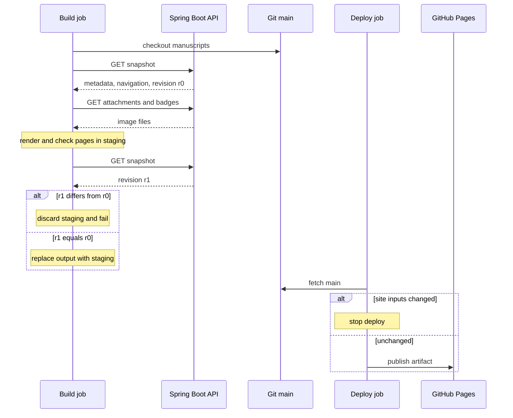

독자의 열람은 GitHub Pages에서 끝나고, 서버(API·DB)는 관리 요청과 사이트 빌드에만 쓰임.

## 품질 요구사항

| 품질 속성 | 요구 | 관련 문제[* P1~P3는 [대문](/ken-blog/post/project-06840552-43a2-4870-83a9-d3e848c71d7e/)에서 정의함] | 구조적 대응 |
| --- | --- | --- | --- |
| 변경 추적성 | 모든 본문 변경이 커밋 단위 diff로 남고 되돌릴 수 있음 | P1 | 본문 정본을 Git Markdown으로 두고, API에 본문 저장 경로를 두지 않음 |
| 열람 지연 | 독자가 문서를 열 때 본문 표시까지 API 왕복이 없음 | P2 | 빌드 시 정적 생성, GitHub Pages로 제공 |
| 서버 부하 | 열람량이 API 서버 부하로 이어지지 않음 | P2 | 열람 경로에서 API 제외 |
| 열람 가용성 | API·DB·VM이 멈춰도 공개 글을 읽을 수 있음 | P2 | 공개 산출물을 VM과 다른 배포 경계(GitHub)에 둠[* 정적 생성 구조의 [열람 지연 측정](/ken-blog/post/post-c342d140-8026-4137-8761-b5c3eecddc2c/)에서 열람 중 API 서버 도달 요청은 0회였고 모든 시나리오에서 본문이 표시됨] |
| 발행 일관성 | 공개 결과가 한 시점의 글 정보·첨부 상태로 구성됨 | P3 | 공개 스냅샷 revision 재검증, 검증을 통과한 산출물만 배포 |

## 인프라 구성도

배포 경계는 GitHub, OCI ARM VM, 관리형 MySQL의 세 영역.

```mermaid caption="API 응답은 요청의 반대 경로로 전달"
architecture-beta
  %% layout: ken-blog-infrastructure
  group people[Users]
  group github[GitHub]
  group site[Pages workflow] in github
  group ci[API workflow] in github
  group ops[Manual operation]
  group oci[OCI ARM VM]
  group compose(ken:docker)[Docker Compose] in oci
  group data[OCI managed DB]

  service writer(ken:user)[Author and agent] in people
  service repo(ken:git)[Git repository] in github
  service sitebuild(ken:github-actions)[Site build] in site
  service pages(ken:github)[GitHub Pages] in site
  service apibuild(ken:github-actions)[API CI] in ci
  service archive(ken:docker)[JVM image] in ci
  service operator(ken:user)[Operator] in ops
  service reader(ken:user)[Reader] in people
  service admin(ken:user)[Admin] in people
  service caddy(ken:caddy)[Caddy] in compose
  service api(ken:spring)[Java Spring Boot API] in compose
  service disk(ken:disk)[Image disk] in oci
  service db(ken:mysql)[MySQL] in data

  writer:R -[Push]-> L:repo
  repo:R -[Web changes]-> L:sitebuild
  repo:B -[API changes]-> L:apibuild
  sitebuild:R -[Publish]-> L:pages
  sitebuild:B -[Public API]-> T:caddy
  apibuild:R -[Archive]-> L:archive
  archive:B -[Review]-> R:operator
  operator:B -[Manual deploy]-> T:api
  reader:R -[Read]-> R:pages
  admin:T -[Manage UI]-> B:pages
  admin:R -[Admin API]-> L:caddy
  caddy:R -[HTTP]-> L:api
  api:R -[JDBC]-> L:db
  api:B -[Read only]-> T:disk
```



| 배포 경계 | 구성 요소 | 책임 |
| --- | --- | --- |
| GitHub | Git 저장소 | 원고·웹 소스·API 소스와 변경 이력 관리 |
| GitHub | 사이트 빌더 | Node·TypeScript로 공개 자료 수집, Markdown 렌더링, Nunjucks HTML 조립 |
| GitHub | GitHub Pages | HTML·CSS·JavaScript·이미지와 관리자 화면 제공 |
| OCI ARM VM | Caddy | HTTPS 종료, 허용 경로 프록시, 로그인 출처 헤더 설정 |
| OCI ARM VM | Java Spring Boot API | 인증, 글·시리즈·분류 관리, 공개 스냅샷·이미지 제공 |
| OCI ARM VM | 이미지 디스크 | 본문 이미지·기술 아이콘 원본. API에 읽기 전용 마운트 |
| 관리형 MySQL | MySQL | 글 정보·연결 관계·계정·세션 저장 |

API 이미지의 빌드와 운영 반영 절차는 [배포와 운영](/ken-blog/post/doc-aaa3ec9d-c135-4bc6-a1cd-398a3493480c/)에서 다룸.

## 시스템 구조

전형적인 3계층(표현·애플리케이션·데이터)과 달리 표현 계층이 요청 시점이 아니라 빌드 시점에 만들어짐. 그래서 요청 경로가 열람·관리·빌드 세 갈래로 나뉘고, 독자의 열람은 애플리케이션 계층을 거치지 않음.

```mermaid caption="열람 경로는 GitHub Pages에서 끝나고, 애플리케이션 계층은 관리 요청과 빌드만 처리함"
architecture-beta
  %% layout: ken-blog-system
  group users[Users]
  group presentation[Presentation]
  group build[Build]
  group application[Application]
  group data[Data]

  service reader(ken:user)[Reader] in users
  service admin(ken:user)[Admin] in users
  service html(ken:github)[Static HTML] in presentation
  service manage(ken:github)[Admin UI] in presentation
  service builder(ken:nodejs)[Site builder] in build
  service caddy(ken:caddy)[Caddy] in application
  service api(ken:spring)[Spring Boot API] in application
  service db(ken:mysql)[MySQL] in data
  service disk(ken:disk)[Image disk] in data
  service git(ken:git)[Git manuscripts] in data

  reader:R -[Read]-> L:html
  admin:R -[Manage]-> L:manage
  manage:B -[Admin API]-> T:caddy
  caddy:R -[HTTP]-> L:api
  api:B -[JDBC]-> T:db
  api:B -[Read only]-> T:disk
  git:T -[Manuscripts]-> B:builder
  api:R -[Snapshot]-> L:builder
  builder:T -[Publish]-> T:html
```



| 경로 | 거치는 계층 | 처리 |
| --- | --- | --- |
| 열람 | 표현 | 빌드 때 만든 HTML·검색 색인을 Pages가 그대로 제공. 목차·검색·테마·도식은 브라우저에서 처리 |
| 관리 | 표현 → 애플리케이션 → 데이터 | Pages의 관리 화면 스크립트가 Caddy를 거쳐 API를 호출하고, API가 MySQL과 이미지 디스크를 다룸 |
| 빌드 | 데이터 → 빌더 → 표현 | Node 빌더가 Git 원고와 API의 공개 스냅샷·이미지를 모아 HTML을 생성하고 Pages에 배포 |

API 내부는 요청을 받는 순서대로 보안 필터, 컨트롤러, 서비스, 저장소 계층으로 나뉨. 기능 단위 패키지(`post`, `series`, `category`, `attachment`, `stack`, `auth`, `pages`)마다 이 계층을 둠.

```mermaid caption="API 내부 계층. 쓰기와 단건 조회·행 잠금은 JPA, 목록·검색·공개 스냅샷 조회는 jOOQ가 맡고 같은 데이터 소스와 트랜잭션을 공유함"
flowchart TB
    request([HTTP request from Caddy])
    security[Security filters: session, CSRF, CORS]
    controller[Controllers: request validation, HTTP mapping]
    service[Services: domain rules, transactions, edit version]
    jpa[JPA repositories: writes, single reads, row locks]
    queries[jOOQ queries: lists, search, snapshot]
    storage[Asset storage: read-only disk]
    db[(MySQL)]
    session[(Spring Session JDBC)]
    request --> security
    security --> controller
    controller --> service
    service --> jpa
    service --> queries
    service --> storage
    jpa --> db
    queries --> db
    security -.-> session
    session -.-> db
    classDef web fill:#eff6ff,stroke:#2563eb,color:#172554,stroke-width:2px
    classDef domain fill:#f5f3ff,stroke:#7c3aed,color:#2e1065,stroke-width:2px
    classDef store fill:#f0fdfa,stroke:#0d9488,color:#134e4a,stroke-width:2px
    class security,controller web
    class service domain
    class jpa,queries,storage,db,session store
```

## 데이터의 정본과 파생 결과물

본문·글 정보·이미지는 Git·MySQL·VM 디스크 세 저장소에 나뉘어 있고, 공개 사이트의 HTML은 이를 빌드할 때 합친 결과물임. 자료마다 원본이 어디 있고 누가 바꾸며 어떻게 공개 사이트까지 가는지가 다음 절의 일관성 문제의 출발점이 됨.

| 자료 | 정본 | 변경 주체 | 공개 반영 |
| --- | --- | --- | --- |
| 글 본문 | Git의 `content/posts/{slug}.md` | 작성자·에이전트 | Pages 빌드 |
| 글·프로젝트 정보(분류·태그·소속·발행 상태·기술 배지) | MySQL | 관리자 API | 스냅샷 수집 후 Pages 빌드 |
| 이미지 원본 | VM 영속 디스크(메타데이터는 MySQL) | 운영자 | API로 내려받아 정적 복사 |
| HTML·검색 색인·역링크 | 빌드 산출물(역링크는 원고에서 계산) | Node 빌더 | Pages에 배포 |

## 일관성 모델과 보장 범위

자료가 Git·DB·디스크 세 저장소에 나뉘어 있어 하나의 트랜잭션으로 묶을 수 없음. 대신 경계마다 보장 수준을 정하고, 보장하지 않는 구간을 명시함.

| 경계 | 보장 | 방법 | 보장하지 않는 구간 |
| --- | --- | --- | --- |
| 관리자 편집 | 갱신 손실(lost update) 방지 | 편집 버전 비교(불일치 시 409)와 글 행 비관적 잠금 | 첨부 연결 교체는 별도 트랜잭션 |
| 스냅샷 수집 | 한 시점의 공개 자료로 페이지 생성 | 스냅샷을 한 트랜잭션에서 조회하고, 이미지 수집 중 변경은 revision으로 감지 | — |
| Git 원고 | 빌드한 원고가 배포 시점의 `main`과 같음 | 배포 직전 `main`의 사이트 입력 재확인 | 마지막 확인부터 배포 완료까지[* 확인 시점과 사용 시점 사이에 상태가 바뀔 수 있는 TOCTOU(time-of-check to time-of-use) 구간] |
| DB → 공개 사이트 | 최종적 일관성 | 다음 Pages 배포에서 반영 | 자동 배포가 없어 반영 시점이 정해지지 않음 |
| 빌드 실패 | 마지막 정상 배포 유지 | 검증을 통과한 결과만 배포 | — |

> 관리 상태는 DB 트랜잭션으로 즉시 일관되고, 공개 상태는 배포 시점에 하나의 revision으로 맞춰짐.

관리 작업별 충돌 처리는 [기능과 사용자 흐름](/ken-blog/post/doc-4cfccbd2-1972-4ad8-893a-6a8bf45744e1/)의 동시성 정책에 있음.

### 사이트 생성 순서

빌더는 공개 스냅샷의 revision을 수집 시작과 페이지 생성 후 두 번 받아 비교하고, 배포 직전 `main`의 사이트 입력을 다시 확인함. 이 방식을 고른 이유와 대안은 [주요 기술적 의사결정](/ken-blog/post/doc-267e2237-7f38-4ea1-b04b-7c51d456c2b4/)의 P3에 있음.



[운영 Compose](https://github.com/gjaku1031/ken-blog/blob/3074d80/deploy/compose.production.yaml) · [데이터 모델](/ken-blog/post/post-f9235d74-4d5b-4705-8f59-ba3511bd50e9/) · [보안 설계](/ken-blog/post/doc-b707888f-a270-4aef-a617-f3345644a3f3/)
