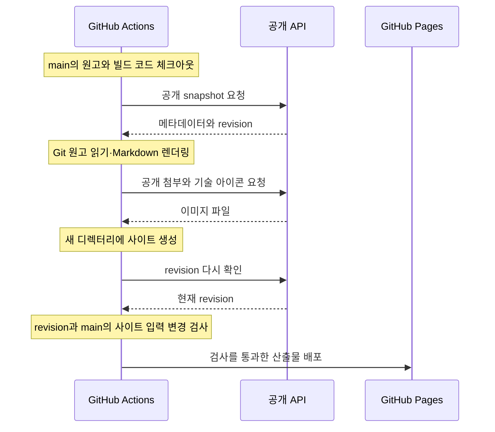

ken.blog는 **Git의 Markdown 원고와 DB의 공개 메타데이터를 빌드할 때 결합해 정적 페이지를 만드는 블로그**입니다. 공개·관리자 화면은 GitHub Pages에 두고, OCI의 Spring Boot API는 인증과 메타데이터·연결 관계·이미지 읽기를 담당합니다.

이 글은 **2026년 10월 3일 기준**의 코드와 배포 기록을 바탕으로 작성했습니다. 서비스의 목적과 사용 흐름은 [[ken.blog — 에이전트와 함께 쓰는 개발 블로그|프로젝트 소개]]에서 설명합니다.

## 현재 요구사항과 역할 분담

원고는 작성자와 에이전트가 파일로 수정하고, 독자는 완성된 페이지를 읽습니다. 웹 관리자는 제목·분류·프로젝트·발행 상태를 관리합니다. 이 흐름에 맞춰 원고 편집과 화면 생성, 운영 API의 역할을 나눴습니다.

| 역할 | 구현과 책임 |
| --- | --- |
| 원고 작성 | Git의 `content/posts/{slug}.md`를 로컬 편집기나 에이전트로 수정 |
| 공개·관리자 화면 생성 | Node·TypeScript·Nunjucks와 공용 Markdown 렌더러 |
| 브라우저 상호작용 | TypeScript로 검색·테마·목차·관리 폼·Mermaid 렌더링 처리 |
| 화면 배포 | GitHub Actions에서 정적 사이트를 생성해 GitHub Pages에 배포 |
| 운영 API | Kotlin·Spring Boot 4.1.1, Java 25 일반 JVM |
| 저장과 조회 | MySQL, JPA와 jOOQ, Spring Session JDBC |
| HTTPS와 API 진입 | OCI VM의 Caddy |
| 이미지 원본 | VM의 영속 로컬 디스크, API에는 읽기 전용 마운트 |

Next.js·React, Thymeleaf, 웹 본문 편집기, 블로그 전용 MCP, Redis, 런타임 OCI Object Storage 연결은 현재 구성에서 제거했습니다. Native Image는 과거 검증 이력이며 현재 API는 일반 JVM으로 실행합니다.

## 인프라 아키텍처

GitHub의 빌드·배포, OCI의 API, 외부 데이터 저장소를 나눠 표시했습니다. 화살표는 요청하거나 결과물을 전달하는 방향입니다. API 응답은 요청 경로의 반대 방향으로 돌아옵니다.

```mermaid
architecture-beta
  group github[GitHub]
  group oci[OCI ARM VM]
  group compose(ken:docker)[Docker Compose] in oci
  group data[External data]

  service git(ken:git)[Git Markdown] in github
  service build(ken:github-actions)[Actions Build] in github
  service pages(ken:github)[GitHub Pages] in github
  service caddy(ken:caddy)[Caddy HTTPS] in compose
  service api(ken:spring)[Spring Boot API] in compose
  service disk(ken:disk)[Image disk RO] in oci
  service db(ken:mysql)[External MySQL] in data
  service reader(ken:user)[Reader]
  service admin(ken:user)[Admin]

  git:R --> L:build
  build:R --> L:pages
  reader:T --> B:pages
  admin:L --> R:pages
  admin:B --> T:caddy
  build:B --> T:caddy
  caddy:L --> R:api
  api:B --> T:disk
  api:L --> R:db
```



| 구역 | 주요 역할 |
| --- | --- |
| GitHub | Git 원고와 공개 API 데이터를 Node 빌드에서 결합하고 Pages에 배포 |
| OCI ARM VM · Docker Compose | Caddy가 HTTPS 요청을 받아 Spring Boot API로 전달 |
| External MySQL | 글 메타데이터·계정·JDBC 세션 저장 |
| Image disk RO | API가 읽기 전용으로 사용하는 VM의 이미지 원본 디스크 |
| Reader · Admin | 독자는 Pages에서 글을 읽고, 관리자는 Pages의 관리 화면에서 API 호출 |

### 공개 글을 만드는 경로

빌드가 API에서 가져오는 것은 공개 글·시리즈의 메타데이터와 이미지입니다. 본문은 체크아웃한 Git 원고에서 읽습니다. Node가 Markdown을 렌더링하고 Nunjucks로 페이지를 조립한 뒤, 필요한 이미지도 Pages 산출물에 복사합니다.

독자의 본문 읽기는 Pages에 배포된 HTML과 이미지로 이루어집니다. 로그인 상태 확인과 관리 기능은 별도로 API를 사용하지만, 글을 읽기 위해 브라우저가 본문 API를 호출하는 구조는 아닙니다. API가 중단되면 관리와 새 빌드는 영향을 받으며, 이미 배포된 공개 글은 계속 제공할 수 있습니다.

### 관리자와 API의 경로

Caddy는 공개 HTTPS 연결과 인증서 발급·갱신을 맡고, 허용한 API 경로를 Spring으로 전달합니다. 현재 운영 설정은 공인 IPv4용 단기 인증서를 사용합니다. Spring이 직접 TLS를 처리하거나 관리자 HTML을 제공하지는 않습니다.

운영 Compose에는 API와 Caddy를 두고, MySQL은 기존 외부 서비스를 사용합니다. API 이미지를 교체해도 DB와 이미지 디렉터리는 유지합니다. 이미지 디스크는 컨테이너와 분리되어 있지만 VM 밖의 Object Storage는 아니므로, 디스크와 DB의 별도 백업은 운영 책임입니다.

## 원고·메타데이터·이미지의 저장 위치

| 자료 | 현재 원본 | 읽거나 변경하는 주체 |
| --- | --- | --- |
| 글 본문 | `content/posts/{slug}.md` | 작성자·에이전트가 수정, Node가 빌드 시 읽음 |
| 제목·요약·분류·태그·소속·순서·발행 상태 | MySQL | 관리자 HTTP API가 관리 |
| 시리즈·프로젝트 정보와 기술 선택 | MySQL | 관리자 HTTP API가 관리 |
| 첨부 정보와 이미지 파일 | MySQL과 영속 로컬 디스크 | 운영자가 직접 준비, API가 공개 조건을 확인해 읽음 |
| 글의 첨부 ID·위키 대상 선언 | MySQL | 관리자 HTTP API에서 교체 |
| 기술 목록과 아이콘 | MySQL과 영속 로컬 디스크 | 운영자가 직접 관리, 웹에서는 프로젝트에 사용할 기술 선택 |
| 로그인 계정·세션 | MySQL | 계정은 운영자가 준비, 세션은 Spring Security·JDBC가 관리 |
| 사이드바의 블로그 소개 | Nunjucks 템플릿 | 저장소 코드 수정과 Pages 배포로 반영 |

Spring에는 원고 디렉터리 설정과 마운트가 없습니다. 본문을 읽거나 저장하는 API도 없습니다. DB에 남겨 둔 옛 `body`·`body_sha256` 열은 기존 자료와 스키마의 호환을 위한 것이며, 현재 원고를 공급하는 경로가 아닙니다.

공개 저장소에 올릴 원고와 비공개 초안도 구분해야 합니다. 사이트 빌더가 공개 대상만 선택하더라도 Git에 커밋한 파일 자체를 비공개로 만들어 주지는 않습니다.

## 글과 시리즈의 공통 모델

일반 글과 프로젝트 문서는 모두 `Post`로 관리합니다. 글의 묶음은 `Series`로 표현하며, 일반 시리즈는 `TECH`, 프로젝트는 `PROJECT` 종류를 사용합니다. 예전 Tech·Projects·Notes의 본문 처리 모델을 각각 유지하던 구조를 통합했습니다.

| 모델 | 맡은 일 |
| --- | --- |
| Post | 글의 고정 주소, 제목·요약, 발행 상태, 분류·태그, 시리즈 소속과 순서 |
| Series | 여러 글의 묶음과 공개 범위, 프로젝트의 상태·기간·기술 스택 |
| Category | 대분류·소분류 두 단계의 주제 분류 |
| 첨부·위키 연결 | 글이 사용하는 이미지 ID와 위키 대상 제목의 선언 |

명시 시리즈가 있는 글은 그 시리즈의 공개 문서를 따라 이동합니다. 시리즈가 없는 글은 소분류에 속한 공개 글로 읽기 목록을 구성합니다. 대분류는 주제 탐색에 사용하며 이 방식의 자동 읽기 목록을 만들지 않습니다. 프로젝트와 일반 시리즈의 첫 공개 문서는 대문 역할을 합니다.

글과 시리즈를 만들 때 주소를 생략하면 서버가 UUID 기반 주소를 발급합니다. 제목을 바꿔도 주소와 원고 경로가 함께 바뀌지 않습니다. 이전에 명시적으로 만든 주소와 기존 공개 글의 주소도 유지합니다.

테이블별 주요 컬럼과 외래 키, 첨부·기술 스택·인증의 관계는 [[ERD]]에서 이어서 설명합니다.

## JPA와 jOOQ의 역할

JPA는 엔티티 저장, 단일 조회와 변경을 위한 잠금을 담당합니다. jOOQ는 목록·검색·집계·위키 탐색·공개 첨부 조회처럼 필요한 열과 조인이 분명한 조회에 사용합니다. 첨부 연결 전 상태 잠금도 jOOQ로 수행하며, 연결 저장은 같은 Spring 트랜잭션 안에서 JPA로 처리합니다.

두 방식을 함께 쓰면서 스키마를 이중으로 관리하지 않도록 **JPA 엔티티를 코드 생성의 원본**으로 삼았습니다.

```text
원본 Kotlin 도메인 클래스
  → JPA 모델 선행 컴파일
  → Hibernate로 MySQL DDL 생성
  → jOOQ 테이블 타입 생성
  → 애플리케이션 컴파일
```

이 과정은 Gradle 빌드 안에서 실행되며 실제 DB에 접속하지 않습니다. 생성된 DDL과 jOOQ 코드는 `build/` 아래의 재생성 가능한 산출물입니다. 도메인 모델을 먼저 컴파일해 jOOQ 코드 생성과 앱 컴파일 사이의 순환 의존을 피했습니다.

이 DDL을 운영 DB에 실행하는 것은 아닙니다. JDBC 세션 등 JPA 외 테이블의 초기화와 운영 데이터 이관도 별도 책임입니다. 코드 생성이 성공했다는 사실과 실제 DB가 모델에 맞게 동작한다는 사실은 구분하고, 후자는 통합 검사로 확인합니다.

## 원고 작성과 발행의 경계

현재는 웹에서 본문 편집본을 저장한 뒤 버전을 비교해 발행하는 흐름을 사용하지 않습니다. 원고 변경은 Git에서 검토하고, 서버의 발행 요청은 Post의 공개 상태를 바꿉니다.

새 글은 메타데이터를 미발행 상태로 등록하고, 발급받은 주소에 대응하는 Markdown을 준비합니다. 공개할 파일을 `main`에 반영한 뒤 발행 상태와 이미지 연결을 확인하고 Pages를 실행합니다. API는 원고 파일의 존재를 검사하지 않으므로, **원고 없이 발행 요청이 성공해도 사이트 빌드는 실패할 수 있습니다.**

위키 링크의 화면 렌더링과 역링크는 Node가 원고의 `[[제목]]`을 읽고 공개 스냅샷의 제목에 연결해 만듭니다. DB의 위키 대상 선언도 유지하지만, 본문에서 DB 선언으로 자동 동기화하지는 않습니다. 서버가 원고 해시를 비교해 오래된 선언을 거부하던 기능도 제거되어, 원고와 선언을 맞추는 일은 작성자가 맡습니다.

관리자 요청은 단일 관리자 비밀번호 로그인, JDBC 세션과 CSRF 검사를 거칩니다. 로그인 실패 제한과 계정 변경 시 세션 해제는 유지하며, MFA와 블로그 전용 MCP 인증 경로는 현재 사용하지 않습니다. 관리 화면은 Pages에 있지만 권한 검사는 API에서 수행합니다.

## 이미지 제공과 정적 복사

본문에는 `attachment:ID`로 이미지를 참조합니다. 운영자가 PNG·JPEG 파일과 첨부 DB 행을 준비하고, 관리 API에서 해당 글에 첨부 ID를 연결해야 빌더가 이미지를 받을 수 있습니다. API는 파일을 업로드하거나 삭제하지 않고 읽기 전용 저장소에서 제공합니다.

공개 첨부 조회는 글의 공개 발행 상태, 소속 시리즈의 공개 조건, 글과 첨부의 연결, 첨부의 `READY` 상태를 확인합니다. 파일을 읽을 때는 저장소 루트와 경로·심볼릭 링크를 검증합니다.

Node 빌더는 허용된 API 출처와 경로에서 이미지를 받고, 크기·MIME·파일 시그니처를 확인합니다. 이후 내용 해시를 포함한 파일명으로 Pages 산출물에 저장합니다. 독자가 보는 이미지는 이 복사본이며, 원본 교체도 새 Pages 배포를 거쳐 반영됩니다.

첨부 연결을 해제하는 것은 파일을 지우는 동작이 아닙니다. 파일과 DB 정보를 직접 관리하도록 바뀐 만큼, 등록·교체·정리 시 참조와 백업을 확인해야 합니다. 옛 업로드 상태와 기존 객체·백업을 기능 제거와 함께 일괄 삭제하지는 않았습니다.

## Pages 빌드와 배포

### 실행되는 시점

현재 Pages 워크플로의 시작 조건은 두 가지입니다.

- `main`에 공개 원고·웹 소스·npm 설정·사이트 빌드 코드 등 사이트 입력 파일의 변경을 반영할 때
- GitHub Actions에서 `workflow_dispatch`로 수동 실행할 때

**15분 간격 예약 실행은 현재 없습니다.** DB의 제목·분류·발행 상태만 바꾸는 작업도 자동으로 Pages를 실행하지 않습니다. 관리자 화면의 배포 링크에서 Actions로 이동해 수동 실행해야 합니다.

### 한 번의 빌드에서 확인하는 것



공개 스냅샷은 MySQL의 같은 일관 읽기 트랜잭션에서 구성합니다. 글·시리즈 메타데이터와 첨부 변경 정보로 revision을 만들고, Node는 생성이 끝난 뒤 다시 확인합니다. 생성 중 공개 데이터가 바뀌면 해당 결과를 확정하지 않습니다.

공개 목록의 원고 누락, 잘못된 이미지, 공개 범위나 문서 관계가 맞지 않는 입력도 빌드 실패로 처리합니다. 사이트는 매번 빈 임시 디렉터리에서 전체 생성하므로, 성공한 다음 배포에는 공개 취소된 글과 더 이상 쓰지 않는 이미지가 이전 산출물에서 따라 들어오지 않습니다.

워크플로는 배포 전에 현재 `main`과 빌드에 사용한 소스의 사이트 입력 파일도 비교합니다. 다만 마지막 확인 이후의 변경과 브라우저 캐시까지 하나의 트랜잭션으로 묶는 것은 아닙니다. **DB에서 발행하거나 공개를 취소한 시점과 독자가 새 페이지를 받는 시점은 다를 수 있습니다.** 공개 취소도 Pages 재배포와 캐시 반영을 확인해야 합니다.

### 원고 수정과 프로그램 빌드 분리

페이지는 전체를 다시 만들지만, 브라우저 JS·CSS 번들은 입력 해시와 산출물 검사를 통과하면 재사용합니다. 원고와 Nunjucks 템플릿은 번들 캐시 키에서 제외되어 있습니다. 따라서 원고 수정으로 페이지를 다시 만드는 것과 TypeScript를 다시 번들링하는 것은 별개입니다.

사이트 생성에는 Java·Gradle·Spring 기동이 필요하지 않습니다. 반대로 API 빌드도 npm이나 웹 템플릿에 의존하지 않습니다. 이 분리 덕분에 글 수정이 백엔드 빌드·배포로 이어지지 않습니다.

## API 빌드와 운영 반영

백엔드 CI는 Kotlin·런타임 리소스·검사·Gradle 설정 변경을 대상으로 실행하며 웹 리소스는 제외합니다. MySQL 통합 검사와 인증·HTTP 동작을 확인하고, `bootBuildImage`와 Cloud Native Buildpacks로 Linux ARM64 JVM 이미지를 만듭니다.

이미지 실행 검사에는 로그인·로그아웃, CSRF, 글·시리즈 메타데이터, 공개 스냅샷과 실제 이미지 읽기가 포함됩니다. 통과한 이미지 아카이브와 SHA-256을 보관하고, 운영에서는 검증한 이미지를 불러와 Compose의 API 컨테이너를 교체합니다. CI가 운영 서버까지 자동 배포하는 구성은 아닙니다.

현재 운영 설정은 API 1코어·메모리 1536MiB 한도이며, JVM 외 메모리를 고려해 힙을 계산합니다. Native Image도 기동·메모리·부하를 검증했지만, 상시 실행하는 4GB 서버에서 동적 기능의 호환과 유지보수 비용을 고려해 일반 JVM을 선택했습니다. 과거 Native 측정값을 현재 JVM의 성능 수치로 사용하지 않습니다.

운영 전환에서는 기존 MySQL 자료를 보존하며 Post·Series 관계를 이관하고, 기존 이미지 원본을 로컬 디스크로 복사해 해시를 대조했습니다. API·Caddy·Pages의 전환 이후 주소 자동 발급과 2단계 분류도 반영했습니다. 세부 검증과 당시 배포 상태는 인프라 ADR에 구분해 남겼습니다.

## 설계가 바뀐 흐름

| 변경 | 현재 구조에 남은 결과 |
| --- | --- |
| [저장소 Markdown 도입](https://github.com/gjaku1031/ken-blog/commit/36a257d138787e5b375b7bb16c02b06df2fdc0c1) | 본문 원본을 Git 파일로 이동 |
| [Post·Series 통합](https://github.com/gjaku1031/ken-blog/commit/f7cd470c04a479213701bb146801653e2000ac22) | 일반 글과 프로젝트 문서의 저장·탐색 모델 공유 |
| [Node 정적 생성으로 전환](https://github.com/gjaku1031/ken-blog/commit/71cf418685a5f3d74b16287768256e5022034ef0) | 사이트와 Spring 빌드 분리, Thymeleaf 제거 |
| [MCP와 API 원고 접근 제거](https://github.com/gjaku1031/ken-blog/commit/bd066256470e05cd35f697ae7835e978bcd9d364) | 파일 편집·관리 HTTP·Node 렌더링의 역할 분리 |
| [주소 자동 발급](https://github.com/gjaku1031/ken-blog/commit/24dd81f) · [2단계 분류](https://github.com/gjaku1031/ken-blog/commit/ffae0f1) | 글 등록과 주제 탐색 단순화, 기존 주소 유지 |
| [Posts 진입 통합](https://github.com/gjaku1031/ken-blog/commit/902dc96) · [프로젝트와 문서 제목 분리](https://github.com/gjaku1031/ken-blog/commit/802966e) | 현재 Posts·Projects 중심의 읽기 화면 |

결정의 배경과 검증 범위는 [애플리케이션 ADR](https://github.com/gjaku1031/ken-blog/blob/main/docs/ADR/ADR_application.md), [영속성 ADR](https://github.com/gjaku1031/ken-blog/blob/main/docs/ADR/ADR_persistence.md), [인프라 ADR](https://github.com/gjaku1031/ken-blog/blob/main/docs/ADR/ADR_infra.md)에서 이어 볼 수 있습니다. ADR 안의 과거 검증 결과는 당시 구성의 기록이며, 현재 적용 상태는 후속 결정과 배포 기록을 함께 확인합니다.
