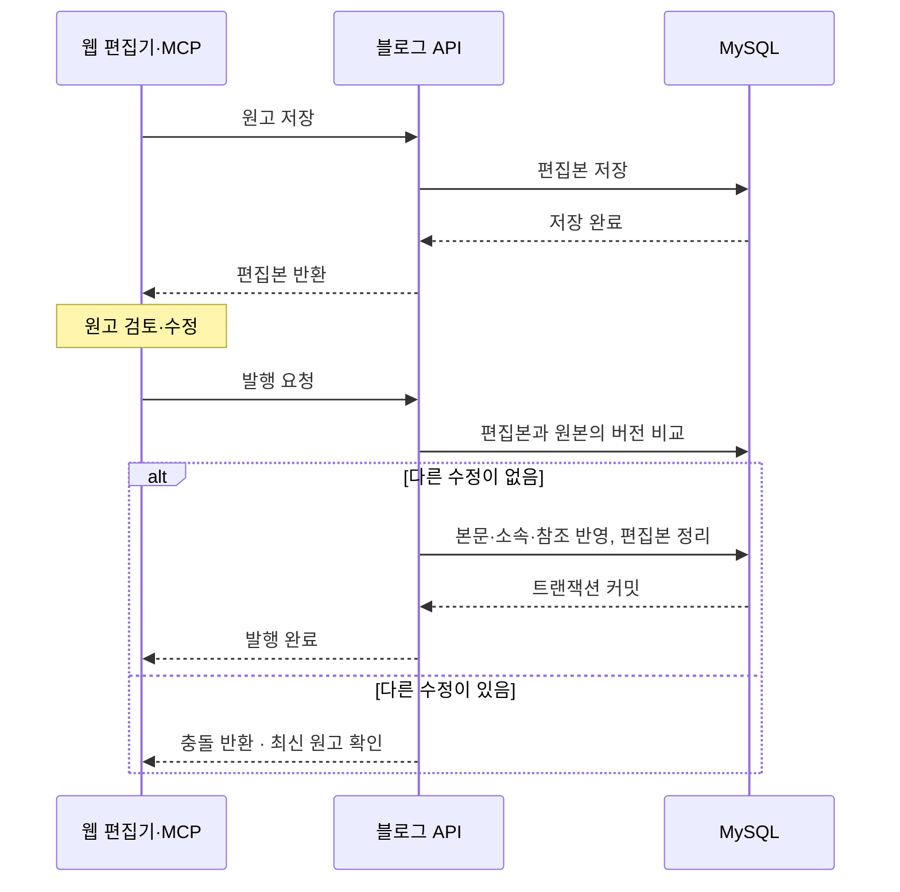
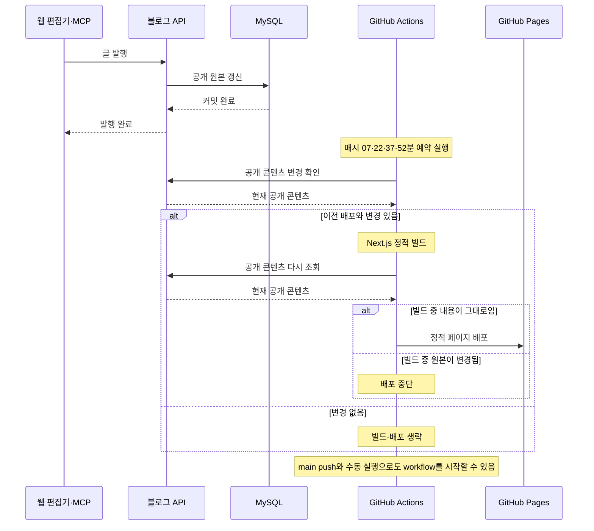

운영비를 줄이면서 웹 편집기와 에이전트에서 같은 원고를 이어 쓸 수 있도록 구성했습니다. 화면은 GitHub Pages에 배포하고, 문서의 원본과 편집본은 OCI의 Spring Boot API에서 관리합니다. 데이터베이스와 이미지 저장소는 API가 실행되는 VM과 분리했습니다.

서비스의 목적과 사용 흐름은 [[ken.blog — 에이전트와 함께 쓰는 개발 블로그|프로젝트 대문]]에서 소개했습니다.

## 인프라 아키텍처

Next.js로 만든 화면은 정적 파일로 빌드해 GitHub Pages에서 제공합니다. 브라우저는 화면을 내려받은 뒤, 글 조회와 편집에 필요한 데이터를 OCI의 API에 요청합니다.

### 화면과 데이터 처리를 나눈 이유

프런트를 Pages에 두면 OCI VM에서는 화면을 제공하는 Next.js 서버를 별도로 실행할 필요가 없습니다. VM에는 Nginx와 Spring Boot API를 두고, 문서 조회와 저장을 맡겼습니다. 화면을 바꾸는 배포와 서버 기능을 바꾸는 배포도 나뉩니다.

MySQL HeatWave에는 글과 편집본, 프로젝트·과목 정보, 첨부파일의 연결 관계를 저장합니다. 이미지 파일 자체는 OCI Object Storage에 보관합니다.[*ObjectStorage 이미지 같은 파일을 객체 단위로 저장하는 OCI 서비스로, 특정 VM의 디스크와 별개입니다. [Object Storage 개요](https://docs.oracle.com/en-us/iaas/Content/Object/Concepts/objectstorageoverview.htm)] 이처럼 데이터를 VM 밖에 두어 API 컨테이너를 교체해도 문서와 파일은 같은 저장소에서 이어서 사용하도록 했습니다.

Redis Cloud는 공개 Tech 본문을 캐시하는 용도로만 사용합니다. 캐시가 없거나 연결에 문제가 있으면 MySQL에서 본문을 읽습니다.[*캐시 글 ID와 본문의 SHA-256 해시로 캐시 버전을 구분합니다. Projects·Notes 본문은 이 캐시의 대상이 아닙니다.]

### CI/CD와 API 배포

`main`에 소스를 반영하면 GitHub Actions에서 CI 검사와 Pages 워크플로가 각각 시작됩니다. CI는 API 빌드·기존 검사·임시 MySQL을 이용한 HTTP 상태 확인과 웹 타입·동작·정적 빌드 검사를 수행합니다.

Pages 워크플로는 공개 콘텐츠를 수집해 Next.js를 정적으로 빌드하고, 빌드 중 콘텐츠가 바뀌지 않았는지 다시 확인한 뒤 배포합니다. 수동 실행과 15분 간격 예약 확인도 같은 경로를 사용하며, 예약 확인에서 내용이 같으면 빌드를 건너뜁니다.

API는 별도의 운영 절차로 배포합니다. 운영자가 VM에서 Docker 이미지를 빌드하고 Compose로 API 컨테이너를 교체한 뒤 상태를 확인합니다. MySQL과 Object Storage는 이 컨테이너 교체와 분리된 저장소입니다.

## 시스템 아키텍처

서버는 하나의 Spring Boot 애플리케이션입니다. 웹 API와 MCP 도구는 입구만 다르고, 내부에서는 같은 문서 처리 기능을 사용합니다. 에이전트를 위한 저장 로직을 따로 만들기보다 기존의 편집본과 발행 기능에 연결했습니다.

[도면 원본과 생성 코드](https://github.com/gjaku1031/ken-blog/tree/main/artifacts/architecture)

### 기록의 소속은 나누고, 본문 처리는 공유하기

Tech, Projects, Notes는 기록을 묶는 방식이 다릅니다. 하지만 본문 편집, 이미지 첨부, 주석과 위키 링크는 같은 기능을 사용합니다.

| 섹션 | 기록을 묶는 방식 |
| --- | --- |
| Tech | 기술 개념과 문제 해결 글을 분류·태그로 정리 |
| Projects | 프로젝트 소개를 대문에, 설계와 구현 과정을 하위 문서에 정리 |
| Notes | 공부한 과목과 논문을 분야·과목 아래 회차별로 정리 |

본문의 공통 형식은 Markdown으로 정했습니다. 웹에서는 블록을 옮기거나 표를 편집하고, 에이전트는 Markdown을 직접 작성합니다. 저장 형식이 같으므로 어느 쪽에서 시작한 글이든 다른 쪽에서 이어서 수정할 수 있습니다. 편집기가 다루기 어려운 문법은 원문으로 남겨 기존 내용을 보존합니다.

### 글 정보와 파일을 함께 관리하기

첨부파일 관리는 파일 저장뿐 아니라 어느 글에 사용되는지도 다룹니다. MySQL에 첨부 정보와 글의 연결을 남기고, Object Storage에는 실제 파일을 저장합니다.

두 저장소에 걸친 작업은 한쪽만 성공할 수 있습니다. 이를 구분하기 위해 업로드 상태를 기록하고, 파일 저장이 끝난 뒤 사용 가능한 상태로 전환합니다. 중간에 실패하면 완료로 처리하지 않고, 결과에 따라 파일을 정리하거나 재처리할 상태를 남깁니다.[*첨부상태 업로드는 PENDING에서 READY로 전환하고, 삭제는 DELETING 상태를 거칩니다. 원격 저장 결과나 DB 갱신 결과가 불확실하면 추적 행을 유지합니다.]

## 주요 처리 흐름

### 원고 저장과 발행

편집 중인 원고는 발행된 글과 분리해 저장합니다. 웹과 에이전트가 같은 편집본을 수정할 수 있으므로, 발행 직전에 다른 수정이 있었는지도 확인합니다.

*웹과 MCP가 공유하는 저장·발행 흐름. 실선은 요청, 점선은 응답입니다.*

발행 시 본문과 메타데이터, 첨부·위키 연결을 하나의 DB 트랜잭션으로 반영합니다. 그동안 원고가 달라졌다면 덮어쓰지 않고 충돌을 반환합니다.[*수정충돌 요청의 revision이 현재 편집본 버전과 일치하는지, baseUpdatedAt이 원본의 현재 수정 시각과 일치하는지 각각 확인합니다.]

### 발행한 글이 Pages에 반영되는 과정

블로그에서 글을 발행하면 먼저 API가 MySQL의 공개 원본을 갱신합니다. **이때 GitHub Actions가 바로 실행되는 것은 아닙니다.** Pages 배포 workflow는 `main` 브랜치의 변경, 수동 실행, 그리고 예약 실행으로 시작됩니다.

글 발행 후 정적 페이지에 반영되는 일반적인 경로는 **다음 예약 실행에서 공개 콘텐츠의 변경을 감지하는 방식**입니다.

*글 발행과 Pages 배포는 직접 연결하지 않았습니다. API의 공개 원본이 먼저 바뀌고, GitHub Actions가 별도의 실행 주기에 변경을 확인합니다.*

예약 실행은 매시 07·22·37·52분에 설정되어 있어 약 15분 간격으로 공개 콘텐츠를 확인합니다.[*배포주기 GitHub Actions의 `schedule`은 `7,22,37,52 * * * *`로 설정했습니다. 예약 작업은 GitHub의 실행 상황에 따라 실제 시작 시각이 늦어질 수 있습니다.] 이전 배포와 내용이 같으면 정적 빌드와 배포를 생략합니다.

변경이 있으면 공개 콘텐츠를 기준으로 Next.js 정적 페이지를 만들고, 빌드가 끝난 뒤 원본을 다시 조회합니다. 빌드 도중 글이 수정되어 처음 수집한 내용과 달라졌다면 해당 결과는 배포하지 않습니다.

따라서 **글의 원본 발행 시점과 GitHub Pages에 반영되는 시점은 다를 수 있습니다.** 글을 발행하더라도 GitHub Actions를 즉시 호출하지 않으며, 일반적으로 다음 예약 실행과 빌드·배포를 거쳐 정적 페이지가 갱신됩니다.
