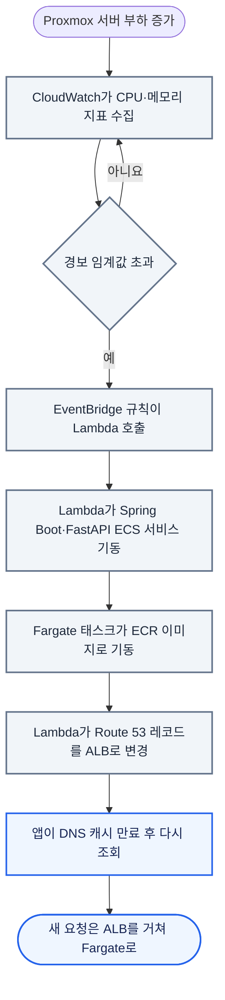

서버 이미지는 Proxmox의 runner에서 만들어 ECR에 올리고, 같은 이미지를 평소에는 Proxmox의 Docker Compose가, 부하가 오르면 AWS의 Fargate가 실행함(P4). 앱과 대상 사이트의 브라우저 조작은 배포 대상이 아니어서 서버 교체 중에도 이미 받은 경로의 실행은 계속됨(P3). 배포 경계는 [아키텍처](/ken-blog/post/doc-fd568125-2806-4210-a0b2-e4bf2d1b509e/)에서 정의함.

## 변경별 반영 경로

```mermaid caption="CI/CD 구성. main push부터 Proxmox 재기동까지 GitHub Actions가 자동으로 하고, Fargate 기동은 부하 경보가 시작함"
flowchart TD
    %% legend: solid=자동 실행; dotted=조건부·사람이 시작; color:#f1f5f9:#64748b=빌드·배포 작업; color:#fff7ed:#ea580c=경보·사람의 조작; round=시작·반영 대상
    push(["main push"])
    push --> runner["GitHub Actions - Proxmox self-hosted runner에서 이미지 빌드"]
    runner --> ecr["Amazon ECR - Spring Boot·FastAPI 이미지 등록"]
    runner -->|Compose 재기동| onprem(["Proxmox Docker Compose"])
    alarm["CloudWatch 경보"] -.->|EventBridge·Lambda| ecs["ECS 서비스 기동"]
    ecr --> ecs
    ecs --> fargate(["AWS Fargate"])
    classDef job fill:#f1f5f9,stroke:#64748b,color:#1e293b,stroke-width:2px
    classDef human fill:#fff7ed,stroke:#ea580c,color:#7c2d12,stroke-width:2px
    class runner,ecr,ecs job
    class alarm human
```

| 변경 | 반영 경로 | 완료 확인 | 관련 문제 |
| --- | --- | --- | --- |
| Spring Boot·FastAPI 소스 | GitHub Actions가 자동으로 runner 빌드 → ECR → Proxmox Compose 재기동 | 컨테이너 상태 검사(`/actuator/health`) | P4 |
| 확장 서비스 | 다음 Fargate 기동 때 ECR의 이미지를 받음 | ALB 대상 상태 | P4 |
| 데스크톱 앱 | GitHub Releases에 올린 설치 파일을 사용자가 받아 설치. 지금 공개 저장소에는 릴리스가 남아 있지 않음 | — | — |
| 작업 경로 | 앱의 기록 저장, 수집 스크립트 → 경로 저장 API | 그래프 통계·검색 결과 | P1 |
| MySQL 스키마 | 엔티티 변경 → 기동 시 Hibernate `ddl-auto: update` | 기동 로그 | — |
| Neo4j 구조 | 저장 코드 변경과 이관 스크립트 | 그래프 통계 | P1 |

공개 저장소에는 GitHub Actions 워크플로, ECS 태스크 정의, Lambda 코드가 없음. 위 경로는 인프라를 구성한 본인의 설명을 기준으로 함.

## 롤백

이전 이미지로 되돌리는 별도 절차는 두지 않았음. 잘못된 이미지가 배포되면 이전 커밋을 되돌려 다시 배포해야 하고, 그동안 문제가 있는 이미지가 계속 실행되는 것이 대가임.

## 컨테이너 이미지

Spring Boot 이미지는 JDK 이미지에서 `bootJar`를 만든 뒤 JRE 이미지에 옮기는 두 단계 빌드이고, 전용 비root 사용자로 실행하며 30초마다 `/actuator/health`로 상태를 검사함.[* [백엔드 Dockerfile](https://github.com/Vovvser/vowser-backend/blob/488d8ea/Dockerfile)] 운영 설정(`deploy` 프로필)은 DB·Redis 접속 정보를 모두 환경 변수로 받아, 같은 이미지가 Proxmox와 Fargate에서 접속 대상만 바꿔 실행됨.[* [배포 설정](https://github.com/Vovvser/vowser-backend/blob/488d8ea/src/main/resources/application-deploy.yml)] FastAPI 서버의 이미지 정의는 공개 저장소에 없음.

## 확장 전환

평소에는 ECS 서비스를 중지해 두고, 부하 경보가 울리면 Lambda가 서비스를 기동하고 DNS 레코드를 ALB로 바꿈.



| 항목 | 내용 |
| --- | --- |
| 확장 대상 | Spring Boot·FastAPI 두 서비스. Fargate의 public subnet에서 public IP로 실행하고 NAT Gateway는 두지 않음 |
| 데이터 | 두 환경이 RDS MySQL·Redis Cloud·Neo4j Cloud를 공유. Proxmox는 Site-to-Site VPN으로 RDS에 접근 |
| 경보 기준 | CPU·메모리 지표 |
| 전환 중 | DNS 캐시가 남은 앱은 계속 Proxmox로 요청함. Spring Boot와 에이전트 서버의 WebSocket은 같은 환경 안의 연결이라, 환경마다 따로 맺어짐 |

ECS 서비스 기동부터 ALB 대상이 정상이 될 때까지는 Proxmox가 부하를 감당함. 이 흐름은 구현해 실습으로 확인했고, 경보 임계값·전환 시간·복귀 방식은 기록으로 남기지 않았음.

## 스키마 변경

MySQL은 이관 도구 없이 Hibernate가 기동 때 엔티티와 테이블을 비교해 열을 추가함(`ddl-auto` 기본값 `update`). 열 추가는 자동으로 반영되지만 이름 변경·삭제·형식 변경은 반영되지 않고, 두 실행 환경이 같은 RDS를 쓰므로 먼저 기동한 쪽의 엔티티가 스키마를 바꿈.

Neo4j는 스키마가 없어 저장 코드가 구조를 정함. `PAGE`·`PATH` 중심 구조에서 `ROOT`·`STEP` 구조로 바꿀 때는 이관 스크립트로 기존 경로를 옮겼고, 경로 정리·인덱스 생성은 운영 API로 실행함.[* [이관 스크립트](https://github.com/Vovvser/vowser-agent-server/blob/d94eaf5/scripts/migrate_old_to_new_db.py)]

## CI 결과의 의미

백엔드 빌드(`./gradlew build`)는 테스트를 함께 실행함. 테스트는 컨텍스트 로드와 음성 처리 단위 테스트이고, 에이전트 연동은 WebSocket 클라이언트를 모의 객체로 바꾼 연결 여부·전달 호출만 검사함. 인증·경로 API를 검사하는 테스트는 없음. 에이전트 서버의 테스트는 실행 중인 서버에 WebSocket으로 접속하는 수동 스크립트임.[* [백엔드 테스트](https://github.com/Vovvser/vowser-backend/tree/488d8ea/src/test/java/com/vowser/backend) · [에이전트 테스트](https://github.com/Vovvser/vowser-agent-server/tree/d94eaf5/test)] 따라서 빌드 성공은 컴파일과 음성 처리 단위 동작을 뜻하고, 경로 저장·검색이나 로그인 흐름의 회귀를 막지 못함.

## 운영 점검

| 점검 | 방법 |
| --- | --- |
| 서버 상태 | Spring Boot `/actuator/health`, 컨테이너 상태 검사 |
| 에이전트 연결 | `/api/v1/speech/mcp-status`가 Spring Boot와 에이전트 서버의 WebSocket 연결 여부를 반환 |
| 경로 데이터 | `/api/v1/paths/graph/stats`의 `ROOT`·`STEP`·관계 수 |
| 부하 | CloudWatch 지표와 경보 |

팀은 k6로 앱 사용자 접속 증가 상황을 흉내 내고 클라이언트에서 백엔드·DB 연결 풀까지 지표를 보며 설정을 조정했음. 본인은 이 부하 시험을 직접 실행하지 않았고, 부하 규모·처음 드러난 병목·바꾼 설정은 [확인 필요].
