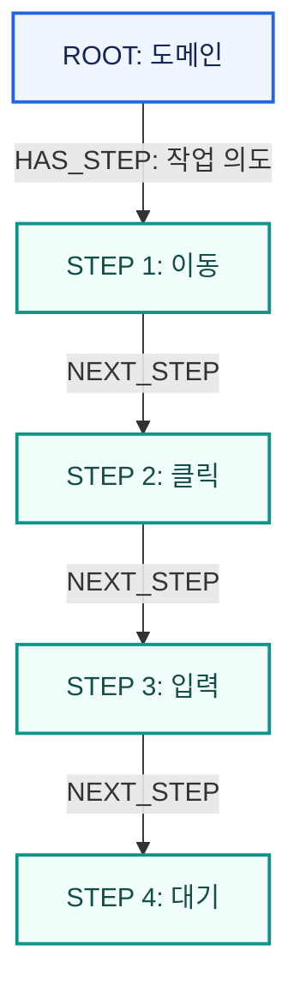

작업 하나는 기록한 사람의 브라우저 조작에서 단계 목록으로 만들어지고, 다른 사용자의 음성 요청으로 검색되어 그 사용자의 PC에서 다시 실행됨(P1·P2·P3). 핵심 문제는 [대문](/ken-blog/post/project-8d420603-48bb-4e29-8983-e08a6e649f80/), 구성과 보장 범위는 [아키텍처](/ken-blog/post/doc-fd568125-2806-4210-a0b2-e4bf2d1b509e/)에서 정의함.

## 기능 범위

| 역할 | 기능 묶음 | 내용 |
| --- | --- | --- |
| 실행 사용자 | 작업 찾기 | 음성 또는 앱 화면에서 작업을 찾음. 음성 인식은 일반·숫자·알파벳 모드를 고를 수 있음 |
| 실행 사용자 | 작업 실행 | 경로를 브라우저에서 단계별로 수행, 현재 단계 그래프, 클릭 대상 강조, 실행 취소 |
| 실행 사용자 | 개인화 | 접근성 프로필(장애 유형·설정) 저장, 회원 정보로 본인 확인 칸 자동 입력 |
| 기록 사용자 | 작업 기록 | 작업 이름을 말한 뒤 브라우저를 조작하면 단계가 기록되고, 끝내면 경로로 저장됨 |
| 운영자 | 경로 관리 | 그래프 통계, 도메인별 경로 시각화, 인기 경로 조회, 벡터 인덱스 생성, 오래된 연결 정리 |

로그인은 OAuth2 소셜 로그인으로만 하고, 첫 로그인 때 회원이 자동 생성됨.[* [OAuth2 회원 처리](https://github.com/Vovvser/vowser-backend/blob/488d8ea/src/main/java/com/vowser/backend/infrastructure/security/oauth2/CustomOAuth2UserService.java)] 운영자 기능은 별도 권한 없이 경로 API 아래에 있어, 접근 통제는 [보안 설계](/ken-blog/post/doc-005871e6-b37a-4873-bbab-0f93aaf467e2/)의 남은 위험으로 다룸.

## 작업 경로 모델

작업 하나는 도메인(`ROOT`), 작업 의도가 붙은 첫 연결(`HAS_STEP`), 차례로 이어진 단계(`STEP`)로 이뤄짐. 검색은 첫 연결의 작업 의도로 하고, 실행은 첫 단계부터 `NEXT_STEP`을 따라 끝 단계까지 함.



저장 구조와 속성은 [데이터 모델](/ken-blog/post/doc-9e692538-463a-46f7-afe0-338da1182bfa/)에서 다룸.

## 단계 실행 규칙

단계마다 동작 종류가 있고, 실행기는 종류에 따라 값을 정하거나 사용자를 기다림.[* [경로 실행기](https://github.com/Vovvser/vowser-client/blob/8065803/shared/src/commonMain/kotlin/com/vowser/client/api/PathExecutor.kt) · [회원 정보 자동 입력](https://github.com/Vovvser/vowser-client/blob/8065803/shared/src/commonMain/kotlin/com/vowser/client/api/UserInputMatcher.kt)]

| 동작 | 실행 규칙 | 실패 시 |
| --- | --- | --- |
| 이동 | 단계의 URL로 이동하고 네트워크가 잠잠해질 때까지 기다림 | 실행 중단 |
| 클릭 | 저장된 선택자를 순서대로 시도(마지막 전까지 각 2초 제한) | 링크 주소로 대체 클릭, 그것도 실패하면 대상 주소로 직접 이동 |
| 입력 | 값은 ① 회원 정보 자동 입력(이름·생년월일·휴대폰 번호 칸) ② 경로에 저장된 입력값 ③ 사용자 입력 순으로 정함. ②가 있으면 ①보다 우선함 | 다음 선택자 시도 후 중단 |
| 선택 | 드롭다운 값을 저장값이나 사용자 선택으로 정함 | 다음 선택자 시도 후 중단 |
| 대기 | 안내 문구를 보여 주고 사용자가 완료를 확인할 때까지 멈춤 | — |

대기 단계는 기록 모드에서 자동으로 생기지 않음. 정부24 등본 경로처럼 수집 스크립트로 준비한 경로에 "카카오톡 본인인증을 완료한 후 진행" 같은 대기 단계가 들어 있음.[* [정부24 경로 수집 스크립트](https://github.com/Vovvser/vowser-agent-server/blob/d94eaf5/scripts/collect_and_save_gov24_new_path.py)] 사용자 기록 경로에서는 값이 저장되지 않은 입력 단계(비밀번호 등)가 사용자 개입 지점이 됨.

입력 값의 우선순위 때문에, 기록한 사람이 일반 텍스트 칸에 입력한 짧은 값이 다른 사용자의 회원 정보보다 먼저 입력됨. 이 동작의 개인정보 측면은 [보안 설계](/ken-blog/post/doc-005871e6-b37a-4873-bbab-0f93aaf467e2/)에서 다룸.

## 작업 찾기와 실행 흐름

음성 인식, 경로 검색, 사용자 PC에서의 실행이 이어지고, 인증 단계에서 사용자 개입이 들어가는 흐름.

```mermaid caption="검색은 서버, 실행과 인증은 사용자 PC에서 일어남. 유사도가 낮으면 서버가 의도·키워드로 다시 찾음"
flowchart TD
    %% legend: color:#eff6ff:#2563eb=사용자 행동; color:#f1f5f9:#64748b=시스템 처리; round=시작·끝; diamond=판단
    start(["작업을 말함"]) --> stt["음성 인식 결과 표시"]
    stt --> search["서버가 등록 경로 검색"]
    search --> sim{"최고 유사도 0.43 이상"}
    sim -->|예| rank["기존 후보 순위화"]
    sim -->|아니요| re["의도·키워드로 재검색"]
    rank --> found{"경로 있음"}
    re --> found
    found -->|없음| none(["작업 없음 안내"])
    found -->|있음| pick["경로 선택"]
    pick --> step["다음 단계 실행"]
    step --> kind{"단계 종류"}
    kind -->|이동·클릭·선택| auto["자동 수행, 대상 강조"]
    kind -->|입력: 값 없음| ask["사용자가 값 입력"]
    kind -->|대기: 인증·결제| wait["사용자가 직접 인증 후 완료 확인"]
    auto --> ok{"성공"}
    ask --> ok
    wait --> ok
    ok -->|선택자 실패| fallback["대체 선택자·주소로 재시도"]
    fallback --> ok2{"성공"}
    ok2 -->|실패| fail(["실행 중단, 단계 표시"])
    ok2 -->|성공| more
    ok -->|성공| more{"남은 단계"}
    more -->|있음| step
    more -->|없음| done(["작업 완료"])
    classDef user fill:#eff6ff,stroke:#2563eb,color:#172554,stroke-width:2px
    classDef system fill:#f1f5f9,stroke:#64748b,color:#1e293b,stroke-width:2px
    class start,pick,ask,wait,none,fail,done user
    class stt,search,sim,rank,re,found,step,kind,auto,ok,fallback,ok2,more system
```

검색 1위 경로를 바로 실행함. 짧은 개발 기간에 맞춰 결과를 고르는 화면은 두지 않았음. 검색 1위 결과의 가중치는 응답 뒤에 올라가, 같은 의도에서 자주 선택된 경로가 인기 경로 조회의 위쪽에 옴.

## 작업 기록 흐름

기록 사용자가 브라우저에서 한 조작이 단계 목록으로 바뀌어 저장되는 흐름. 기록 중에는 중복 클릭과 타이핑을 정리하고, 끝날 때 전체 단계를 한 번에 전송함.[* [기록 서비스](https://github.com/Vovvser/vowser-client/blob/8065803/shared/src/commonMain/kotlin/com/vowser/client/contribution/ContributionModeService.kt) · [기록 상수](https://github.com/Vovvser/vowser-client/blob/8065803/shared/src/commonMain/kotlin/com/vowser/client/contribution/ContributionConstants.kt)]

```mermaid caption="입력값은 20자 이하의 검색어·일반 텍스트만 경로에 남고, 비밀번호·이메일·아이디 칸의 값은 남지 않음"
flowchart TD
    %% legend: color:#eff6ff:#2563eb=사용자 행동; color:#f1f5f9:#64748b=시스템 처리; round=시작·끝; diamond=판단
    start(["기록 모드 시작"]) --> name["작업 이름을 말함"]
    name --> act["브라우저에서 직접 조작"]
    act --> rec["조작을 단계로 기록"]
    rec --> dup{"2초 안의 같은 조작"}
    dup -->|예| skip["중복으로 버림"]
    dup -->|아니요| typing{"타이핑"}
    typing -->|예| merge["1.5초 멈출 때까지 모아 한 단계로"]
    typing -->|아니요| keep["단계 추가"]
    skip --> act
    merge --> act
    keep --> stop{"기록 종료"}
    stop -->|계속| act
    stop -->|사용자가 종료 또는 30분 경과| convert["단계를 선택자·설명·입력 정보로 변환"]
    convert --> save["경로 저장 API로 전체 단계 전송"]
    save --> stored(["의도 임베딩과 함께 Neo4j에 저장, 다음 검색부터 후보"])
    classDef user fill:#eff6ff,stroke:#2563eb,color:#172554,stroke-width:2px
    classDef system fill:#f1f5f9,stroke:#64748b,color:#1e293b,stroke-width:2px
    class start,name,act,stop user
    class rec,dup,skip,typing,merge,keep,convert,save,stored system
```

기록 중에는 5단계씩 WebSocket으로도 보내지만 에이전트 서버는 이를 로그로만 남기고, 실제 저장은 종료 시 REST 경로 저장 한 번으로 함. 저장 요청이 실패해도 앱 화면에 실패가 표시되지 않음.[* [기록 저장 처리](https://github.com/Vovvser/vowser-client/blob/8065803/shared/src/commonMain/kotlin/com/vowser/client/AppViewModel.kt) · [에이전트의 기록 메시지 처리](https://github.com/Vovvser/vowser-agent-server/blob/d94eaf5/app/main.py)]

## 동시 사용 정책

여러 사용자가 같은 작업을 쓰거나 같은 경로를 동시에 저장할 때의 처리.

| 상황 | 처리 | 판단 |
| --- | --- | --- |
| 같은 기록의 재저장 | 단계 ID가 기록 세션·URL·선택자·동작으로 정해져 같은 노드에 `MERGE`, 가중치만 증가 | 재전송으로 단계가 중복 생성되지 않음 |
| 서로 다른 사람이 같은 작업을 기록 | 기록 세션이 달라 별도 경로로 저장되고, 검색 결과에 함께 나옴 | 단계 공유 없음. 대신 한 사람의 잘못된 기록이 다른 경로를 망가뜨리지 않음 |
| 같은 경로의 동시 검색 | 가중치를 한 Cypher 문에서 증가 | 갱신 손실 없음 |
| 동시 검색 요청의 응답 연결 | 백엔드가 요청 ID 없이 대기 중인 첫 요청에 응답을 연결 | 응답이 뒤바뀔 수 있음. [아키텍처](/ken-blog/post/doc-fd568125-2806-4210-a0b2-e4bf2d1b509e/)의 일관성 절 참조 |
