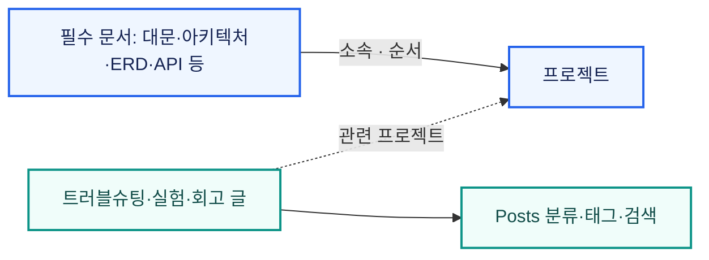
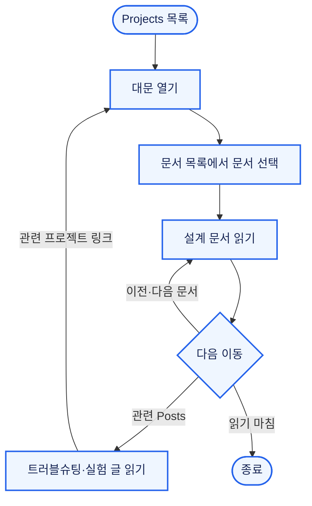
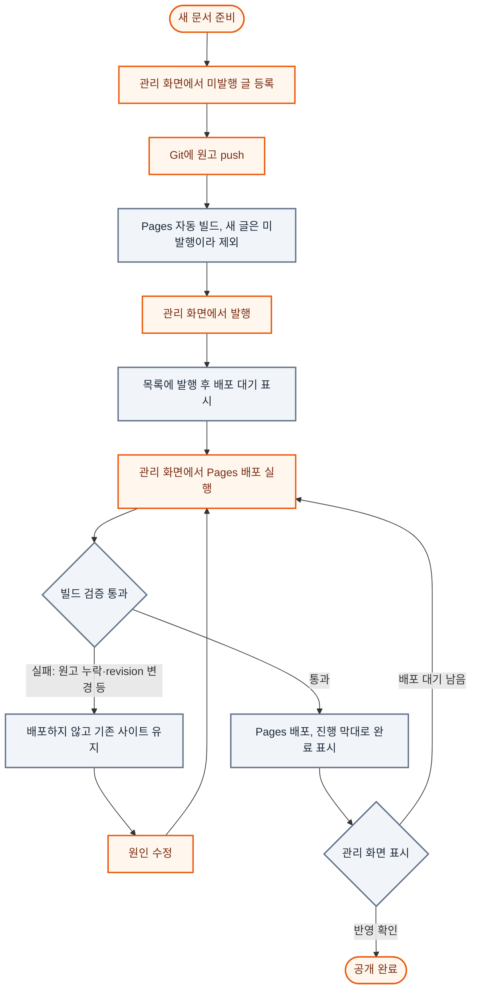

한 편의 글이 Git 원고·DB 글 정보·Pages 배포를 거쳐 공개되고 회수되는 생애주기와 그 과정의 기능 규칙. 세 저장소에 나뉜 자료의 발행 일관성(P3)이 사용자 흐름에서 어떻게 드러나는지를 다룸. 핵심 문제는 [대문](/ken-blog/post/project-06840552-43a2-4870-83a9-d3e848c71d7e/), 구조와 일관성 보장 범위는 [아키텍처](/ken-blog/post/doc-340352c9-5fde-4bae-bc0b-4ecd744719a8/)에서 정의함.

## 기능 범위

| 역할 | 기능 | 내용 |
| --- | --- | --- |
| 독자 | 프로젝트 문서 열람 | 대문에서 설계 문서를 정해진 순서로 읽고, 이전·다음 문서와 관련 Posts로 이동 |
| 독자 | Posts 탐색 | 두 단계 분류·태그·검색으로 일반 글 조회 |
| 독자 | 본문 탐색 | 목차·위키 링크·역링크·주석, 이미지·도식 확대 보기 |
| 관리자 | 글 정보 편집 | 제목·요약·분류·태그·소속·문서 순서·관련 프로젝트 저장 |
| 관리자 | 발행 관리 | 발행·발행 취소, 관리 화면에서 Pages 배포 실행, 공개 사이트 반영 여부 확인 |
| 관리자 | 분류·시리즈·프로젝트 관리 | 두 단계 분류, 묶음 정보·정렬, 프로젝트 상태·기간·기술 배지 |
| 관리자 | 첨부 선언 | 글이 공개 페이지에서 사용할 이미지 목록 지정 |

본문은 웹에서 편집하지 않고 Git의 Markdown 원고로만 수정함(P1). 웹은 글 정보와 발행 상태만 다룸.[* 관리 API는 설정된 관리자 계정의 `ADMIN` 역할로 권한을 검사함. 저장소·서버·DB 접근 권한은 웹 세션과 별개]

## 콘텐츠 모델: 소속과 연결

프로젝트와 글의 관계를 소속과 연결 두 가지로 나눔.



| 관계 | 대상 | 목적 | 표시 위치 |
| --- | --- | --- | --- |
| 소속 (`seriesId`, 문서 순서) | 대문·아키텍처·ERD·API 등 모든 프로젝트에 공통으로 들어가는 필수 문서 | 필수 문서를 한 묶음으로 관리해 빠뜨리거나 갱신을 놓치지 않게 함 | 프로젝트의 순차 문서 목록, 이전·다음 문서 |
| 연결 (`relatedSeriesId`) | 트러블슈팅·실험·회고 글 | 블로그에 따로 올린 글도 어느 프로젝트에서 겪은 일인지 드러나고, 하나의 프로젝트 경험으로 묶이게 함 | Posts 목록, 프로젝트 화면의 관련 Posts 목록, 글에서 프로젝트로 돌아가는 링크 |

트러블슈팅·회고는 하나의 프로젝트 경험에 속한다고 보아, 글 하나는 프로젝트 하나에만 연결함. 연결은 소속과 독립이라 연결한 글도 분류·일반 시리즈를 그대로 가짐.

## 글의 상태와 공개 조건

```mermaid caption="발행 상태는 DB에만 있고 공개 사이트에는 다음 배포에서 반영됨. 최초 발행 시각은 발행 취소 후 다시 발행해도 유지됨"
stateDiagram-v2
    [*] --> DRAFT: 글 정보 등록
    DRAFT --> PUBLISHED: 발행, 최초 발행 시각 기록
    PUBLISHED --> DRAFT: 발행 취소
    DRAFT --> [*]: 삭제
    PUBLISHED --> [*]: 삭제
```

빌드에 들어가는 글은 발행 상태 `PUBLISHED`, 공개 범위 `PUBLIC`이고, 소속 시리즈가 있으면 그 시리즈도 공개인 글.[* 이 밖에 이관 전 구획의 글을 제외하는 `section` 조건이 있음] 공개 화면의 목록과 순서는 이 공개 글만으로 계산함.

| 규칙 | 내용 |
| --- | --- |
| 프로젝트 대문 | 소속 공개 문서를 문서 순서 → 최초 발행 시각 → ID 순으로 정렬한 첫 문서. 순서를 정하지 않은 문서는 마지막 |
| 빈 프로젝트 | 공개 문서가 하나도 없으면 Projects 목록에서 제외 |
| 자동 읽기 목록 | 소속 시리즈가 없고 소분류에 속한 글은 같은 소분류의 공개 글로 이전·다음 목록 구성. 대분류에는 만들지 않음 |

[분류 계층 통합 테스트](https://github.com/gjaku1031/ken-blog/blob/3074d80/src/test/java/io/github/gjaku1031/kenblog/CategoryHierarchyIntegrationTest.java)에서 소분류 목록의 순서 유지와 초안 제외(`secondLevelNavigationKeepsOrderAndExcludesDrafts`), 대분류에 자동 목록을 만들지 않음(`topLevelDoesNotCreateAnAutomaticReadingSeries`)을 확인함.

## 독자 흐름



프로젝트 대문의 문서 목록과 이전·다음 링크로 설계 문서를 순서대로 읽고, 관련 Posts의 글에서 다시 프로젝트로 돌아올 수 있음.

Posts는 두 단계 분류·태그·정적 검색 색인으로 찾고, 위키 링크·역링크와 소분류 읽기 목록으로 관련 글을 이어 읽음. 두 경로 모두 열람 중 API 요청은 관리자 메뉴 표시를 위한 로그인 확인 한 건뿐.[* `/auth/me`. 요청이 실패해도 관리자 메뉴만 숨겨지고 열람에는 영향 없음] 이 구조의 열람 지연은 [정적 생성 측정](/ken-blog/post/post-c342d140-8026-4137-8761-b5c3eecddc2c/)에서 다룸.

## 발행 흐름

원고는 Git, 발행 상태는 DB, 공개 결과는 Pages에 있어 발행이 한 번의 조작으로 끝나지 않음.



원고를 먼저 반영하고 발행 상태를 바꿈. 발행한 글의 원고가 없으면 빌드가 실패하므로[* 원고·이미지 누락, revision 변경 등 빌드 실패 조건은 [아키텍처](/ken-blog/post/doc-340352c9-5fde-4bae-bc0b-4ecd744719a8/)의 일관성 모델 절 참조], 발행을 먼저 하면 원고를 push하기 전에 다른 push나 배포 실행으로 돈 빌드가 원고 누락으로 실패함. 대신 push가 실행한 빌드에는 새 글이 빠져 발행 후 관리 화면에서 배포를 한 번 더 실행해야 함.

DB 변경은 Pages 배포를 자동으로 실행하지 않음. 글 정보를 바꿀 일이 드물어 DB 변경을 감지해 배포하는 경로를 두지 않았고, 그 대가로 공개 사이트가 DB와 어긋나는 구간이 생김. 이 구간은 관리 화면의 배포 대기 표시로 확인하고, 같은 화면의 배포 버튼으로 Pages 배포를 실행함. 버튼은 관리자 API를 거쳐 서버가 GitHub 워크플로를 실행하므로 GitHub 토큰이 브라우저에 오지 않음.

### 배포 대기 표시

빌드는 공개 글마다 제목·요약·분류·태그·소속·문서 순서 등 공개 메타데이터의 지문을 계산해 배포 결과의 `deployment.json`에 기록함. 관리 화면은 서비스 중인 `deployment.json`과 현재 공개 스냅샷의 지문을 캐시 없이 받아 글 단위로 비교함.

| 표시 | 상태 |
| --- | --- |
| 발행 후 배포 대기 | DB에서 발행했지만 배포된 사이트에 없음 |
| 수정 후 배포 대기 | 공개 메타데이터가 배포된 사이트와 다름 |
| 발행 취소 · 배포 대기 | DB에서 발행을 취소했지만 배포된 사이트에 남아 있음 |
| 비공개 전환 · 배포 대기 | 비공개로 바꿨지만 배포된 사이트에 남아 있음 |
| 공개 메타데이터 반영 확인 | 두 지문이 같음 |
| 배포 상태 확인 필요 | 발행·공개 상태인데 현재 공개 스냅샷에 글이 없음 |
| 미발행 · 배포 상태 미확인 등 | 배포 기록이나 스냅샷을 불러오지 못함. 앞에 DB 상태(미발행·비공개 발행·공개 발행)를 붙여 표시 |

둘 중 하나라도 불러오지 못하면 반영 완료로 표시하지 않음. 본문은 비교 대상이 아님. 원고 변경은 push로 Pages 배포가 자동 실행되기 때문. 관리 화면에는 배포 대기 글만 모아 보는 필터가 있음. [배포 상태 판정](https://github.com/gjaku1031/ken-blog/blob/3074d80/src/main/resources/web/shared/deployment-status.ts) · [판정 테스트](https://github.com/gjaku1031/ken-blog/blob/3074d80/.github/pages/deployment.test.mjs)

> 공개 사이트는 DB와 최종적으로 일관되고, 그 사이의 불일치는 관리 화면에서 글 단위로 드러남.

### 발행 취소

발행을 취소하면 DB에서 `DRAFT`로 바뀌어 공개 스냅샷과 해당 글을 통한 첨부 다운로드에서 즉시 빠짐. 공개 사이트에는 다음 배포 전까지 남고, 관리 화면에 '발행 취소 · 배포 대기'로 표시됨. 재배포가 실패하면 이전 공개 파일이 그대로 유지됨.

## 관리 작업의 동시성 정책

관리 화면은 여러 탭에서 열 수 있어 작업마다 충돌 처리를 정함.

| 작업 | 충돌 처리 | 판단 |
| --- | --- | --- |
| 글 정보·문서 순서·소속 | 화면이 받은 편집 버전과 현재 편집 버전을 비교해 다르면 409 | 여러 필드를 함께 바꾸므로 앞선 저장을 덮어쓰지 않게 함 |
| 발행·발행 취소 | 버전 비교 없이 누른 대로 적용. 편집 버전을 올려 열린 편집 화면의 다음 저장은 409 | 혼자 관리하는 블로그라 두 화면에서 동시에 발행 버튼을 누를 일이 없음 |
| 시리즈·프로젝트 정보 | 조회한 수정 시각과 현재 수정 시각을 비교해 다르면 409 | 글 정보와 같은 이유 |
| 첨부 선언 | 버전 비교 없이 전체 교체. 마지막 저장 적용 | 목록 전체를 한 번에 지정하는 작업 |
| 분류 | 분류 트리 전체를 잠그고 변경. 관리 화면의 정렬 요청은 같은 부모의 형제 전체를 담아야 하며, 서버의 형제 집합과 다르면 409 | 정렬 중 추가·삭제된 분류가 빠지지 않게 함 |

409를 받은 화면은 입력을 보존하고, 사용자가 최신 값과 비교해 다시 저장함. 기준 버전만 바꿔 자동으로 다시 보내지 않음. 자동 재전송은 앞선 저장을 덮어쓰는 것과 같기 때문. [편집 충돌 화면 검사](https://github.com/gjaku1031/ken-blog/blob/3074d80/.github/pages/browser.spec.mjs) · [영속성 통합 테스트](https://github.com/gjaku1031/ken-blog/blob/3074d80/src/test/java/io/github/gjaku1031/kenblog/PostPersistenceIntegrationTest.java)

[API 명세](/ken-blog/post/doc-6bf82223-5b13-49ae-894b-5da5a0de6ddf/) · [글 서비스](https://github.com/gjaku1031/ken-blog/blob/3074d80/src/main/java/io/github/gjaku1031/kenblog/post/service/PostService.java) · [Pages 워크플로](https://github.com/gjaku1031/ken-blog/blob/3074d80/.github/workflows/pages.yml)
