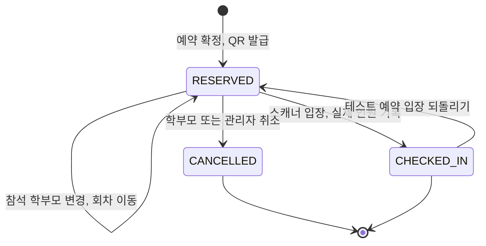
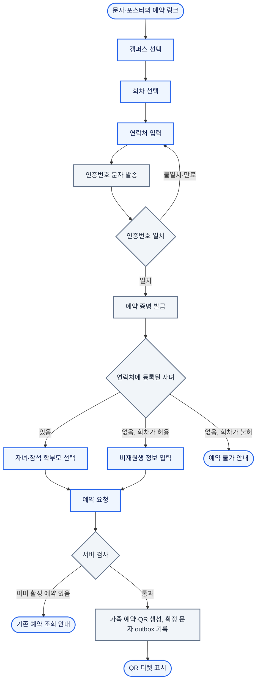

학부모의 예약 한 건은 문자 인증, 예약 확정, 당일 입장의 세 단계를 거치고, 단계마다 다른 사람(학부모·관리자·현장 스캐너)이 같은 예약 행을 바꿈(P1). 핵심 문제는 [대문](/ken-blog/post/project-d2ef2e0b-2e15-4aee-9454-88b4d5a00172/), 구조와 일관성 보장 범위는 [아키텍처](/ken-blog/post/doc-71ac4b10-9f99-4251-893d-a57dd46ad334/)에서 정의함.

## 기능 범위

| 역할 | 기능 | 내용 |
| --- | --- | --- |
| 학부모 | 예약 | 캠퍼스·회차 선택, 문자 인증, 연락처에 등록된 자녀 선택, 참석 학부모(모·부·모와 부) 선택, 가족 QR 발급 |
| 학부모 | 비재원생 예약 | 회차가 허용한 경우 이름·학교·학년·캠퍼스로 예약 |
| 학부모 | 예약 관리 | 문자 링크나 연락처 조회로 예약과 QR 다시 보기, 참석 학부모 변경, 회차 이동, 취소 |
| 현장 직원 | 입장 처리 | iPad 페어링, 회차 선택과 잠금, QR 스캔 또는 연락처 뒤 네 자리 검색, 실제 입장 인원 입력 |
| 관리자 | 설명회 운영 | 설명회·회차 생성과 공개, 예약 기간·비재원생 허용 설정, 안내 포스터 등록 |
| 관리자 | 명단·통계 | 회차별 재원생 명단과 예약·입장·로그, 캠퍼스·단위·담임 필터, 엑셀 내보내기, 수동 예약·취소 |
| 관리자 | 문자 | 템플릿 편집, 대상별 미리보기와 발송, 발송 이력 |
| 관리자 | 스캐너·동기화 | 스캐너 기기 상태와 배터리, 페어링 코드 발급·해제, 학생 동기화 실행·상태 확인 |
| 시스템 | 자동 처리 | 예약 확정·변경·취소 문자, 시트 반영, 6시간마다 재원생 동기화, 등록한 비재원생 예약의 재원생 연결 |

학부모는 계정이 없고, 관리자는 운영자가 등록한 단일 관리자 계정, 현장 iPad는 페어링 코드로 받은 스캐너 세션으로 권한을 가짐.[* 역할은 `ADMIN`·`SCANNER` 두 가지. [역할 제약](https://github.com/gjaku1031/npr-seminar/blob/e74a2a2/apps/api/prisma/migrations/20260717000000_corrected_nest_baseline/migration.sql)]

## 예약 모델: 가족 예약과 참가자

예약 단위는 학생이 아니라 가족임. 한 연락처가 같은 회차에 형제를 함께 예약하면 가족 예약 한 건에 참가자 여러 명이 붙고, QR도 가족당 하나만 발급됨. 형제 수만큼 예약·QR을 만들면 입구에서 같은 학부모가 QR을 여러 번 찍어야 하고 참석 인원도 중복으로 세어지기 때문.

```mermaid caption="참가자 행은 예약 시점의 학생 이름·반·학교·학년·담임을 복사해 두므로, 이후 원장이 바뀌어도 명단과 입장 기록은 그대로임"
flowchart LR
    %% legend: color:#eff6ff:#2563eb=예약; color:#f0fdfa:#0d9488=학생 원장; solid=소유; dotted=참조
    booking[가족 예약: 연락처, 참석 학부모, 상태]
    enrolled[재원생 참가자: 학생 스냅샷]
    guest[비재원생 참가자: 입력값, 내부 번호]
    qr[가족 QR: 활성 1개]
    student[학생 원장]
    booking --> enrolled
    booking --> guest
    booking --> qr
    enrolled -.-> student
    classDef bookingC fill:#eff6ff,stroke:#2563eb,color:#172554,stroke-width:2px
    classDef studentC fill:#f0fdfa,stroke:#0d9488,color:#134e4a,stroke-width:2px
    class booking,enrolled,guest,qr bookingC
    class student studentC
```

| 규칙 | 내용 |
| --- | --- |
| 재원생 소유 | 인증한 연락처가 학생의 모 또는 부 연락처와 일치해야 예약 가능. 선택한 캠퍼스에 속한 자녀만 후보로 보임 |
| 중복 예약 | 한 회차에서 한 연락처의 활성 예약은 하나, 한 학생의 활성 참가는 하나 |
| 재원생 연락처 | 재원생으로 등록된 연락처는 비재원생 예약을 할 수 없음 |
| 참석 학부모 | 모·부·모와 부 중 하나. 예약 인원은 1명 또는 2명 |
| 좌석 | 회차에 정원이 없음. 예약 수와 실제 입장 인원만 셈 |
| 비재원생 연결 | 매 동기화 뒤, 지나지 않은 회차의 비재원생 참가자 중 이름과 연락처가 모두 일치하는 재원생이 생기면 재원생 참가로 바꿈. 하나만 일치하면 바꾸지 않음 |

비재원생 연결은 이름과 연락처 둘 다 일치할 때만 함. 연락처만 보면 형제에게, 이름만 보면 동명이인에게 잘못 붙기 때문이며, 같은 캠퍼스 동명이인 37건 중 33건이 다른 학교였음.[* [비재원생 연결](https://github.com/gjaku1031/npr-seminar/blob/e74a2a2/apps/api/src/modules/student-sync/guest-booking-reconciler.service.ts). 2026-08-19 커밋 시점의 학생 원장 기준]

## 예약 상태와 입장



취소하면 그 예약의 QR이 폐기되고, 같은 가족이 다시 예약하면 이전 예약을 되살리지 않고 새 예약을 만듦. 회차를 옮겨도 QR은 그대로이고, 예약 행과 모든 참가자 행의 회차가 한 트랜잭션에서 함께 바뀜.[* 참가자 행의 (예약 ID, 회차 ID) 외래 키를 트랜잭션 안에서만 지연 검사함. [ERD 문서](https://github.com/gjaku1031/npr-seminar/blob/e74a2a2/apps/api/docs/erd.md)]

### 인원을 세는 세 가지 기준

형제가 함께 예약하면 학생 행은 둘이지만 가족 예약은 하나이고, 참석 학부모는 예약 인원과 다를 수 있음. 명단과 통계는 세 값을 따로 셈.

| 지표 | 세는 것 | 쓰는 곳 |
| --- | --- | --- |
| 해당 학생 | 필터에 걸린 학생 행 수 | 단위·담임별 명단 |
| 형제원생 제외 | 중복 없는 활성 가족 예약 수 | 예약 규모 |
| 참가자 수 | 예약한 참석 학부모 수(모와 부는 2명). 형제 수만큼 곱하지 않음 | 행사장 준비 |
| 실제 입장 인원 | 입구에서 직원이 입력한 인원 | 행사 후 실적 |

실제 입장 인원은 예약 인원에서 계산하지 않음. 1명으로 예약하고 두 분이 오거나, 2명 예약에 한 분만 오는 경우가 있어 스캐너가 매번 인원을 묻고 입력값을 그대로 기록함.[* 입력 상한 20명은 숫자패드 오타를 막는 값. [입장 서비스](https://github.com/gjaku1031/npr-seminar/blob/e74a2a2/apps/api/src/modules/check-ins/check-ins.service.ts)]

## 학부모 예약 흐름



예약 요청에는 브라우저가 만든 `Idempotency-Key`가 붙음. 응답을 받기 전에 연결이 끊겨 다시 보내면 서버는 새 예약을 만들지 않고 처음 결과를 돌려주며, 이때 QR 원문은 응답에 없으므로 화면은 예약 조회로 QR을 다시 받게 안내함.[* [예약 서비스](https://github.com/gjaku1031/npr-seminar/blob/e74a2a2/apps/api/src/modules/family-bookings/family-bookings.service.ts)]

확정 문자에는 QR이 아니라 예약 링크(`/booking/{예약 ID}`)가 담김. 링크를 열면 연락처를 다시 입력해 그 예약 하나에 대한 읽기 세션을 받고, 변경·취소는 다시 문자 인증을 거쳐야 함. 링크의 예약 ID는 추측하기 어려운 UUID지만 그 자체로 권한이 되지 않음.

## 현장 입장 흐름

```mermaid caption="회차를 잠근 스캐너만 스캔할 수 있어, 다른 회차 예약은 SESSION_MISMATCH로 기록되고 입장 처리되지 않음"
flowchart TD
    %% legend: color:#fff7ed:#ea580c=현장 직원 행동; color:#f1f5f9:#64748b=시스템 처리; round=시작·끝; diamond=판단
    start(["관리자가 페어링 코드 발급"]) --> claim["iPad에서 6자 코드 입력"]
    claim --> scannerSession["스캐너 세션 발급"]
    scannerSession --> lock["오늘 회차 선택, 스캔 모드 잠금"]
    lock --> scan{"QR 있음"}
    scan -->|있음| read["QR 스캔"]
    scan -->|없음| last4["연락처 뒤 네 자리로 후보 검색 후 선택"]
    read --> count["실제 입장 인원 선택"]
    last4 --> count
    count --> decide{"입장 판정"}
    decide -->|CHECKED_IN| ok(["입장 확인 표시, 대표 학생 이름"])
    decide -->|ALREADY_CHECKED_IN| dup(["이미 입장, 기존 인원 표시"])
    decide -->|취소·만료·다른 회차·무효| reject(["거절 사유 표시"])
    classDef staff fill:#fff7ed,stroke:#ea580c,color:#7c2d12,stroke-width:2px
    classDef system fill:#f1f5f9,stroke:#64748b,color:#1e293b,stroke-width:2px
    class start,claim,lock,read,last4,count,ok,dup,reject staff
    class scannerSession,scan,decide system
```

입장 판정은 거절도 모두 입장 사건으로 남김. 무효 QR, 취소된 예약, 다른 회차 예약은 예약 상태를 바꾸지 않고 결과 코드만 기록되며, 관리자 화면의 실시간 입장 로그가 이 사건을 보여 줌. 스캔은 회차를 잠근 상태에서만 가능해, 실수로 다른 화면으로 넘어가 다른 회차에 입장 처리하는 일을 막음.[* [결정 기록의 스캐너 페어링 절](https://github.com/gjaku1031/npr-seminar/blob/e74a2a2/docs/specs/nestjs-implementation-decisions-20260717.md)]

페어링 코드는 5분 동안 한 번만 쓸 수 있고 Redis에는 다이제스트로만 저장됨. 관리자나 iPad 쪽에서 페어링을 해제하면 스캐너 세션이 즉시 끊기고, 기기 행은 지워져도 그 기기의 입장 기록은 남음.

## 관리 작업의 동시성 정책

관리자 콘솔, 학부모 화면, 여러 스캐너가 같은 예약을 동시에 바꿀 수 있어 작업마다 충돌 처리를 정함.

| 작업 | 충돌 처리 | 판단 |
| --- | --- | --- |
| 예약 생성 | 회차 행을 잠근 뒤 활성 예약을 확인하고, 부분 유니크 인덱스가 최종 차단 | 같은 연락처의 동시 예약이 둘 다 통과하지 않게 함 |
| 예약 변경·취소 | 조회한 `expectedVersion`과 현재 버전이 다르면 409. 회차 잠금 후 예약 잠금 | 학부모와 관리자가 같은 예약을 동시에 고칠 때 앞선 변경을 덮어쓰지 않음 |
| 입장 | 버전 비교 없이 `RESERVED`인 경우에만 `CHECKED_IN`으로 바꾸는 조건부 갱신. 경합에서 진 요청은 `ALREADY_CHECKED_IN` | 입장은 같은 결과로 수렴해야 하므로 409 대신 이미 입장으로 응답 |
| 입장과 취소·회차 이동 | 모두 회차 ID 오름차순으로 잠근 뒤 예약 잠금. 잠근 뒤 회차를 다시 확인 | 최종 상태가 하나만 남고, 이동된 예약은 이전 회차 스캐너에서 거절 |
| 설명회·회차 정보 | 조회한 버전과 다르면 409 | 여러 필드를 함께 바꾸는 수정 |
| 페어링 코드 사용과 취소 | Redis 스크립트로 원자적으로 처리해 둘 중 하나만 성공 | 취소한 코드로 기기가 붙지 않게 함 |

같은 연락처의 동시 예약, 입장과 취소의 경합, 회차 이동과 취소의 경합은 통합 테스트가 검사함.[* [예약 통합 테스트](https://github.com/gjaku1031/npr-seminar/blob/e74a2a2/apps/api/test/integration/family-bookings.spec.ts) · [스캐너 동시성 테스트](https://github.com/gjaku1031/npr-seminar/blob/e74a2a2/apps/api/test/integration/scanner-device-concurrency.spec.ts)] 요청 계약과 409 응답 형식은 [API 설계](/ken-blog/post/doc-570225bc-e4d5-42db-b89e-64a8ab9d413c/)에서 다룸.
