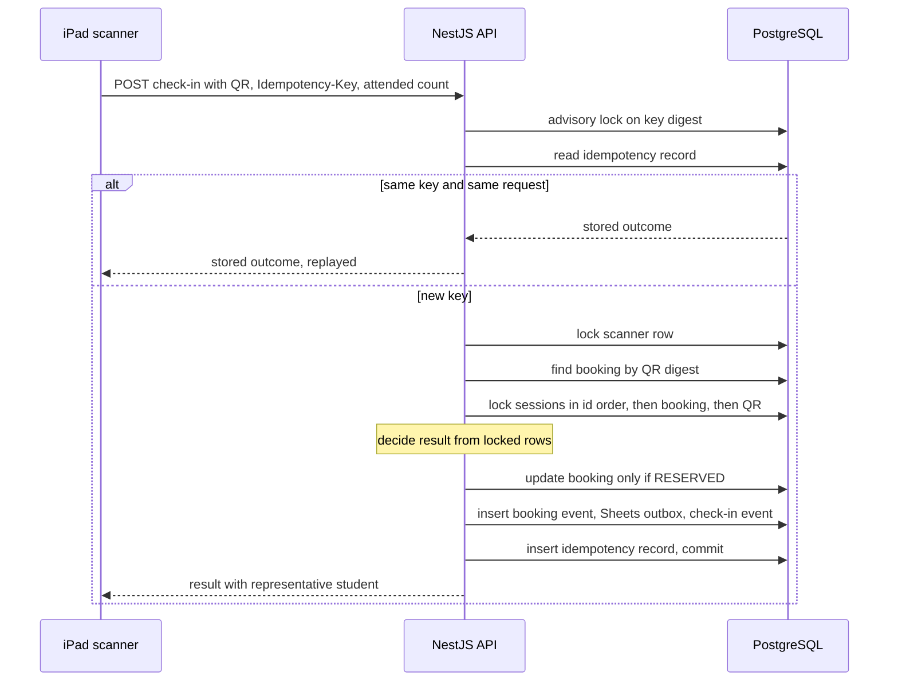

예약·입장·학생 원장은 PostgreSQL 한 곳에서 트랜잭션으로 바뀌고, 외부 서비스 호출은 그 트랜잭션 밖의 worker와 동기화 실행이 맡음.

## 품질 요구사항

| 품질 속성 | 요구 | 관련 문제[* P1~P3는 [대문](/ken-blog/post/project-d2ef2e0b-2e15-4aee-9454-88b4d5a00172/)에서 정의함] | 구조적 대응 |
| --- | --- | --- | --- |
| 정합성 | 한 회차에서 한 연락처·한 학생의 활성 예약은 하나. 입장·취소·회차 이동이 경합해도 최종 상태는 하나 | P1 | 회차 행 잠금 순서, 부분 유니크 인덱스, 상태별 CHECK 제약 |
| 멱등성 | 응답을 받지 못해 다시 보낸 변경 요청은 처음 결과를 돌려받고 두 번 반영되지 않음 | P1 | `Idempotency-Key`와 요청 다이제스트를 DB에 24시간 저장 |
| 기밀성 | 연락처·QR·예약 증명의 원문이 DB·URL·로그·시트에 남지 않음 | P2 | 암호문·다이제스트 저장, QR은 헤더와 요청 본문으로만 전달 |
| 장애 격리 | 문자·시트·학생 원천의 장애가 예약·입장 처리를 막지 않음 | P3 | 트랜잭션 outbox, 별도 worker 프로세스, 학생 원천 회로 |
| 중복 실행 방지 | 결과를 알 수 없는 외부 호출을 자동으로 반복하지 않음 | P3 | lease 기반 작업 소유, `DELIVERY_UNKNOWN`, 로그인 1회 회로 |

## 인프라 구성도

시스템은 공개 진입점(GCP VM), 운영 VM, 외부 서비스 세 곳에 나뉘어 있음.[* [운영 배포 절차](https://github.com/gjaku1031/npr-seminar/blob/92598e6/ops/pve-release/README.md) · [공개 게이트웨이](https://github.com/gjaku1031/npr-seminar/blob/92598e6/ops/gcp-gateway/README.md)]

```mermaid caption="운영 VM에서 외부로 열린 포트는 WireGuard 상대만 접근하는 upstream 소켓 하나이고, 나머지는 모두 loopback에만 열림"
architecture-beta
  %% layout: npr-infrastructure
  group users[Users]
  group gcp(ken:google-cloud)[GCP VM]
  group academy[Academy network]
  group vm(ken:proxmox)[Release VM] in academy
  group external[External services]

  service parent(ken:user)[Parent phone] in users
  service admin(ken:user)[Admin console] in users
  service scanner(ken:user)[iPad scanner] in users
  service caddy(ken:caddy)[Caddy] in gcp
  service proxy(ken:wireguard)[Socket proxy] in vm
  service web(ken:nextjs)[Next.js web] in vm
  service redis(ken:redis)[Redis] in vm
  service api(ken:nestjs)[NestJS API] in vm
  service worker(ken:nodejs)[Delivery worker] in vm
  service pg(ken:postgresql)[PostgreSQL] in vm
  service nas(ken:disk)[NAS] in academy
  service tong(server)[Student source] in external
  service sms(cloud)[SMS provider] in external
  service sheets(ken:google-sheets)[Google Sheets] in external

  parent:R -[HTTPS]-> L:caddy
  admin:R -[HTTPS]-> L:caddy
  scanner:R -[HTTPS]-> L:caddy
  caddy:R -[WireGuard]-> T:proxy
  proxy:R -[Loopback]-> L:web
  web:B -[API]-> T:api
  api:L -[Sessions]-> R:redis
  api:B -[SQL]-> T:pg
  worker:B -[Claim outbox]-> R:pg
  api:T -[Sync]-> L:tong
  worker:R -[SMS]-> L:sms
  worker:R -[Sheets]-> L:sheets
  pg:B -[Backup]-> T:nas
```

| 배포 경계 | 구성 요소 | 책임 |
| --- | --- | --- |
| GCP VM | Caddy | 공개 HTTPS 종료와 인증서 자동 갱신, WireGuard로 운영 VM에 전달. 접근 로그를 남기지 않음 |
| 운영 VM | 소켓 프록시 | WireGuard 주소에서만 받아 loopback의 Next.js로 전달. 운영 VM의 유일한 비loopback 수신 |
| 운영 VM | Next.js | 학부모 예약 화면, 관리자 콘솔, 스캐너 화면 제공. `/api/v1/*`를 API로 전달 |
| 운영 VM | NestJS API | 인증·세션, 예약·입장·명단·통계, 문자 outbox 기록, 학생 원천 동기화 |
| 운영 VM | Delivery worker | 문자·시트 outbox 처리. HTTP 수신 없음, 전용 DB 역할과 Google 인증 파일 사용 |
| 운영 VM | PostgreSQL | 학생·예약·QR·입장·감사 기록·outbox의 원장. 매일 03:30 백업 |
| 운영 VM | Redis | 관리자·스캐너 세션, 요청 횟수 제한, 페어링 코드, 스캐너 접속 상태 |
| 외부 | 통통통 | 재원생 원천. API가 6시간마다 조회 |
| 외부 | Aligo | 문자 발송. worker만 호출 |
| 외부 | Google Sheets | 운영 직원이 보는 예약 명단 사본. worker가 한 방향으로만 씀 |

운영 VM은 공유기 포트 포워딩 없이 WireGuard 터널로만 외부와 연결됨.[* 운영 VM은 학원 안에 둔 본인의 개발용 Proxmox 서버에 있음]

## 주요 흐름

| 흐름 | 처리 경로 | 실패하면 | 관련 문제 |
| --- | --- | --- | --- |
| 학부모 예약 | 휴대폰 브라우저 → GCP Caddy → WireGuard → Next.js → `/api/v1` → NestJS API → PostgreSQL. 확정 문자는 outbox에 남김 | 응답을 받지 못해 다시 보낸 요청은 멱등 키로 저장된 결과를 그대로 돌려받음. 문자 발송이 실패해도 예약은 유지됨 | P1·P2 |
| 현장 입장 | iPad(스캐너 세션) → 같은 경로 → 입장 트랜잭션에서 예약 상태·입장 사건·시트 outbox를 함께 커밋 | 다른 회차로 옮겨진 예약은 `SESSION_MISMATCH`로 기록되고 입장되지 않음. QR이 안 읽히면 연락처 뒤 네 자리로 찾고, 예약이 없으면 관리 화면에서 현장 예약을 만든 뒤 입장 | P1 |
| 문자·시트 반영 | API 트랜잭션의 outbox 행 → worker의 lease 획득 → 문자 공급자·Google Sheets → 시도 기록 | 전송 중 결과를 모르게 된 문자는 `DELIVERY_UNKNOWN`으로 멈춰 사람이 확인함. 시트 공유 범위가 넓으면 쓰지 않음 | P3 |
| 재원생 동기화 | API 스케줄러(6시간마다) → 학원 관리 서비스 로그인 1회와 세 캠퍼스 조회 → staging 검증 → 학생 원장 승격 | 검증에 실패하면 원장을 바꾸지 않고, 로그인 결과가 불명확하면 회로를 열어 사람이 확인할 때까지 멈춤 | P3 |
| 배포 | 운영 VM의 배포 스크립트 → 빌드·DB 백업·마이그레이션 → 릴리스 링크 교체 | 교체 뒤 검사에 실패하면 이전 릴리스로 자동 복귀. 절차는 [배포와 운영](/ken-blog/post/doc-5fe55659-a943-4c64-aed1-481462f32c56/) | — |

## 시스템 구조

화면(web), 업무 API, 전달 worker가 서로 다른 프로세스와 OS 계정으로 나뉨. 화면은 DB 접속 정보를 받지 않고 `/api/v1`만 호출하며, 두 앱이 공유하는 것은 OpenAPI 계약 하나뿐임.[* [모노레포 경계](https://github.com/gjaku1031/npr-seminar/blob/92598e6/docs/monorepo.md) · [OpenAPI 계약](https://github.com/gjaku1031/npr-seminar/blob/92598e6/packages/contracts/openapi.yaml)]


| 프로세스 | DB 역할 | 가진 비밀값 | 하지 않는 것 |
| --- | --- | --- | --- |
| web | 없음 | 없음 | DB·Redis 접속, API 내부 코드 import |
| API | `npr_app` | 세션 키, 연락처 암호화·HMAC 키, QR 암호화 키, 통통통 계정 | Google 인증 파일 보유, 문자 공급자 호출 |
| worker | `npr_worker` | 연락처 복호화 키, 문자 공급자 키, Google 인증 파일 | HTTP 수신, 학생·예약 원장 쓰기 |
| 마이그레이션 | `npr_migrator` | 마이그레이션 DB 주소 | 런타임 실행 |

API는 설정에 Google 인증 파일 경로가 있으면 기동을 거부하고, 배포 스크립트는 API 설정에 worker·마이그레이션 DB 주소가 들어 있으면 배포를 멈춤.[* [설정 검증](https://github.com/gjaku1031/npr-seminar/blob/92598e6/apps/api/src/common/config/environment.ts) · [worker 운영 절차](https://github.com/gjaku1031/npr-seminar/blob/92598e6/apps/api/docs/worker-runbook.md)]

API 내부는 요청 순서대로 가드, 컨트롤러, 서비스, 저장 계층으로 나뉨. 별도 저장소(Repository) 계층 없이 서비스가 Prisma Client와 SQL을 직접 쓰고, 잠금·조건부 갱신은 SQL로 씀.[* [모듈 책임 정리](https://github.com/gjaku1031/npr-seminar/blob/92598e6/docs/refactoring-notes.md)]

```mermaid caption="API 내부 계층. 외부 통신은 gateway에만 있고, 서비스는 외부 호출 대신 outbox 행을 기록함"
flowchart TB
    request([HTTP request from Next.js])
    guards[Guards: session, role, same-origin, CSRF, booking proof]
    controller[Controllers: DTO validation, HTTP mapping]
    service[Services: locks, state transitions, idempotency]
    prisma[Prisma Client and raw SQL]
    outbox[Outbox rows: SMS, Sheets]
    gateway[TongTongTong gateway]
    pg[(PostgreSQL)]
    redis[(Redis sessions, rate limits)]
    request --> guards
    guards --> controller
    controller --> service
    service --> prisma
    service --> outbox
    service --> gateway
    prisma --> pg
    outbox --> pg
    guards -.-> redis
    classDef web fill:#eff6ff,stroke:#2563eb,color:#172554,stroke-width:2px
    classDef domain fill:#f5f3ff,stroke:#7c3aed,color:#2e1065,stroke-width:2px
    classDef store fill:#f0fdfa,stroke:#0d9488,color:#134e4a,stroke-width:2px
    class guards,controller web
    class service,gateway domain
    class prisma,outbox,pg,redis store
```

## 데이터의 정본과 파생 결과물

같은 예약이 DB, 문자, Google Sheets, 엑셀 내보내기에 나타나고, 학생 정보는 외부 원천에서 들어옴. 어느 쪽이 정본이고 다른 쪽이 언제 따라오는지를 정해 두지 않으면, 직원이 시트를 고치거나 원천이 바뀌었을 때 어느 값을 믿을지 정할 수 없음.

| 자료 | 정본 | 변경 주체 | 파생·반영 |
| --- | --- | --- | --- |
| 재원생·반 배정·학부모 연락처 | 통통통 | 학원 행정 | 6시간마다 staging 검증 후 PostgreSQL 학생 원장으로 승격 |
| 예약·참가자·QR·입장 | PostgreSQL | 학부모·관리자·스캐너 | 문자 outbox, 시트 outbox, 엑셀 내보내기 |
| 예약 당시 학생 정보 | PostgreSQL 참가자 행의 스냅샷 | 예약 시점에 고정 | 학생 원장이 바뀌어도 명단·입장 기록은 예약 당시 값 유지 |
| 운영 명단 시트 | PostgreSQL에서 파생 | worker만 씀 | 시트에서 고친 값은 DB로 돌아오지 않음 |
| 세션·요청 횟수·페어링 코드 | Redis | API | 유실되면 재로그인·재페어링으로 복구. 원장이 아님 |

Redis가 유실되면 관리자 재로그인과 진행 중인 인증 무효화는 감수하지만, 예약 원장은 영향을 받지 않음.[* [모노레포 경계](https://github.com/gjaku1031/npr-seminar/blob/92598e6/docs/monorepo.md)]

## 일관성 모델과 보장 범위

예약·입장 원장은 한 DB 트랜잭션으로 바뀌지만, 문자·시트·학생 원천은 DB 밖에 있어 같은 트랜잭션에 넣을 수 없음. 그래서 원장 안에서는 잠금과 제약으로 즉시 일관성을 지키고, 원장 밖으로는 outbox로 최종적 일관성을 맞춤.

| 경계 | 보장 | 방법 | 보장하지 않는 구간 |
| --- | --- | --- | --- |
| 예약 생성 | 회차당 연락처 하나·학생 하나의 활성 예약 | 회차 행 잠금 후 선조회, 부분 유니크 인덱스 | — |
| 입장·취소·회차 이동 | 경합해도 최종 상태 하나. 다른 회차로 옮겨진 예약은 입장 거부 | 회차 ID 오름차순 잠금 후 예약 행 잠금, 잠근 뒤 회차 재확인 | — |
| 요청 재전송 | 같은 키·같은 본문은 첫 결과 재생, 다른 본문은 409 | 멱등 키 advisory lock과 요청 다이제스트 비교 | 24시간이 지난 키, 같은 화면을 새로 고친 뒤의 재시도 |
| 원장 → 문자·시트 | 최종적 일관성. 커밋된 예약의 발송 작업은 반드시 남음 | 같은 트랜잭션의 outbox 행, worker lease | 결과 불명 문자(`DELIVERY_UNKNOWN`)는 사람이 확인 |
| 통통통 → 학생 원장 | 세 캠퍼스 전체가 한 번에 바뀌거나 전혀 바뀌지 않음 | staging 해시 재검증 후 한 트랜잭션 승격 | 원천 변경부터 다음 동기화까지 최대 6시간 |
| 감사 기록 | 입장·예약 사건과 외부 시도 기록은 고칠 수 없음 | 갱신·삭제를 거부하는 DB 트리거 | — |

> 예약과 입장의 상태는 DB 트랜잭션 안에서 즉시 하나로 정해지고, 문자와 시트는 커밋된 outbox를 따라 나중에 맞춰짐.

### 입장 처리 순서

입장 요청은 한 트랜잭션에서 멱등 키, 스캐너, 회차, 예약, QR 순서로 잠금. 학부모의 회차 이동이 예약 조회와 잠금 사이에 끝나면, 잠근 뒤 다시 읽은 회차가 스캐너 회차와 달라 `SESSION_MISMATCH`로 기록됨.[* [입장 서비스](https://github.com/gjaku1031/npr-seminar/blob/92598e6/apps/api/src/modules/check-ins/check-ins.service.ts)] 이 방식을 고른 이유와 대안은 [주요 기술적 의사결정](/ken-blog/post/doc-faeef8eb-3ab9-4a39-840f-bfb6b01adbda/)의 P1에 있음. 중복을 막는 인덱스와 상태 제약은 [데이터 모델](/ken-blog/post/doc-6c652497-f90f-4841-a2e8-4eef47870f69/)에서, 스캐너 세션과 가드는 [보안 설계](/ken-blog/post/doc-9ba607d2-b6e2-4a63-8e79-c974564acf11/)에서 다룸.


