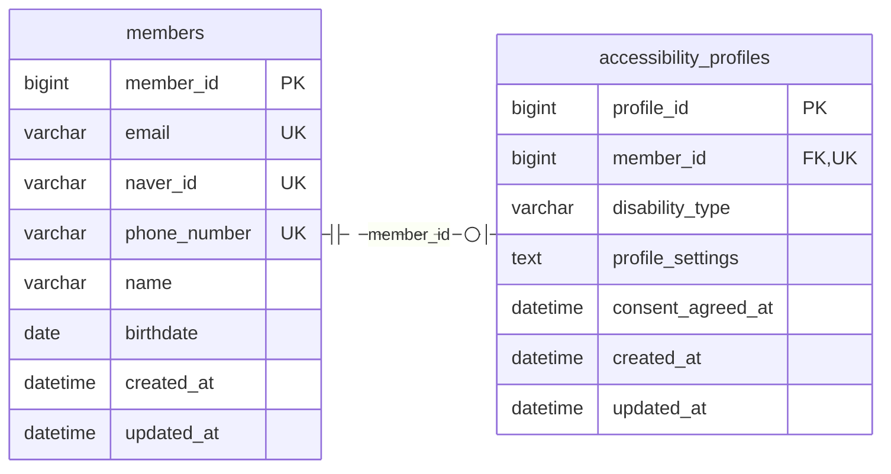

작업 경로는 Neo4j 그래프에, 회원과 접근성 프로필은 MySQL에, 로그인 토큰은 만료 시간과 함께 Redis에 둠. 경로 그래프가 이 프로젝트의 핵심 데이터이고(P1·P2), MySQL은 회원 두 테이블뿐임. 세 저장소의 역할과 정본 구분은 [아키텍처](/ken-blog/post/doc-fd568125-2806-4210-a0b2-e4bf2d1b509e/)에서 다룸.

## 작업 경로 그래프(Neo4j)

경로는 노드 두 종류와 관계 두 종류로 저장함. 이 절의 구조는 에이전트 서버의 저장·검색 코드 기준임.[* [경로 저장·검색 코드](https://github.com/Vovvser/vowser-agent-server/blob/d94eaf5/app/services/neo4j_service.py) · [데이터 모델](https://github.com/Vovvser/vowser-agent-server/blob/d94eaf5/app/models/step.py)]

```mermaid caption="작업 의도는 노드가 아니라 ROOT에서 첫 STEP으로 가는 관계의 속성임. 같은 도메인의 작업마다 HAS_STEP 관계가 하나씩 생김"
flowchart TD
    %% legend: color:#eff6ff:#2563eb=노드; solid=관계
    root["ROOT: 도메인"]
    first["STEP: 첫 단계"]
    next["STEP: 다음 단계"]
    last["STEP: 마지막 단계"]
    root -->|HAS_STEP| first
    first -->|NEXT_STEP| next
    next -->|NEXT_STEP| last
    classDef node fill:#eff6ff,stroke:#2563eb,color:#172554,stroke-width:2px
    class root,first,next,last node
```

| 요소 | 책임 | 주요 속성 | 식별·제약 | 쓰는 곳 |
| --- | --- | --- | --- | --- |
| `ROOT` | 도메인 하나 | `domain`, `baseURL`, `displayName`, `embedding`, `visitCount`, `lastVisited` | `domain` 고유 제약 | 도메인 힌트 검색의 시작점, 방문 횟수 |
| `STEP` | 실행할 단계 하나 | `stepId`, `url`, `action`, `selectors`, `isInput`, `inputType`, `inputPlaceholder`, `shouldWait`, `waitMessage`, `description`, `textLabels`, `embedding` | `stepId` 고유 제약. 기록 세션 ID·URL·첫 선택자·동작의 MD5 | 실행기가 받는 단계 목록 |
| `HAS_STEP` | 작업 하나의 진입점 | `taskIntent`, `intentEmbedding`, `weight`, `order` | 같은 `ROOT`·첫 `STEP`·`taskIntent` 조합에 하나(`MERGE`) | 의도 벡터 검색, 인기 경로 정렬 |
| `NEXT_STEP` | 단계 사이의 순서 | `sequenceOrder`, `pathId`(기록 세션 ID), `weight` | 두 `STEP` 사이에 하나(`MERGE`) | 경로 복원(`NEXT_STEP*0..20`을 끝 단계까지 따라감) |

### 스키마의 특징

- **작업 의도를 관계에 둠**: 같은 첫 단계에서 시작해도 의도 문장이 다르면 `HAS_STEP`이 따로 생기고, 검색은 관계 벡터 인덱스(`intent_embeddings`)로 이 관계를 찾음. 검색 단위(의도)와 실행 단위(단계 목록)가 첫 단계에서 만나도록 한 구조임(P2).
- **경로마다 독립된 단계**: 단계 ID에 기록 세션 ID가 들어가 같은 화면·같은 버튼이라도 기록이 다르면 다른 노드가 됨. 그래서 그래프는 실제로 서로 겹치지 않는 선형 사슬의 모음이고, 여러 경로가 단계를 공유하는 분기 구조는 쓰지 않음(P1, [주요 기술적 의사결정](/ken-blog/post/doc-d8735f2c-c9bf-45fa-bcac-a692eb4dc739/)).
- **임베딩을 속성으로 저장**: `ROOT`·`STEP`·`HAS_STEP`마다 OpenAI `text-embedding-3-small`의 1536차원 벡터를 저장함. 원문에서 다시 계산할 수 있는 파생값임.
- **가중치로 사용 빈도 누적**: 같은 기록을 다시 저장하거나 검색 1위로 반환될 때 `HAS_STEP.weight`가 1씩 오름. 인기 경로 조회와 시각화가 이 값으로 정렬함.
- **경로 길이 상한**: 경로 복원은 `NEXT_STEP` 20개, 시각화는 10개까지만 따라감. 시각화에서 10개를 넘는 경로는 단계 없이 반환됨.

### 인덱스

| 인덱스 | 대상 | 쓰는 곳 |
| --- | --- | --- |
| 고유 제약 `root_domain_unique`, `step_id_unique` | `ROOT.domain`, `STEP.stepId` | 저장 시 `MERGE`, 경로 복원의 시작 단계 조회 |
| 관계 벡터 인덱스 `intent_embeddings` | `HAS_STEP.intentEmbedding` | 의도 검색 |

검색이 쓰는 `intent_embeddings`는 저장소의 인덱스 생성 함수에 들어 있지 않음. 운영 DB에서는 따로 만들어 쓴 것으로 보임. 반대로 생성 함수는 `ROOT`·`STEP`의 임베딩 벡터 인덱스와 `STEP`의 일반·전문 검색 인덱스도 만들지만 현재 검색은 이를 쓰지 않아, 저장할 때마다 단계 임베딩 생성 비용과 인덱스 갱신 비용만 듦.

## 회원 데이터(MySQL)

회원과 접근성 프로필 두 테이블이며, 스키마는 JPA 엔티티와 Hibernate의 `ddl-auto` 생성을 기준으로 함. 운영 DB의 실제 정의와는 대조하지 못함.[* [회원 엔티티](https://github.com/Vovvser/vowser-backend/blob/488d8ea/src/main/java/com/vowser/backend/domain/member/entity/Member.java) · [접근성 프로필 엔티티](https://github.com/Vovvser/vowser-backend/blob/488d8ea/src/main/java/com/vowser/backend/domain/member/entity/AccessibilityProfile.java) · [배포 설정](https://github.com/Vovvser/vowser-backend/blob/488d8ea/src/main/resources/application-deploy.yml)]



| 테이블 | 책임 | 규칙 |
| --- | --- | --- |
| `members` | 네이버 계정으로 가입한 회원 | 이메일·네이버 ID·휴대폰 번호가 각각 고유. 첫 로그인 때 네이버가 준 값으로 자동 생성되고, 이름·생년월일·휴대폰 번호는 본인 확인 칸 자동 입력에 쓰임 |
| `accessibility_profiles` | 장애 유형과 화면·음성 설정 | 회원당 하나(`member_id` 고유 FK). `profile_settings`는 서비스 계층에서 AES-GCM으로 암호화한 JSON 문자열. 프로필을 처음 저장할 때 개인정보 활용 동의 시각을 함께 기록함 |

<details><summary>Redis 키</summary>

| 키 | 값 | 만료 | 쓰는 곳 |
| --- | --- | --- | --- |
| `refresh_token:{회원 ID}` | 리프레시 토큰 | 토큰의 남은 유효 시간 | 액세스 토큰 갱신 시 저장값과 일치 확인, 로그아웃 시 삭제 |
| `oauth_code:{UUID}` | 회원 ID·액세스 토큰·리프레시 토큰 JSON | 5분 | 데스크톱 앱의 일회용 코드 교환. 조회 후 삭제 |

</details>

## 스키마 변경 방식

MySQL은 이관 도구 없이 Hibernate `ddl-auto`(배포 설정 기본값 `update`)로 엔티티 변경을 반영함. 이관 스크립트 디렉터리는 비어 있음. Neo4j는 스키마가 없어 저장 코드가 곧 구조이고, PAGE·PATH 노드 중심의 이전 구조에서 현재 ROOT–STEP 구조로 바꿀 때는 별도 이관 스크립트를 썼음.[* [이관 스크립트](https://github.com/Vovvser/vowser-agent-server/blob/d94eaf5/scripts/migrate_old_to_new_db.py) · [재설계 문서](https://github.com/Vovvser/vowser-agent-server/blob/d94eaf5/docs/DB_refactor.md)] 이전 구조에서 의도 문장을 표현할 노드가 없어 벡터 검색으로만 의도를 추정해야 했고, 경로가 PAGE 관계와 PATH 노드에 이중으로 저장되던 문제가 재설계 이유로 기록되어 있음.
