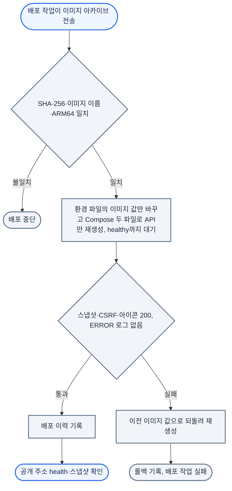

공개 사이트는 Git에 push하면 Pages로 나가고, API는 CI가 검사한 이미지를 배포 작업이 VM에 올리고, DB는 검토한 SQL로 바꿈. API를 교체하는 동안에도 독자는 Pages의 정적 파일을 읽으므로 글이 계속 보이고(P2), 검증에 실패한 빌드는 배포되지 않음(P3). 배포 경계와 구성 요소는 [아키텍처](/ken-blog/post/doc-340352c9-5fde-4bae-bc0b-4ecd744719a8/)에서 정의함.

## 변경별 반영 경로

```mermaid caption="CI/CD 구성. 바뀐 경로에 따라 세 워크플로가 따로 실행되고, SQL이 바뀐 커밋만 운영 반영 전에 승인을 기다림"
flowchart TD
    %% legend: solid=자동 실행; dotted=사람이 시작하거나 조건부로 실행; color:#f1f5f9:#64748b=워크플로 작업; color:#fff7ed:#ea580c=사람의 조작; round=시작·반영 대상
    push(["main push"])
    button(["관리 화면 배포 버튼"])
    push -->|원고·웹 소스 변경| fe["Frontend verify - 타입·브라우저 검사"]
    push -->|원고·웹 소스 변경| pbuild["Pages build - 스냅샷 수집·revision 비교·산출물 검사"]
    button -.->|API가 workflow_dispatch 호출| pbuild
    pbuild --> pdeploy["Pages deploy - main 재확인 후 발행"]
    pdeploy --> pages(["GitHub Pages"])
    push -->|Java·배포 설정 변경| cverify["CI verify - Gradle·MySQL 통합·TLS·스키마 이관·사이트 간 인증"]
    cverify --> cimage["CI jvm-image - ARM64 이미지 생성·기동 검사·90일 보관"]
    cimage -->|SQL 변경 없음| cdeploy["CI deploy - tailnet 접속·서버 릴리스 스크립트"]
    cimage -.->|deploy/sql 변경| approve["SQL 승인 - 사람이 SQL 적용 후 승인"]
    approve --> cdeploy
    cdeploy --> vm(["OCI VM의 API"])
    classDef job fill:#f1f5f9,stroke:#64748b,color:#1e293b,stroke-width:2px
    classDef human fill:#fff7ed,stroke:#ea580c,color:#7c2d12,stroke-width:2px
    class fe,pbuild,pdeploy,cverify,cimage,cdeploy job
    class button,approve human
```

| 변경 | 반영 경로 | 완료 확인 | 관련 문제 |
| --- | --- | --- | --- |
| Markdown 원고 | `main` push → Pages 자동 빌드·배포 | 공개 주소의 새 HTML | P1 |
| 글 정보·발행 상태 | 관리 API → MySQL → 관리 화면의 배포 버튼으로 Pages 워크플로 실행 | 관리 화면의 배포 대기 표시 해소 | P3 |
| 템플릿·CSS·TypeScript | Frontend 검사, Pages 자동 빌드·배포 | 새 정적 자산 | — |
| API 소스·런타임 설정 | API CI → JVM 이미지 → 배포 작업의 운영 교체(`deploy/sql/` 변경 시 승인 후) | 서버 스크립트의 응답·로그 확인, 공개 주소 health | — |
| 이미지·기술 아이콘 | 운영자가 디스크 파일과 DB 행 준비 → 다음 Pages 빌드가 수집 | 공개 페이지의 정적 복사본 | — |
| DB 스키마 | 복사 DB에서 이관 검증 → 운영 SQL → API 검증 | 자료 보존과 새 계약 확인 | — |

DB 변경은 GitHub Actions를 실행하지 않음.[* API 소스만 바뀐 경우도 Pages 자동 실행 경로에 포함되지 않으므로, 공개 스냅샷 계약이 바뀌면 사이트 재빌드를 따로 확인함] 글 정보 변경의 반영 여부는 관리 화면의 배포 대기 표시로 확인하며, 판정 규칙은 [기능과 사용자 흐름](/ken-blog/post/doc-4cfccbd2-1972-4ad8-893a-6a8bf45744e1/)에서 다룸.

## Pages 배포

빌드는 공개 스냅샷과 Git 원고를 모으고 revision을 두 번 비교한 뒤, 검증을 통과한 결과만 배포함. 단계와 보장 범위는 [아키텍처](/ken-blog/post/doc-340352c9-5fde-4bae-bc0b-4ecd744719a8/)의 일관성 모델 절에서 다룸.

- **직렬 실행**: 워크플로가 `github-pages` 동시성 그룹 하나로 묶여 배포가 겹치지 않고, 진행 중인 배포를 새 실행이 취소하지 않음.[* [Pages 워크플로](https://github.com/gjaku1031/ken-blog/blob/b768152/.github/workflows/pages.yml)]
- **실패 시 유지**: 수집·생성·검증 중 하나라도 실패하면 배포하지 않아 공개 중인 사이트가 그대로 남음. 성공한 빌드는 이전 출력의 옛 파일을 복사하지 않아, 발행 취소한 글은 다음 성공 배포에서 사라짐.
- **번들 재사용**: 브라우저 JS·CSS 번들은 입력 해시와 산출물 검사를 통과하면 재사용하고, 페이지는 매번 전체를 다시 생성함.


## API 배포와 롤백

API CI는 Gradle과 MySQL 통합 검사를 통과한 커밋으로 ARM64 JVM 이미지를 만들고, 실제로 HTTP 요청을 보내 동작을 검사함. 검사를 통과하면 같은 워크플로의 배포 작업이 그 이미지를 운영 서버로 보내 교체함.[* [API CI](https://github.com/gjaku1031/ken-blog/blob/d2ff0fc/.github/workflows/ci.yml) · [릴리스 스크립트](https://github.com/gjaku1031/ken-blog/blob/d2ff0fc/deploy/release.sh) · [API 배포 절차](https://github.com/gjaku1031/ken-blog/blob/d2ff0fc/deploy/API-RELEASE.md)]

- **문제**: 2026-10-08까지는 CI가 만든 이미지를 운영자가 서버에서 직접 교체했음. 배포마다 같은 명령을 손으로 실행해 절차 실수가 생길 수 있었고, 아래 truststore 누락 중단도 이 수동 단계에서 일어남
- **결정**: CI가 검사한 이미지 아카이브를 그대로 운영으로 보내고, 서버의 교체 절차는 스크립트 하나로 고정함
  - 접속: 배포 작업은 GitHub OIDC로 Tailscale에 일회용 노드로 들어가 운영 VM의 SSH 포트에만 접근함. SSH는 인터넷에 열지 않음
  - 실행 범위: 배포 전용 계정의 키는 tailnet 주소에서만 받고, 접속하면 릴리스 스크립트만 실행됨. 이미지 아카이브는 표준 입력으로 전달함
  - 교체: 스크립트가 아카이브와 이미지가 맞는지 확인한 뒤 환경 파일의 이미지 값만 바꿔 API 컨테이너를 다시 만들고, healthy가 되면(`compose up --wait`) 공개 스냅샷과 인증 경로, 아이콘 응답, 기동 후 ERROR 로그를 확인함. 하나라도 실패하면 이전 이미지로 되돌림(확인 항목은 아래 흐름도)
  - 승인: `deploy/sql/`이 바뀐 커밋만 배포 전에 사람의 승인을 받음. 확장 SQL을 먼저 적용해야 새 API가 기동하기 때문
  - 비교한 대안
    - 블루-그린 교체: 중단은 없지만 API 컨테이너 둘을 동시에 띄우고 Caddy 전환까지 관리해야 함. API가 멈춰도 관리 기능만 영향을 받아 택하지 않음
    - 서버에서 소스를 받아 빌드: CI가 검사한 이미지와 다른 산출물이 배포되고, 운영 서버에 빌드 도구가 상주함
    - 서버가 레지스트리를 주기적으로 확인해 당겨 오는 방식: 이미 쓰는 Tailscale로 밀어 넣으면 배포 로그와 승인을 Actions에서 그대로 쓸 수 있음
- **대가**
  - 교체하는 동안 API가 멈춤. 2026-10-09 첫 자동 배포에서는 컨테이너를 다시 만든 때부터 확인을 마칠 때까지 약 26초였음.[* CI 로그의 컨테이너 재생성 07:47:02, healthy 07:47:26, 서버 배포 이력 기록 07:47:28(UTC). 아카이브 전송까지 포함한 Actions 단계 시간은 59초. 이 배포는 첫 시도가 Tailscale OIDC 신뢰 설정 문제로 실패해, 설정을 고친 뒤 재실행해 성공함] 열람은 Pages의 정적 파일이라 영향이 없고 관리 기능만 멈춤
  - 배포 전용 SSH 키를 GitHub Environment 비밀값으로 보관함. 유출되어도 tailnet 밖에서는 쓸 수 없고, 할 수 있는 동작은 이미지 교체뿐임
- **검증**
  - CI가 운영과 같은 Compose 파일로 릴리스 스크립트를 실제 실행해 정상 교체, 같은 이미지 재배포 생략, 해시 불일치·잘못된 인자 거부, 기동 실패 이미지의 자동 롤백을 매번 검사함[* [릴리스 스크립트 검사](https://github.com/gjaku1031/ken-blog/blob/d2ff0fc/deploy/tests/release-test.sh)]
  - 배포 키로 임의 명령 실행과 포트 포워딩이 거부되는 것을 서버에서 확인함
  - 2026-10-09 첫 자동 배포에서 이미지가 바뀌고 공개 스냅샷 revision은 그대로 유지됨



이미 실행 중인 이미지를 다시 보내면 아무것도 바꾸지 않고 끝남. 배포 이력은 서버의 이력 파일에 시각·결과·이전 이미지·새 이미지로 남음. 이미지 태그에는 커밋 해시를 쓰고, 서버에서 직접 배포해야 할 때도 같은 스크립트를 실행함.

<details><summary>배포 접근 경계</summary>

| 경계 | 설정 |
| --- | --- |
| GitHub | 배포 환경(`production`)은 `main`에서만 쓰고, SQL 승인 환경(`production-schema`)은 지정한 검토자의 승인이 필요함 |
| Tailscale | 배포 노드는 `tag:ci` 일회용 노드. 접근 규칙은 운영 VM의 22번 포트만 허용 |
| SSH | 배포 전용 계정. tailnet 대역에서만 키를 받고, 포트 포워딩 등을 막고(`restrict`), 접속하면 릴리스 스크립트만 실행 |
| sudo | 배포 계정은 root 소유 릴리스 스크립트 하나만 실행할 수 있음 |

</details>

<details><summary>운영 구성</summary>

| 항목 | 구성 |
| --- | --- |
| API | 1 CPU, 메모리 한도 1,536MiB, 비루트 사용자. 메타스페이스 256MiB를 확보하고 힙은 남은 공간에서 계산 |
| 호스트 포트 | loopback에만 바인딩 |
| Caddy | 공개 HTTPS 진입점. 허용한 API 경로와 메서드만 전달. 도입 이유는 [보안 설계](/ken-blog/post/doc-b707888f-a270-4aef-a617-f3345644a3f3/)의 HTTPS 진입점 절 |
| MySQL | Compose 밖의 OCI 관리형 MySQL. 사설 CA의 TLS로 연결하며 truststore를 읽기 전용으로 마운트 |
| 이미지 원본 | 전용 영속 디렉터리를 API에 읽기 전용 마운트 |
| 스키마 | `APP_JPA_DDL_AUTO=validate`, `APP_SQL_INIT_MODE=never`로 기동 시 검증만 수행 |
| 환경 값 | 저장소 밖의 접근 제한된 운영 설정 파일 |

</details>

## 운영 사례: truststore 누락으로 인한 API 중단

2026-10-07 API 이미지를 교체하고 되돌리다가 API가 약 6분 동안 멈췄음. 교체 명령에 Compose 파일을 하나만 지정하는 바람에 DB TLS 연결에 필요한 truststore가 빠졌고, API는 DB에 붙지 못해 재시작을 반복했음. 공개 사이트는 Pages에서 제공되므로 열람에는 영향이 없었고, 관리 기능과 새 빌드만 멈췄음.

배포 실행은 에이전트가 했고, 재발 방지 기준은 본인이 정함.

- 절차서에 운영 설정과 DB TLS 설정 두 파일을 함께 지정하는 명령을 고정함.[* [운영 Compose](https://github.com/gjaku1031/ken-blog/blob/b768152/deploy/compose.production.yaml) · [DB TLS Compose](https://github.com/gjaku1031/ken-blog/blob/b768152/deploy/compose.mysql-tls.yaml) · [인프라 ADR](https://github.com/gjaku1031/ken-blog/blob/b768152/docs/ADR/ADR_infra.md)]
- 재생성 후 실행 중인 컨테이너의 `com.docker.compose.project.config_files` 라벨로 두 파일이 모두 적용됐는지 확인하는 단계를 추가함.
- 2026-10-09부터는 교체 자체를 릴리스 스크립트로 옮겨, 두 파일 지정이 코드에 고정됨.

## 스키마 변경을 동반한 전환

API와 DB 스키마가 함께 바뀔 때는 확장-축소(expand/contract) 순서를 따름. 새 열이나 테이블을 먼저 추가하고 새 API를 배포한 뒤, 옛 구조를 더 쓰지 않는 것을 확인하고 나중에 지움. 이렇게 하면 교체 도중 옛 API와 새 API가 같은 DB에서 잠깐 함께 돌아도 깨지지 않고, 문제가 생기면 API 이미지만 되돌리면 됨.

기존 행의 값을 채우거나 바꾸는 이관은 2026-10-03 편집 버전 열을 추가할 때 아래 순서로 적용했음.

1. 복사 DB에서 이관 SQL과 새 API 기동, 자료 보존을 확인함.
2. 관리자 쓰기를 멈춤.
3. 검토한 SQL을 적용하고 검증된 API 이미지를 반영함.
4. Pages를 배포하고 관리 화면을 새로 고침.
5. 인증·글 조회·편집 충돌·발행·이미지·공개 스냅샷을 확인한 뒤 작업을 재개함.

이 순서는 일회성 이관 때 쓴 것이고, 반복 절차인 [API 배포 절차](https://github.com/gjaku1031/ken-blog/blob/d2ff0fc/deploy/API-RELEASE.md)에는 열 추가·삭제 규칙만 둠.

값을 바꾸지 않고 열이나 테이블을 지울 때는 확장-축소 SQL만으로 적용함. 쓰지 않게 된 본문 열을 지운 경우가 그 예임. 새 API는 옛 본문 열을 쓰지 않았지만, 운영의 본문 열이 NOT NULL에 기본값이 없어 새 API의 글 등록이 실패할 수 있었음. 그래서 열을 먼저 NULL 허용으로 바꾸고(확장), 새 API를 배포해 기동을 확인한 뒤 열을 지움(축소).[* [NULL 허용 SQL](https://github.com/gjaku1031/ken-blog/blob/b768152/deploy/sql/legacy-columns-nullable-2026-10-08.sql) · [열 삭제 SQL](https://github.com/gjaku1031/ken-blog/blob/b768152/deploy/sql/drop-legacy-columns-2026-10-08.sql) · [API 배포 절차](https://github.com/gjaku1031/ken-blog/blob/d2ff0fc/deploy/API-RELEASE.md)]

## CI 결과의 의미

| 검사 | 확인하는 범위 | 운영에서 추가로 확인할 것 |
| --- | --- | --- |
| API verify | 빌드, 격리 DB 통합 검사, 인증·배포 계약 | 실제 운영 DB·TLS·네트워크 |
| JVM 이미지 | ARM64 컨테이너 기동과 HTTP 동작, 운영 Compose 파일로 실행한 릴리스 스크립트 | 운영 DB·TLS 연결 |
| API deploy | 운영 이미지 교체, 서버 안의 응답·로그 확인, 공개 주소 health | 관리 화면 동작 |
| Frontend | 타입 검사, Node 검사, 모의 API 브라우저 검사 | 운영 계정과 실제 API 연동 |
| Pages build | 공개 자료 수집과 정적 생성 | 실제 호스팅 반영 |
| Pages deploy | 해당 artifact 발행 | 공개 화면의 본문·이미지·탐색 |

Frontend 검사는 Pages 배포보다 먼저 통과해야 하는 조건이 아니라서, Pages가 성공했다고 브라우저 검사까지 통과했다는 뜻은 아님.

## 운영 점검

운영 상태는 `/actuator/health`, 공개 스냅샷의 `version`과 `revision`, 기동 뒤 로그에 ERROR가 있는지로 확인함.
