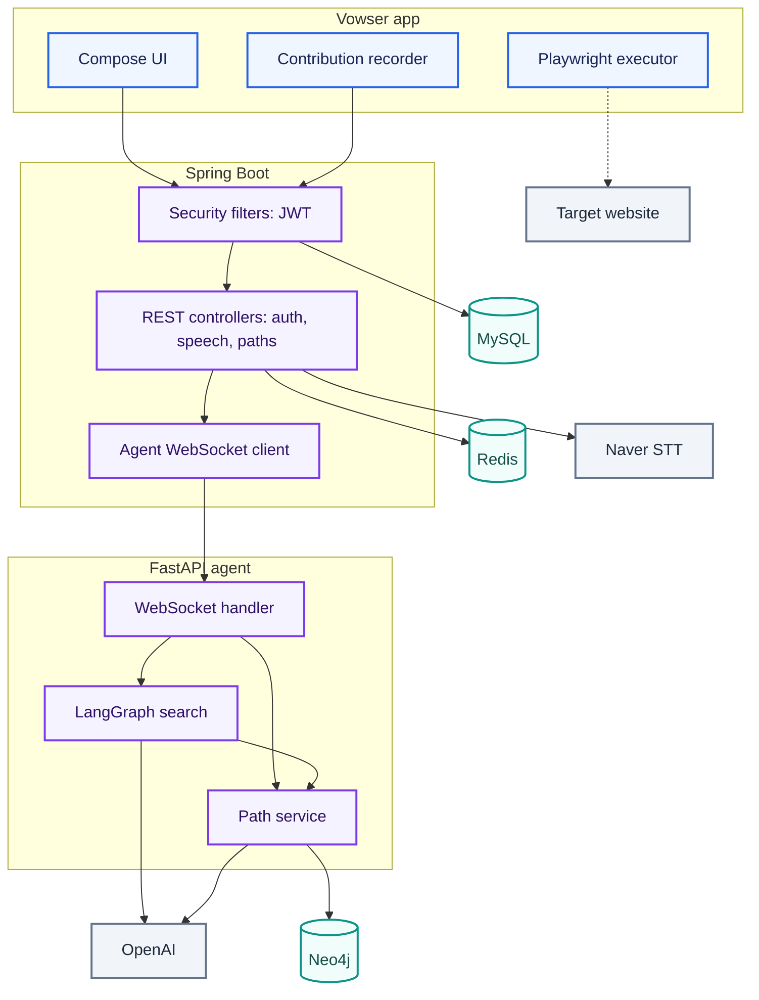
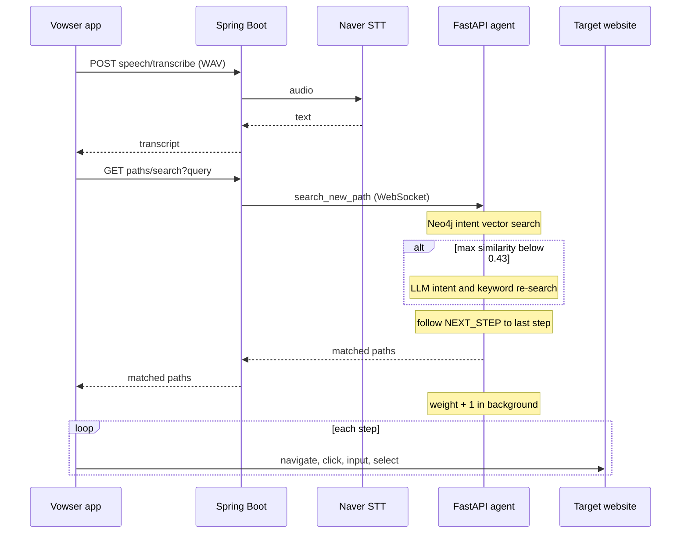

서버(Spring Boot·FastAPI)는 작업 경로를 찾아 돌려주는 데서 끝나고, 대상 사이트의 브라우저 조작은 모두 사용자 PC의 Playwright가 함. 그래서 서버를 AWS로 늘려도 사용자의 로그인 세션과 입력값은 서버로 오지 않음.

## 품질 요구사항

| 품질 속성 | 요구 | 관련 문제[* P1~P4는 [대문](/ken-blog/post/project-8d420603-48bb-4e29-8983-e08a6e649f80/)에서 정의함] | 구조적 대응 |
| --- | --- | --- | --- |
| 작업 확장성 | 새 작업을 코드 변경 없이 사용자 기록으로 등록 | P1 | 앱의 기록 모드가 단계 목록을 만들고, 경로 저장 API가 Neo4j에 그래프로 저장 |
| 의도 검색 | 등록 문장과 다른 표현으로도 같은 작업을 찾음 | P2 | 작업 의도 임베딩의 벡터 인덱스 검색, 낮은 유사도에서 LangGraph 재검색 |
| 실행 통제 | 인증·결제 단계와 비밀 입력값이 사용자 PC 밖으로 나가지 않음 | P3 | 실행기를 사용자 PC에 두고 서버는 경로만 반환. 기록 시 비밀번호 칸의 값은 저장하지 않음 |
| 비용 대비 확장 | 평소 클라우드 상시 비용 없이 운영하고, 부하가 오르면 처리 용량을 늘림 | P4 | Proxmox 기본 실행, 같은 컨테이너 이미지를 AWS Fargate로 기동, 데이터 저장소는 두 환경이 공유 |

## 인프라 구성도

배포 경계는 사용자 PC, Proxmox 서버, AWS, 외부 관리형 클라우드의 네 영역.

```mermaid caption="평상시 API 요청은 Proxmox로, 확장 시에는 AWS의 같은 서버로 전환되며, 브라우저 실행은 항상 사용자 PC에서 일어남"
architecture-beta
  %% layout: vowser-infrastructure
  group pc[User PC]
  group target[Target website]
  group onprem(ken:proxmox)[Proxmox]
  group aws[AWS Cloud]
  group vpc[VPC] in aws
  group ecs(ken:fargate)[ECS Fargate] in vpc
  group control[Scaling control] in aws
  group external[Managed cloud]

  service actions(ken:github-actions)[GitHub Actions]
  service runner(server)[Runner] in onprem
  service origin(ken:docker)[Docker Compose] in onprem
  service app(ken:kotlin)[Vowser app] in pc
  service website(internet)[Target website] in target
  service ecr(ken:ecr)[Amazon ECR] in aws
  service dns(ken:route53)[Route 53] in aws
  service alb(ken:alb)[ALB] in vpc
  service backend(ken:spring)[Spring Boot] in ecs
  service agent(ken:fastapi)[FastAPI] in ecs
  service db(ken:rds)[RDS MySQL] in vpc
  service vpn(ken:vpn)[Site to Site VPN] in aws
  service watch(ken:cloudwatch)[CloudWatch] in control
  service events(ken:eventbridge)[EventBridge] in control
  service lambda(ken:lambda)[Lambda] in control
  service redis(ken:redis)[Redis Cloud] in external
  service neo4j(ken:neo4j)[Neo4j Cloud] in external

  actions:R -[Build]-> L:runner
  runner:R -[Push]-> L:ecr
  ecr:B -[Image]-> L:backend{group}
  app:R -[Normal API]-> L:origin
  app:R -[Cloud API]-> L:alb
  app:T -[DNS]-> L:dns
  app:B -[Playwright]-> T:website
  alb:R -[API]-> L:backend
  backend:B -[WebSocket]-> T:agent
  backend:B --> L:db
  backend:R --> L:redis
  agent:R --> L:neo4j
  origin:B --> L:vpn
  vpn:T --> L:db
  origin:R -[Shared data]-> L:redis{group}
  origin:B -[Metrics]-> L:watch
  watch:R -[Alarm]-> L:events
  events:R -[Invoke]-> L:lambda
  lambda:T -[Start]-> R:agent{group}
  lambda:T -[DNS update]-> B:dns

  align row actions runner ecr dns
  align row app origin alb backend redis
  align row agent neo4j
  align row website vpn
  align row watch events lambda
  align column actions app website
  align column runner origin
  align column ecr alb vpn watch
  align column backend agent events
  align column dns db lambda
  align column redis neo4j
```

| 배포 경계 | 구성 요소 | 책임 |
| --- | --- | --- |
| 사용자 PC | Vowser 앱(Kotlin·Compose Desktop) | 음성 녹음, 로그인 콜백 수신, 경로 실행 그래프 표시, 작업 기록 |
| 사용자 PC | Playwright 실행기 | 대상 사이트의 이동·클릭·입력·선택, 클릭 대상 강조, 사용자 입력 대기 |
| Proxmox | Docker Compose의 Spring Boot·FastAPI | 평상시 API 요청 처리 |
| Proxmox | self-hosted runner | 컨테이너 이미지 빌드와 ECR 등록 |
| AWS | ALB, ECS Fargate의 Spring Boot·FastAPI | 확장 시 API 요청 처리. ALB는 두 가용 영역의 public subnet에 두고, 평소 Fargate 서비스는 중지 |
| AWS | RDS MySQL | 회원·접근성 프로필. Proxmox에서는 Site-to-Site VPN으로 접근 |
| AWS | CloudWatch·EventBridge·Lambda·Route 53 | 부하 경보에 따른 Fargate 기동과 DNS 레코드 변경 |
| 외부 관리형 클라우드 | Redis Cloud | 리프레시 토큰, 로그인 임시 코드(만료 시간 포함) |
| 외부 관리형 클라우드 | Neo4j Cloud | 작업 경로 그래프와 임베딩 |
| 외부 서비스 | 네이버 로그인·네이버 음성 인식·OpenAI | 회원 인증, 음성의 텍스트 변환, 임베딩과 의도 분석 |

확장과 이미지 배포의 반영 절차는 [배포와 운영](/ken-blog/post/doc-388fbde8-12bf-4281-9e74-bf90c396e8d6/)에서 다룸.

## 시스템 구조

전형적인 웹 서비스와 달리 사용자의 최종 작업(대상 사이트 조작)은 서버가 아니라 클라이언트에서 일어남. 서버는 두 단계로 나뉘어, Spring Boot가 인증·음성 인식·API 진입점을 맡고 FastAPI 에이전트 서버가 경로 저장·검색을 맡음. 두 서버는 WebSocket 연결 하나로 통신함.



| 경로 | 거치는 구성 요소 | 처리 |
| --- | --- | --- |
| 음성 검색 | 앱 → Spring Boot → 네이버 음성 인식, 앱 → Spring Boot → FastAPI → OpenAI·Neo4j | 음성 인식과 경로 검색을 두 번의 HTTP 요청으로 나눔. 인식 결과는 앱이 받아 검색어로 다시 보냄 |
| 작업 실행 | 앱 → 대상 웹사이트 | 검색 응답의 단계 목록을 실행기가 순서대로 수행. 서버 요청 없음 |
| 작업 기록 | 앱 → Spring Boot → FastAPI → OpenAI·Neo4j | 기록이 끝나면 단계 목록 전체를 경로 저장 API로 한 번에 보냄 |
| 로그인 | 앱 → 시스템 브라우저 → 네이버 → Spring Boot → 앱의 로컬 콜백 | 일회용 코드를 받아 토큰으로 교환. 순서는 [보안 설계](/ken-blog/post/doc-005871e6-b37a-4873-bbab-0f93aaf467e2/) |

Spring Boot는 `api`(컨트롤러·DTO), `application`(서비스), `domain`(엔티티·저장소), `infrastructure`(보안·WebSocket·외부 연동) 패키지로 나뉨.[* [백엔드 소스](https://github.com/Vovvser/vowser-backend/tree/488d8ea/src/main/java/com/vowser/backend)] 경로 API의 컨트롤러는 요청을 에이전트 서버 메시지로 바꿔 보내고, 응답을 기다리는 동안 요청 스레드를 막지 않도록 `CompletableFuture`를 반환함.[* [경로 API 컨트롤러](https://github.com/Vovvser/vowser-backend/blob/488d8ea/src/main/java/com/vowser/backend/api/controller/PathManagementController.java) · [에이전트 WebSocket 클라이언트](https://github.com/Vovvser/vowser-backend/blob/488d8ea/src/main/java/com/vowser/backend/infrastructure/mcp/McpWebSocketClient.java)]

## 데이터의 정본과 파생 결과물

자료가 MySQL·Redis·Neo4j와 사용자 PC에 나뉘어 있고, 임베딩처럼 다른 자료에서 계산해 저장하는 값이 있음. 자료마다 원본 위치와 바뀌는 시점이 달라, 어느 쪽을 기준으로 삼는지 정해 둬야 함.

| 자료 | 정본 | 변경 주체 | 수명 |
| --- | --- | --- | --- |
| 회원(이름·이메일·휴대폰 번호·생년월일) | MySQL `members` | 첫 네이버 로그인 시 자동 가입 | 계속 보존 |
| 접근성 프로필 | MySQL `accessibility_profiles`(설정 JSON은 AES-GCM 암호문) | 회원 | 계속 보존 |
| 리프레시 토큰 | Redis `refresh_token:{회원 ID}` | 로그인 | 토큰 만료 시각까지. 로그아웃 시 삭제 |
| 로그인 임시 코드 | Redis `oauth_code:{UUID}` | 로그인 성공 처리 | 5분 또는 한 번 교환할 때까지 |
| 작업 경로(도메인·작업 의도·단계) | Neo4j `ROOT`·`STEP` 노드와 `HAS_STEP`·`NEXT_STEP` 관계 | 경로 저장 API | `NEXT_STEP`은 정리 API가 30일 지난 관계를 삭제 |
| 작업 의도·단계 임베딩 | Neo4j 속성(OpenAI 임베딩, 1536차원) | 경로 저장 시 계산 | 원문(의도·단계 설명)에서 다시 계산 가능 |
| 사용 가중치 | Neo4j `HAS_STEP.weight` | 같은 경로 재저장, 검색 1위 결과 | 계속 누적 |
| 앱의 로그인 토큰 | 사용자 PC의 Java Preferences | 앱 | 로그아웃 시 삭제 |

## 일관성 모델과 보장 범위

세 저장소를 하나의 트랜잭션으로 묶는 연산은 없고, 경로 저장도 Neo4j 안에서 여러 쿼리로 나뉨. 서버 사이의 요청·응답은 WebSocket 연결 하나를 공유함. 경계마다 지켜지는 것과 어긋날 수 있는 구간은 다음과 같음.

| 경계 | 보장 | 방법 | 보장하지 않는 구간 |
| --- | --- | --- | --- |
| 경로 저장 | 같은 기록을 다시 보내도 단계가 중복 생성되지 않음 | 단계 ID를 기록 세션·URL·선택자·동작의 해시로 만들고 `MERGE`로 저장 | 단계마다 별도 auto-commit 쿼리라 중간에 실패하면 일부만 저장된 경로가 남음 |
| 가중치 증가 | 동시 증가의 갱신 손실 없음 | 한 Cypher `SET weight = weight + 1` 문으로 증가 | 검색 1위의 가중치 증가는 응답 후 백그라운드에서 실행하고 실패는 로그만 남김 |
| 백엔드 ↔ 에이전트 요청 | 요청마다 30초 안에 응답 또는 실패 | 응답 대기 목록과 시간 제한 | 메시지에 요청 ID가 없어 응답을 대기 목록의 첫 항목에 연결함. 동시 요청이 겹치면 다른 요청의 응답을 받을 수 있음(코드 구조상 판단, 재현 시험은 하지 않음) |
| 경로 정리 | 오래 쓰지 않은 연결 제거 | 30일 지난 `NEXT_STEP` 삭제 | 단계 노드와 첫 관계는 남아, 검색이 잘린 경로를 반환할 수 있음 |
| 확장 전환 | 두 실행 환경이 같은 회원·토큰·경로를 봄 | RDS·Redis Cloud·Neo4j Cloud를 공유 | DNS 캐시가 남은 동안 요청이 두 환경으로 나뉨. 열린 연결은 옮겨지지 않음 |
| 로그인 세션 | 회원당 리프레시 토큰 하나 | Redis 키를 회원 ID로 둠 | 다른 PC에서 로그인하면 이전 PC의 토큰 갱신이 실패함 |

토큰 계약은 [보안 설계](/ken-blog/post/doc-005871e6-b37a-4873-bbab-0f93aaf467e2/)에서, 경로 그래프의 저장 구조는 [데이터 모델](/ken-blog/post/doc-9e692538-463a-46f7-afe0-338da1182bfa/)에서 다룸.

> 경로 데이터는 단계 단위로만 원자적으로 저장되고, 서버 간 요청은 연결 하나에 순서 없이 섞일 수 있음. 한 명이 순차로 쓰는 시연 조건에서는 드러나지 않지만, 동시 사용자가 늘면 먼저 보강해야 할 구간임.

보강 방향은 [주요 기술적 의사결정](/ken-blog/post/doc-d8735f2c-c9bf-45fa-bcac-a692eb4dc739/)의 한계 절에 있음.

### 음성 검색 실행 순서

앱은 음성 인식 결과를 받은 뒤 경로 검색을 따로 요청함. 에이전트 서버는 검색 1위 결과를 응답한 다음 가중치를 올림.[* [음성 처리 서비스](https://github.com/Vovvser/vowser-backend/blob/488d8ea/src/main/java/com/vowser/backend/application/service/speech/SpeechProcessingService.java) · [에이전트 WebSocket 처리](https://github.com/Vovvser/vowser-agent-server/blob/d94eaf5/app/main.py)]


