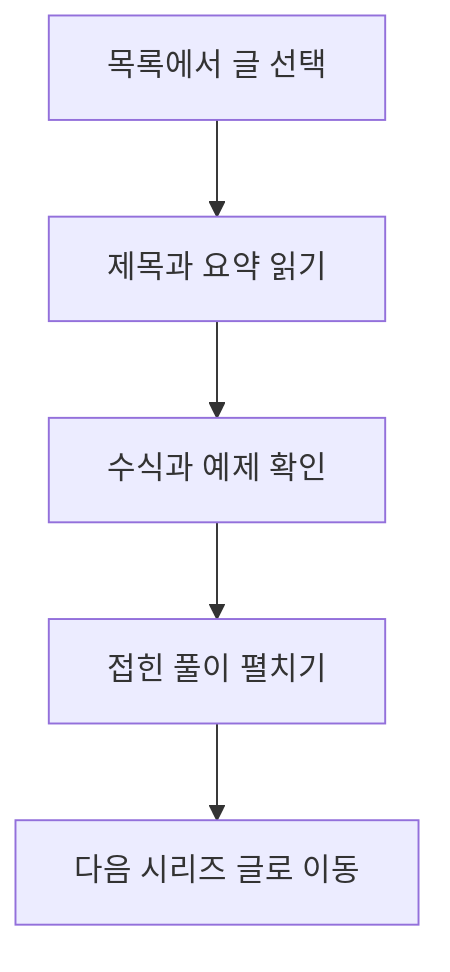

## 문서를 여는 흐름

본문 중간의 도식은 페이지를 연 뒤에 렌더링된다. 도식이 차지하는 높이가 달라져도 현재 읽는 절에 맞게 목차가 표시되는지 확인한다.

## 첫 번째 긴 문단

목차는 문서 전체의 구조를 빠르게 훑어보는 데 쓰인다. 지금 읽고 있는 절을 알 수 있으면 긴 글에서도 앞뒤 맥락을 놓치지 않는다. 스크롤을 조금씩 내릴 때와 빠르게 건너뛸 때 모두 같은 제목이 강조되는지 확인한다.

목차는 문서 전체의 구조를 빠르게 훑어보는 데 쓰인다. 지금 읽고 있는 절을 알 수 있으면 긴 글에서도 앞뒤 맥락을 놓치지 않는다. 스크롤을 조금씩 내릴 때와 빠르게 건너뛸 때 모두 같은 제목이 강조되는지 확인한다.

목차는 문서 전체의 구조를 빠르게 훑어보는 데 쓰인다. 지금 읽고 있는 절을 알 수 있으면 긴 글에서도 앞뒤 맥락을 놓치지 않는다. 스크롤을 조금씩 내릴 때와 빠르게 건너뛸 때 모두 같은 제목이 강조되는지 확인한다.

목차는 문서 전체의 구조를 빠르게 훑어보는 데 쓰인다. 지금 읽고 있는 절을 알 수 있으면 긴 글에서도 앞뒤 맥락을 놓치지 않는다. 스크롤을 조금씩 내릴 때와 빠르게 건너뛸 때 모두 같은 제목이 강조되는지 확인한다.

### 작은 절의 제목

두 번째 수준의 제목 아래에 있는 작은 절도 목차에 들여쓰기되어 표시된다. 같은 단어가 제목에 반복되어도 각 위치를 구분할 수 있어야 한다.

## 접힌 내용을 펼친 뒤

추가 설명 펼치기

접힌 설명을 펼치면 아래 제목들의 위치가 이동한다. 이때 이전 위치를 계속 사용하는지, 새 위치를 기준으로 강조가 바뀌는지 확인한다.

접힌 설명을 펼치면 아래 제목들의 위치가 이동한다. 이때 이전 위치를 계속 사용하는지, 새 위치를 기준으로 강조가 바뀌는지 확인한다.

접힌 설명을 펼치면 아래 제목들의 위치가 이동한다. 이때 이전 위치를 계속 사용하는지, 새 위치를 기준으로 강조가 바뀌는지 확인한다.

접힌 설명을 펼치면 아래 제목들의 위치가 이동한다. 이때 이전 위치를 계속 사용하는지, 새 위치를 기준으로 강조가 바뀌는지 확인한다.

접힌 설명을 펼치면 아래 제목들의 위치가 이동한다. 이때 이전 위치를 계속 사용하는지, 새 위치를 기준으로 강조가 바뀌는지 확인한다.

## 같은 이름

처음 등장하는 제목이다. 목차의 해당 항목을 누르면 이 문단으로 이동해야 한다.

## 같은 이름

두 번째로 등장하는 제목이다. 앞의 제목과는 다른 앵커를 가져야 한다.

## 마지막 짧은 절

문서 끝에 도착하면 짧은 마지막 절도 목차에서 선택되어야 한다.

