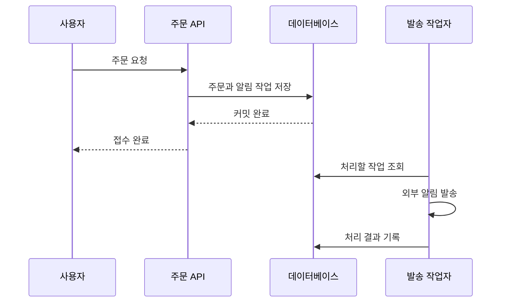

관련 프로젝트 연결 화면을 확인하기 위한 가상 개발 기록이다. 주문 알림을 보내는 작은 서비스를 예시로 사용한다.

## 주문 응답이 알림을 기다리는 상황

주문 저장이 끝났어도 알림 제공자의 응답을 기다리면 사용자는 주문 접수 결과를 늦게 받는다. 알림 제공자에 장애가 생겼을 때 주문까지 실패한 것으로 보일 수도 있다.

먼저 응답의 의미를 정했다. 주문 API의 성공은 주문과 발송 예정 작업이 저장됐다는 뜻이다. 수신자가 알림을 받았다는 뜻은 아니다.

## 한 트랜잭션으로 남길 것

주문만 저장되고 알림 작업이 빠지는 틈을 막기 위해 두 기록을 같은 데이터베이스 트랜잭션에 넣는다. 작업자는 커밋된 대기 작업을 읽고 외부 발송을 수행한다.

## 경계에서 확인할 실패

| 실패 시점 | 남아야 할 상태 | 다음 동작 |
| --- | --- | --- |
| 주문 저장 전 | 주문과 작업 모두 없음 | 요청 재시도 |
| 커밋 직후 응답 유실 | 주문과 작업 모두 있음 | 요청 식별자로 기존 접수 확인 |
| 발송 전 작업자 종료 | 미완료 작업 존재 | 점유 만료 후 다시 조회 |
| 발송 뒤 결과 저장 실패 | 외부 결과가 불확실함 | 제공자의 처리 결과 확인 |

작업을 분리하면 대기 시간을 줄일 수 있지만 실패가 사라지지는 않는다. 어디까지 끝났는지 복구할 기록이 더 필요해진다.

## 다음으로 정할 규칙

작업자가 같은 작업을 다시 읽는 것은 복구 과정에서 일어날 수 있다. 다음 글에서는 [요청을 식별하고 중복 발송을 줄이는 규칙](../mock-notification-02/)을 정리한다.
