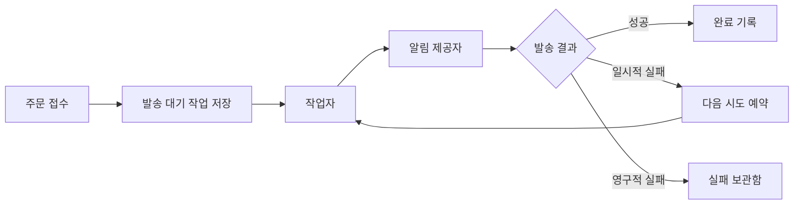

이 프로젝트는 관련 프로젝트가 연결된 글의 화면을 확인하기 위한 가상 프로젝트다. 아래 설계와 운영 상황은 모두 예시이며 실제 서비스의 성과를 나타내지 않는다.

## 어떤 문제를 풀까

주문이 접수될 때마다 알림을 보내는 작은 서비스를 가정했다. 알림 제공자의 응답이 늦어지면 주문 요청까지 기다리게 되고, 사용자가 재시도하면 같은 알림이 여러 번 나갈 수 있다.

주문 접수와 알림 발송을 분리하고, 처리 상태를 기록해 실패한 작업을 다시 확인할 수 있게 만드는 것이 목표다.

## 처리 흐름

## 범위와 선택

| 항목 | 예시 프로젝트의 선택 |
| --- | --- |
| 요청 처리 | 발송할 작업을 저장한 뒤 접수 결과 반환 |
| 작업 저장 | MySQL에 상태와 다음 실행 시각 기록 |
| 발송 처리 | Spring Boot 작업자가 대기 작업 조회 |
| 중복 제어 | 이벤트·수신자·채널 조합으로 요청 식별 |
| 실패 처리 | 횟수가 제한된 재시도와 실패 보관함 |

이번 예시는 이메일 한 채널로 범위를 좁혔다. 외부 제공자가 요청을 받았는지 알 수 없는 타임아웃은 성공이나 실패로 단정하지 않고 별도로 확인할 대상으로 남긴다.

## 관련 개발 기록

프로젝트를 구현하면서 생각해 볼 주제를 일반 글 5편으로 나눴다. 각 글 상단의 **연관 프로젝트** 링크로 이 소개 페이지에 돌아올 수 있다.

1. [[mock] 알림 요청과 발송 작업 분리하기](../mock-notification-01/)
2. [[mock] 같은 알림을 두 번 보내지 않으려면](../mock-notification-02/)
3. [[mock] 실패한 알림의 재시도 간격 정하기](../mock-notification-03/)
4. [[mock] 알림 큐에서 먼저 볼 지표](../mock-notification-04/)
5. [[mock] 알림 큐를 만들며 남긴 선택과 다음 과제](../mock-notification-05/)

## 확인할 화면

Projects 목록에서는 상태·기간·기술 배지가 있는 프로젝트 카드를, Posts 목록에서는 프로젝트 이름이 연결된 글 카드를 확인할 수 있다. 관련 글은 프로젝트 소속 문서와 별개이므로 프로젝트 카드의 문서 수에는 소개 글 1개가 표시된다.
