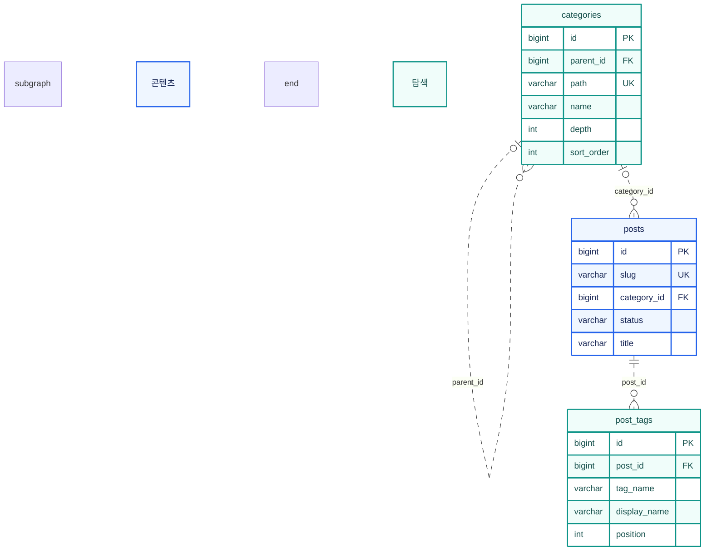

MySQL에 두는 글 정보·탐색 관계·첨부 연결·관리자 인증 상태의 스키마. 본문은 Git Markdown, 이미지 파일은 서버 디스크에 있고 DB에는 두지 않음. 세 저장소의 역할과 정본 구분은 [아키텍처](/ken-blog/post/doc-340352c9-5fde-4bae-bc0b-4ecd744719a8/)에서 다룸.

## 전체 ERD

이 문서의 스키마는 운영 DB의 실제 정의를 기준으로 하며, 그중 현재 코드가 읽고 쓰는 테이블 14개와 그 사이 FK 11개를 그림.[* 2026-10-07 운영 DB의 `information_schema`를 읽기 전용으로 조회해 열 순서·타입·키·삭제 규칙을 확인하고, 이관 전 테이블·열을 정리함] 생성 DDL과의 차이와 남아 있는 옛 열은 [스키마 변경과 운영 대조](#스키마-변경과-운영-대조)에서 다룸.

```mermaid caption="파랑은 콘텐츠, 청록은 탐색, 보라는 기술 배지, 주황은 이미지, 분홍은 인증, 회색은 운영 상태. 선은 실제 FK만 표시. 실선은 부모 키가 자식 PK에 포함된 식별 관계, 점선은 비식별 관계. 선 끝의 원은 없을 수 있음, 갈라진 끝은 여러 개를 뜻함"
erDiagram
    direction TB
    subgraph content_group["콘텐츠 · 글과 시리즈"]
        series {
            bigint id PK
            varchar slug UK
            varchar kind
        }
        posts {
            bigint id PK
            varchar slug UK
            bigint category_id FK
            bigint series_id FK
            bigint related_series_id FK
            varchar status
            bigint edit_version
        }
    end
    subgraph discovery_group["탐색 · 분류와 태그"]
        categories {
            bigint id PK
            bigint parent_id FK
            varchar path UK
        }
        post_tags {
            bigint id PK
            bigint post_id FK
            varchar tag_name
        }
    end
    subgraph stack_group["기술 스택 · 프로젝트의 기술"]
        stack_badges {
            bigint id PK
            varchar name_key UK
            varchar object_key UK
        }
        series_stack_badges {
            bigint series_id PK, FK
            bigint badge_id PK, FK
            int sort_order
        }
    end
    subgraph media_group["첨부 · 이미지와 공개 연결"]
        attachments {
            bigint id PK
            bigint uploaded_by FK
            varchar object_key UK
            varchar status
        }
        post_attachments {
            bigint post_id PK, FK
            bigint attachment_id PK, FK
        }
    end
    subgraph auth_group["인증 · 계정과 세션"]
        users {
            bigint id PK
            varchar username UK
        }
        SPRING_SESSION {
            char PRIMARY_ID PK
            char SESSION_ID UK
            varchar PRINCIPAL_NAME
        }
        SPRING_SESSION_ATTRIBUTES {
            char SESSION_PRIMARY_ID PK, FK
            varchar ATTRIBUTE_NAME PK
        }
        admin_login_sources {
            varchar source_key PK
            int failure_count
            datetime expires_at
        }
        admin_auth_state {
            tinyint id PK
            bigint auth_version
            int failure_count
        }
    end
    subgraph operation_group["운영 · 변경 직렬화"]
        content_state {
            tinyint id PK
        }
    end

    categories |o..o{ categories : parent_id
    categories |o..o{ posts : category_id
    series |o..o{ posts : series_id
    series |o..o{ posts : related_series_id
    posts ||..o{ post_tags : post_id
    series ||--o{ series_stack_badges : series_id
    stack_badges ||--o{ series_stack_badges : badge_id
    posts ||--o{ post_attachments : post_id
    attachments ||--o{ post_attachments : attachment_id
    users ||..o{ attachments : uploaded_by
    SPRING_SESSION ||--o{ SPRING_SESSION_ATTRIBUTES : SESSION_PRIMARY_ID

    classDef content fill:#eff6ff,stroke:#2563eb,color:#172554,stroke-width:2px
    classDef discovery fill:#f0fdfa,stroke:#0d9488,color:#134e4a,stroke-width:2px
    classDef stack fill:#f5f3ff,stroke:#7c3aed,color:#3b0764,stroke-width:2px
    classDef media fill:#fff7ed,stroke:#ea580c,color:#7c2d12,stroke-width:2px
    classDef auth fill:#fff1f2,stroke:#e11d48,color:#881337,stroke-width:2px
    classDef operation fill:#f1f5f9,stroke:#64748b,color:#1e293b,stroke-width:2px
    class content_group,series,posts content
    class discovery_group,categories,post_tags discovery
    class stack_group,stack_badges,series_stack_badges stack
    class media_group,attachments,post_attachments media
    class auth_group,users,SPRING_SESSION,SPRING_SESSION_ATTRIBUTES,admin_auth_state,admin_login_sources auth
    class operation_group,content_state operation
```

## 스키마의 특징

### 본문을 DB에 두지 않음

`posts`에는 제목·요약·소속·발행 상태 같은 글 정보만 저장하고, 본문은 `content/posts/{slug}.md`에 둠. DB 행을 만들어도 원고 파일은 생기지 않고, 원고가 있는지는 사이트 빌드에서 확인함.[* 본문을 DB에 저장하던 시기의 `body`, `body_sha256` 열이 남아 있음. 새 글에는 빈 본문을 저장하며 조회에는 쓰지 않음] 위키 링크와 역링크도 DB에 저장하지 않고 빌더가 원고에서 계산함.

### FK 없이 코드에서 잇는 연결

선으로 그린 FK 외에 코드에서만 대응시키는 연결이 있음.

| 연결 | 방식 |
| --- | --- |
| 세션 → 계정 | `SPRING_SESSION.PRINCIPAL_NAME`에 로그인 이름을 문자열로 저장. Spring Session이 관리하는 테이블이라 `users` FK가 없음 |
| 세션 → 인증 상태 | 세션 속성에 담은 인증 버전을 `admin_auth_state.auth_version`과 비교해, 관리자 설정(비밀번호 등)이 바뀌어 버전이 오르면 기존 세션을 거부 |
| 로그인 출처 | `admin_login_sources`는 출처를 해시한 키로 실패 횟수만 저장. 계정·세션과 연결하지 않음 |
| 프로젝트 종류 | `posts.related_series_id`가 PROJECT 시리즈를 가리키는지, 기술 배지를 PROJECT에만 다는지는 서비스에서 검사 |
| 분류 깊이 | 최대 두 단계 제한은 서비스에서 검사. DB는 `parent_id` 자기참조만 표현 |

### 삭제 규칙을 DB가 처리함

글을 지우면 태그와 첨부 연결은 DB가 함께 삭제함(`ON DELETE CASCADE`). 서비스는 글 행만 삭제함. 관련 프로젝트 참조(`related_series_id`)에는 `ON DELETE SET NULL`이 걸려 있으나, 서비스가 참조가 남은 시리즈의 삭제를 먼저 거부하므로 실제로는 안전장치 역할. 시리즈를 지우면 기술 배지 연결도 함께 삭제되고, 세션을 지우면 세션 속성도 함께 삭제됨. 첨부 연결을 지워도 파일과 `attachments` 행은 남고, 반대로 연결이 남은 `attachments` 행은 지울 수 없음(`attachment_id` FK의 `ON DELETE RESTRICT`).

### 단일 상태 행 잠금으로 변경 직렬화

| 대상 | 방식 |
| --- | --- |
| 분류 변경 | 생성·이름 변경·정렬·삭제 모두 `content_state`의 행 하나(`id=1`)를 먼저 잠근 뒤 진행해, 분류 트리 변경이 한 번에 하나씩 일어나게 함 |
| 로그인 | `admin_auth_state`의 행 하나(`id=1`)를 잠가 로그인 시도와 실패 횟수 갱신을 순서대로 처리함 |
| 글 편집 | 글 행을 비관적 잠금으로 잡고 `edit_version`을 비교함. 원리는 [아키텍처](/ken-blog/post/doc-340352c9-5fde-4bae-bc0b-4ecd744719a8/)의 일관성 모델 절 참조 |
| 첨부 연결 교체 | 글 행을 잠근 뒤 첨부 ID를 정렬된 순서로 잠그고 READY 상태를 확인해 전체 교체함. 편집 버전 검사는 없어 나중에 저장한 쪽이 적용됨 |

## 영역별 상세

각 상세도에는 해당 영역의 주요 열과 관계만 표시함. 생략한 다른 영역의 연결은 [전체 ERD](#전체-erd) 참조.

### 콘텐츠와 프로젝트 관계

```mermaid caption="글의 소속(series_id)과 관련 프로젝트(related_series_id)는 같은 series 테이블을 가리키는 별개의 선택 관계. 한 시리즈에 소속 글과 관련 글이 각각 0개 이상 연결됨"
erDiagram
    direction TB
    subgraph content_detail["콘텐츠"]
        posts {
            bigint id PK
            varchar slug UK
            bigint series_id FK
            bigint related_series_id FK
            varchar status
            bigint edit_version
            varchar title
            int series_order
            varchar visibility
        }
        series {
            bigint id PK
            varchar slug UK
            varchar kind
            varchar name
            varchar project_status
        }
    end
    series |o..o{ posts : series_id
    series |o..o{ posts : related_series_id
    classDef content fill:#eff6ff,stroke:#2563eb,color:#172554,stroke-width:2px
    class content_detail,posts,series content
```

프로젝트 문서는 `series_id`로 소속되고, 트러블슈팅·실험 글은 `related_series_id`로 연결됨. 관계를 나눈 이유는 [기능과 사용자 흐름](/ken-blog/post/doc-4cfccbd2-1972-4ad8-893a-6a8bf45744e1/)의 콘텐츠 모델 절에서 다룸. 프로젝트 대문은 별도 FK 없이 소속 공개 글 중 첫 문서로 계산함.

<details><summary>posts·series 필드</summary>

| 필드 | 의미·제약 |
| --- | --- |
| `posts.id`, `posts.slug` | 내부 PK와 고유 공개 주소. 제목을 바꿔도 slug 유지 |
| `posts.title`, `posts.summary` | 제목·목록 요약. 입력 한도는 각각 200·120 코드 포인트 |
| `posts.category_id` | 분류 FK, null 허용 |
| `posts.series_id`, `posts.series_order` | 소속 시리즈 FK와 문서 순서, 둘 다 null 허용. 순서에 연속·고유 제약은 없고 화면 위치는 1부터 다시 계산 |
| `posts.related_series_id` | 관련 프로젝트 FK, null 허용 |
| `posts.status`, `posts.visibility` | `DRAFT / PUBLISHED`, `PUBLIC / PRIVATE` |
| `posts.edit_version` | 편집 충돌 검사용 정수. 글 정보 저장과 발행 전환 때 증가 |
| `posts.created_at`, `updated_at`, `published_at` | 등록·수정·최초 발행 시각(UTC). 최초 발행 시각은 발행 취소 후에도 유지 |
| `posts.section` | 이관 전 구획 값. 공개 조회에서 이관 전 글을 거르는 데만 쓰고, 화면의 글 종류는 소속 시리즈의 `kind`로 계산 |
| `posts.legacy_path` | 과거 주소. 빌드 때 새 주소로 이동하는 페이지를 만드는 데 사용 |
| `series.kind` | `TECH`(일반 시리즈) 또는 `PROJECT`. 생성 후 변경 불가 |
| `series.project_status`, `start_period`, `end_period` | PROJECT 전용. 상태는 `PLAN / DEV / MAINT / DONE`, 기간은 `YYYY.MM`. 상태·시작 기간 필수 |

</details>

### 분류와 태그



소속 시리즈가 없는 소분류 글의 읽기 목록은 조회할 때 계산하며, 이를 위한 `series` 행을 따로 만들지 않음.

<details><summary>categories·post_tags 필드</summary>

| 필드 | 의미·제약 |
| --- | --- |
| `categories.parent_id` | 부모 분류 자기참조 FK. 대분류는 null |
| `categories.path` | `대분류/소분류` 형태의 고유 경로. 이름을 바꿔도 경로 유지 |
| `categories.depth`, `sort_order` | 단계(1·2)와 형제 사이 표시 순서 |
| `post_tags.tag_name` | 대소문자를 정규화한 비교용 이름. `(post_id, tag_name)` 고유 |
| `post_tags.display_name` | 처음 입력한 표시 철자 |
| `post_tags.position` | 0부터 시작하는 표시 순서. `(post_id, position)` 고유 |

</details>

### 글과 이미지 연결

```mermaid caption="글과 이미지는 post_attachments를 통한 다대다 관계이며 연결 행의 복합 PK는 (post_id, attachment_id). 첨부 등록자는 필수 사용자 FK"
erDiagram
    direction TB
    subgraph content_detail["콘텐츠"]
        posts {
            bigint id PK
            varchar slug UK
            varchar status
            varchar visibility
        }
    end
    subgraph media_detail["이미지"]
        attachments {
            bigint id PK
            bigint uploaded_by FK
            varchar object_key UK
            varchar status
            varchar content_type
            bigint byte_size
        }
        post_attachments {
            bigint post_id PK, FK
            bigint attachment_id PK, FK
        }
    end
    subgraph auth_detail["인증"]
        users {
            bigint id PK
            varchar username UK
            tinyint enabled
        }
    end
    posts ||--o{ post_attachments : post_id
    attachments ||--o{ post_attachments : attachment_id
    users ||..o{ attachments : uploaded_by
    classDef content fill:#eff6ff,stroke:#2563eb,color:#172554,stroke-width:2px
    class content_detail,posts content
    classDef media fill:#fff7ed,stroke:#ea580c,color:#7c2d12,stroke-width:2px
    class media_detail,attachments,post_attachments media
    classDef auth fill:#fff1f2,stroke:#e11d48,color:#881337,stroke-width:2px
    class auth_detail,users auth
```

`post_attachments`는 글별로 공개 다운로드를 허용한 첨부 목록. 공개 전달에는 글이 공개 조건을 만족하고, 연결이 있고, 첨부가 READY 상태여야 함. 파일 바이트는 DB 밖 디스크에 있고, 현재 API에는 업로드·변환·파일 삭제 경로가 없음.

### 프로젝트와 기술 배지

```mermaid caption="series_stack_badges의 복합 PK는 (series_id, badge_id), 표시 순서의 복합 고유 제약은 (series_id, sort_order)"
erDiagram
    direction TB
    subgraph content_detail["콘텐츠"]
        series {
            bigint id PK
            varchar slug UK
            varchar kind
            varchar name
        }
    end
    subgraph stack_detail["기술"]
        stack_badges {
            bigint id PK
            varchar name_key UK
            varchar object_key UK
            varchar name
        }
        series_stack_badges {
            bigint series_id PK, FK
            bigint badge_id PK, FK
            int sort_order
        }
    end
    series ||--o{ series_stack_badges : series_id
    stack_badges ||--o{ series_stack_badges : badge_id
    classDef content fill:#eff6ff,stroke:#2563eb,color:#172554,stroke-width:2px
    class content_detail,series content
    classDef stack fill:#f5f3ff,stroke:#7c3aed,color:#3b0764,stroke-width:2px
    class stack_detail,stack_badges,series_stack_badges stack
```

`stack_badges`는 기술 이름, 대소문자를 정규화한 `name_key`, 디스크의 PNG 위치인 `object_key`를 저장하며 두 키는 각각 고유함.

### 계정·세션·운영 상태

```mermaid caption="이 영역의 물리 FK는 세션 속성에서 세션으로 향하는 하나뿐. 세션과 계정, 인증 상태의 대응은 코드에서 처리함"
erDiagram
    direction TB
    subgraph auth_detail["인증"]
        users {
            bigint id PK
            varchar username UK
            tinyint enabled
        }
        SPRING_SESSION {
            char PRIMARY_ID PK
            char SESSION_ID UK
            varchar PRINCIPAL_NAME
            bigint EXPIRY_TIME
        }
        SPRING_SESSION_ATTRIBUTES {
            char SESSION_PRIMARY_ID PK, FK
            varchar ATTRIBUTE_NAME PK
            blob ATTRIBUTE_BYTES
        }
        admin_auth_state {
            tinyint id PK
            bigint auth_version
            int failure_count
            datetime locked_until
        }
        admin_login_sources {
            varchar source_key PK
            int failure_count
            datetime expires_at
        }
    end
    subgraph operation_detail["운영"]
        content_state {
            tinyint id PK
        }
    end
    SPRING_SESSION ||--o{ SPRING_SESSION_ATTRIBUTES : SESSION_PRIMARY_ID
    classDef auth fill:#fff1f2,stroke:#e11d48,color:#881337,stroke-width:2px
    class auth_detail,users,SPRING_SESSION,SPRING_SESSION_ATTRIBUTES,admin_auth_state,admin_login_sources auth
    classDef operation fill:#f1f5f9,stroke:#64748b,color:#1e293b,stroke-width:2px
    class operation_detail,content_state operation
```

<details><summary>인증·운영 테이블</summary>

| 테이블 | 책임 | 키·제약 |
| --- | --- | --- |
| `users` | 계정·비밀번호 해시·권한·활성 상태 | `id` PK, `username` 고유 |
| `SPRING_SESSION` | 세션 ID·만료 시각·로그인 이름 | `PRIMARY_ID` PK, `SESSION_ID` 고유. `EXPIRY_TIME`, `PRINCIPAL_NAME` 인덱스 |
| `SPRING_SESSION_ATTRIBUTES` | 직렬화한 세션 속성 | `(SESSION_PRIMARY_ID, ATTRIBUTE_NAME)` PK |
| `admin_auth_state` | 관리자 설정 지문·인증 버전·실패 횟수 | `id=1` 단일 행 |
| `admin_login_sources` | 출처별 로그인 실패 횟수와 만료 시각 | 출처 해시 `source_key` PK, `expires_at` 인덱스. 60초 창, 최대 4,096행 |
| `content_state` | 분류 변경 직렬화용 잠금 행 | `id=1` 단일 행 |

`SPRING_SESSION` 계열과 `admin_auth_state`, `admin_login_sources`는 JPA 엔티티가 아니라 `schema.sql`로 만듦.

</details>

## 스키마 변경과 운영 대조

개발 환경에서는 JPA 엔티티로 스키마를 만들고, jOOQ 타입도 엔티티에서 생성한 DDL로 만듦.[* 생성 순서는 [JPA 기반 코드 생성 ADR](/ken-blog/post/post-f69cf0bb-68a1-4b72-b6c9-6aea1ed04db9/) 참조] 운영은 `ddl-auto=validate`, `sql.init.mode=never`로 기동해 스키마를 자동으로 바꾸지 않고 검증만 하며, 변경은 검토한 이관 SQL로 적용함. `posts.edit_version`과 `admin_login_sources`는 2026-10-03 이관 SQL로 추가했고 운영에 반영되어 있음.

운영 DB의 테이블 14개와 FK 11개는 이 문서의 그림과 같음. 2026-10-07 대조 뒤 현재 코드가 쓰지 않는 이관 전 모델의 테이블 12개와 위키 선언 테이블 `post_wiki_links`, `posts`의 이관 전 열 6개와 관련 FK·인덱스를 [정리 SQL](https://github.com/gjaku1031/ken-blog/blob/main/deploy/sql/drop-legacy-tables-2026-10-07.sql)로 삭제함.

아래 옛 열은 운영에 남아 있음.

| 열 | 상태 |
| --- | --- |
| `posts.body`, `posts.body_sha256` | 새 글에 빈 본문 저장, 조회에 쓰지 않음 |
| `posts.legacy_path` | 과거 주소 이동에 사용 |
| `posts.section` | 공개 조회의 이관 전 글 제외 조건에 사용 |
| `series.legacy_source`, `series.legacy_id` | 이관 자료의 중복 연결을 막는 복합 고유 제약만 유지 |
| `posts.pin_order`, `posts.view_count`, `attachments.pending_cleanup` | 엔티티에 열만 있고 현재 기능에서 쓰지 않음 |
| `admin_auth_state.last_totp_step` | `schema.sql`과 코드에 없는 이관 전 열(NULL 허용). 현재 기능에서 쓰지 않음 |

<details><summary>생성 DDL과 운영 스키마의 차이</summary>

생성 DDL은 JPA 엔티티에서 만든 `build/generated/jooq/schema.sql`. DDL에 정의된 테이블 10개와 FK 10개는 운영에 모두 있고 NULL 여부도 같음.[* 나머지 테이블 4개와 세션 속성 FK는 JPA 엔티티가 아니라 `schema.sql`로 만듦] 다른 점은 아래 항목.

| 대상 | 생성 DDL | 운영 |
| --- | --- | --- |
| `post_attachments` 복합 PK 순서 | `(attachment_id, post_id)` | `(post_id, attachment_id)` |
| `series_stack_badges` 복합 PK 순서 | `(badge_id, series_id)` | `(series_id, badge_id)` |
| `post_attachments.attachment_id` FK 삭제 규칙 | 지정 없음 | `RESTRICT` |
| `attachments.status`, `users.role` | `ENUM` | `VARCHAR(16)`, `VARCHAR(20)` |
| `attachments.pending_cleanup`, `users.enabled` | `BIT` | `TINYINT(1)` |
| 보조 인덱스 | 없음 | `posts`·`categories` 등의 조회용 인덱스 |

</details>

[영속성 ADR](https://github.com/gjaku1031/ken-blog/blob/3074d80/docs/ADR/ADR_persistence.md) · [비 JPA 초기화 SQL](https://github.com/gjaku1031/ken-blog/blob/3074d80/src/main/resources/schema.sql) · [2026-10-03 이관 SQL](https://github.com/gjaku1031/ken-blog/blob/3074d80/deploy/sql/review-2026-10-03.sql) · [운영 Compose](https://github.com/gjaku1031/ken-blog/blob/3074d80/deploy/compose.production.yaml)
