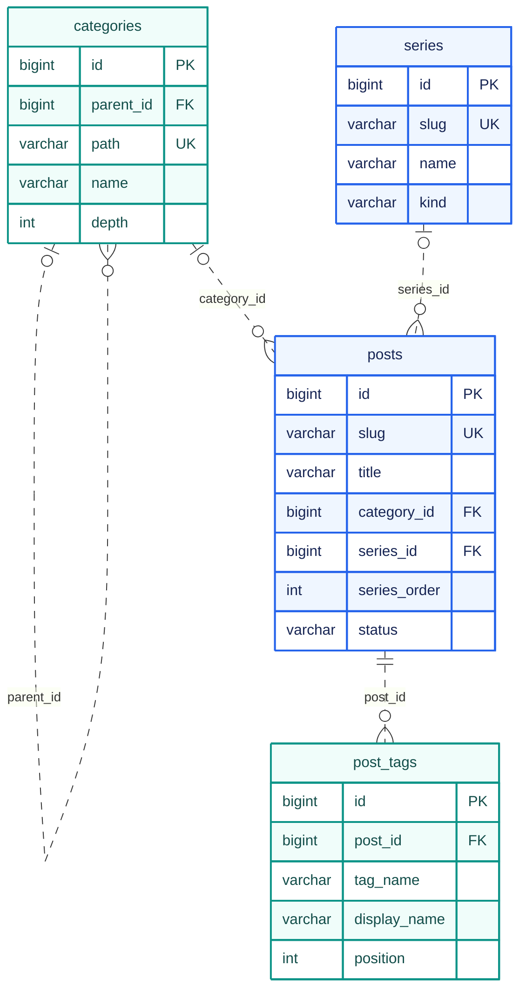
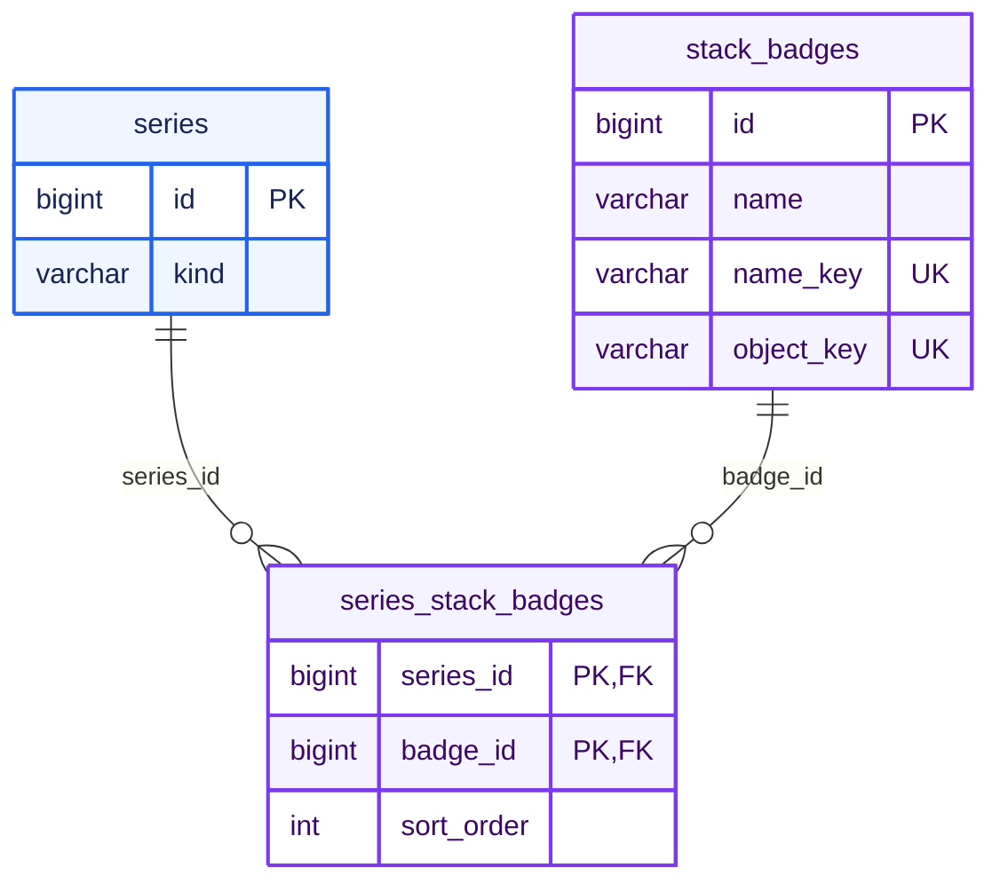
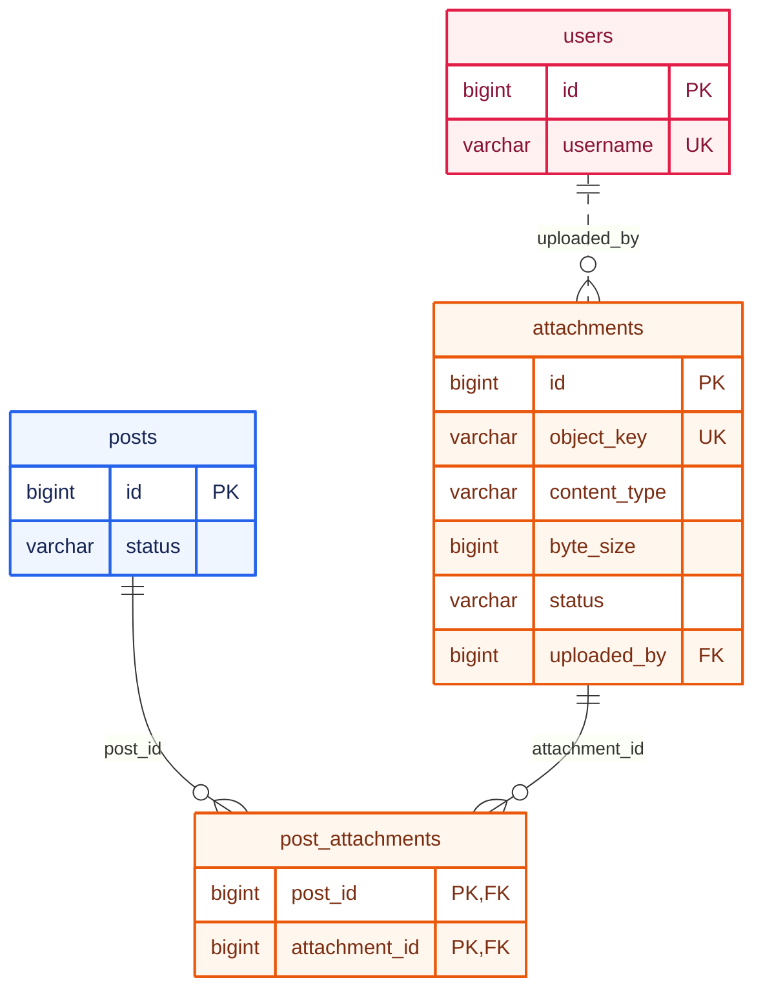

ken.blog의 DB는 **글의 정보와 연결 관계, 로그인 상태**를 관리합니다. 본문은 Git의 Markdown에, 이미지 파일은 서버의 영속 디스크에 두므로 DB의 관계도를 볼 때도 이 경계를 먼저 구분해야 합니다.

이 글은 **2026년 10월 3일 기준**의 JPA 엔티티와 운영 스키마를 대조해 정리했습니다. 전체 배치와 빌드 흐름은 [[아키텍처]]에서 설명하고, 여기서는 테이블이 맡은 역할과 관계를 살펴봅니다.

## 전체 ERD

현재 사용하는 **14개 테이블**을 역할별로 묶었습니다. 파랑은 글·시리즈, 청록은 분류·태그·위키, 보라는 기술 스택, 주황은 이미지, 분홍은 계정·인증, 회색은 운영 상태입니다. 그룹 이름도 함께 표시해 색만으로 구분하지 않아도 읽을 수 있습니다.

```mermaid
erDiagram
    direction TB
    subgraph content_group["콘텐츠 · 글과 시리즈"]
        series {
            bigint id PK
            varchar slug UK
            varchar kind
        }
        posts {
            bigint id PK
            varchar slug UK
            bigint category_id FK
            bigint series_id FK
            bigint related_series_id FK
            varchar status
        }
    end
    subgraph discovery_group["탐색 · 분류와 참조"]
        categories {
            bigint id PK
            bigint parent_id FK
            varchar path UK
        }
        post_tags {
            bigint id PK
            bigint post_id FK
            varchar tag_name
        }
        post_wiki_links {
            bigint id PK
            bigint post_id FK
            varchar target_title
        }
    end
    subgraph stack_group["기술 스택 · 프로젝트의 기술"]
        stack_badges {
            bigint id PK
            varchar name_key UK
            varchar object_key UK
        }
        series_stack_badges {
            bigint series_id PK, FK
            bigint badge_id PK, FK
            int sort_order
        }
    end
    subgraph media_group["첨부 · 이미지와 공개 연결"]
        attachments {
            bigint id PK
            bigint uploaded_by FK
            varchar object_key UK
            varchar status
        }
        post_attachments {
            bigint post_id PK, FK
            bigint attachment_id PK, FK
        }
    end
    subgraph auth_group["인증 · 계정과 세션"]
        users {
            bigint id PK
            varchar username UK
        }
        SPRING_SESSION {
            char PRIMARY_ID PK
            char SESSION_ID UK
            varchar PRINCIPAL_NAME
        }
        SPRING_SESSION_ATTRIBUTES {
            char SESSION_PRIMARY_ID PK, FK
            varchar ATTRIBUTE_NAME PK
        }
        admin_auth_state {
            tinyint id PK
            bigint auth_version
            int failure_count
        }
    end
    subgraph operation_group["운영 · 변경 직렬화"]
        content_state {
            tinyint id PK
        }
    end

    categories |o..o{ categories : parent_id
    categories |o..o{ posts : category_id
    series |o..o{ posts : series_id
    series |o..o{ posts : related_series_id
    posts ||..o{ post_tags : post_id
    posts ||..o{ post_wiki_links : post_id
    series ||--o{ series_stack_badges : series_id
    stack_badges ||--o{ series_stack_badges : badge_id
    posts ||--o{ post_attachments : post_id
    attachments ||--o{ post_attachments : attachment_id
    users ||..o{ attachments : uploaded_by
    SPRING_SESSION ||--o{ SPRING_SESSION_ATTRIBUTES : SESSION_PRIMARY_ID

    classDef content fill:#eff6ff,stroke:#2563eb,color:#172554,stroke-width:2px
    classDef discovery fill:#f0fdfa,stroke:#0d9488,color:#134e4a,stroke-width:2px
    classDef stack fill:#f5f3ff,stroke:#7c3aed,color:#3b0764,stroke-width:2px
    classDef media fill:#fff7ed,stroke:#ea580c,color:#7c2d12,stroke-width:2px
    classDef auth fill:#fff1f2,stroke:#e11d48,color:#881337,stroke-width:2px
    classDef operation fill:#f1f5f9,stroke:#64748b,color:#1e293b,stroke-width:2px
    class content_group,series,posts content
    class discovery_group,categories,post_tags,post_wiki_links discovery
    class stack_group,stack_badges,series_stack_badges stack
    class media_group,attachments,post_attachments media
    class auth_group,users,SPRING_SESSION,SPRING_SESSION_ATTRIBUTES,admin_auth_state auth
    class operation_group,content_state operation
```

**도식을 누르면 확대 창에서 배율을 조절하며 볼 수 있습니다.** 선은 실제 DB 외래 키만 나타냅니다. 세션의 로그인 이름과 계정, 인증 상태·분류 잠금 행은 코드에서 함께 사용하지만 FK로 연결되어 있지 않으므로 임의의 선을 그리지 않았습니다. 위키 대상도 글 ID가 아닌 제목 문자열입니다.

전체도에는 관계를 파악할 주요 키만 표시했습니다. 아래에는 같은 색상으로 나눈 부분 ERD와 각 테이블의 컬럼·업무 규칙을 정리했습니다. Git의 Markdown과 디스크의 이미지 파일, 보존 중인 과거 테이블은 현재 DB 모델의 전체도에서 제외했습니다.

## 관계도를 읽는 기준

일반 글과 프로젝트 문서는 모두 `posts`에 저장합니다. 여러 글의 묶음은 `series`, 주제 분류는 `categories`로 표현합니다. 예전의 프로젝트·과목별 모델을 공통 글·시리즈 모델로 합친 구조입니다.

`PK`는 기본 키, `FK`는 외래 키, `UK`는 고유 키입니다. 선 끝의 원은 연결이 없어도 된다는 뜻이고, 갈라진 표시는 여러 행이 연결될 수 있다는 뜻입니다. 실선은 부모의 키가 자식의 기본 키에 포함되는 식별 관계, 점선은 별도의 기본 키를 가진 비식별 관계입니다.

도식에는 주요 컬럼만 표시했습니다. 복합 키와 업무 규칙은 아래 설명을 함께 읽어야 합니다. 운영 DB에 보존된 과거 테이블까지 전부 나열한 물리 스키마와는 범위가 다릅니다.

## 글·시리즈·분류

### posts — 모든 글의 공통 메타데이터

제목과 고정 주소, 발행 상태, 분류와 시리즈 소속을 저장합니다. 프로젝트의 소개 글과 설계 문서도 별도 본문 테이블 없이 같은 행 구조를 사용합니다.

| 주요 컬럼 | 의미와 규칙 |
| --- | --- |
| `id`, `slug` | 내부 식별자와 고유한 공개 주소. 제목을 바꿔도 주소는 유지 |
| `title`, `summary` | 문서 제목과 목록용 요약. 각각 최대 200자, 120자 |
| `category_id` | 선택한 분류. 분류가 없으면 `NULL` |
| `series_id`, `series_order` | 소속 시리즈와 읽는 순서. 소속 없이 분류 안의 순서만 지정하는 경우도 있음 |
| `related_series_id` | 소속과 별도로 연결하는 관련 프로젝트. API에서 `PROJECT` 종류인지 검사 |
| `status`, `visibility` | 미발행·발행 상태와 공개 범위. 현재 발행 API는 `PUBLIC`만 허용 |
| `published_at`, `created_at`, `updated_at` | 최초 발행 시각과 등록·수정 시각. DB에는 UTC 기준으로 기록 |

`series_id`는 “이 문서가 속한 묶음”, `related_series_id`는 “이 글과 관련 있는 프로젝트”입니다. 서로 다른 역할의 외래 키이며, 전체도에는 둘 다 표시하고 이 부분 도식에는 소속 관계만 표시했습니다.

DB에는 이전 본문인 `body`와 `body_sha256`도 남아 있습니다. 현재 신규 글은 빈 본문과 그 해시로 등록하고, 정적 사이트의 본문은 `slug`에 대응하는 Git 파일에서 가져옵니다. 따라서 **DB 행의 존재가 원고 파일의 존재를 보장하지는 않습니다.**

### series — 일반 시리즈와 프로젝트

`kind=TECH`는 일반 시리즈, `kind=PROJECT`는 프로젝트입니다. 공통으로 이름·설명·고정 주소·공개 범위·목록 순서를 갖고, 프로젝트에는 진행 상태와 기간을 추가합니다.

| 주요 컬럼 | 의미와 규칙 |
| --- | --- |
| `id`, `slug`, `name` | 묶음의 식별자·고정 주소·표시 이름 |
| `kind`, `description` | 묶음의 종류와 소개 문구 |
| `visibility`, `sort_order` | 공개 범위와 시리즈 카드의 정렬 순서 |
| `project_status` | 프로젝트 상태: `PLAN`, `DEV`, `MAINT`, `DONE` |
| `start_period`, `end_period` | 프로젝트의 시작·종료 연월. `YYYY.MM` 형식이며 종료 연월은 생략 가능 |
| `legacy_source`, `legacy_id` | 기존 프로젝트·과목 자료를 이관한 출처. 두 컬럼의 조합은 고유 |

대문 글을 가리키는 별도 FK는 두지 않았습니다. 시리즈의 **첫 공개 글**을 대문으로 계산합니다. 이 프로젝트는 소개 → 아키텍처 → ERD 순으로 읽게 됩니다.

글은 `series_order`, 발행 시각, ID 순으로 정렬하며 미지정 순서는 뒤로 갑니다. 저장된 순서 숫자가 연속적이거나 고유해야 한다는 DB 제약은 없습니다. 화면에는 정렬된 공개 글을 1번부터 다시 번호 매겨 보여줍니다.

### categories — 대분류와 소분류

`parent_id`가 같은 테이블의 `id`를 참조하는 구조입니다. 대분류는 부모가 없고 `depth=1`, 소분류는 대분류를 부모로 가지며 `depth=2`입니다. 최대 두 단계라는 규칙은 애플리케이션에서 검사합니다.

`path`는 정규화한 전체 경로이며 고유합니다. `name`은 표시 이름, `sort_order`는 같은 부모 아래에서의 순서입니다. 글의 분류는 선택 사항이고, 한 글에 직접 연결하는 분류는 하나입니다.

명시 시리즈가 없는 글은 소분류의 공개 글들을 읽기 목록으로 사용할 수 있습니다. 이 목록은 조회할 때 구성하므로 자동 시리즈를 나타내는 `series` 행을 따로 만들지 않습니다.

### post_tags — 글에 붙인 태그

공용 `tags` 테이블과 연결 테이블을 두는 대신, 글마다 태그 이름을 직접 저장합니다. `tag_name`은 소문자로 정규화한 검색 키, `display_name`은 입력한 대소문자를 보존하는 이름입니다. `position`은 0부터 시작하는 표시 순서입니다.

`(post_id, tag_name)`과 `(post_id, position)`이 각각 고유하므로 같은 글에 태그나 위치가 중복되지 않습니다. 글이 삭제되면 해당 태그 행도 함께 삭제되는 FK 규칙을 둡니다.

## 프로젝트의 기술 스택

| 테이블 | 맡은 일 |
| --- | --- |
| `stack_badges` | 기술 이름과 아이콘 파일 키를 보관하는 공용 목록. `name_key`는 대소문자를 정규화한 고유 이름 |
| `series_stack_badges` | 프로젝트가 선택한 기술을 연결. `(series_id, badge_id)`가 복합 PK이며 `sort_order`로 표시 순서를 보존 |

여러 프로젝트가 같은 기술을 선택할 수 있으므로 다대다 관계를 연결 테이블로 풀었습니다. `(series_id, sort_order)`도 고유해서 한 프로젝트의 같은 위치에 두 기술이 들어가지 않습니다.

DB의 FK는 시리즈의 존재를 보장하고, 프로젝트에만 기술 스택을 지정하는 규칙은 API가 검사합니다. 기술 목록과 아이콘은 운영자가 준비하고, 웹 관리자는 프로젝트에서 사용할 기술을 선택합니다. 아이콘 바이트 자체를 이 테이블에 저장하지는 않습니다.

## 이미지와 글의 연결

### attachments — 파일의 위치와 상태

이미지 파일의 원본은 영속 디스크에 두고, DB에는 이를 찾고 검증할 정보를 저장합니다.

| 주요 컬럼 | 의미 |
| --- | --- |
| `object_key` | 파일을 찾는 고유 키. 이름은 유지했지만 현재 저장소는 로컬 디스크 |
| `original_filename`, `content_type`, `byte_size` | 원래 파일명, MIME 유형, 파일 크기 |
| `uploaded_by` | 파일을 등록한 계정의 `users.id` |
| `status` | `PENDING`, `READY`, `DELETING` 상태. 공개 읽기와 새 연결은 `READY`만 허용 |
| `pending_cleanup`, `created_at`, `updated_at` | 정리 상태와 등록·변경 시각. 과거 처리 상태도 보존 |

현재 API에는 이미지 업로드·삭제 기능이 없습니다. 상태 컬럼이 있다는 이유만으로 서버가 업로드나 정리를 자동 실행하는 것은 아니며, 운영자가 파일과 DB 정보를 함께 준비해야 합니다.

### post_attachments — 어떤 글에서 읽을 수 있는가

`(post_id, attachment_id)`가 복합 PK입니다. 한 글에 여러 이미지를 연결하고 같은 이미지를 여러 글에서 사용할 수 있으며, 동일한 연결은 중복되지 않습니다.

이 연결은 파일 목록이면서 **글 단위의 이미지 공개 조건**입니다. API는 글의 공개 여부, 해당 글과 첨부의 연결, 첨부의 `READY` 상태를 함께 확인합니다. Markdown에 이미지 ID만 적는 것으로 읽기 권한이 생기지는 않습니다.

연결을 바꿀 때는 글과 첨부 상태를 잠근 뒤 같은 트랜잭션에서 교체합니다. 글의 연결을 제거해도 파일 자체가 자동으로 삭제되지는 않습니다.

## 위키 링크·계정·세션을 위한 테이블

| 테이블 | 주요 키·컬럼 | 맡은 일 |
| --- | --- | --- |
| `post_wiki_links` | `id`, `post_id`, `target_title`, `position` | 관리자가 선언한 위키 대상 제목. `(post_id, target_title)`이 고유 |
| `users` | `id`, `username`, `password_hash`, `role`, `enabled` | 로그인 계정과 첨부 등록자. 비밀번호는 해시로 저장 |
| `SPRING_SESSION` | `PRIMARY_ID`, `SESSION_ID`, `EXPIRY_TIME`, `PRINCIPAL_NAME` | JDBC 로그인 세션과 만료 정보. `SESSION_ID`는 고유 |
| `SPRING_SESSION_ATTRIBUTES` | `SESSION_PRIMARY_ID`, `ATTRIBUTE_NAME`, `ATTRIBUTE_BYTES` | 세션 속성. 세션 ID와 속성 이름이 복합 PK |
| `admin_auth_state` | `id`, `config_fingerprint`, `auth_version`, `failure_count`, `locked_until` | 관리자 인증 설정 변경과 로그인 실패 제한을 관리하는 단일 상태 행 |
| `content_state` | `id` | 분류 생성·삭제·순서 변경을 직렬화할 때 잠그는 단일 행 |

`post_wiki_links`의 `post_id`는 FK지만 **대상은 글 ID가 아닌 제목 문자열**입니다. 따라서 아직 존재하지 않는 글의 제목도 선언할 수 있습니다. 공개 페이지의 실제 위키 링크와 역링크는 Node가 Git 원고와 공개 글 목록으로 계산하며, Markdown 수정이 이 테이블을 자동 갱신하지는 않습니다.

`SPRING_SESSION_ATTRIBUTES.SESSION_PRIMARY_ID`는 `SPRING_SESSION.PRIMARY_ID`를 참조하며 세션 삭제 시 속성도 함께 삭제합니다. 반면 `SPRING_SESSION.PRINCIPAL_NAME`과 `users.username` 사이에는 DB 외래 키가 없습니다. 계정과 세션의 유효성은 인증 코드에서 확인합니다.

현재 로그인은 설정된 활성 관리자 계정으로 제한합니다. `users` 테이블이나 `USER` 권한 값이 남아 있다고 해서 공개 회원가입을 제공하는 구조는 아닙니다. 인증 설정 변경은 `auth_version`으로, 계정 비밀번호 변경은 세션 인증 증명 비교로 기존 세션에 반영합니다.

## DB 제약과 애플리케이션 규칙

관계도만으로는 발행·분류·파일 관리의 모든 조건을 표현할 수 없습니다. 저장 구조와 서비스 규칙을 다음처럼 나누었습니다.

| 조건 | 보장하는 위치 |
| --- | --- |
| 글·시리즈 주소, 분류 경로 중복 방지 | DB의 고유 키 |
| 존재하는 글·시리즈·첨부에 연결 | DB의 외래 키 |
| 최대 2단계 분류, 프로젝트 전용 상태·기술 스택 | API 입력 검사와 변경 트랜잭션 |
| 공개할 수 있는 글과 `READY` 이미지인지 확인 | API의 조회 조건과 연결 시 상태 검사 |
| 공개 대상의 Markdown과 실제 이미지가 있는지 확인 | Node의 Pages 빌드 |
| 본문을 바꾼 이력과 검토 | Git 커밋 |

JPA는 저장과 변경 잠금을, jOOQ는 목록·조인·집계와 일부 잠금 조회를 맡습니다. 도메인 테이블의 코드 생성 기준은 JPA 엔티티이고, JDBC 세션·인증 상태 테이블은 별도 SQL로 관리합니다. 코드 생성용 DDL을 만들었다고 운영 DB까지 자동 이관되는 것은 아닙니다.

## 운영 DB에 남아 있는 과거 구조

운영 DB에는 `projects`, `courses`, `project_stack_badges`, `editor_drafts`와 그 연결 테이블 등 이전 모델의 자료도 보존되어 있습니다. 현재 글·시리즈의 저장 경로와 웹 본문 편집 기능에서 사용하는 테이블은 아닙니다.

`posts`의 옛 프로젝트·과목 참조와 `section`, 조회수 관련 컬럼도 이관·호환을 위해 남아 있습니다. 현재 글의 종류는 소속 시리즈로 판단합니다. 공개 조회에서는 미이관 자료가 섞이지 않도록 기존 `section`이 `TECH`로 정규화되었는지도 확인합니다.

과거 테이블을 현재 ERD의 중심에 놓으면 이미 없어진 편집기나 프로젝트 전용 본문 모델이 계속 사용되는 것처럼 보입니다. 그래서 이 글은 **현재 코드가 사용하는 관계와 보존 중인 자료를 구분**했습니다. 실제 스키마 변경은 기존 데이터와 외래 키를 확인하는 별도의 이관 작업입니다.

세부 정의는 [도메인 엔티티](https://github.com/gjaku1031/ken-blog/tree/main/src/main/kotlin/io/github/gjaku1031/kenblog), [세션·인증 초기화 SQL](https://github.com/gjaku1031/ken-blog/blob/main/src/main/resources/schema.sql), [영속성 ADR](https://github.com/gjaku1031/ken-blog/blob/main/docs/ADR/ADR_persistence.md)에서 확인할 수 있습니다.
