글 메타데이터·탐색 관계·첨부 정보·관리자 인증 상태를 저장하는 모델. 본문 정본은 Git Markdown, 이미지 바이트는 영속 디스크에 보관.

## 전체 ERD

현재 엔티티와 초기화·이관 SQL의 활성 테이블 15개. 운영 DB에 보존된 과거 테이블은 제외. 실선은 부모 키가 자식 PK에 포함된 식별 관계, 점선은 비식별 관계. 선 끝의 원은 선택 관계, 갈라진 표시는 다수 관계.

```mermaid
erDiagram
    direction TB
    subgraph content_group["콘텐츠 · 글과 시리즈"]
        series {
            bigint id PK
            varchar slug UK
            varchar kind
        }
        posts {
            bigint id PK
            varchar slug UK
            bigint category_id FK
            bigint series_id FK
            bigint related_series_id FK
            varchar status
            bigint edit_version
        }
    end
    subgraph discovery_group["탐색 · 분류와 참조"]
        categories {
            bigint id PK
            bigint parent_id FK
            varchar path UK
        }
        post_tags {
            bigint id PK
            bigint post_id FK
            varchar tag_name
        }
        post_wiki_links {
            bigint id PK
            bigint post_id FK
            varchar target_title
        }
    end
    subgraph stack_group["기술 스택 · 프로젝트의 기술"]
        stack_badges {
            bigint id PK
            varchar name_key UK
            varchar object_key UK
        }
        series_stack_badges {
            bigint series_id PK, FK
            bigint badge_id PK, FK
            int sort_order
        }
    end
    subgraph media_group["첨부 · 이미지와 공개 연결"]
        attachments {
            bigint id PK
            bigint uploaded_by FK
            varchar object_key UK
            enum status
        }
        post_attachments {
            bigint post_id PK, FK
            bigint attachment_id PK, FK
        }
    end
    subgraph auth_group["인증 · 계정과 세션"]
        users {
            bigint id PK
            varchar username UK
        }
        SPRING_SESSION {
            char PRIMARY_ID PK
            char SESSION_ID UK
            varchar PRINCIPAL_NAME
        }
        SPRING_SESSION_ATTRIBUTES {
            char SESSION_PRIMARY_ID PK, FK
            varchar ATTRIBUTE_NAME PK
        }
        admin_login_sources {
            varchar source_key PK
            int failure_count
            datetime expires_at
        }
        admin_auth_state {
            tinyint id PK
            bigint auth_version
            int failure_count
        }
    end
    subgraph operation_group["운영 · 변경 직렬화"]
        content_state {
            tinyint id PK
        }
    end

    categories |o..o{ categories : parent_id
    categories |o..o{ posts : category_id
    series |o..o{ posts : series_id
    series |o..o{ posts : related_series_id
    posts ||..o{ post_tags : post_id
    posts ||..o{ post_wiki_links : post_id
    series ||--o{ series_stack_badges : series_id
    stack_badges ||--o{ series_stack_badges : badge_id
    posts ||--o{ post_attachments : post_id
    attachments ||--o{ post_attachments : attachment_id
    users ||..o{ attachments : uploaded_by
    SPRING_SESSION ||--o{ SPRING_SESSION_ATTRIBUTES : SESSION_PRIMARY_ID

    classDef content fill:#eff6ff,stroke:#2563eb,color:#172554,stroke-width:2px
    classDef discovery fill:#f0fdfa,stroke:#0d9488,color:#134e4a,stroke-width:2px
    classDef stack fill:#f5f3ff,stroke:#7c3aed,color:#3b0764,stroke-width:2px
    classDef media fill:#fff7ed,stroke:#ea580c,color:#7c2d12,stroke-width:2px
    classDef auth fill:#fff1f2,stroke:#e11d48,color:#881337,stroke-width:2px
    classDef operation fill:#f1f5f9,stroke:#64748b,color:#1e293b,stroke-width:2px
    class content_group,series,posts content
    class discovery_group,categories,post_tags,post_wiki_links discovery
    class stack_group,stack_badges,series_stack_badges stack
    class media_group,attachments,post_attachments media
    class auth_group,users,SPRING_SESSION,SPRING_SESSION_ATTRIBUTES,admin_auth_state,admin_login_sources auth
    class operation_group,content_state operation
```

파랑은 콘텐츠, 청록은 탐색, 보라는 기술, 주황은 이미지, 분홍은 인증, 회색은 운영 상태. 선은 실제 FK만 표시. 세션의 로그인 이름, 위키 대상 제목, 인증·로그인 출처 상태는 코드에서 연결하며 해당 논리 관계의 FK는 없음.

## 저장 책임

| 저장소 | 자료 | 변경 방식 |
| --- | --- | --- |
| Git | Markdown 본문·다이어그램 원문 | 파일 편집과 커밋 |
| MySQL | 글 정보·연결 관계·계정·세션 | 관리자 API, 운영 SQL, 인증 처리 |
| 영속 디스크 | 본문 이미지·기술 아이콘 | 운영자가 파일 준비, API는 읽기 전용 |
| Pages | HTML·검색 자료·이미지 복사본 | 전체 빌드 후 배포 |

DB 행만 생성해도 원고 파일은 생성되지 않음. 발행 요청은 DB 상태를 변경하며 원고 존재 여부는 사이트 빌드에서 확인.

## 콘텐츠와 프로젝트 관계

### posts

| 필드 | 의미·제약 |
| --- | --- |
| `id`, `slug` | 내부 PK와 고유 공개 주소. 제목 변경 후에도 slug 유지 |
| `title`, `summary` | 제목·목록 요약. 입력 한도는 각각 200·120 코드 포인트 |
| `category_id` | nullable 분류 FK |
| `series_id`, `series_order` | nullable 소속 FK와 문서 순서 |
| `related_series_id` | nullable 관련 프로젝트 FK. PROJECT 종류는 서비스에서 검사 |
| `status`, `visibility` | `DRAFT / PUBLISHED`, `PUBLIC / PRIVATE`. 발행 API는 공개 발행으로 전환 |
| `edit_version` | 글 메타데이터 편집 충돌용 정수. 서비스가 글 잠금 안에서 증가 |
| `created_at`, `updated_at`, `published_at` | 등록·수정·최초 발행 시각. UTC 기준 |
| `body`, `body_sha256` | 기존 자료·스키마 호환용 보존 열. 현재 본문 정본으로 사용하지 않음 |

`series_id`는 문서의 소속, `related_series_id`는 일반 글과 프로젝트의 연관. 프로젝트 상세 문서는 전자, 문제 해결·ADR·실험 Posts는 후자 사용.

저장된 `section`은 이관 호환 조건으로 유지. API·화면의 글 종류는 소속 시리즈 `kind`에서 계산하며 미소속 글은 TECH. DB의 호환 값과 화면의 PROJECT 구분을 혼동하지 않음.

### series

`TECH`는 일반 시리즈, `PROJECT`는 프로젝트. 이름·설명·공개 범위·표시 순서를 공통으로 저장. 프로젝트에는 `project_status`, `start_period`, `end_period`와 기술 배지 연결 추가.

프로젝트 상태는 `PLAN / DEV / MAINT / DONE`, 기간은 `YYYY.MM`. PROJECT의 상태·시작 기간은 필수. 종류와 slug는 생성 후 수정 대상에서 제외.

별도 대문 FK 없이 첫 공개 글로 대문 계산. 정렬은 문서 순서, 최초 발행 시각, ID 순서이며 null 순서는 마지막. 저장 순서에 연속·고유 제약은 없으며 화면 위치는 1부터 재계산.

## 탐색 모델

| 테이블 | 책임 | 주요 규칙 |
| --- | --- | --- |
| `categories` | 대분류·소분류 | 자기참조 nullable `parent_id`, 고유 `path`, 최대 두 단계는 서비스 검사 |
| `post_tags` | 글별 태그 | 정규화한 `tag_name`, 표시 철자의 `display_name`, 0부터 시작하는 `position` |
| `post_wiki_links` | 글별 위키 대상 선언 | 대상은 글 ID 대신 제목 문자열. 원고와 자동 동기화하지 않음 |

명시 시리즈가 없는 소분류 글의 읽기 목록은 조회 시 계산. 자동 목록을 위한 별도 `series` 행을 생성하지 않음.

위키 링크와 역링크의 공개 화면은 빌더가 원고에서 계산. DB 선언 목록 교체와 원고 수정은 각각 관리.

## 첨부·기술 배지

| 테이블 | 책임 | 관계·수명 |
| --- | --- | --- |
| `attachments` | 파일 키·이름·MIME·크기·상태·등록자 | `uploaded_by`는 필수 사용자 FK. 실제 파일은 디스크 |
| `post_attachments` | 글별 첨부 허용 목록 | `(post_id, attachment_id)` 복합 PK와 양쪽 FK |
| `stack_badges` | 기술 이름·정규화 키·PNG 객체 키 | 정규화 이름과 객체 키 각각 고유 |
| `series_stack_badges` | 프로젝트 기술 선택·순서 | `(series_id, badge_id)` 복합 PK와 양쪽 FK |

첨부 연결 전 부모 글 잠금과 정렬된 첨부 ID별 READY 상태 잠금 수행. 유효성 검사를 마친 뒤 기존 연결을 전체 교체하며 실패 시 함께 롤백.

연결 해제는 파일 삭제가 아님. 기존 첨부 상태 값은 보존하되 현재 API는 업로드·변환·파일 삭제를 제공하지 않음. 공개 전달에는 글 공개 조건·연결·READY 상태 모두 필요.

## 계정·세션·운영 상태

| 테이블 | 책임 | 키·연결 |
| --- | --- | --- |
| `users` | 계정·비밀번호 해시·권한·활성 상태 | ID PK, username 고유 |
| `SPRING_SESSION` | 세션 ID·수명·인증 주체 | PRIMARY_ID PK, SESSION_ID 고유. PRINCIPAL_NAME은 사용자 FK가 아님 |
| `SPRING_SESSION_ATTRIBUTES` | 직렬화한 세션 속성 | `(SESSION_PRIMARY_ID, ATTRIBUTE_NAME)` PK, 세션 삭제 시 CASCADE |
| `admin_auth_state` | 관리자 설정 지문·인증 버전·전역 검증 예산 | `id=1` 단일 행. 로그인 처리 직렬화 |
| `admin_login_sources` | 출처별 로그인 실패 횟수·만료 시각 | 해시 `source_key` PK, `expires_at` 인덱스. 사용자·세션 FK 없음 |
| `content_state` | 분류 변경 직렬화 | 단일 상태 행의 잠금 사용 |

출처 원문 대신 해시 저장. 출처 상태는 60초 창과 최대 4,096행으로 제한. 인증 상태 행 누락은 정상 로그인 상태로 대체하지 않음.

## 고유 제약과 인덱스

| 대상 | 제약·인덱스 | 목적 |
| --- | --- | --- |
| `posts.slug`, `series.slug`, `categories.path` | 각각 고유 | 주소·분류 경로 중복 방지 |
| `series(legacy_source, legacy_id)` | 복합 고유 | 이관 자료의 중복 연결 방지 |
| `post_tags(post_id, tag_name)` | 복합 고유 | 글 안의 태그 중복 방지 |
| `post_tags(post_id, position)` | 복합 고유 | 글 안의 표시 위치 중복 방지 |
| `post_wiki_links(post_id, target_title)` | 복합 고유 | 글 안의 대상 선언 중복 방지 |
| `series_stack_badges(series_id, sort_order)` | 복합 고유 | 같은 시리즈의 기술 표시 순서 중복 방지 |
| `SPRING_SESSION.EXPIRY_TIME`, `PRINCIPAL_NAME` | 각각 인덱스 | 세션 만료·주체 조회 |
| `admin_login_sources.expires_at` | 인덱스 | 만료 출처 정리 |

물리 제약으로 표현하지 않은 PROJECT 관련성·분류 깊이·문서 순서 입력 범위는 서비스에서 검사.

## 변경·삭제·이관

글 삭제 시 종속 연결 정리. Git 원고·이미지 원본은 별도 유지. 분류 삭제 시 글은 삭제 대상 부모로 이동하고 편집 버전 갱신. 시리즈 삭제는 초안·비공개를 포함한 소속 글과 관련 프로젝트 참조가 없어야 가능.

엔티티 → 생성 DDL → jOOQ 타입은 빌드 경로. JDBC 세션·인증 상태 테이블은 별도 SQL 관리. 운영은 `ddl-auto=validate`, `sql.init.mode=never`로 기동하고 스키마 변경은 검토한 이관 SQL로 적용.

`posts.edit_version`과 `admin_login_sources`는 2026-10-03 이관 대상. 생성 DDL과 현재 운영 DB의 일치 여부는 별도 확인 대상.

[영속성 ADR](https://github.com/gjaku1031/ken-blog/blob/970e66241683ec63e4b9c7882fb1316afc7a3831/docs/ADR/ADR_persistence.md) · [비 JPA 초기화 SQL](https://github.com/gjaku1031/ken-blog/blob/970e66241683ec63e4b9c7882fb1316afc7a3831/src/main/resources/schema.sql) · [2026-10-03 이관 SQL](https://github.com/gjaku1031/ken-blog/blob/970e66241683ec63e4b9c7882fb1316afc7a3831/deploy/sql/review-2026-10-03.sql) · [API 명세](/ken-blog/post/doc-6bf82223-5b13-49ae-894b-5da5a0de6ddf/)
