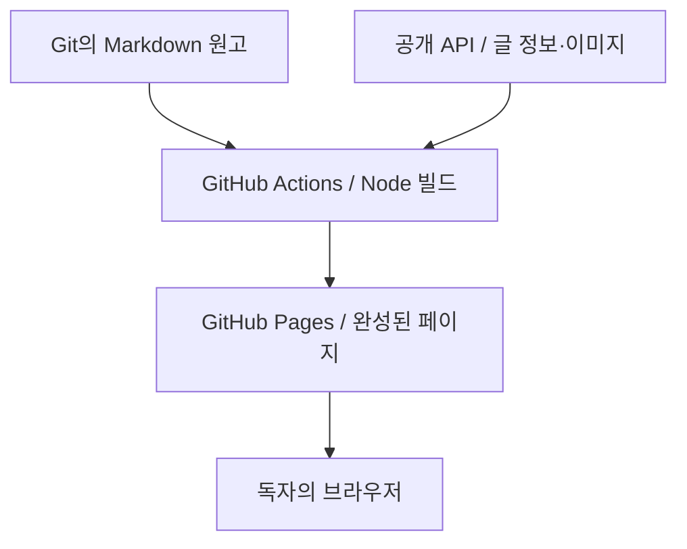

개발 과정과 공부한 내용을 글로 남기고, 프로젝트별로 다시 찾아 읽기 위해 만든 개인 블로그입니다. 에이전트와 함께 Git 저장소의 Markdown 원고를 수정하고, 웹에서는 글의 분류·소속·발행 상태를 관리합니다. 기획부터 프런트엔드·백엔드 개발과 배포까지 혼자 진행했습니다.

처음에는 웹 블록 편집기와 블로그 전용 MCP를 만들었습니다. 이후 작성 방식을 로컬 파일 편집으로 정리하면서, 원고는 Git에 두고 공개 화면은 정적 파일로 배포하는 구조로 바꿨습니다. 이 글은 **2026년 10월 3일 기준**으로 바뀐 요구사항과 현재 사용 흐름을 설명합니다.

## 어떤 블로그가 필요했나

기술 개념과 문제 해결 기록, 프로젝트의 설계·구현 과정, 과목과 논문을 공부한 내용을 한곳에 모으고 싶었습니다. 긴 글에서 필요한 절을 찾고, 관련 개념으로 이동하거나 같은 주제의 다음 글을 이어 읽을 수 있어야 했습니다. 코드·표·수식·구조도를 한 문서에서 다루는 것도 필요했습니다.

작성 도구는 파일을 직접 다룰 수 있는 에이전트와 로컬 편집기로 충분했습니다. 원고를 수정할 때마다 웹 편집기와 서버의 본문 저장 기능까지 함께 유지하기보다, Git에서 내용을 검토하고 변경 이력을 남기는 쪽으로 요구사항을 정리했습니다.

| 필요한 일 | 현재 방식 |
| --- | --- |
| 에이전트와 같은 원고 수정하기 | `content/posts/{slug}.md`를 직접 편집하고 Git diff로 검토 |
| 기술·학습 기록을 주제별로 찾기 | Posts의 대분류·소분류와 검색 |
| 프로젝트 소개와 구현 과정을 함께 읽기 | Projects의 프로젝트별 문서 목록과 순서 |
| 긴 글과 연속된 글 읽기 | 목차, 위키 링크·역링크, 주석, 이전·다음 글 이동 |
| 공개 화면을 가볍게 제공하기 | 빌드가 끝난 HTML·CSS·JavaScript·이미지를 GitHub Pages에서 제공 |
| 글의 정보와 공개 여부 관리하기 | 관리자 화면과 Spring API에서 메타데이터·발행 상태 관리 |

## 기록을 찾아 읽는 흐름

진입 화면과 메뉴는 **Posts와 Projects**로 정리했습니다. Posts에서는 일반 글을 대분류·소분류로 찾거나 제목·본문·태그를 검색합니다. 예전에 따로 두었던 Notes의 학습 기록도 같은 글 모델과 분류·시리즈 안에서 다룹니다.

Projects에서는 프로젝트의 개요·진행 상태·기간·기술 스택을 먼저 보고, 프로젝트에 속한 글을 순서대로 읽습니다. 첫 공개 문서를 프로젝트 대문으로 사용하므로 소개 글과 설계·구현 글이 같은 목록에 놓입니다.

| 구분 | 글을 묶고 읽는 방식 |
| --- | --- |
| 분류 | 대분류와 소분류 두 단계로 주제를 정리 |
| 일반 시리즈 | 같은 주제의 여러 글에 읽는 순서를 지정 |
| 프로젝트 | 프로젝트 정보와 순서 있는 문서 목록을 함께 관리 |

명시적으로 시리즈를 지정하지 않은 글도 소분류에 속하면 그 안의 공개 글을 이어 읽을 수 있습니다. 본문 옆에는 목차와 문서 목록을 두고, 본문 아래에는 이전·다음 글을 표시했습니다. 프로젝트의 이름과 각 문서의 제목도 구분해 현재 읽는 글을 알 수 있게 했습니다.

## 에이전트와 원고를 작성하고 발행하기

원고 작성과 글 정보 관리는 다음 순서로 진행합니다.

1. 로그인한 관리자가 글 정보를 미발행 상태로 등록합니다. 제목·분류·시리즈나 프로젝트를 정하고, 서버에서 발급한 주소를 확인합니다.
2. 그 주소에 대응하는 `content/posts/{slug}.md`를 작성자나 에이전트가 편집합니다. 기존 글을 고칠 때는 같은 파일을 수정합니다.
3. 원고와 참조를 검토합니다. 이미지를 썼다면 파일·첨부 정보와 글의 첨부 연결을 준비하고, 위키 제목과 필요한 선언도 맞춥니다.
4. 공개할 원고를 `main`에 반영한 뒤 관리자 화면에서 발행 상태를 설정합니다. 미공개 원고는 공개 저장소에 올리지 않습니다.
5. GitHub Actions의 Pages 워크플로를 실행해 공개 화면을 갱신합니다. DB의 발행 상태만 바꿨다면 수동 실행이 필요합니다.

이미 발행된 글의 본문만 수정하는 경우에는 원고 변경을 `main`에 반영하면 Pages 워크플로가 실행됩니다. 관리자 화면의 배포 링크는 GitHub Actions로 이동하는 링크이며, 글 정보 저장이나 발행 버튼 자체가 사이트를 배포하지는 않습니다.

웹의 ‘글쓰기’는 제목과 소속 같은 **글 정보를 등록하는 화면**입니다. 본문 편집기, 서버에 저장하는 별도 편집본, 블로그 전용 MCP는 현재 사용하지 않습니다. 에이전트도 작성자와 같은 Git 파일을 수정하므로 원고 변경을 커밋 단위로 확인할 수 있습니다.

## 전체 구성

**Git에는 원고, MySQL에는 글 정보와 연결 관계, 서버의 영속 디스크에는 이미지 원본을 둡니다.** Node 빌드가 이 자료를 모아 공개 페이지를 만듭니다.

화면은 TypeScript와 Nunjucks 템플릿으로 만들고, GitHub Pages에서 제공합니다. Node는 빌드할 때 실행하며 운영 VM에 프런트엔드 서버를 따로 띄우지 않습니다. 독자가 읽는 본문과 이미지는 Pages에 배포된 파일입니다. 로그인 상태 확인이나 관리 기능을 사용할 때는 브라우저가 OCI의 API에 요청합니다.

OCI VM에서는 Caddy가 HTTPS를 처리하고, Kotlin·Spring Boot API가 Java 25 JVM에서 실행됩니다. API는 외부 MySQL에 메타데이터와 로그인 세션을 저장하고, 읽기 전용으로 마운트한 영속 이미지 디스크에서 파일을 제공합니다. 현재 API는 Markdown 원고를 읽거나 저장하지 않습니다.

구체적인 배치와 JPA·jOOQ의 역할, 빌드·배포 경계는 [[아키텍처]]에 정리했습니다.

## Markdown으로 남긴 읽기 기능

작성 화면을 단순화하면서도 읽는 데 필요한 표현은 유지했습니다. 표와 접기, 코드 강조, 수식, Mermaid 도식, 이미지, 위키 링크와 주석을 같은 원고에서 사용할 수 있습니다.

위키 링크는 관련 글로 이동하는 데 쓰고, 역링크는 이 글을 참조하는 다른 공개 글을 찾는 데 씁니다. 주석에는 본문 흐름을 끊기 쉬운 용어나 보충 설명을 둡니다. 이 링크와 목차, 수식·코드의 HTML은 정적 빌드에서 준비합니다. Mermaid는 브라우저에서 렌더링하며 테마가 바뀌면 다시 그립니다. 이미지와 도식은 확대 창에서 배율을 조절하거나 화면에 맞춰 볼 수 있습니다.

표현 기능을 유지하는 기준은 ‘웹에서 모든 문법을 편집할 수 있는가’에서 ‘파일로 작성한 원고를 읽기 좋게 보여줄 수 있는가’로 바뀌었습니다.

## 운영하면서 받아들인 제약

정적 페이지를 사용하면 글을 읽을 때마다 API가 본문을 조회하거나 HTML을 만들 필요가 없습니다. 이미 배포된 공개 글은 API가 일시적으로 중단돼도 Pages에서 계속 읽을 수 있습니다. 다만 로그인과 관리 작업, API 자료가 필요한 새 사이트 빌드는 영향을 받습니다.

원고와 DB 메타데이터를 나눈 만큼 **발행 상태 변경과 독자에게 보이는 화면 변경은 별도 단계**입니다. 공개를 취소한 글도 Pages를 다시 배포하기 전까지 기존 정적 페이지에 남을 수 있습니다. 빌더는 공개 대상 원고가 없거나 생성 중 공개 데이터가 바뀌면 배포할 결과를 확정하지 않습니다.

이미지도 현재는 운영자가 파일과 DB 정보를 직접 관리합니다. API에 업로드·삭제 기능을 두지 않았으므로 파일 준비, 글의 첨부 연결, 백업을 함께 확인해야 합니다. 이미지는 API 컨테이너 바깥의 영속 디스크에 있지만 같은 VM에 있으므로, VM 장애에 대비한 별도 백업이 필요합니다.

글 변경은 Pages 빌드로, 백엔드 변경은 API 검사와 이미지 빌드로 나누었습니다. API 이미지는 Cloud Native Buildpacks로 만들고 검증한 뒤 별도 운영 절차로 반영합니다. 원고 수정 때문에 Spring 애플리케이션까지 다시 빌드할 필요는 없습니다.

## 설계를 바꾸며 정리한 것

초기에는 블록 편집, 편집본과 발행본의 분리, MCP 작성 도구를 함께 구현했습니다. 이후 실제 작성 흐름에 맞춰 본문은 Git으로 옮기고, API에는 메타데이터·공개 범위·인증·이미지 읽기를 남겼습니다. Tech·Projects·Notes로 나뉘었던 문서 구조도 공통 Post와 Series로 통합했습니다.

화면 생성은 Next.js와 이후의 Thymeleaf 구성을 거쳐 Node·TypeScript·Nunjucks로 정리했습니다. Redis 캐시, 런타임 Object Storage 연결, 통계·잔디 기능은 현재 구성에서 제거했습니다. API 런타임은 Native Image도 검증했지만, 최종적으로 일반 JVM을 선택했습니다.

이 과정에서 원고·첨부·계정·기존 주소를 보존하며 구조를 바꾸는 일이 중요했습니다. 제거한 기능과 과거 실험의 기록은 Git과 ADR에 남기고, 현재 글에서는 지금 사용하는 구성과 작업 흐름을 기준으로 설명합니다.

| 문서 | 내용 |
| --- | --- |
| [[아키텍처]] | 서비스 배치, 데이터 모델, 원고·이미지 관리, JPA·jOOQ, 정적 빌드와 배포 |
| [설계 결정 기록](https://github.com/gjaku1031/ken-blog/tree/main/docs/ADR) | 애플리케이션·영속성·인프라의 결정 이유와 검증 이력 |
| [소스 코드](https://github.com/gjaku1031/ken-blog) | 현재 구현과 변경 이력 |
