| 항목 | 내용 |
| --- | --- |
| 소개 | 프로젝트 경험과 학습 문서를 한곳에서 관리하는 개인 블로그 |
| 목적 | 흩어진 개발 기록을 모아 다시 찾고 재사용 |
| 개발 형태 | 개인 프로젝트(1인) |
| 담당 범위 | 본인·Claude·Codex 역할 분담. 아래 목록 참조 |
| 주요 기능 | 프로젝트별 문서 탐색, 글 검색·분류, Markdown 렌더링, 발행 관리 |
| 링크 | [ GitHub](https://github.com/gjaku1031/ken-blog) |

- **본인**: 문제 정의, 설계 대안 비교와 결정, 검증 기준 수립과 결과 판정, 운영 배포. 코드는 에이전트가 쓰고 본인은 결과를 검토해 채택 여부를 판정함
  - 직접 정한 설계: 웹 편집기 대신 Git 원고, Next.js 화면 대신 빌드 시 정적 페이지, Redis 캐시 미도입, Posts·Projects·시리즈 콘텐츠 구조, OCI VM·관리형 MySQL 인프라 구성, Native Image 대신 일반 JVM, 분류 두 단계, 관리자 계정 DB 직접 등록
  - 직접 정한 범위·운영: 업로드 기능 제거, DB 변경 자동 배포 대신 배포 버튼, 정적 생성의 효과 실측 요구, 설계·구현·배포를 에이전트별로 나눈 작업 체계
- **Claude**: 설계안 초안·대안 조사, 작업 계획, 화면 디자인
- **Codex**: 기능 구현·테스트, 문서 초안 작성·교정

프로젝트별로 소개 문서와 설계 문서(아키텍처·ERD·API 등)를 정한 순서로 보여 줌. 기술·학습 글은 분류·검색·위키 링크·역링크로 서로 이어짐. 원고는 Git 저장소의 Markdown 파일이라 사람과 에이전트가 같은 방식으로 쓰고 고치며, 공개 화면은 빌드 시 정적 페이지로 생성됨.

## 개발 배경과 핵심 문제

포트폴리오를 정리하면서 프로젝트 경험과 학습 기록이 GitHub·개인 노트 등 여러 곳에 흩어져 있어, 정리할 때마다 자료를 다시 모아야 했음. 기록을 한곳에 모아 다시 찾고, 에이전트와 함께 쓰고 고칠 수 있는 블로그를 직접 만듦.

다음 제약 안에서 설계함.

- **서버 자원**: OCI 일본 리전의 ARM 2코어·8GB 단일 VM이며 API 컨테이너는 1 CPU·1.5GiB로 제한함. 주요 독자는 한국에 있으며 독자 기준 왕복 지연은 약 38ms[* 한국의 맥에서 측정 VM까지 ping 30회 평균 38.6ms].
- **운영 인력**: 설계·구현·운영을 1인이 담당.
- **작성 방식**: 사람과 에이전트가 같은 원고를 수정.

이 제약에서 다음 세 문제를 핵심 문제로 정의함.

- **P1 변경 추적성**: 사람과 에이전트가 함께 고치는 원고의 변경 내용을 검토하고 이력을 추적할 수 있어야 함.
- **P2 열람 성능**: 해외 리전의 소형 서버에서도 글을 열 때 본문이 빠르게 보이고, 독자 요청이 서버 부하로 이어지지 않아야 함.
- **P3 발행 일관성**: Git의 원고, DB의 글 정보, 디스크의 이미지를 결합한 공개 결과가 서로 다른 시점의 자료로 섞이지 않아야 함.

## 주요 기능

| 기능 | 사용자가 할 수 있는 일 |
| --- | --- |
| 프로젝트 문서 탐색 | 프로젝트별 대문에서 아키텍처·ERD·API 등 설계 문서를 정해진 순서로 읽고, 이전·다음 문서와 관련 문제 해결·실험 글로 이동 |
| 기술·학습 기록 탐색 | 두 단계 분류·태그·검색으로 글을 찾고, 위키 링크와 역링크로 관련 글을 오가며 읽기 |
| 설계 도식 | Mermaid로 쓴 아키텍처·ERD를 기술 아이콘과 고정 배치로 렌더링하고, 확대 보기에서 드래그·휠·핀치로 세부 확인 |
| 기술 문서 표현 | 코드 하이라이트·표·수식·주석, 라이트·다크 테마별 이미지 |
| 원고 작성과 발행 | 사람과 에이전트가 Git의 Markdown 원고를 수정하고, 관리자 화면에서 제목·분류·소속·문서 순서·발행 상태 관리 |

## 전체 아키텍처

### 인프라·시스템 통합 구성도

```mermaid caption="API 응답은 요청의 반대 경로로 전달"
architecture-beta
  %% layout: ken-blog-infrastructure
  group people[Users]
  group github[GitHub]
  group site[Pages workflow] in github
  group ci[API workflow] in github
  group deploy[Automatic deploy]
  group oci[OCI ARM VM]
  group compose(ken:docker)[Docker Compose] in oci
  group data[OCI managed DB]

  service writer(ken:user)[Author and agent] in people
  service repo(ken:git)[Git repository] in github
  service sitebuild(ken:github-actions)[Site build] in site
  service pages(ken:github)[GitHub Pages] in site
  service apibuild(ken:github-actions)[API CI] in ci
  service archive(ken:docker)[JVM image] in ci
  service release(ken:github-actions)[Deploy job] in deploy
  service reader(ken:user)[Reader] in people
  service admin(ken:user)[Admin] in people
  service caddy(ken:caddy)[Caddy] in compose
  service api(ken:spring)[Java Spring Boot API] in compose
  service disk(ken:disk)[Image disk] in oci
  service db(ken:mysql)[MySQL] in data

  writer:R -[Push]-> L:repo
  repo:R -[Web changes]-> L:sitebuild
  repo:B -[API changes]-> L:apibuild
  sitebuild:R -[Publish]-> L:pages
  sitebuild:B -[Public API]-> T:caddy
  apibuild:R -[Archive]-> L:archive
  archive:B -[Verified image]-> R:release
  release:B -[Release script]-> T:api
  reader:R -[Read]-> R:pages
  admin:T -[Manage UI]-> B:pages
  admin:R -[Admin API]-> L:caddy
  caddy:R -[HTTP]-> L:api
  api:R -[JDBC]-> L:db
  api:B -[Read only]-> T:disk
```

배포 경계는 GitHub(원고 저장·사이트 빌드·Pages 호스팅), OCI ARM VM(Caddy·API·이미지 디스크), 관리형 MySQL의 세 영역. 공개 화면은 GitHub Pages가 제공하고, API는 인증·메타데이터 관리와 빌드용 공개 데이터 제공을 담당함. 원고는 Git, 글 정보·관계·세션은 MySQL, 이미지 원본은 VM의 영속 디스크에 두고, 빌드 단계의 Node 빌더가 이 자료를 결합해 공개 페이지를 생성함.

### 설계 결정 요약

| 결정 | 해결한 문제 | 받아들인 비용 |
| --- | --- | --- |
| Git Markdown을 본문 정본으로 사용 | P1 | 원고(Git)와 글 정보(DB)를 서로 다른 저장소에서 관리 |
| 공개 페이지를 빌드 시 정적 생성해 GitHub Pages로 제공 | P2 | 글·공개 상태 변경이 재배포 후 반영 |
| 공개 데이터 revision 재검증과 검증된 산출물만 교체 | P3 | 빌드 중 관리자 변경이 있으면 빌드 재실행 |
| 쓰기는 JPA, 목록·집계 조회는 jOOQ로 분리([QueryDSL과 비교](/ken-blog/post/post-e0973871-5ba5-473d-ae69-735e6914a2a7/)) | 조건이 많은 조회 쿼리의 작성·유지 | 두 영속 기술과 코드 생성 단계 유지 |

### 주요 흐름

독자의 열람은 GitHub Pages의 정적 파일에서 끝나고 API를 거치지 않음. 관리 요청만 Caddy를 거쳐 API와 MySQL로 가고, 사이트는 빌드 때 Git 원고와 API의 공개 데이터를 모아 생성됨. API는 CI가 검사한 이미지가 자동으로 배포됨. 흐름별 경로와 실패 시 동작은 [아키텍처](/ken-blog/post/doc-340352c9-5fde-4bae-bc0b-4ecd744719a8/)에서 다룸.

## 핵심 문제별 설계와 검증

검토한 대안 표와 검증 상세는 [주요 기술적 의사결정](/ken-blog/post/doc-267e2237-7f38-4ea1-b04b-7c51d456c2b4/)에 있음.

### P1. Git Markdown을 원고의 정본으로

- **문제**: 웹 블록 편집기와 DB 저장 구조에서는 원고 변경을 diff로 검토하거나 이력을 추적하기 어려웠음
- **결정**: Git 저장소의 Markdown을 본문 정본으로 삼아, 사람과 에이전트가 같은 파일을 diff·검토·되돌리기로 다룸
- **대가**: 본문(Git)과 글 정보(DB)가 서로 다른 저장소로 나뉘어, 둘을 일관되게 발행하는 문제(P3)로 이어짐
- **검증**: 아키텍처 문서 한 편을 20번 개정하는 동안 매번 diff로 검토하고 되돌릴 수 있었음. API에는 본문을 저장하는 경로가 없어 이를 우회할 수 없음

### P2. 빌드 시 정적 생성으로 열람 경로에서 API 제거

- **문제**: 옛 구조는 문서 하나를 열 때 순차 API 요청이 6~9회 발생해, 단계마다 왕복 지연(약 38ms)과 1코어 서버의 처리 시간이 쌓임
- **결정**: 빌드 시 정적 생성을 채택해 본문 표시에 필요한 요청이 API 서버에 가지 않게 함[* 관리자 메뉴 표시용 로그인 확인 1건은 API로 가며, 실패해도 열람에는 영향 없음]
- **대가**: 글과 공개 상태의 변경은 Pages 재배포 후 반영됨
- **검증**: 같은 데이터를 넣은 세 구조를 로컬에 재구성해 20개 조건 조합에서 각 15회 측정함[* 맥에서 잰 실제 왕복 지연(38.6ms)을 브라우저 요청 단위로 주입하고, 세 구조 모두 GitHub Pages와 같은 캐시 정책으로 제공]

| 측정 항목(중앙값) | 순수 CSR | 하이브리드 | 정적 생성 |
| --- | ---: | ---: | ---: |
| ERD 문서 첫 방문, 본문 표시 | 747ms | 625ms | 463ms |
| 같은 조건, 모바일 네트워크 | 3,536ms | 1,582ms | 869ms |
| ERD 문서 한 번 열 때 본문 표시까지의 API 요청 | 6회 | 9회 | 0회 |

측정 방법과 전체 결과는 [정적 생성 전환 전후의 글 열람 지연 측정](/ken-blog/post/post-c342d140-8026-4137-8761-b5c3eecddc2c/) 참조.

### P3. revision 재검증으로 서로 다른 시점의 자료 혼합 방지

- **문제**: 빌드가 Git 원고·DB 글 정보·디스크 이미지를 수집하는 동안 관리자가 글 정보를 바꾸면, 서로 다른 시점의 자료가 섞이거나 일부만 깨진 사이트가 배포될 수 있음
- **결정**: 수집 시작 때와 페이지 생성 후의 revision이 다르면 결과를 버리는 낙관적 검증을 채택함
- **대가**: 빌드 중 관리자 변경이 있으면 빌드를 다시 실행해야 하고, 마지막 확인부터 배포 완료까지는 원자적으로 묶이지 않음
- **검증**: 원고 누락, 수집 중 revision 변경, 첨부 접근 거부, 잘못된 이미지 응답에서 기존 산출물이 유지됨을 회귀 검사로 확인함
