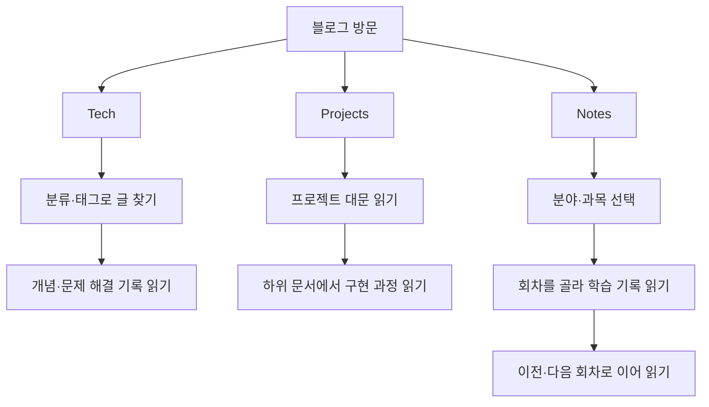
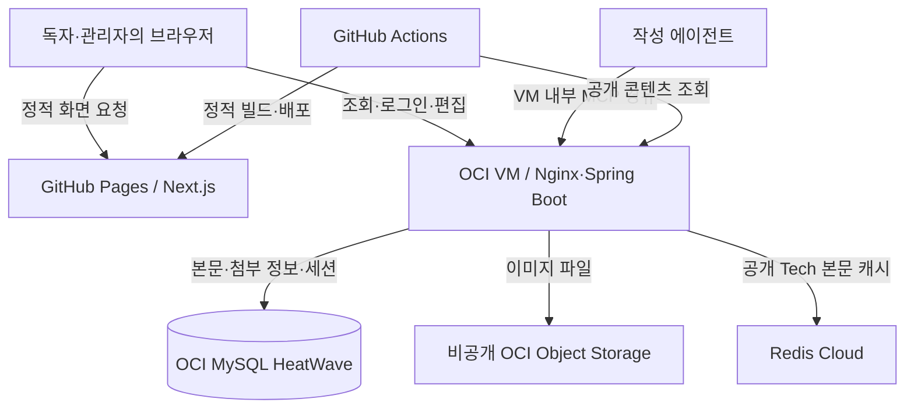
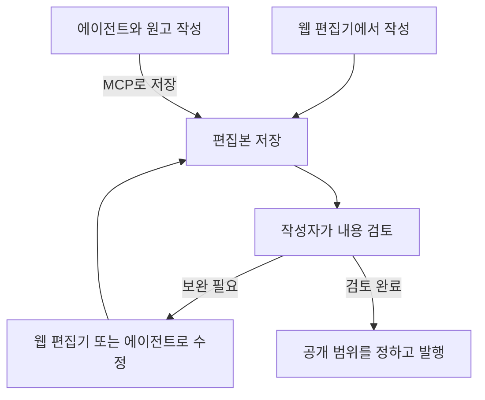

웹 편집기와 에이전트에서 같은 Markdown 원고를 작성하고 수정할 수 있도록 만든 개인 블로그입니다. 개발 과정은 Tech와 Projects에, 공부한 과목과 읽은 논문은 Notes에 정리하기 위해 만들었습니다. 기획부터 프런트엔드·백엔드·편집기 개발과 배포까지 혼자 진행했습니다.

> **이미지 자리 01 — 블로그 홈 화면**
>
> 프로필, 글쓰기 잔디, 최근 글 목록이 함께 보이는 화면.
>
> 캡션: 개발 기록과 프로젝트, 학습 노트를 모아둔 ken.blog.

## 어떤 블로그가 필요했나

노션의 블록 편집과 위키의 문서 연결·주석 기능을 한곳에서 쓰고 싶었습니다. 문단을 옮기거나 긴 설명을 접어두고, 관련 개념은 다른 글로 연결하는 식입니다. 과목과 논문을 공부한 내용을 적으려면 코드뿐 아니라 수식과 구조도도 함께 다룰 수 있어야 했습니다.

웹에서 쓴 글을 에이전트가 수정하고, 에이전트와 정리한 초안을 다시 웹에서 이어 쓰는 것도 필요했습니다. 그래서 작성 화면은 달라도 저장하는 원고의 형식과 발행 절차는 같게 만들었습니다.

## 기록을 찾아 읽는 흐름

Tech는 기술 개념과 문제 해결 기록을 찾는 곳입니다. Projects에서는 대문으로 프로젝트를 소개하고 하위 문서에 구현 과정을 남깁니다. Notes는 공부한 과목과 논문을 같은 주제 아래 묶어 다시 읽기 위해 따로 마련했습니다.

Notes는 과목 아래에 회차를 두는 구조입니다. 날짜순으로 흩어진 글을 찾기보다 공부한 순서대로 이어 읽을 수 있게 했습니다. 논문 정리에도 이 구조를 활용하려고 하며, 과목·회차 기능은 구현해 두고 실제 학습 기록은 채워갈 예정입니다.

## 전체 구성

화면은 GitHub Pages에서 제공하고, 로그인과 글 저장은 OCI의 API가 처리합니다. 웹과 MCP는 같은 Spring 애플리케이션의 콘텐츠 서비스를 사용합니다.

API 요청은 Pages 서버가 아니라 브라우저에서 보냅니다. MySQL과 Object Storage는 VM 밖의 별도 서비스이며, Redis Cloud는 OCI 외부에 있습니다. 실행 환경과 문서 처리 구조는 [[아키텍처]]에 정리했습니다.

## 위키와 노션에서 가져온 편집 기능

문단 선택과 이동, 표와 접기를 기본으로 만들고 위키 링크와 주석을 추가했습니다. 코드 블록, 이미지, 수식, Mermaid 도식도 같은 문서에서 작성할 수 있습니다. 주석은 이 글처럼 낯선 용어를 설명하거나 참고 자료를 연결하는 데 사용합니다.

편집기에서 특히 신경 쓴 것은 기존 원고를 보존하는 일이었습니다. 화면에서는 블록을 조작하지만, 저장 기준은 Markdown 원문으로 두었습니다. 복잡하거나 지원하지 않는 문법까지 무리하게 블록으로 변환하지 않고 원문으로 남겨, 글을 다시 열었다는 이유만으로 내용이 바뀌지 않도록 했습니다.

모든 문법을 편집할 수 있게 만드는 대신, 편집할 수 있는 부분과 그대로 보존할 부분을 나눈 선택입니다. 이 저장 규칙은 에이전트용 작성 스킬에도 담았습니다.

> **이미지 자리 04 — 편집 화면과 읽기 화면**
>
> 표·접기·코드·위키 링크·주석을 담은 같은 문서의 두 화면. 블록을 선택한 모습도 함께 표시.
>
> 캡션: 블록으로 편집한 문서를 Markdown으로 저장하고 읽는 모습.

## 에이전트에서 초안을 저장하고 검토하기

에이전트와 정리한 글을 다시 복사해 옮기지 않도록, 기존 글 조회와 이미지 업로드, 편집본 저장·수정·발행을 MCP 도구로 연결했습니다. 작성 스킬에는 프로젝트 문서와 Notes 회차의 소속, Markdown 문법, 첨부와 위키 링크를 연결하는 방법을 적었습니다. 매번 같은 규칙을 설명하는 대신 글을 쓰기 전에 읽도록 했습니다.

아래는 제가 원고를 작성하고 공개하는 순서입니다. 웹에서 직접 쓰든 에이전트와 함께 쓰든 편집본으로 저장한 뒤 내용을 확인하고 발행합니다.

중요한 것은 도구에서 별도로 DB를 수정하지 않는다는 점입니다. 웹과 같은 저장 서비스를 사용하고, 수정 시각과 편집본 버전을 확인해 오래된 내용으로 덮어쓰는 것을 막습니다. 직접 검토하는 것은 제 작업 절차이고, 서버는 저장과 발행의 분리 및 수정 충돌 검사를 담당합니다.

> **이미지 자리 02 — MCP로 편집본을 저장하는 화면**
>
> 작성 스킬을 읽고 기존 글을 조회한 뒤 편집본을 저장하는 과정. 인증정보와 개인 대화는 제외.
>
> 캡션: 에이전트와 정리한 원고를 블로그 편집본으로 저장하는 과정.

## 무료 자원을 활용하면서 고려한 것

개인 블로그의 운영비를 줄이기 위해 GitHub Pages와 Oracle Cloud Infrastructure(OCI)의 무료 자원을 활용하는 방향으로 구성했습니다. Next.js의 정적 산출물은 GitHub Pages에 배포하고,[*Pages GitHub Pages는 HTML·CSS·JavaScript 같은 정적 파일을 웹사이트로 제공하는 서비스입니다. 이 블로그의 로그인과 글 저장은 별도의 Spring Boot API에 요청합니다. [GitHub Pages 소개](https://docs.github.com/en/pages/getting-started-with-github-pages/what-is-github-pages)] 글과 로그인 세션은 MySQL HeatWave에 저장합니다.[*MySQL Oracle이 제공하는 관리형 MySQL 서비스입니다. 이 블로그에서는 글과 첨부 정보, 세션을 저장하는 데이터베이스로 사용합니다. [MySQL HeatWave 공식 문서](https://docs.oracle.com/en-us/iaas/mysql-database/home.htm)] 이미지 파일은 비공개 OCI Object Storage에 따로 보관합니다.[*ObjectStorage 이미지·동영상 같은 파일을 객체 단위로 저장하는 Oracle의 클라우드 저장소입니다. 파일을 담는 공간을 버킷이라고 부르며, 특정 VM의 로컬 디스크와는 별개입니다. 이 블로그에서는 이미지 파일은 이곳에, 파일 정보와 글의 연결 관계는 MySQL에 저장합니다. [Object Storage 개요](https://docs.oracle.com/en-us/iaas/Content/Object/Concepts/objectstorageoverview.htm)] Redis는 공개 Tech 본문 조회에 한정한 선택적 캐시로 사용합니다.

저장소를 나누니 파일만 저장되고 DB 기록은 실패하는 상황도 고려해야 했습니다. 그래서 업로드 중인 파일과 사용 가능한 파일, 삭제 중인 파일을 구분했습니다. 결과가 불확실한 작업은 추적할 상태를 남기고, 저장된 파일과 글의 첨부 연결은 구분해 관리합니다.

화면을 정적으로 배포하는 데 따른 제약도 있습니다. 글의 원본을 발행한 시점과 Pages에 반영되는 시점은 다를 수 있습니다. GitHub Actions에서 공개 콘텐츠를 수집해 빌드하고, 빌드 중 원본이 바뀌지 않았는지 다시 확인하도록 했습니다.

> **이미지 자리 03 — OCI 자원 구성**
>
> VM, MySQL, Object Storage 구성을 보여주는 화면. 계정 식별자와 접속정보는 가림.
>
> 캡션: API 서버, 데이터베이스, 이미지 저장소를 나눈 구성.

## 구현 기록

문서별로 설계와 구현 과정을 정리하고 있습니다.

| 상태 | 문서 | 내용 |
| --- | --- | --- |
| 작성 | [[아키텍처]] | 인프라 배치, 공통 문서 처리 구조, 저장·발행과 정적 배포 |
| 예정 | 로컬 MCP로 블로그 글쓰기 | 연결 설정, 작성 스킬, 편집본과 수정 충돌 |
| 예정 | 위키와 노션에서 가져온 나만의 Markdown 편집기 | 블록 편집, 문서 연결과 주석, 원문 보존 |
| 예정 | 이미지 한 장을 안전하게 저장·공개하기 | 첨부 상태와 부분 실패·복구 처리 |
| 예정 | 동적 콘텐츠를 GitHub Pages로 발행하기 | 공개 글 수집, 변경 확인과 정적 배포 |
