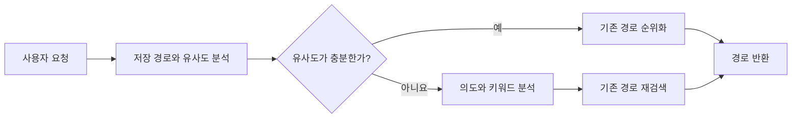

## 프로젝트 개요

**4인 팀 · 팀 리더 · 2025 오픈소스 개발자대회 본선 진출**

| 영역 | 맡은 일 |
| --- | --- |
| 백엔드 | Java·Spring Boot 회원·인증 처리, 데스크톱 앱과 검색 서버 연동 |
| AI 검색 | Colab 프로토타입, 초기 Neo4j 경로 조회와 LangGraph 처리 흐름 설계 |
| 인프라 | Proxmox 배포 환경과 AWS 확장 구성 |

## 개발 배경

손을 사용하기 어려운 가족의 컴퓨터 사용을 돕기 위해, 자주 쓰는 Bash 명령을 음성으로 실행하는 도구를 먼저 만들었습니다. 실제 사용에는 도움이 되었지만, 새로운 작업이 필요할 때마다 제가 스크립트를 추가해야 했습니다.

이 문제를 팀원들과 이야기하며 웹 작업으로 범위를 넓혔습니다. Vowser도 처음에는 개발자가 준비한 작업만 실행할 수 있었습니다. 이후 사용자가 직접 수행한 페이지 이동과 클릭을 기록·공유하는 기능을 추가했습니다. **작업 순서와 대상 요소를 하나의 경로로 저장**하고, 다른 사람도 그 경로를 가져와 실행할 수 있도록 했습니다.

## 사용 흐름과 시연

**작업 기록·공유 → 음성 검색 또는 앱에서 선택 → 사용자 PC의 브라우저에서 실행**

반복적인 마우스·키보드 조작이 어려운 사용자는 원하는 작업을 음성으로 찾거나 앱에서 선택할 수 있습니다. 예를 들어 “오늘 날씨 어때?”라고 요청하면 날씨를 조회하는 작업을 찾고, 저장된 순서대로 브라우저의 이동·클릭·입력을 수행합니다. **등록된 경로를 찾아 실행하는 방식이며, AI가 새로운 웹 작업 절차를 만드는 것은 아닙니다.**

현재 실행 단계는 앱의 그래프 보기에서 확인할 수 있습니다.[* 이 그래프는 브라우저 작업의 진행 상황을 보여주는 화면입니다. 작업 경로를 저장하는 Neo4j 그래프나 검색 처리 순서를 구성하는 LangGraph와는 별개입니다.]

로그인·인증처럼 직접 입력이 필요한 단계에서는 자동 진행을 멈추고 사용자 입력을 기다립니다. 브라우저에서는 클릭할 요소를 강조해 조작 대상을 보여줍니다.

## 시스템 구성과 주요 설계

### 요청부터 브라우저 실행까지

**서버는 작업 경로를 검색하고, 사용자 PC는 브라우저를 실행합니다.**

Kotlin·Compose 데스크톱 앱의 음성 요청은 Spring Boot 백엔드로 전달됩니다. 음성을 텍스트로 변환한 뒤, FastAPI가 인식문을 바탕으로 Neo4j에 저장된 작업 경로를 검색합니다. 앱이 경로를 받으면 사용자 PC의 Playwright 실행기가 브라우저를 조작합니다.

저는 회원·인증과 앱·검색 서버 연동을 포함한 Spring Boot 백엔드 전반을 맡았습니다. 로그인 이후에도 인증 상태가 이어지도록 OAuth2 코드 교환 응답의 쿠키 처리를 수정했습니다.[* 코드 교환 응답에 액세스 토큰과 리프레시 토큰의 JWT 쿠키 설정을 추가했습니다. [변경 코드](https://github.com/Vovvser/vowser-backend/commit/2ecf4912e79546e09c00d0cca513d41f950a33a7)에서 수정 내용을 확인할 수 있습니다.]

### AI 작업 검색

같은 작업도 사람마다 다르게 요청하므로, 요청과 저장된 작업 의도를 임베딩으로 표현해 유사한 경로를 찾았습니다. 저는 Colab에서 초기 프로토타입을 만들고 LangGraph 처리 흐름을 설계했습니다.

초기 경로 조회를 구현한 환경에서는 Neo4j GDS 함수를 사용할 수 없었습니다. 경로 모델은 Neo4j에 유지, 코사인 유사도 계산을 Python으로 옮겼습니다.

초기 서버 통합 버전에서는 요청과 저장된 경로의 유사도를 먼저 비교했습니다. 유사도가 충분하면 기존 경로를 순위화하고, 부족하면 LLM으로 의도와 키워드를 분석해 등록된 경로를 다시 검색했습니다.

*초기 서버 통합 버전의 검색 흐름.*

### 서버 배치와 확장

AWS에서 서버를 상시 실행하는 비용을 고려해, 기본 서버는 제가 익숙하게 다루던 Proxmox에 배포했습니다. 평소에는 Docker Compose로 백엔드 서버[* SpringBoot, FastAPI]를 실행하고, 접속이 집중되는 상황에 대비해 두 서버를 AWS ECS·Fargate에서도 실행할 수 있도록 구성했습니다.

CPU·메모리 지표를 기준으로 AWS 서버를 기동하고, DNS 레코드를 바꿔 요청 경로를 전환하는 구성을 구현·실습했습니다.[* CloudWatch 지표를 EventBridge·Lambda와 연결해 ECS·Fargate 서비스를 기동하고 Route 53 레코드를 변경하도록 구성했습니다. Fargate는 평소 중지하는 방식입니다.] **확장 대상은 Spring Boot와 FastAPI입니다. 브라우저 조작은 계속 사용자 PC에서 실행됩니다.**

관계형 데이터는 RDS MySQL, 인증 토큰은 Redis Cloud, 작업 경로는 Neo4j Cloud에 저장했습니다. Proxmox에서 RDS에 접근할 때는 Site-to-Site VPN을 사용했습니다.

## 결과와 한계

팀은 작업 검색·실행·기록을 지원하는 데스크톱 앱을 구현했습니다. 개발 당시 실제 사이트 시연에서는 다음 단계까지 동작을 확인했습니다.

| 시연 작업 | 도달한 단계 |
| --- | --- |
| 날씨·뉴스 조회 | 날씨를 묻는 표현에서 네이버 날씨, 추상적인 시사 질문에서 뉴스 표시 |
| 열차 예매 | 결제 직전 단계까지 진행 |
| 주민등록등본 조회 | 사용자 인증 후 문서가 표시되는 단계까지 진행 |

결제나 공식 문서 발급을 완료한 결과는 아닙니다. 첨부한 앱·브라우저 화면은 **2026년 가상 데이터와 시연용 사이트로 재현한 화면**입니다. 당시 실제 사이트 시연과는 별개이며, AI 검색이나 실제 사이트 연동을 검증한 화면은 아닙니다.

검색 정확도와 접근성 효과, 클라우드 전환 시간과 비용 절감률의 측정 자료는 아직 없습니다. DNS 변경 중 기존 연결이 유지되는지도 별도로 검증하지 않았습니다.

## 상세 문서와 코드

상세 문서는 작성 예정입니다.

- **시스템과 실행:** 요청부터 브라우저 실행까지의 흐름, 작업 기록, 로그인·인증 단계의 처리.
- **AI 작업 검색:** 경로 모델과 검색 기준, Colab 프로토타입의 FastAPI 서비스 전환, 이후 검색 구조의 변경.
- **배포와 확장:** Proxmox·AWS 배치, 데이터 접근과 VPN, Fargate 기동·DNS 전환 절차.

[데스크톱 클라이언트](https://github.com/Vovvser/vowser-client) · [Spring Boot 백엔드](https://github.com/Vovvser/vowser-backend) · [FastAPI 검색 서버](https://github.com/Vovvser/vowser-agent-server)
