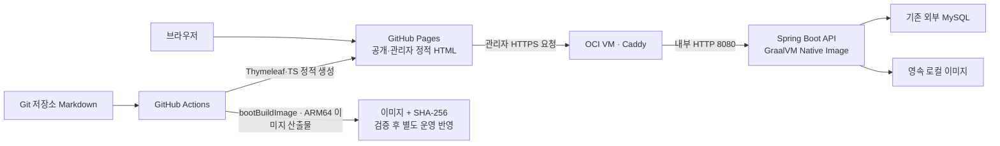

# 인프라 결정 기록

기준일: 2026-10-01. 인프라 변경 시 구현과 함께 갱신하는 결정 원본 문서.

**코드의 구성과 실제 운영 적용 상태를 구분하는 원칙.** 현재 운영 원고·OCI 첨부 이관 전이며, 아래 신규 구성의 실서버 전환·push·배포는 보류 상태.

## 서비스 배치

| 결정 | 이유·효과 | 실제 적용 상태 |
| --- | --- | --- |
| 공개·관리자 화면 모두 GitHub Pages | 정적 파일 배포 유지, 서버의 HTML 렌더링 제거 | 소스 및 격리 브라우저 검증 완료, 운영 반영 전 |
| Thymeleaf는 빌드 시 HTML 생성, TypeScript는 브라우저 동작 | Spring 중심 소스 구조와 정적 Pages의 역할 분리 | 기존 생성·로그인 검증 완료 |
| Caddy가 공개 HTTPS 종료·인증서 갱신 | 별도 Certbot·systemd·Spring 직접 TLS 관리 제거 | 소스 및 시험 인증서 검증 완료, 운영 발급·전환 전 |
| 공개 IPv4 + Let’s Encrypt ACME `shortlived` | 도메인 구매 없이 지원되는 브라우저의 공개 신뢰 사용 | 설정 검증 완료, 실제 공개 인증서 요청 전 |
| Caddy `default_sni`에 공인 IP 지정 | IP 접속의 SNI 부재와 OCI NAT 환경에서 올바른 인증서 선택 | IP URL의 TLS·주소 검증 완료 |
| MySQL/JDBC 세션, 비밀번호+MFA, CSRF 유지 | 기존 인증·데이터 계약 유지 | JVM·Native의 비밀번호+MFA·JDBC 세션 및 재시작 검증 완료 |
| 원고는 저장소 Markdown, 이미지는 영속 로컬 파일 | 본문 웹 편집·S3/Redis 의존 제거 | 소스 구현 완료, 기존 자료 이관 전 |
| Dockerfile 대신 CI의 `bootBuildImage` | 이미지 빌드 정의를 Gradle·Cloud Native Buildpacks로 통합 | 로컬 ARM64 이미지 빌드·CI 동일 검사 완료 |
| GraalVM Native Image·Linux ARM64 | OCI ARM 서버 호환과 실행 시 JVM 메모리 부담 감소 목적 | 격리 Native 기능 검증 및 메모리 감소 실측 완료 |

Caddy는 운영 Compose에서 `caddy run`으로 직접 실행하는 선택. 고정 IP의 단일 VM에서 중간 실행 스크립트의 필요성이 낮아 `deploy/start-caddy.sh`와 연결 마운트·entrypoint 제거. 공인 IP와 사설 NIC bind IP는 Compose 필수 입력이며, 실제 값의 적합성은 운영 준비 단계에서 확인하는 계약. 인증서 발급·갱신은 Caddy 자체 기능으로 유지.

## 이미지 빌드와 배포

선택: GitHub Actions CI의 기본 검사 성공 후 ARM64 작업에서 `./gradlew -PskipWeb=true bootBuildImage` 실행. Spring Boot의 GraalVM 플러그인과 `BP_NATIVE_IMAGE=true`로 Native Image 생성. JVM 이미지로 조용히 대체하는 fallback은 허용하지 않는 구성. [Spring Boot Native Image 안내](https://docs.spring.io/spring-boot/how-to/native-image/developing-your-first-application.html)

빌더 내부에서 컴파일하며 CI의 Java 설치는 Gradle·Spring AOT 실행용. Pages 생성기는 기존 JVM으로 실행하며 Node는 TS/CSS·Markdown·정적 사이트 빌드용. Node 실행 서버 추가 없음.

선택한 버전은 Spring Boot 4.1.1, GraalVM Build Tools 1.1.14, Java 25. 빌더 `paketobuildpacks/ubuntu-noble-builder:latest`와 실행 이미지 `paketobuildpacks/ubuntu-noble-run:latest` 사용. Native 컴파일은 Paketo가 공급하는 GraalVM 기반 Liberica Native Image Kit로 수행하며, `--no-fallback -J-Xmx6g -J-XX:-UseParallelGC -J-XX:+UseG1GC -march=compatibility`로 JVM fallback 금지·빌드 힙 상한·빌드 GC 선택·ARM CPU 호환성 확보. [Paketo 빌더 구성](https://paketo.io/docs/reference/builders-reference/)

이미지 처리에 `ImageIO`·`Graphics2D` 사용 중이므로 가장 작은 실행 이미지보다 필요한 시스템 라이브러리를 포함하는 빌더·실행 이미지 선택. 로그인·JDBC 세션 직렬화·JPA·MCP·PNG/JPEG 처리까지 실제 Native 실행으로 검증해야 하는 조건. [Spring Boot 이미지 설정](https://docs.spring.io/spring-boot/gradle-plugin/packaging-oci-image.html), [Paketo Native Image 구성](https://paketo.io/docs/howto/java/#build-an-app-as-a-graalvm-native-image-application)

CI는 전용 빈 DB에 일회성 더미 관리자 계정을 초기화한 뒤, 생성 이미지를 운영과 같은 UID 10001/GID 1001로 격리 MySQL에 연결하여 health·status·CSRF, MCP 초기화·도구 목록·문서·프롬프트, PNG/JPEG 업로드와 64px 배지 변환, 프로젝트 메타데이터 생성·Markdown 조회·미출간 원고를 제외한 공개 스냅샷을 확인한 뒤 산출물 업로드. 본문 fixture는 CI가 호스트 파일로 작성하며 API 컨테이너의 content 마운트는 읽기 전용 유지. 로컬 Compose의 일회성 `assets-init`은 named volume 루트만 10001:1001/0750으로 준비하며 기존 첨부 파일의 내용·소유권·권한은 보존. 운영 bind mount는 기존 `ops/prepare-local-storage.py` 계약 유지.

산출물은 커밋 SHA가 포함된 이미지 태그와 압축 이미지 파일·SHA-256을 CI artifact로 90일 보관. 빌더·실행 이미지의 `latest` 태그는 변경 가능하므로 소스 SHA만으로 동일 바이너리를 보장하지 않으며, 실제 보관 이미지의 SHA-256으로 식별·대조하는 기준. Compose는 검증된 이미지 이름을 받으며 서버에서 소스 이미지를 다시 빌드하지 않는 구성. 자동 운영 배포·레지스트리 공개는 이번 변경 범위에 포함하지 않은 상태.

대안: 기존 Dockerfile/JVM 이미지는 디버깅과 동적 라이브러리 호환이 쉬우나 실행 메모리 감소 목적과 이미지 빌드 관리 통합 요구를 만족하지 않아 신규 기본 경로에서 제외. JVM의 일반 `bootJar`는 기존 검사와 Pages 생성 준비를 위해 유지.

## 메모리와 호환성 기준

Native Image의 목표는 실행 메모리 감소이며, 컴파일에 필요한 CI 메모리는 별도 문제. 현재 공개 저장소의 `ubuntu-24.04-arm` runner는 ARM64·4 CPU·16GB RAM으로 선택. 비공개 저장소로 바꾸면 같은 label의 RAM은 8GB이므로 빌드 메모리 재검토 필요. [GitHub runner 사양](https://docs.github.com/en/actions/reference/runners/github-hosted-runners) 이번 로컬 검증에서 기본 Parallel GC의 old generation이 가득 차며 빌드 GC 시간이 증가한 상태 관측. 최종 설정은 빌드 JVM의 Parallel GC를 명시 해제하고 G1로 변경하되 6GB 힙 상한 유지. `-J` 옵션은 빌드 JVM에 전달되며 생성된 API 실행 파일의 GC를 바꾸는 설정이 아님. [GraalVM 빌드 메모리 설정](https://www.graalvm.org/dev/reference-manual/native-image/overview/BuildConfiguration/#memory-configuration-for-native-image-build) 이미지 빌드의 시간·메모리 증가와 reflection/resource/serialization 설정 관리가 도입 비용. 최종 로컬 ARM64 이미지 빌드 15분 22초, Native 컴파일 13분 37초·빌드 프로세스 최대 RSS 7.71GB 관측. 현재 환경의 수치이며 GitHub runner나 다른 소스의 빌드 시간·메모리 상한을 보장하는 값은 아님.

고정 감소율을 가정하지 않고 같은 DB·기능·요청 조건에서 JVM과 Native 컨테이너의 실행 메모리를 비교하는 기준. 기본 컨테이너 제한은 검증 결과 없이 급격히 낮추지 않으며 환경 설정으로 조정 가능한 형태 유지. 관측 수치는 대기 상태·기능 요청 후 상태와 측정 방법을 함께 기록하는 원칙.

### 실행 메모리 실측

같은 최종 애플리케이션 JAR를 사용하는 Java 25 JVM과 해당 JAR에서 컴파일한 Native API 비교. Linux ARM64·1 CPU·1GiB 한도, 같은 DB·환경 변수·원고·이미지·인증 세션·요청 조건. 두 API 재기동·health 확인 후 30초 대기, 단계마다 2초 간격 5회 측정값의 중앙값 사용. Linux cgroup v2의 `memory.current - inactive_file` 값으로 Docker CLI의 메모리 표시 방식 적용.

| API 상태 | JVM | Native | 관측 감소율 |
| --- | --- | --- | --- |
| 기동 후 대기 | 647.4MiB | 143.8MiB | 77.8% |
| 동일 읽기 요청 120회 후 | 684.4MiB | 136.3MiB | 80.1% |

읽기 요청은 health·status·공개 스냅샷·인증한 글 목록·프로필 이미지·본문 첨부 조회. 작은 시험 데이터의 API 컨테이너 실측이며 MySQL·Caddy·호스트 전체 메모리나 최대 동시 요청·큰 이미지 변환의 상한을 나타내는 값은 아님. GC·캐시 상태에 따라 요청 후 값이 대기 값보다 낮아질 수 있으므로 일정한 감소율을 보장하는 지표로 사용하지 않는 기준. 기본 `API_MEMORY_LIMIT=1g` 유지, 실제 운영 부하를 확인한 뒤 제한 조정.

Spring AOT 시점의 조건부 기능은 실행 시점의 환경 설정만 바꿔 복구할 수 없으므로 MCP 관련 빈이 생성될 조건을 빌드 때 확보. 빌드용 DB 설정은 가짜 값만 사용하고 실제 DB 연결·인증 정보를 이미지에 포함하지 않는 원칙. [Spring AOT 제약](https://docs.spring.io/spring-boot/reference/packaging/native-image/introducing-graalvm-native-images.html)

Spring AI 2.0.1의 MCP annotation AOT 처리는 도구 클래스만 등록하므로 MCP 전용 입력·출력 DTO에는 별도의 binding hints 등록. 중첩 DTO까지 포함하고 MCP 작성 문서의 resource hints 및 JDBC 인증·CSRF 객체의 serialization hints 유지. 실제 Native MCP 연결에서 Kotlin reflection이 SDK의 중첩 Java record를 찾지 못한 오류를 확인하여 선언 클래스 `McpSchema`의 멤버 목록 힌트 추가. SDK가 제공한 중첩 타입 힌트는 그대로 사용. Kotlin reflection이 Java record를 조회할 때 호출하는 `RecordComponent` 접근자와 네 가지 `Class` 메서드에도 호출 힌트 추가. Native에서 누락된 Spring JDBC의 `sql-error-codes.xml`과 XML 설정·스키마 리소스도 포함하여 DB 공급자별 오류 분류 및 오프라인 설정 해석 보존.

Native 이미지의 PNG/JPEG 읽기와 `Graphics2D` 리사이즈에서 JDK 내부 raster 필드·JPEG 접근 메서드의 JNI 누락 오류 확인. 현재 빌더의 Java 25 추적 에이전트로 실제 처리 경로를 수집하여 52개 타입의 필요한 필드·메서드만 등록하고, AWT 모듈의 지역화 리소스 포함. JDK·Native Image Kit 변경 시 내부 이름·시그니처가 달라질 수 있으므로 CI 이미지 처리 검사를 유지하고 필요하면 다시 수집하는 관리 비용. [GraalVM JNI·리소스 메타데이터](https://www.graalvm.org/jdk25/reference-manual/native-image/metadata/)

프로젝트 생성에서는 Jackson의 Kotlin 모듈이 빈 목록 타입을 동적으로 찾지 못하는 오류도 확인. 전체 JVM 요청을 추적하여 표준 빈 `List/Set/Map` 싱글턴과 `buildList()` 구현 관련 총 8개 타입을 이름 조회 대상으로 등록. JVM 추적에서 실제 호출된 MCP 검색 응답 `ContentFeedItem/Page`의 25개 getter에도 binding hints 추가. 존재하지 않는 Kotlin 타입 별칭이나 JVM management·추적 에이전트 전용 JNI를 신규 API 설정에 섞지 않는 기준.

AOT 분석은 `caddy` 프로필로 수행하며 해당 프로필의 쿠키·CORS 설정은 환경 변수로 재정의 가능한 형태. 운영 기본값은 Secure/SameSite=None/Partitioned와 정확한 Pages origin을 유지하고, 로컬 Compose는 기존 개발용 쿠키 설정 사용. 인증·origin 경계를 완화하기 위한 설정 변경은 별도 운영 판단 대상.

## 루트 파일 정리

- `Dockerfile`·`.dockerignore`: Dockerfile 빌드 경로 제거와 함께 삭제. Buildpacks는 Gradle이 만든 JAR를 입력으로 사용하므로 저장소 전체의 Docker build context 제외 목록 불필요.
- `target/`: 예전 Maven 생성물로 현재 Gradle·Actions의 사용처 없음. 최종 점검 시 작업 폴더에서 제거된 상태.
- `build/`·`node_modules/`·`.gradle/`·`.kotlin/`: 현재 Gradle·Pages 빌드와 의존성 캐시로 사용.
- `gradlew.bat`: 사용자 확정에 따라 Windows용 wrapper 실행 파일 삭제. `gradlew`와 `gradle/wrapper` 유지.
- Linux/macOS Gradle wrapper·`package*.json`·`tsconfig.json`·환경 예시·`.editorconfig`·`.gitattributes`·두 Compose 파일: 현재 사용처가 있어 유지.

## 보존해야 하는 운영 도구

`ops`는 애플리케이션 런타임이나 CI에서 자동 실행하는 폴더는 아니지만, 아래 작업이 끝나지 않아 현재 일괄 삭제 대상에서 제외.

| 파일 | 현재 필요성 | 삭제 판단 기준 |
| --- | --- | --- |
| `ops/backup-mysql.sh` | 기존 운영 DB의 안전한 백업 | 검증된 별도 백업 체계로 대체 후 검토 |
| `ops/restore-mysql.sh` | 빈 복구 스키마의 백업 복원 | 검증된 복구 절차로 대체 후 검토 |
| `ops/prepare-local-storage.py` | 컨테이너·호스트의 파일 소유권과 권한 준비 | 실행 사용자·마운트 권한 계약을 대체 절차에 옮긴 후 검토 |
| `ops/export-markdown.py` | 기존 DB 원고·미출간·편집본 보존 추출 | 이관 완료 및 원본 대조 후 제거 가능 |
| `ops/migrate-oci-assets.py` | DB가 참조하는 OCI 객체의 로컬 이관·해시 대조 | 이관 완료 및 원본 대조 후 제거 가능 |

도구를 지우기 위해 실제 원고·첨부·계정·DB·비밀 파일·기존 운영 인증서를 삭제하지 않는 원칙. 폴더 이름 변경이나 이관을 끝내는 작업은 별도 범위.

## 검증과 남은 운영 작업

- 기존 Caddy/Pages 변경: 기존35개 검사, TS, 정적 사이트 생성, 시험 인증서를 통한 HTTPS/IP URL, 관리자 브라우저와 API 재시작 검증 완료.
- 이번 변경의 기존35개 검사: 실패·오류·건너뜀 없이 통과. TS 검사와 빈 fixture의 공개·관리자 Pages HTML 생성 통과. 로컬 볼륨 준비의 최상위 권한과 기존 파일 보존 검증 통과.
- 실제 Native 이미지: Linux ARM64·Native buildpack·비루트 실행 및 ELF 실행 파일 확인. 신뢰한 시험 CA의 HTTPS/CORS/CSRF, 비밀번호+MFA, JVM 세션 복원, 프로젝트 생성·기간/순서·메타데이터, MCP 검색·문서·프롬프트, PNG/JPEG 업로드·64px 배지/256px 프로필, 본문 해시 보존·미출간 제외, 재시작·로그아웃·실제 TOTP 검증 통과.
- CI와 같은 별도 빈 DB에서 더미 계정 초기화·MCP/이미지/프로젝트/Markdown/빈 공개 스냅샷 검사 통과. 기본 MCP 비활성 상태의 접근 차단 검증 통과.
- 같은 최종 코드·환경·DB·1 CPU/1GiB 조건의 API 메모리 비교 완료. 동일 읽기 요청 120회 후 중앙값 JVM 684.4MiB/Native 136.3MiB, 약 80.1% 감소 관측. 기본 한도 1GiB 유지.
- 운영 잔여: 기존 DB 원고 추출·공개 Markdown 반영, OCI 이미지 로컬 이관·해시 확인, 운영 API/env·권한·방화벽·이미지 선택·Caddy 전환 후 Pages 배포.
- 운영 이관 전 push·실서버 전환·실제 공개 인증서 발급은 보류 상태.
