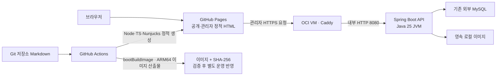

# 인프라 결정 기록

기준일: 2026-10-02. 인프라 변경 시 구현과 함께 갱신하는 결정 원본 문서.

**코드의 구성과 실제 운영 적용 상태를 구분하는 원칙.** 기존 운영 DB·원고·OCI 첨부 이관 후 새 서버의 일반 JVM API·Caddy와 GitHub Pages로 운영 전환·push 완료. 아래 과거 검증 기록은 당시 상태이며 최신 배포·용량 결과는 문서 후반 참조. 애플리케이션 및 영속성 결정은 [ADR 목록](README.md)에서 연결.

## 서비스 배치

| 결정 | 이유·효과 | 실제 적용 상태 |
| --- | --- | --- |
| 공개·관리자 화면 모두 GitHub Pages | 정적 파일 배포 유지, 서버의 HTML 렌더링 제거 | 운영 Pages 발행·공개 브라우저 확인 완료 |
| Node·TypeScript·Nunjucks는 빌드 시 HTML 생성, 브라우저 TypeScript는 상호작용 | 사이트 생성과 Spring 빌드의 분리 | 아래 Node 전환 검증 기록 참조 |
| Caddy가 공개 HTTPS 종료·인증서 갱신 | 별도 Certbot·systemd·Spring 직접 TLS 관리 제거 | 기존 인증서 보존·운영 데이터 HTTPS 전환 완료 |
| 공개 IPv4 + Let’s Encrypt ACME `shortlived` | 도메인 구매 없이 지원되는 브라우저의 공개 신뢰 사용 | 새 서버 공인 IP의 실제 발급·CA 검증 완료 |
| Caddy `default_sni`에 공인 IP 지정 | IP 접속의 SNI 부재와 OCI NAT 환경에서 올바른 인증서 선택 | IP URL의 TLS·주소 검증 완료 |
| MySQL/JDBC 세션, 단일 관리자 비밀번호, CSRF 유지 | 사용자 승인에 따라 MFA 제거, 로그인 실패 제한과 계정 변경 시 세션 해제 유지 | Post·Series 통합 브랜치 JVM 검증 완료; 아래 병합 검증 기록 참조 |
| 원고는 저장소 Markdown, 이미지는 영속 로컬 파일 | 본문 웹 편집·S3/Redis 의존 제거 | 기존 DB 원고 추출·로컬 이미지 이관 완료 |
| Dockerfile 대신 CI의 `bootBuildImage` | 이미지 빌드 정의를 Gradle·Cloud Native Buildpacks로 통합 | 로컬 ARM64 이미지 빌드·CI 동일 검사 완료 |
| 일반 JVM·Linux ARM64 | OCI ARM 서버 호환과 동적 기능의 유지보수 단순화 | 아래 JVM 전환 검증 기록 참조 |

Caddy는 운영 Compose에서 `caddy run`으로 직접 실행하는 선택. 고정 IP의 단일 VM에서 중간 실행 스크립트의 필요성이 낮아 `deploy/start-caddy.sh`와 연결 마운트·entrypoint 제거. 공인 IP와 사설 NIC bind IP는 Compose 필수 입력이며, 실제 값의 적합성은 운영 준비 단계에서 확인하는 계약. 인증서 발급·갱신은 Caddy 자체 기능으로 유지.

## 운영 Compose 위치 — 2026-10-02 결정

로컬 실행용 `compose.yaml`은 루트에 유지하고 운영용은 `deploy/compose.production.yaml`로 이동. Caddy 설정·운영 환경 예시와 같은 폴더에서 관리. 운영 파일은 로컬 Compose와 합치는 override가 아닌 독립 스택.

저장소 루트에서 `docker compose --env-file /absolute/path/production.env -f deploy/compose.production.yaml up -d`로 실행하는 구성. 환경 파일과 이미지 저장소는 기존대로 저장소 밖 절대 경로 사용. Caddy 마운트는 Compose 파일 기준 `./Caddyfile`로 수정. 디렉터리 이동 때문에 프로젝트·컨테이너·볼륨 이름이 바뀌지 않도록 기존 기본값 `name: ken-blog` 명시. 기존 배포에서 `-p`로 별도 이름을 지정했다면 같은 이름을 계속 사용하는 기준.

검증: 저장소 밖 가짜 환경 파일로 이동 전후 `docker compose config`의 전체 해석 결과 일치 확인. 포트·환경·마운트·자원 제한·볼륨 이름 동일. 컨테이너 실행·운영 배포 미수행.

## Spring 설정 통합 — 2026-10-02 결정

기존 Caddy 전용 프로필의 설정을 `application.yml`과 실행 환경변수로 통합. 별도 프로필 파일과 운영 Compose·CI의 프로필 활성화 제거. 기본 포트 8080과 전달 헤더 자동 신뢰 금지 정책은 공통 설정에 명시.

로컬 HTTP의 쿠키 기본값 false/lax/false와 빈 CORS 허용 목록 유지. 운영은 기존 Compose가 Secure=true·SameSite=None·Partitioned=true와 GitHub Pages의 공개/인증 CORS 주소를 지정. CI는 HTTP 검사 쿠키 값을 그대로 유지하고 이전 프로필에서 받던 두 CORS 주소를 실행 환경변수로 명시. 운영 Compose 없이 직접 실행하는 경우에도 필요한 쿠키·CORS 환경변수를 명시하는 계약.

검증: 저장소 밖 격리 복사본에서 기존 인증·HTTP 검사 17개와 bootJar 통과(실패·오류·건너뜀 0). 로컬·운영·CI 설정값의 전후 대조, 두 Compose 해석과 CI YAML/shell/Python 구문 검사 통과. JAR에 통합 설정만 포함하고 삭제 프로필 미포함 확인. 신규 저장소 테스트·원격 CI·운영 배포 미수행.

## 관리자 등록 설정 제거 — 2026-10-02 결정

관리자 계정의 DB 직접 관리 결정에 따라 초기 생성용 환경변수와 application 설정·로컬 Compose 전달·환경 예시 제거. ADMIN_USERNAME은 로그인 대상 선택용으로 유지. CI는 앱의 기동·health 확인 후 CI 전용 MySQL 서비스에만 관리자 행을 INSERT하며 실제 운영 계정 등록 절차로 사용하지 않음. 상세 계정 관리 기준은 [애플리케이션 ADR](ADR_application.md) 참조.

## 정적 페이지 생성의 Node 통합 — 2026-10-02 결정

Post의 메타데이터와 저장소 Markdown을 빌드 시 결합해 완성 HTML을 제공하는 방식 유지. 글 변경 시 Spring·프론트 컴파일을 분리하려는 목적만으로 SPA를 도입하지 않는 결정. 공통 화면 유지나 실시간 메타데이터 반영은 이번 요구에서 제외. 공통 레이아웃 변경 시 전체 페이지 재조립 필요.

기존 Kotlin SiteGenerator와 Thymeleaf 템플릿·의존성 제거. `src/main/resources/web/site/generate.ts`와 같은 폴더의 Nunjucks 템플릿으로 홈·목록·프로젝트·검색·상세·관리자 화면·목차·시리즈·백링크·이전 주소·사이트맵 생성 역할 이전. Nunjucks는 빌드 전용 의존성으로 자동 HTML 이스케이프 사용. 기존 공용 Markdown 렌더러가 처리한 본문만 `safe` 출력. 템플릿은 저장소 코드이며 DB·원고 문자열을 템플릿 소스로 실행하지 않는 경계. [Nunjucks API](https://mozilla.github.io/nunjucks/api.html)

`pages`의 공개 snapshot v2·revision 및 일관 읽기 계약 유지. `content/posts/{slug}.md` 경로 규칙 유지. 공개 목록에 있는 글만 생성하고, 원고 누락·비공개 데이터 혼입·생성 중 revision 변경 시 최종 출력 교체 전 실패. 공개 페이지와 다운로드 이미지는 빈 staging에서 전체 재생성하여 삭제·공개 해제된 자료가 과거 출력에서 남지 않는 구성. 글별 증분 생성·의존성 그래프·본문 캐시 미도입.

홈 소개는 후속 단순화로 `views/about.njk`에 직접 작성. snapshot v2의 `profile` 필드와 프로필 사진 다운로드 제거. 빌더는 구 API가 추가로 반환하는 profile 필드도 사용하지 않으며 사이트·API 사이 프로필 의존성 제거. 소개 수정은 템플릿 변경으로 Pages만 재생성. Caddy에서 프로필 공개·관리자 경로 삭제, ACME 인증서의 `profile shortlived` 설정은 별개 기능으로 유지.

### 빌드·배포 경계

- 사이트 명령은 `npm ci`, `npm test`, `PUBLIC_API_BASE_URL=… npm run build:site`. Node 24.21.0 사용. Java·Gradle·Spring 실행 없는 생성 경로. `npm test`는 기존 타입 검사와 빈 사이트 생성 검사.
- API 명령은 `./gradlew build`와 `bootBuildImage`. npm 태스크·`skipWeb`·`writeSiteClasspath` 제거. API JAR에서 웹 소스·템플릿 제외 유지.
- `pages.yml`은 공개 원고·웹 소스·npm 설정·사이트 빌드 코드 변경 시 실행. `ci.yml`은 Kotlin·런타임 리소스·기존 검사·Gradle 변경 시 실행하고 웹 리소스 제외. 변경 파일 경로 기준이며 커밋 메시지 규칙 없음. DB 메타데이터 변경은 기존 `workflow_dispatch`로 발행. 백엔드 공개 데이터 계약 변경 시 API 반영 후 사이트 수동 발행 필요.
- 프론트 번들의 입력 키는 브라우저 소스·공용 코드·빌더·package/lockfile·tsconfig·Node 버전·플랫폼의 내용 해시. 페이지 템플릿과 원고는 번들 키에서 제외. 자산 manifest의 모든 파일 해시와 JS/CSS 진입 파일을 검사한 뒤 재사용. 캐시 미존재·손상·입력 변경 시 소스에서 재생성. Actions 캐시 만료가 발행 실패 조건이 아니며, 프론트 컴파일의 영구 생략 보장은 없음. 별도 산출물 Git 브랜치 미도입.
- Pages 발행 workflow 하나에서 전체 사이트 artifact 구성·배포. workflow 전체 concurrency 유지, 시작 시 main checkout 및 배포 전 현재 main과 사이트 입력 경로 차이 검사. Git 소스·snapshot revision·자산 키를 실행 요약에 기록. 마지막 확인 이후의 변경이나 브라우저 캐시까지 원자적으로 묶는 보장은 없으며 메타데이터 저장과 공개 반영은 별도 단계. [Pages Actions 배포](https://docs.github.com/en/pages/getting-started-with-github-pages/using-custom-workflows-with-github-pages)

### 검증과 적용 상태

Java 없는 Node 컨테이너에서 타입 검사·빈 사이트·일반 글·프로젝트·시리즈·이미지 포함 사이트 생성 통과. 저장소 밖 fixture를 사용하여 기존 Thymeleaf 생성 결과와 22개 HTML의 DOM 의미 및 routes·sitemap·robots 일치 확인. 빈 속성 표기·공백·동등한 URL 인코딩은 비교 시 정규화. XSS 문자열 이스케이프, 공개 대상 외 원고 제외, revision 변경·원고 누락 시 기존 산출물 보존, 공개 해제 후 글·이미지 파일 제거 검증 통과. 캐시 적중·미존재·손상 및 원고/템플릿과 CSS 입력 분리 검증 완료.

Chromium에서 홈·상세·위키 링크·목차·시리즈·본문 검색·이전 프로젝트 주소·다크 모드·모바일 프로젝트 화면 및 모의 API 기반 관리자 로그인 화면 검증. JavaScript 오류 없음. 기존 JVM 검사 35개 실패·오류·건너뜀 없이 통과. 최초 격리 JVM 실행의 Docker socket 누락으로 인한 Testcontainers 실패는 실행 환경 수정 후 해소. 최종 API JAR의 Thymeleaf·SiteGenerator·템플릿 부재 확인.

소스 및 로컬 검증 완료. GitHub Actions 원격 실행·실제 Pages 배포·운영 API 재배포는 미수행. 기존 운영 자료 이관 전 fixture 배포 금지 상태 유지.

## JVM 이미지 빌드와 배포 — 2026-10-02 결정

상시 실행하는 1코어·RAM 4GB 개인 블로그의 기본 런타임을 Java 25 일반 JVM으로 변경. Native의 기동 시간·메모리 이득보다 Spring/JPA·jOOQ·ImageIO의 동적 기능 호환과 유지보수 단순성을 우선하는 선택. 이전 같은 조건의 JVM 실측은 유휴 647.4MiB, 조회 120회 후 684.4MiB였으며, 4GB 서버에서 JVM을 배제할 근거가 부족하다는 판단. 이 과거 값은 현재 코드의 최대 부하 상한이 아님.

이미지 생성은 기존 `bootBuildImage`·Cloud Native Buildpacks 유지. GraalVM Gradle 플러그인, `processAot` 환경 설정, Native 컴파일 옵션, `NativeRuntimeHints.kt` 및 ImageIO 전용 reachability metadata 제거. Spring 빈은 일반 JVM 실행 환경에서 구성하며 MCP 서버는 후속 단순화로 제거. JPA 기반 jOOQ 빌드 코드 생성은 런타임 AOT와 별개이므로 유지.

Spring Boot 4.1.1·Java 25 및 `paketobuildpacks/ubuntu-noble-builder:latest`/`ubuntu-noble-run:latest` 유지. Java desktop 이미지 처리에 필요한 시스템 라이브러리를 포함한 실행 이미지 사용. CI의 ARM64 작업은 Liberica JVM buildpack 포함·Native buildpack 미포함, 실제 Java 실행, 비루트 사용자와 운영 UID 10001/GID 1001의 파일 접근을 검증하는 구성. [Spring Boot 이미지 빌드](https://docs.spring.io/spring-boot/gradle-plugin/packaging-oci-image.html)

API 컨테이너 기본 메모리 한도 `1536m`, 운영 CPU 한도 1코어. `BPL_JVM_HEAD_ROOM=10`으로 JVM 외 작업에 10% 여유를 예약하고, 나머지에서 메타스페이스·코드 캐시·스레드 스택을 뺀 힙 크기는 Paketo 메모리 계산기에 위임. MCP가 존재하던 과거 최초 기본 계산의 메타스페이스 약 139MiB에서는 이미지 도구 실행 중 `OutOfMemoryError: Metaspace`와 종료 코드 3 확인. `JAVA_TOOL_OPTIONS=-XX:MaxMetaspaceSize=256m`으로 클래스 정보 공간을 확보하고 그만큼 힙을 줄여 전체 한도 유지. 컨테이너 한도 전체를 `-Xmx`로 지정하지 않는 기준. Caddy·OS 및 테스트 MySQL의 메모리는 별도. [Paketo 메모리 계산기](https://paketo.io/docs/reference/java-reference/#memory-calculator)

CI의 Actuator health·CSRF·직접 준비한 본문 PNG/JPEG 조회·로컬 64px 아이콘·Series/Post·jOOQ 조회·비밀번호 로그인/로그아웃·공개 스냅샷 v2 검사는 인증된 관리자 HTTP로 수행. MCP 도구·문서·프롬프트 검사는 제거하고 원고 디렉터리와 마운트 없이 API 동작 검증. 위키 선언은 해시 없는 새 HTTP 계약으로 확인. 기능 검사를 통과한 이미지·SHA-256을 커밋별 artifact로 90일 보관. 빌더의 `latest`는 변경 가능하므로 실제 이미지 ID와 아카이브 해시가 산출물 식별 기준. Compose는 검증된 이미지를 받아 실행하며 자동 운영 배포·레지스트리 공개는 없는 구성.

실서버 적용 및 새 용량 검증 결과는 문서 후반의 JVM 전환 기록 참조. 기존 외부 DB 연결·자료 이관·Pages 전환은 별도 잔여 작업이며 테스트 DB의 성공을 운영 완료로 간주하지 않는 원칙.

## 이미지 읽기 전용 런타임 — 2026-10-02

본문 첨부와 기술 아이콘의 파일 쓰기를 API에서 제거. `APP_ASSETS_DIRECTORY`와 영속 이미지 마운트·UID/GID 준비는 기존 파일 조회에 필요하므로 유지, `APP_ASSETS_KEY_PREFIX`와 multipart 크기 설정만 제거. API는 디렉터리를 자동 생성하지 않으며 파일을 열 때 경계·심볼릭 링크·디렉터리 쓰기 권한 확인. Caddy의 관리자 attachments 경로 제거, 공개 글별 이미지 경로 유지. 기존 서버 파일/백업 삭제와 운영 마운트 변경 없음.

본문 이미지도 기술 아이콘과 동일하게 직접 파일을 먼저 준비한 다음 DB 행 등록. 기존 `attachments`의 ID·object_key·original_filename·content_type·byte_size·uploaded_by·status·pending_cleanup·시각 열과 FK 유지. 새 행은 실제 PNG/JPEG·10MiB 이하 파일, 일치하는 MIME/크기, 기존 계정 FK, READY·pending_cleanup=false, UTC 시각과 고유 UUID 상대 키 사용. 파일/디렉터리 권한과 루트 경계는 기술 아이콘 직접 관리 절차와 동일. 업로드 검증기가 제거되어 앱이 형식을 변환/검증해 주지 않으므로 작성자가 파일을 확인하는 책임. 기존 PENDING/DELETING 행은 자동 복구/삭제 없이 보존.

글의 `attachmentIds`는 관리자 HTTP로 등록하며 존재·READY 검증과 잠금 유지. 원고의 `attachment:ID`와 연결 관계가 일치해야 Pages 빌드에서 다운로드 가능. 파일 교체는 새 키를 준비한 뒤 DB 키/크기/MIME/updated_at을 함께 변경하고 Pages 재생성 확인. 정리 전에는 `post_attachments`·기술 아이콘·복구 자료의 참조 및 백업 확인. 실제 자료 삭제는 이 코드 변경에 포함하지 않음.

CI의 PNG/JPEG 준비를 격리 DB INSERT·로컬 파일 배치로 변경하고 로그인·출간·연결·공개 원본 바이트·jOOQ·Pages snapshot 검사 유지. 삭제된 관리자 첨부 API의 404 확인. 저장소 밖 실제 JVM/Caddy와 읽기 전용 이미지 마운트에서 해당 시나리오 및 Node의 실제 원고·이미지 Pages 생성 통과. CI YAML/shell/Python 구문 및 Caddy adapt/validate 확인. 런타임 자료 등록용 스크립트/스킬 신설 없음. Buildpacks·원격 CI·운영 반영 미수행.

## 기술 이름·아이콘의 직접 관리 — 2026-10-02

기술 목록의 웹 쓰기 기능 제거, DB와 로컬 파일 직접 관리 채택. 운영 DB·파일에 대한 이번 코드 작업의 실제 변경 없음. 기존 기술 ID·프로젝트 연결·아이콘·백업 보존. CI는 기존 배지 업로드 검사를 격리 DB 행과 디스크 PNG fixture 준비 후 목록/프로젝트 선택/공개 이미지 조회 검사로 보정. CI 자료 준비는 테스트 실행에만 포함하며 애플리케이션 초기화·운영 동기화 기능과 별개.

### 등록 값과 파일 규칙

| 대상 | 규칙 |
| --- | --- |
| `stack_badges.id` | 신규만 DB AUTO_INCREMENT 사용, 이름/아이콘 변경 시 기존 ID 유지 |
| `name` | 앞뒤 공백 제거, 비어 있지 않은 100자 이하, ISO 제어문자 금지; Kotlin String 길이 기준 |
| `name_key` | name에 Kotlin `lowercase(Locale.ROOT)`와 동일한 소문자 변환, 기존 utf8mb4_bin UNIQUE 확인; DB 로케일의 LOWER 결과에 무조건 의존하지 않는 기준 |
| `object_key` | 고유 상대 키 `{prefix}/{UUID}.png`, 기본 prefix `ken-blog/attachments`; prefix는 영문·숫자·밑줄·하이픈 세그먼트와 `/`만 허용, 전체 키 255자 이하. 절대 경로·점 세그먼트·역슬래시 금지 |
| 시각 | created_at·updated_at은 UTC datetime(6), 신규는 둘 다 지정. 변경은 created_at 보존, updated_at을 이전 값과 다른 새 UTC 마이크로초 시각으로 갱신 |
| 아이콘 | 미리 디코딩 검증한 64×64 PNG, 비율 유지·투명 여백, 불필요 메타데이터 제거. Node 다운로드 상한 10MiB 이하. JPEG/SVG 등을 `.png`로 이름만 바꿔 등록 금지 |
| 저장 위치 | 호스트 `KEN_BLOG_ASSETS_DIR` 아래 object_key; 컨테이너 `/var/lib/ken-blog/assets`와 동일한 영속 마운트. 키는 DB만 보관하고 외부 응답에는 공개 ID URL만 노출 |
| 소유자·권한 | 현재 Compose API UID:GID 10001:1001. 디렉터리 0700 또는 0750, 파일 0600 또는 0640. API의 읽기/경로 통과 권한 확인. 루트와 모든 조상·대상의 심볼릭 링크 금지, 저장 루트 이하 디렉터리의 group/other 쓰기 금지 |

직접 준비한 아이콘은 Spring이 형식·크기를 다시 정규화하지 않으므로 등록자가 PNG 내용과 64px 크기를 검증할 책임. 기존 아이콘을 일괄 변환하거나 기존 키를 바꾸는 작업 없음.

### 변경·삭제·복구 순서

1. 대상 DB 행·연결·기존 파일과 해시를 별도 백업하고 대상 ID 확인. 관리자 동시 저장과 겹치지 않도록 작업 시점 조율. 필요한 경우 영향 시리즈 행을 ID순으로 잠근 후 기술 행/참조 재확인. 인증 정보는 저장소 밖 0600 파일에 보관.
2. 신규/교체 PNG를 API 저장 루트의 새 UUID 키로 준비. 같은 디렉터리의 비공개 임시 파일에 내용을 완성·검증하고 안전하게 게시, 소유자·권한·API 계정 읽기 확인. 기존 파일 덮어쓰기 금지. 실패 시 DB를 바꾸지 않고 새 미참조 파일만 정리 가능한 상태 유지.
3. DB 트랜잭션에서 이름/name_key의 고유성, 새 object_key, UTC 시각을 기록. 이름 변경도 name_key와 updated_at 함께 갱신. 기존 ID·created_at·`series_stack_badges(series_id,badge_id,sort_order)` 보존. 변경 후 열린 관리자 화면은 재조회하여 새 이름을 선택하는 기준. 읽기용 엔티티 메서드를 우회하기 위한 앱 코드 추가 없음.
4. 커밋 결과 확정 후 목록·프로젝트 응답·공개 아이콘 바이트/MIME 확인. 커밋 실패가 확정되면 새 파일만 정리하고 이전 DB·파일 유지. 결과가 불확실하면 재조회할 때까지 두 파일 모두 보존. 되돌릴 때는 이전 키/이름과 새 updated_at으로 DB 복구하여 캐시 재사용 방지.
5. 아이콘 교체는 반드시 새 키와 updated_at 변경. `imageUrl`의 v 및 사용 중인 공개 프로젝트의 snapshot revision 변경으로 새 Pages 입력 생성. 기존 URL 캐시는 최대 300초 남을 수 있으며 v는 과거 파일을 지정하는 저장소 버전이 아님. 기존 키의 파일만 덮어쓰면 revision이 바뀌지 않고 캐시/빌드 중 일관성 검사가 무력화되므로 금지.
6. DB·아이콘 변경은 Git 커밋 트리거가 없으므로 Pages 워크플로 수동 실행 필요. Node가 최신 아이콘을 다시 다운로드하고 내용 해시 파일명으로 HTML 재생성. 공개 프로젝트에 쓰이지 않는 기술은 snapshot에 없어 revision 변화가 없을 수 있음. 성공한 산출물/공개 반영 확인 후에만 참조 없는 이전 파일을 보관 대상으로 이동 또는 명시적 승인 범위에서 정리.
7. 기술 삭제 전 비공개를 포함한 `series_stack_badges` 참조와 순서 확인. 사용 중이면 명시적으로 선택을 제거/교체하고 필요한 sort_order 정리 후 기술 행 삭제. 기존 FK cascade가 있어도 자동 연결 소실에 의존하지 않는 기준. DB 트랜잭션 커밋·Pages 재생성 확인 전에는 파일을 먼저 삭제하지 않으며, 롤백용 행·연결·파일 백업 보존. 본문 attachments 또는 과거 복구 자료가 같은 키를 참조하는지도 파일 정리 전에 확인.

DB와 파일을 하나의 트랜잭션으로 처리할 수 없으므로 새 파일 준비 → DB 전환 → 공개 검증/Pages 발행 → 이전 파일 보관 순서. 운영 적용 시 API와 관리자 Pages를 함께 갱신하여 옛 화면의 삭제된 쓰기 API 호출 제거 필요. 신규 운영 CLI·자동 동기화·스킬 없음.

기술 목록 변경 검증: 기존 CI 시나리오의 DB/PNG 직접 준비·조회·프로젝트 연결·본문 첨부·출간·jOOQ 검사 통과. CI YAML/shell/내장 Python 구문 및 Caddy adapt/validate 확인. 격리 Caddy에서 목록 인증·삭제 쓰기 경로 차단·공개 PNG 헤더/바이트 검증. Node가 변경된 imageUrl을 수집해 내용 해시 아이콘과 본문 이미지를 포함한 Pages 생성. 이미지 동기 스트리밍의 반복 전송 검증과 한계는 [애플리케이션 ADR](ADR_application.md) 참조. Buildpacks 재생성·원격 CI·운영 반영은 별도 미수행.

## 상태 확인의 Actuator 통일 — 2026-10-02 결정

CI의 커스텀 상태 호출 제거, 기존 `/actuator/health` 기동 대기·최종 UP 확인과 후속 관리자 HTTP 검사 유지. Caddy 공개 allowlist에서 삭제 경로만 제거하며 health의 정확한 경로 매칭 유지. Spring의 health 단독 웹 노출·DB 검사·상세 정보 비공개 설정에는 변경 없음.

삭제 경로는 Caddy에서 기존 미등록 경로와 같은 404 처리. API 직접 접근에서는 기본 Security 정책에 따라 익명 GET은 401, 인증한 GET은 미등록 경로 404. 삭제 경로의 호환 허용 규칙이나 대체 상태 API 미도입.

아래 과거 부하 측정의 공개 상태 요청은 삭제 전 커스텀 응답의 이력. DB를 실제 검사하는 Actuator의 현재 처리량 측정으로 해석하지 않는 기준. 운영 배포·외부 모니터링 설정 변경은 이번 범위 밖.

검증: CI YAML·모든 shell 단계·내장 Python 구문, Caddy adapt/validate 통과. 동일 Caddy 라우트를 인증서 발급 없는 로컬 HTTP로 실행하여 삭제 경로·추가 Actuator 경로 404와 health의 정상/DB 장애/복구 상태 전달 확인. API 직결 익명 요청의 추가 Actuator 경로 401 및 관리자 요청의 미노출 env/beans 404 확인. 변경 전후 JAR의 application 설정 동일, DB 검사·상세 정보 비공개 유지 확인.

현재 Spring Boot 의존성의 probes 기본값이 true이므로 health 응답에는 기존 `groups: [liveness, readiness]`가 포함됨. 이번 변경으로 그룹을 추가하거나 공개 경로를 열지 않았으며 하위 probe 경로는 기존 정책대로 Caddy 404·API 직결 익명 401. health의 components/details는 정상·장애 응답과 인증한 정상 응답에서 비노출. 실제 Buildpacks 이미지 재생성·원격 CI 실행·TLS 재발급·운영 배포는 미수행.

## API 원고 마운트와 MCP 런타임 제거 — 2026-10-02 결정

두 Compose·환경 예시·application.yml·CI에서 MCP 활성화/접속 설정과 API 원고 디렉터리 설정·마운트 제거. Spring AI BOM·MCP starter와 앱의 전용 Security 체인·리소스 제거. API 컨테이너는 DB와 이미지 저장소만 필요하며 로컬 API 포트 바인딩은 기존 HTTP 점검·관리 용도로 유지. Caddy에는 원래 MCP 허용 경로가 없으므로 기존 공개/인증/관리자 allowlist와 나머지 404 처리 유지.

삭제된 `/mcp`에는 앱 라우트나 별도 허용 규칙 없음. API 직결 익명 요청은 일반 Security 정책으로 401 또는 CSRF 403, 인증·유효 CSRF 요청은 없는 경로 404. Caddy 외부 경로는 기존과 같이 404. 서버가 활성 상태가 되는 호환 플래그나 대체 엔드포인트 없음.

Node/Pages의 `content/posts` checkout·원고 변경 트리거·Markdown→HTML 생성과 공개 메타데이터 수집 유지. 기존 Pages 소비자는 API의 빈 body를 사용하지 않으므로 필드 제거와 함께 새로운 본문 다운로드 경로를 만들지 않음. API 출간과 Git 원고 배포는 원자적 작업이 아니며 누락 원고는 Pages 생성 시 실패하는 기존 계약.

당시 런타임과 분리해 보존했던 권한 준비·자료 이관·DB 백업/복구 스크립트는 후속 운영 도구 제거 결정으로 삭제. 기존 서버의 원고·비공개 자료·DB 열·이미지·백업·시크릿은 실제로 삭제하거나 변경하지 않는 범위.

아래 Native/JVM 측정의 MCP 언급은 당시 검증 이력이며 현재 의존성이나 기능이 아님. 기존 256MiB 메타스페이스·1536MiB 컨테이너 한도는 유지하며 MCP 제거 후 새 부하 한도를 추정하지 않는 기준.

검증: 최종 clean build·기존 35개 검사, 원고 없는 별도 Java 25 JRE API의 관리자 HTTP 시나리오, Node 타입/빈 생성/실제 snapshot 기반 Pages 생성 통과. 두 Compose는 이미지 저장소만 마운트하고 원고 경로 없이 정상 해석. Caddy adapt/validate 및 CI YAML·shell·내장 HTTP 검사 구문 확인. 자산 전용 권한 준비가 기존 원고를 변경하지 않는 것, 명시적 과거 원고 권한 복구의 바이트/소유자 보존과 심볼릭 링크 거부 검증. 실제 Buildpacks 이미지 재생성·원격 Actions 실행·push·운영 배포는 미수행.

## 루트 파일 정리

- `Dockerfile`·`.dockerignore`: Dockerfile 빌드 경로 제거와 함께 삭제. Buildpacks는 Gradle이 만든 JAR를 입력으로 사용하므로 저장소 전체의 Docker build context 제외 목록 불필요.
- `target/`: 예전 Maven 생성물로 현재 Gradle·Actions의 사용처 없음. 최종 점검 시 작업 폴더에서 제거된 상태.
- `build/`·`node_modules/`·`.gradle/`·`.kotlin/`: 현재 Gradle·Pages 빌드와 의존성 캐시로 사용.
- `gradlew.bat`: 사용자 확정에 따라 Windows용 wrapper 실행 파일 삭제. `gradlew`와 `gradle/wrapper` 유지.
- Linux/macOS Gradle wrapper·`package*.json`·`tsconfig.json`·환경 예시·`.editorconfig`·`.gitattributes`·두 Compose 파일: 현재 사용처가 있어 유지.

## 운영 도구 제거 — 2026-10-02 결정

사용자 결정에 따라 `ops` 폴더와 수동 실행 스크립트 6개 제거. 대상은 DB 백업·복구, 이미지 저장소 권한 준비, 기존 DB 본문의 Markdown 추출, OCI 이미지 복사, Post·Series 메타데이터 이관. 미완료 이관을 위해 도구를 보존하던 이전 결정 대체.

앱·Gradle·Node·CI·Compose에서 호출하지 않던 독립 도구이므로 런타임·빌드·배포 계약 변화 없음. 별도 도구나 자동 이관 경로로 대체하지 않으며 관련 실행 안내·보존 목록도 정리. 향후 백업·복구·권한 준비·자료 이관 절차가 필요하면 별도 마련하는 범위.

도구 삭제는 기존 자료의 이관 완료나 폐기를 의미하지 않음. 실제 DB·원고·비공개 자료·첨부·계정·백업·서버 파일은 보존. 아래 과거 검증 기록은 해당 도구가 있던 시점의 이력.

검증: 저장소의 스크립트 호출·파일 참조 재검색과 문서 diff 검사 수행. 런타임·빌드 입력 변경이 없어 JVM·Node 빌드 재실행 생략. 원격 push·운영 배포 미수행.

## 과거 Native Image 검증 이력 — JVM 결정으로 대체

아래 Native 설정·메모리·배포 기록은 과거 선택의 이력이며 현재 기본 런타임이나 현재 코드의 용량 측정 결과가 아님.

### Native Image 최초 전환 검증과 당시 남은 작업

- 기존 Caddy/Pages 변경: 기존35개 검사, TS, 정적 사이트 생성, 시험 인증서를 통한 HTTPS/IP URL, 관리자 브라우저와 API 재시작 검증 완료.
- 이번 변경의 기존35개 검사: 실패·오류·건너뜀 없이 통과. TS 검사와 빈 fixture의 공개·관리자 Pages HTML 생성 통과. 로컬 볼륨 준비의 최상위 권한과 기존 파일 보존 검증 통과.
- 실제 Native 이미지: Linux ARM64·Native buildpack·비루트 실행 및 ELF 실행 파일 확인. 신뢰한 시험 CA의 HTTPS/CORS/CSRF, 비밀번호+MFA, JVM 세션 복원, 프로젝트 생성·기간/순서·메타데이터, MCP 검색·문서·프롬프트, PNG/JPEG 업로드·64px 배지/256px 프로필, 본문 해시 보존·미출간 제외, 재시작·로그아웃·실제 TOTP 검증 통과.
- CI와 같은 별도 빈 DB에서 더미 계정 초기화·MCP/이미지/프로젝트/Markdown/빈 공개 스냅샷 검사 통과. 기본 MCP 비활성 상태의 접근 차단 검증 통과.
- 같은 최종 코드·환경·DB·1 CPU/1GiB 조건의 API 메모리 비교 완료. 동일 읽기 요청 120회 후 중앙값 JVM 684.4MiB/Native 136.3MiB, 약 80.1% 감소 관측. 기본 한도 1GiB 유지.
- 운영 잔여: 기존 DB 원고 추출·공개 Markdown 반영, OCI 이미지 로컬 이관·해시 확인, 운영 API/env·권한·방화벽·이미지 선택·Caddy 전환 후 Pages 배포.
- 당시 운영 이관 전 push·실서버 전환·실제 공개 인증서 발급은 보류 상태. 이후 별도 테스트 DB의 실서버 배포와 인증서 검증은 아래 2026-10-02 기록 참조.

### Post·Series 통합 병합 — 2026-10-02

메인의 Native Image·Buildpacks·ARM64 CI·Caddy 구성을 유지한 채 Post·Series와 jOOQ 변경을 병합한다. JPA는 저장·단일 조회·잠금, jOOQ는 목록·검색·태그·위키·공개 첨부 조회를 담당한다. 병합 당시 jOOQ 3.21.8의 Kotlin 테이블 코드는 저장소 DDL로 생성했다. 이후 수동 DDL을 제거하고 JPA 엔티티에서 빌드 중 자동 생성하도록 변경했다([영속성 ADR](ADR_persistence.md)). 코드 생성과 AOT는 운영 DB에 연결하지 않는다. 본문은 Markdown 정본을 유지하고 기존 DB 원문·ID·slug·비공개 상태를 보존하는 명시적 이관 도구를 당시 제공. 해당 도구는 후속 운영 도구 제거 결정으로 삭제.

MFA 제거는 사용자 승인된 인증 요구사항 변경이다. 단일 설정 관리자 비밀번호·JDBC 세션·CSRF·로그인 실패 제한은 유지한다. 기존 MFA 자료는 DB에서 삭제하지 않으며 신규 세션 증명으로 이전 MFA 세션의 자동 재사용을 막는다. 운영 환경 예시에서 TOTP·복구 코드 설정도 제거한다.

Native 힌트는 삭제된 Course·ContentFeedItem 대신 Series와 공통 Post DTO를 등록한다. CI의 과거 PROJECT_HOME/스냅샷 v1 검사를 새 Series→Post 등록·jOOQ 조회·공개/미출간 스냅샷 v2로 교체하고, 비밀번호 로그인·로그아웃 검사를 추가한다. CI의 HTTP loopback 검증만 개발 쿠키 설정을 사용하며 운영 Caddy의 Secure/SameSite=None/Partitioned 기본값은 유지한다.

과거 Native 메모리·MFA 측정은 `504c2ab` 구현의 이력이며, 이번 jOOQ 통합 코드의 메모리 실측이나 MFA 동작을 뜻하지 않는다. 이번 병합은 기존 JVM 테스트 35개(실패·오류 0), TypeScript, Pages 빈 fixture, Spring AOT 생성과 새 DTO 힌트를 검증했다. 수정된 CI 시나리오를 JVM에서 실행하여 비밀번호 로그인·로그아웃, MCP 24개 도구·문서·프롬프트, PNG/JPEG·64px 배지, Series/Post 생성·jOOQ 목록/검색·공개 대문 및 스냅샷 v2를 확인했다. 수정 후 ARM64 Native 컨테이너에서도 동일 CI 기능 검사와 재시작 후 JDBC 비밀번호 세션·jOOQ 조회가 통과했다. 최종 로컬 기능 검증 이미지는 `-Ob` 빠른 컴파일 옵션을 사용했으며 저장소의 운영 최적화·메모리·Buildpacks 설정은 변경하지 않았다. 이 이미지는 배포하거나 메모리 성능 비교에 사용하지 않았다. 운영 DB 이관·push·배포는 이번 로컬 병합에 포함하지 않는다.

병합 후 첫 Native 기동에서 jOOQ `SQLDataType`의 unsigned 배열 클래스 이름 조회가 누락되어 `DefaultDataType` 초기화가 실패했다. AOT에서 현재 jOOQ 버전의 공개 `DataType` 필드를 읽어 대응하는 배열 클래스를 등록하고, 내부 중첩 dialect 클래스 이름도 등록하도록 보완했다. 개별 타입 이름을 수동으로 고정하지 않아 라이브러리 갱신 시 새 내장 타입도 같은 규칙을 적용한다. [GraalVM 메타데이터 저장소의 관련 오류](https://github.com/oracle/graalvm-reachability-metadata/issues/752)

CI 원고 fixture는 API와 동일한 10001:1001 소유자 및 0640 권한을 명시하여 runner의 umask에 따른 읽기 실패를 막는다. 운영 파일의 권한은 이 검사에서 변경하지 않는다.

### 2026-10-02 Native 서버 배포·용량 검증 준비

사용자가 배포 대상을 SSH `oci-blog`로 확정했다. 실제 서버는 ARM Neoverse-N1 1코어, RAM 약 3.8GiB이며 Docker와 Compose를 사용할 수 있다. 운영용 API는 기존과 같이 Native Image·1GiB 메모리 제한을 유지하고, Caddy가 TLS를 종료한다. Post·Series 통합에서 누락된 Caddy 관리자 경로를 `/api/v1/admin/series`로 정합화하고 폐기된 courses/projects 경로는 제거했다.

기존 외부 MySQL에 TCP 연결이 되지 않고 OCI API 인증도 `401 NotAuthenticated`이므로, 기존 DB를 덮어쓰거나 과거 백업으로 운영을 복구하지 않았다. `/srv/ken-blog-perf`에 별도 MySQL·가짜 원고 100개·시리즈 10개·임의 테스트 계정을 둔 검증 스택을 구성했다. 실제 운영 데이터 및 GitHub Pages의 API 변수·시크릿은 변경하지 않는다. 이 검증 스택의 성공을 기존 데이터 이관이나 운영 전환 완료로 간주하지 않는다.

실제 공인 IP에 Caddy의 shortlived 인증서 발급과 CA 검증 HTTPS 접속이 성공했다. 비밀번호 로그인·CSRF·시리즈/글 메타데이터·PNG 업로드/배지 변환·공개 이미지 해시·Pages 스냅샷 v2를 확인했다. Chromium에서 실제 GitHub Pages 출처의 CORS/쿠키를 통해 새 API 로그인·관리자 조회가 성공했고, 새 API를 입력으로 한 정적 Pages 생성도 통과했다. 테스트 산출물은 공개 Pages에 배포하지 않는다. 운영 최적화 이미지의 최종 부하 결과는 아래와 같다.

#### 운영 최적화 Native 이미지 실서버 측정

실제 실행 이미지의 소스는 `7b0b471`, 이미지 ID는 `sha256:3d4bef282cdbafc69fbcf7a25f1ea6fa1ca65c1d059006e5826a335649993c64`이다. 기본 운영 최적화 옵션을 사용했으며 `-Ob`를 사용하지 않았다. 로컬 빌드 16분 55초 성공 후 압축 아카이브 SHA-256을 전송 전후 대조하고 서버 컨테이너의 이미지 ID까지 확인했다. 처음 배포 준비에 사용한 `-Ob` 이미지는 최종 측정 전에 교체했다.

측정 조건: ARM 1코어·RAM 3894MiB의 `oci-blog`, API 제한 1 CPU/1GiB, Caddy와 별도 테스트 MySQL도 같은 서버에서 실행. 별도 VM의 클라이언트가 실제 공인 HTTPS 주소에 HTTP/1.1 keep-alive로 고정 도착률 요청을 전송했다. 같은 리전에서 측정했으며 다른 지역의 인터넷 지연이나 장기 안정성·최대 수용량을 보장하는 수치가 아니다. 메모리는 cgroup v2 `memory.current - inactive_file`을 1초 간격으로 측정했다. CPU는 MySQL·OS를 포함한 호스트 전체 사용률이다.

| 시나리오 | 요청률 | 측정 시간 | p95 | p99 | 오류 | 호스트 평균 CPU |
| --- | ---: | ---: | ---: | ---: | ---: | ---: |
| 공개 API: 상태 30% + 배지 이미지 70%, 쿠키 없음 | 10/s | 30초 | 10.2ms | 11.0ms | 0/300 | 7.0% |
| 동일 공개 API | 50/s | 30초 | 9.2ms | 11.3ms | 0/1,500 | 22.4% |
| 동일 공개 API | 100/s | 30초 | 8.8ms | 43.3ms | 0/3,000 | 40.8% |
| 동일 공개 API | 200/s | 30초 | 123.7ms | 245.4ms | 0/6,000 | 80.9% |
| 공개 첨부 약 192KiB | 20/s | 30초 | 12.8ms | 15.1ms | 0/600 | 18.8% |
| Pages 스냅샷: 글 100개·시리즈 10개 | 1/s | 15초 | 377.0ms | 377.0ms | 0/15 | 32.3% |
| 인증된 관리자 글·시리즈 조회 | 10/s | 30초 | 47.0ms | 98.6ms | 0/300 | 34.3% |

별도로 단일 로그인 세션을 **모든 요청에 포함**하고 상태 30%·배지 40%·관리자 조회 30%를 섞은 스트레스 테스트를 수행했다. 50/s에서는 오류 0/1,500·p95 90.3ms였지만, 100/s에서는 CPU 100%에 도달하고 3,000건 중 1,651건이 클라이언트 시간 제한에 걸렸다. 이는 일반 공개 방문자 시나리오와 구분한다. 직후 이미지 테스트는 잔여 부하의 영향을 받았으므로 정상 처리량 근거로 사용하지 않고, 회복 후 쿠키 없는 별도 이미지 테스트 결과를 위 표에 기록했다. 과부하 뒤 health 정상화와 데이터 보존을 확인했다.

새 이미지의 최초 유휴 상태에서 API+Caddy 약 165MiB, 전체 스트레스 테스트 중 두 프로세스 합계 최대 314.9MiB였다. 같은 시점 기준 MySQL까지 합산한 스택 최대 538.8MiB, 호스트의 최소 가용 메모리 2528.8MiB였다. 공개/관리자 요청을 분리한 두 번째 측정에서는 API+Caddy 최대 144.0MiB였으며, 이전 고부하 후 회수가 일어나 메모리가 계속 증가하지 않았다. 두 측정에서 OOM 및 자동 컨테이너 재시작은 0회였다. 마지막 수동 API 재시작 후에도 JDBC 브라우저 세션, 글 100개·시리즈 10개, jOOQ 관리자 조회가 유지됐다.

판단: 현재 정적 Pages 중심의 개인 블로그 구조에서는 1코어·4GB를 유지할 근거가 있다. 공개 HTML·복사된 이미지는 GitHub Pages가 처리하므로 방문자 수와 API 요청률을 동일시하지 않는다. RAM보다 CPU가 먼저 제한되며, 관리자 요청을 한 세션에 집중시키는 부하는 한계가 있다. 외부 운영 MySQL의 지연·실제 데이터·대량 이미지 변환과 장기 부하는 이번 검증 범위 밖이다. 운영 DB 연결 및 OCI 인증 복구, 원본 원고/첨부 이관, Pages 변수·시크릿 정리와 실제 사이트 전환은 여전히 남아 있다.

## JVM 전환 검증 — 2026-10-02

`clean test bootBuildImage` 성공, 기존 35개 검사 실패·오류·건너뜀 0. 깨끗이 생성한 API JAR에 애플리케이션 Native 힌트·reachability metadata·AOT 클래스 미포함 확인. ARM64 이미지의 Liberica JVM buildpack, 비루트 기본 사용자와 실제 PID 1의 Java 25.0.4 실행 확인. 최종 런타임 설정으로 1 CPU/1536MiB 제한을 적용한 CI 동일 검사에서 MCP 24개 도구·문서·프롬프트·PNG/JPEG·64px 배지·Series/Post·jOOQ·스냅샷 v2·비밀번호 로그인/로그아웃 통과. 두 Compose의 실제 해석 결과와 CI YAML·shell·Python 구문 검사 통과. GitHub Actions 자체 실행은 push 전이므로 미수행.

최종 메모리 계산은 `-Xmx641433K`(약 626.4MiB), 메타스페이스 최대 256MiB, 코드 캐시 240MiB, 직접 버퍼 10MiB, 스레드 스택 1MiB×계산용 250개, headroom 10%. 힙과 메타스페이스 값은 상한이며 시작 즉시 전체를 사용하는 값이 아님. 메모리 영역 배분 수정 후 이미지 처리까지 통과했으며, 최초 메타스페이스 실패를 호스트 4GB 부족이나 컨테이너 OOM kill로 해석하지 않는 기준.

새 서버의 기존 테스트 스택을 JVM 이미지 `sha256:b77377d093ed40d472c03caaa0c8692280dd5130e67f99e2ab5c4b8eb8acd025`로 교체. 아카이브 SHA-256 송수신 대조와 컨테이너 이미지 ID 확인 완료. API만 교체하고 Caddy 인증서·테스트 MySQL 유지. 이전 이미지·환경·Compose와 테스트 DB 백업 보존. 실제 서버의 기동 시간 약 27초 관측.

공인 HTTPS의 CA 검증·HTTP 리다이렉트·허용/거부 CORS·CSRF·쿠키 속성·비밀번호 로그인/로그아웃·외부 MCP 404 검증 통과. Native에서 생성한 기존 JDBC 로그인 세션으로 JVM 관리자 jOOQ 조회 성공. 테스트 글 100개·시리즈 10개의 공개 스냅샷과 원고·첨부 SHA-256 교체 전후 일치. 실제 운영 외부 DB·원고·Pages 변수·GitHub 시크릿에는 변경 없음.

### JVM 실서버 부하·메모리 측정

ARM 1코어·RAM 3894MiB 서버, API 제한 1 CPU/1536MiB, Caddy와 테스트 MySQL도 같은 서버에서 실행. 별도 같은 리전 VM에서 공인 HTTPS/HTTP 1.1 keep-alive의 고정 도착률 요청 생성. 공개 요청에는 로그인 쿠키 미전송. 1초 간격 cgroup v2 `memory.current - inactive_file` 측정. CPU는 MySQL·OS를 포함한 호스트 전체 값. 기동 후 기능 검사를 완료한 JVM의 짧은 부하 검증이며 장기 안정성·최대 수용량·실제 운영 DB 지연 보장은 아님.

| 시나리오 | 요청률 | 시간 | p95 | 오류 | 호스트 평균 CPU |
| --- | ---: | ---: | ---: | ---: | ---: |
| 공개 상태 30% + 배지 70%, 쿠키 없음 | 10/s | 30초 | 23.55ms | 0/300 | 18.4% |
| 공개 상태 30% + 배지 70%, 쿠키 없음 | 50/s | 30초 | 15.2ms | 0/1,500 | 43.6% |
| 공개 상태 30% + 배지 70%, 쿠키 없음 | 100/s | 30초 | 10.17ms | 0/3,000 | 57.5% |
| 공개 상태 30% + 배지 70%, 쿠키 없음 | 200/s | 30초 | 33.41ms | 0/6,000 | 88.4% |
| 공개 첨부 약 192KiB | 20/s | 30초 | 15.04ms | 0/600 | 26.5% |
| 글 100개 Pages 스냅샷 | 1/s | 15초 | 772.14ms | 0/15 | 55.6% |
| 인증한 관리자 글·시리즈 조회 | 10/s | 30초 | 68.1ms | 0/300 | 48.4% |

유휴 API 중앙값 400.2MiB. 전체 측정 중 API 최대 474.5MiB, API+Caddy 동시 합계 최대 506.5MiB, 테스트 MySQL까지 합산한 스택 최대 749.0MiB. 호스트 최소 가용 메모리 2361.4MiB. OOM·자동 재시작 0회, 부하 종료 후 기존 JDBC 세션·jOOQ 조회·공개 스냅샷 보존 확인.

판단: 현재 검증한 개인 블로그 부하에서 일반 JVM과 Caddy를 RAM 4GB 서버에 유지할 근거 확보. 최대 힙 약 626MiB와 API 전체 한도 1.5GiB 안에서 운영하는 구성. 공개 200/s에서 CPU 평균 88.4%이므로 이 수치를 장기 처리량 보장으로 해석하지 않는 기준. Native 전용 호환 설정을 다시 도입할 필요 없이 일반 JVM 선택 유지. 실제 운영 DB 연결·원고/첨부 이관·GitHub Pages 전환 및 push는 기존 보류 상태 유지.

## 프론트·백엔드 통합 배포 준비 — 2026-10-02

기존 미반영된 읽기 전용 첨부·계정 직접 관리·Spring 설정 통합·운영 Compose 이동과 관리자 프론트 정렬을 함께 검증. 운영 이미지 마운트도 읽기 전용으로 지정하며 파일 등록·변경은 호스트에서 수행. 관리자 프론트의 HTTP 계약과 검증은 애플리케이션 ADR 참조.

격리 clean build 기존 검사 30개, Node 타입·빈 사이트·실제 격리 API/Markdown/PNG/JPEG/아이콘 기반 사이트 생성 통과. Linux ARM64 Buildpacks JVM 이미지 생성 및 운영 UID 10001/GID 1001·1코어·1536MiB 제한·읽기 전용 이미지 디스크·원고 마운트 없는 기동 확인. 배포 이미지와 검증용 사이트의 분리 보관, 시험 자료의 운영 배포 제외.

운영 준비 중 기존 DB 연결 실패와 API 키 인증 401 확인. 로컬 키 fingerprint·시간 대조 정상, VM 자체 인증은 기본 조회에 성공하지만 DB/Compute/API 키 관리 권한 없음. 사용자 결정은 OCI 인증 복구 후 기존 운영 DB 사용이며 시험 DB 대체나 백업 복원은 적용하지 않은 상태. 운영 전환·Pages 발행·push는 인증 및 운영 자료 연결 이후 확인할 단계.

## OCI 운영 전환 — 2026-10-02

OCI API 키 인증 복구 후 기존 외부 MySQL의 ACTIVE 상태 확인. 이전 서버 IP만 허용하던 DB NSG와 MySQL 계정에 새 API 서버의 단일 사설 IP 접근 추가. 기존 규칙·계정·인증 정보 보존, DB 포트의 인터넷 공개 없음.

기존 DB 백업·원고 추출·Post/Series 이관 후 OCI 이미지 78개를 로컬 디스크로 복사하고 길이·제공된 MD5·SHA-256 대조. 공개 원고만 Git 반영, 기존 객체·DB 본문·편집본·백업 삭제 없음. 검증한 ARM64 JVM 이미지를 새 운영 Compose로 기동하고 기존 Caddy 인증서 볼륨의 복사본으로 HTTPS 전환. 이전 시험 스택은 컨테이너와 볼륨을 보존한 채 중지. 새 API에는 이미지 읽기 전용 마운트만 있으며 원고 마운트 없음.

공개 API 주소는 `https://158.101.158.194`, GitHub Pages의 `BLOG_API_BASE_URL`도 같은 주소로 변경. 외부 TLS 검증·Actuator UP·공개 snapshot의 글 7개/시리즈 6개 및 실제 API를 사용한 Node 사이트 생성 확인. 기존 계정·원고·첨부·기술의 데이터 해시 보존, 인증 상태 행은 새 로그인 정책에 따라 갱신. main push 및 [Pages 37007598432](https://github.com/gjaku1031/ken-blog/actions/runs/37007598432) 성공. 공개 홈·프로젝트 6개·이미지·새 API로 연결된 관리자 로그인 화면을 Chromium에서 확인. 운영 비밀번호 입력을 사용한 로그인/쓰기 검사는 수행하지 않고 기존 계정/해시 보존과 격리 인증 검증으로 구분. 운영 snapshot 2개 동시 요청 60회 오류 0, 외부 왕복 포함 p95 약 344ms. 측정 직후 API 약 393MiB·Caddy 약 15MiB, 4GB 호스트 가용 약 2.7GiB. 장기/최대 부하 보장은 아닌 시점 측정. [CI 37007598395](https://github.com/gjaku1031/ken-blog/actions/runs/37007598395)의 기존 백엔드 검사와 ARM64 Buildpacks 이미지 생성·실행·HTTP 검증 모두 성공. 프로젝트 ID 보정 후 [최종 Pages 37008106440](https://github.com/gjaku1031/ken-blog/actions/runs/37008106440) 재발행 성공. 운영 코드·원고 반영과 공개 접속 확인 완료.

## 주소 자동 발급·관리 화면·QA 원고 배포 — 2026-10-02

백엔드 변경 승인 후 `24dd81f`의 Linux ARM64 이미지 `ken-blog-api:jvm-24dd81fb5d300733152d52c08c44957236a3f453`로 운영 API 교체. [CI 37017979174](https://github.com/gjaku1031/ken-blog/actions/runs/37017979174)의 34개 검사와 Buildpacks 이미지 기동·인증/메타데이터 HTTP 검증 성공. 배포 전 아카이브 SHA-256 대조, 기존 이미지와 환경 파일 보관. 기존 Compose의 포트·Caddy·인증서·DB·읽기 전용 이미지 디스크 구성 유지. 운영 내부 포트 18084와 외부 HTTPS의 Actuator UP, 교체 전후 공개 snapshot 전체 동일성 확인.

QA 글 30편·일반 시리즈 3개를 추가했고 기존 글 7편은 보존. 공개 snapshot은 글 37개·시리즈 9개이며 원고 커밋 `a470faf` 반영 후 QA 메타데이터 공개. 관리자 주소 입력 제거, 분류 트리와 읽기 화면 보완은 `bc048ec` 및 [Pages 37019084401](https://github.com/gjaku1031/ken-blog/actions/runs/37019084401)으로 발행 성공. 주소 생성과 화면 동작의 계약·검증은 애플리케이션 ADR 참조. 운영 관리자 비밀번호를 이용한 인증 쓰기 검증은 별도로 수행하지 않음.
