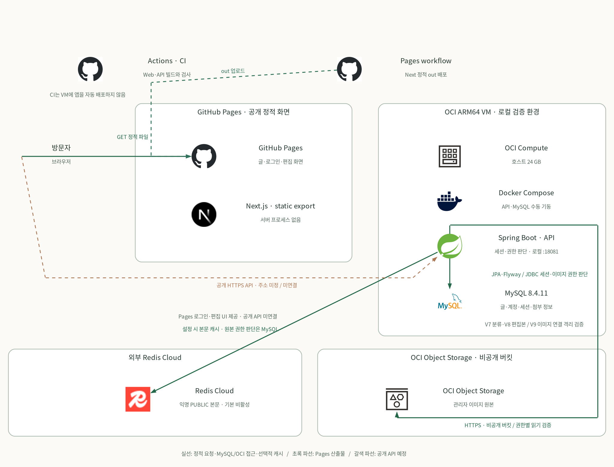

# Ken Blog 아키텍처

[다크 도면](../diagrams/architecture.dark.svg) · [PNG](../diagrams/architecture.png) · [다크 PNG](../diagrams/architecture.dark.png) · [도면 소스와 아이콘 출처](../diagrams/README.md)

방문자에게 GitHub Pages의 정적 Next.js 화면 제공. Pages 배포 대상은 빌드 결과인 `apps/web/out`의 HTML·JavaScript·이미지. Next 서버 프로세스 없음. [CI](../.github/workflows/ci.yml)는 Web·API 빌드와 검사 담당. 별도 [Pages workflow](../.github/workflows/pages.yml)는 정적 화면의 빌드와 배포 담당. CI의 VM 애플리케이션 자동 배포 없음.

새 프로젝트의 Spring Boot API는 Buildpacks JVM 이미지와 Docker Compose로 OCI ARM64 VM의 격리 로컬 검증 환경에 실행하도록 구성. API의 기본 호스트 바인딩은 `127.0.0.1:18081`. 현재 VM에서 별도로 실행 중인 기존 앱·Redis와 다른 자원이며, 도면은 기존 앱의 교체나 CI의 VM 자동 배포를 뜻하지 않음. 공개 HTTPS API 주소는 미확정이며 Pages 화면에는 API 미설정 안내 표시. 그림의 브라우저→Spring 갈색 파선은 **계획된 공개 연결**로, 현재 동작하는 인터넷 경로가 아님. 공개 주소 준비 후 빌드 시 `NEXT_PUBLIC_API_BASE_URL` 저장소 변수에 입력하고 재배포 필요.

MySQL 8.4.11은 같은 VM의 새 프로젝트 개발용 Docker Compose 서비스와 별도 데이터 볼륨으로 구성. DB 호스트 포트는 기본 `127.0.0.1:13306`에만 바인딩하고, Spring 컨테이너는 Compose 네트워크의 `mysql:3306`에 JDBC로 연결. Spring의 `DB_URL`·`DB_USERNAME`·`DB_PASSWORD`가 연결을 결정. Flyway V1·V2가 게시글·계정, V3가 Spring Session JDBC의 `SPRING_SESSION`·`SPRING_SESSION_ATTRIBUTES`, V4가 첨부 메타데이터, V5가 출간 상태·공개 범위·최초 출간 시각, V6가 본문 SHA-256 열·기존 본문 역채움을 관리. P1-04 V6은 격리 검증 완료, main 반영 예정. JPA는 애플리케이션 엔티티의 스키마를 검증하며 세션 스키마 자동 초기화는 사용하지 않음. 관리자 게시글 작성·출간과 권한별 공개 조회 API는 P1-04B에서 main·CI·Pages 반영 완료. 이는 격리 HTTP 기능이며 공개 인터넷에서 API를 호출할 수 있다는 뜻은 아님. 도면의 Spring→MySQL 실선은 게시글 원본·공개 판단·계정·JDBC 세션·첨부 메타데이터의 내부 접근을 뜻함.

Spring Security의 로그인·권한 판단에 사용할 계정과 비밀번호 해시는 MySQL에 저장. Spring Session JDBC가 같은 MySQL에 서버 세션을 저장하며 기본 비활동 만료는 30분, 만료 행 정리 작업은 매분 실행하도록 설정. 로컬 인증은 CSRF 토큰 취득→로그인·세션 ID 교체→현재 사용자 조회→로그아웃·세션 무효화 흐름. 세부 계약은 [관리자 인증 안내](authentication.md)에 기록. 인증 API는 로컬 검증 범위이고 Pages에는 로그인 화면이 없음. 공개 HTTPS API 주소와 실제 도메인에 맞춘 쿠키·CSRF 정책은 아직 미확정.

관리자 첨부 API는 Spring에서 기존 비공개 OCI Object Storage 버킷의 S3 호환 HTTPS endpoint에 접근하도록 구성. 브라우저의 버킷 직접 접근이나 공개 URL은 제공하지 않음. 이미지 원본은 이 버킷의 기능 전용 접두사 아래, object key·원본 파일명·판별 MIME·크기·업로드 계정·PENDING/READY/DELETING 상태는 MySQL에 저장. 도면의 Spring→OCI Object Storage 실선은 **관리자 첨부 기능의 저장 경로**이며 공개 Pages 화면에서 접근 가능한 경로가 아님. 저장소 외부 설정을 모두 비우면 앱의 다른 기능은 실행되지만 첨부 API는 503을 반환. 상세 계약과 중간 실패 복구는 [첨부파일 운영 안내](attachments.md)에 기록.

도면의 Spring→외부 Redis Cloud 실선은 P1-04에서 구현·격리 검증한 **설정 시 선택적** 익명 PUBLIC 상세 본문 캐시 경로. 기본 비활성이고 Compose에 내부 Redis 컨테이너 없음. MySQL의 공개 판정·본문 SHA-256 확인 뒤에만 외부 캐시를 읽으며, 계정·CSRF·JDBC 세션·PRIVATE/회원 본문·관리자 응답은 캐시하지 않음. Redis 실패 시 DB 원본으로 복귀, DB 장애 시 캐시만으로 권한을 판단하지 않음. 기존 외부 설정의 `TLS=false` 평문 연결에서 JAR·Buildpacks 이미지의 캐시 키·TTL을 확인했으며 TLS 성공이나 성능 개선을 주장하지 않음. [캐시 안내](cache.md)에 설정과 검증 경계를 기록. 실행 방법과 검증 조건은 [런타임 안내](runtime.md)에 기록.
