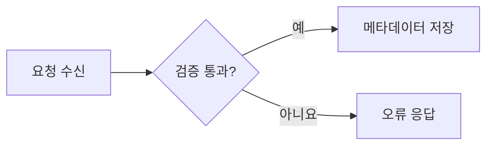
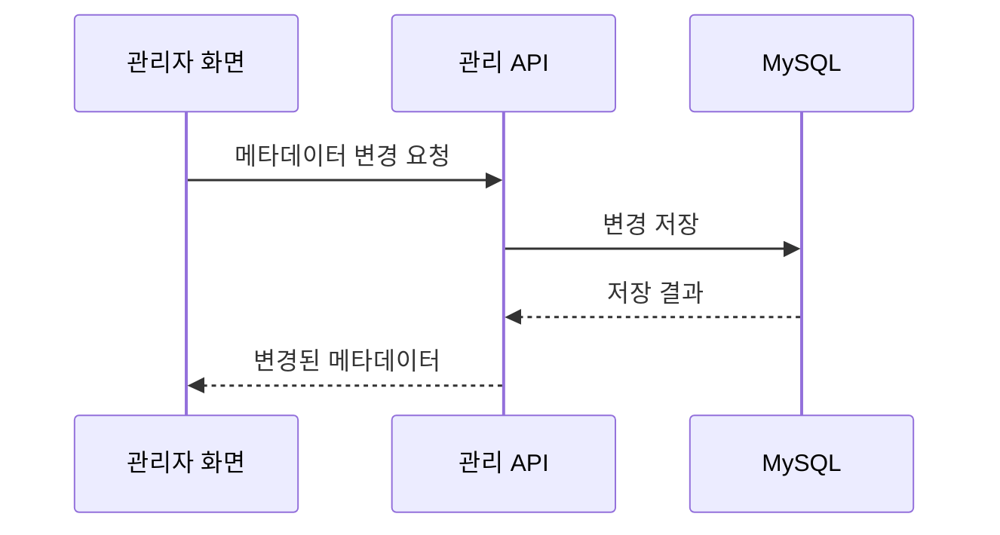

# Mermaid 다이어그램 작성

게시글·문서의 다이어그램을 새로 그리거나 수정할 때 먼저 읽는 공통 가이드다. 현재 블로그는 Mermaid 12.0.0을 사용하며, 실제 지원 범위는 [package.json](../../package.json)과 [공용 렌더러](../../src/main/resources/web/shared/mermaid-render.ts)를 기준으로 한다.

## 종류 선택

| 설명할 내용 | 사용할 도식 | 추가 가이드 |
| --- | --- | --- |
| 처리 단계·조건 분기 | `flowchart` | 이 문서 |
| 요청·응답의 시간 순서 | `sequenceDiagram` | 이 문서 |
| 클래스 구조·상태 전이 | `classDiagram`, `stateDiagram-v2` | 이 문서의 공통 규칙과 해당 문법 |
| 테이블·키·관계 | `erDiagram` | [ERD](erd.md) |
| 서버·배포 영역·기술 스택 | `architecture-beta` | [Mermaid Architecture](mermaid-architecture.md) |

`graph`, `stateDiagram`도 허용한다. 공식 Mermaid에 있는 종류라도 블로그 렌더러가 허용하지 않으면 그림으로 표시되지 않는다.

## 그리기 전 확인

1. 그림이 설명할 질문과 범위를 한 문장으로 정한다. 현재 운영, 설계안, 과거 구조를 구분하고 기준 시점을 적는다.
2. 기존 그림과 코드·스키마·워크플로를 읽고 구성 요소와 연결을 먼저 목록으로 만든다. 배치를 보기 좋게 만들기 위해 사실을 바꾸지 않는다.
3. 전체도는 글 위쪽에 한 장으로 둔다. 큰 구성은 영역으로 묶고, 필요한 상세도와 설명은 아래에 추가한다. 전체도를 여러 부분 그림으로 대체하지 않는다.
4. 노드 이름은 짧게, 세부 설명은 그림 아래 표로 옮긴다. 내부 식별자는 영문으로 고정하고 독자가 읽을 이름은 라벨에 적는다.
5. 같은 역할은 같은 색을 사용한다. 그룹 이름·범례·선의 라벨도 함께 제공한다.

## Markdown에 넣기

코드 블록의 언어를 `mermaid`로 지정한다. 다음 예시 전체를 원고에 붙여 넣을 수 있다.

````markdown

````

`LR`은 왼쪽에서 오른쪽, `TB`는 위에서 아래로 읽는 흐름에 사용한다. 화살표는 처리 순서인지 데이터 전달인지 문장으로 설명한다. 분기에는 조건을 적고, 상세한 오류 처리까지 넣어 전체 흐름이 묻히지 않게 한다. [Flowchart 문법](https://mermaid.js.org/syntax/flowchart.html)을 참고한다.

요청과 응답을 구분해야 하면 시퀀스 다이어그램을 사용한다.



이 예시에서 실선은 요청, 점선은 응답이다. 내부 검증·실패·재시도가 설명의 주제라면 해당 분기만 추가한다. [Sequence 문법](https://mermaid.js.org/syntax/sequenceDiagram.html)을 참고한다.

## 색상과 가독성

`classDef`와 `class`를 사용하는 도식은 다음 형태로 역할을 지정한다. 이 예시는 flowchart이며 Architecture의 영역 색상은 별도 가이드를 따른다.


배경·테두리·글자 색은 6자리 HEX로 지정하고 선 두께는 1~4px만 사용한다. 다크 모드의 색 조정은 렌더러가 처리한다. 긴 이름, 불필요한 줄바꿈, 큰 노드, 교차선과 라벨 겹침을 실제 본문 너비에서 확인한다. 전체도는 한눈에 구조를 파악하게 하고, 세부 내용은 확대 화면과 본문 설명에서 읽게 한다.

## 블로그에서 지킬 제한

| 항목 | 현재 범위 |
| --- | --- |
| 도식 원문 | UTF-8 12KiB 이하, 200줄 이하 |
| 연결 | 렌더러 상한 100개 |
| 스타일 | 허용된 `classDef`의 `fill`, `stroke`, `color`, `stroke-width` |
| 설정 | 테마·배치·글꼴은 공용 렌더러에서 관리 |
| 외부 자원 | 본문의 URL·HTML·원격 이미지·아이콘 팩 요청은 허용하지 않음 |

본문에 `init` 지시문, YAML frontmatter 설정, `style`, `linkStyle`, `click`, 임의 CSS를 넣지 않는다. 주석에도 외부 URL을 넣지 말고 출처 링크는 코드 블록 밖에 적는다. `%% layout: ...`은 등록된 Architecture 배치를 선택하는 블로그 전용 주석이다.

문법·아이콘·배치 검증 또는 렌더링에 실패하면 원문이 남는다. 원문이 보인다는 사실을 렌더링 성공으로 판단하지 않는다. 제한을 피하려고 검증기를 완화하지 말고, 표현과 상세 수준을 먼저 조정한다.

## 작성 후 확인

1. 원본 자료와 비교해 노드·관계·방향·필수/선택 조건·영역이 맞는지 확인한다.
2. 원고의 코드 블록을 공용 렌더러의 원문 검사와 Mermaid 파서로 검사한다. 고정 배치는 원고와 JSON의 일치도 확인한다.
3. 변경 범위에 맞는 검사를 실행한다. 공용 렌더러를 수정했다면 `npm test`와 관련 `npm run test:browser` 검사를 실행한다. 명령과 환경은 [package.json](../../package.json), [브라우저 검사 설정](../../.github/pages/playwright.config.mjs)을 따른다.
4. 실제 게시글에서 밝은·어두운 테마, 데스크톱·모바일, 확대·축소와 원문 보기를 확인한다. 아이콘 누락, 잘린 이름, 선 겹침, 가로 넘침, 콘솔 오류를 확인한다.
5. 배포까지 요청받았다면 공개 페이지에서도 확인한다. 로컬 확인과 배포 완료를 구분해서 보고한다.

다이어그램 작성법이나 공용 렌더러의 지원 범위를 바꾸면 이 가이드도 함께 수정한다.
