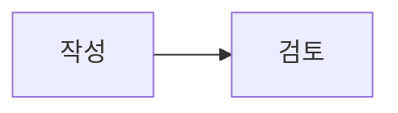

# Markdown 읽기와 안전한 접기

P2-02C의 읽기 화면 계약과 2026-09-26 격리 검증 기록. 최종 소스의 설정된 빌드와 API 주소 미설정 정적 빌드, 실제 브라우저의 접기·표 표시 확인. 검사한 읽기 화면의 라이트·다크 Axe 위반 0건이며, 전체 읽기 접근성 완료 선언은 아님. main `01964c8`·[CI](https://github.com/gjaku1031/ken-blog/actions/runs/36228126312)·[Pages](https://github.com/gjaku1031/ken-blog/actions/runs/36228126314) 반영 완료. 공개 API HTTPS 연결은 아직 전. 작업 기준은 [P2-02C 계획](../planning/issues/P2-02C.md) 참고.

## 읽기 범위

게시글 본문은 CommonMark와 GFM의 문단·제목·목록·표·코드·참조 링크·각주를 읽기 전용으로 표시. 명확한 `<details>`와 `<summary>` 태그만 기본 닫힌 네이티브 접기로 변환. 제목이 없거나 비어 있으면 `펼치기` 표시. 같은 줄 또는 다음 줄 제목, 접기 안의 Markdown과 여러 단계의 중첩 접기 지원. 키보드의 기본 Enter·Space 조작과 초점 표시 사용.

```markdown
<details>
<summary>설치 기록</summary>

본문의 **강조**, [참조 링크][guide], 표와 목록.

</details>

[guide]: https://example.com/guide
```

본문 전체를 한 문서로 파싱하므로 접기 안팎의 참조 정의·각주 문맥 유지. 코드 fence, 인라인 코드, 네 칸 들여쓰기 코드 안의 태그 예시는 접기로 해석하지 않음. 같은 줄에 연속한 형제 접기도 각각 표시. 중첩 상한은 8단계. 닫는 태그가 없거나 짝이 맞지 않는 경우, 임의 HTML 속성 또는 허용되지 않은 HTML이 접기에 섞인 경우에는 해당 원문을 실행하지 않는 코드 표시로 대체. 저장된 Markdown 원문 자체는 변경하지 않음.

## HTML·URL·이미지 경계

일반 raw HTML은 실행하지 않음. 접기에도 원문의 `open`, `onclick`, `class`, `style` 등 속성을 전달하지 않고 안전한 구조와 글자만 별도 생성. `script`, `iframe`, HTML 주석과 태그 속성 문자열의 `<details>`는 접기 시작으로 채택하지 않음. 악성 태그가 명확한 접기 안에 섞이면 접기 범위를 이스케이프된 원문으로 표시.

링크는 현재 읽기 화면의 안전 URL 규칙을 유지. `http:`, `https:`, `mailto:`, 문서 내부 `#` 및 안전한 상대 경로만 허용하며 실행 스킴과 프로토콜 상대 주소는 차단. 외부 링크는 새 탭 분리 속성을 사용. 외부 주소의 Markdown 이미지는 자동 요청하지 않고 대체 텍스트를 안내 문구로 표시. P2-03B의 명시적 내부 `attachment:` 이미지 경로만 별도 허용. GFM 할 일 체크박스는 읽기 전용. 이미지 업로드는 P2-02C 당시 범위 밖이었고 P2-03B에서 격리 구현·검증 완료. P2-02C 당시 수식·Mermaid·임의 HTML 허용은 범위 밖. fenced code의 구문 강조는 P2-04A에서, 수식 읽기는 P2-04B에서, Mermaid 도식은 P2-04C에서 main 반영 완료. 임의 HTML 허용은 계속 후속 범위.

## P2-03B 내부 첨부 이미지 — 격리 브라우저 검증·자원 정리 완료

본문 표기는 ``. `attachment:` 뒤에는 양수 첨부 ID만 허용. `w`는 20~100의 정수 백분율, `a`는 `left`·`center`·`right`; 생략 시 너비 100%·가운데 정렬. 기존 ``도 기본값으로 해석. 설명은 대체 텍스트와 캡션으로 사용하고, 비어 있으면 이미지를 식별할 대체 텍스트 제공. 설명 자체에 파이프가 있으면 ``처럼 이스케이프해 메타데이터 구분자와 구별. 괄호 등 다른 Markdown 구분자도 안전하게 왕복하는 계약. 지원하지 않는 메타데이터, 복잡한 인라인 이미지, 중첩/불명확한 구문은 편집기에서 억지로 블록화하지 않고 원문을 보존하며, 읽기 화면에서는 외부 요청 없이 대체 표시.

읽기 화면은 실제 본문에서 허용된 내부 첨부 이미지에만 `GET /api/v1/posts/{postId}/attachments/{id}/content`를 사용하며, 관리자 미리보기는 기존 관리자 content 경로를 사용. 이미지 요청의 최종 권한은 Spring이 현재 글 상태·연결·세션을 확인. 코드 fence·인라인 코드·들여쓰기 코드·일반 문자열·링크 속 `attachment:`는 이미지가 아니며 권한 목록에 추가하지 않음. 안전한 접기 내부와 유효한 참조 이미지도 같은 Markdown 해석으로 처리. 외부 `http(s)` URL, `data:`, `javascript:`, 프로토콜 상대 주소는 자동 요청하지 않고 대체 표시. OCI endpoint·object key·서명 URL을 HTML이나 본문에 넣지 않음.

허용된 응답도 JPEG/PNG·크기 확인 뒤 일시적인 blob URL로 표시하고, 교체·이동·로그아웃 시 요청을 취소하고 URL을 해제. 비공개 이미지 바이트를 브라우저 영구 저장소에 보관하지 않음. 일반 네트워크·저장소 이미지 오류는 현재 원고·본문을 지우지 않고 안내와 명시적 재시도 제공. 확인된 `401` 세션 만료·로그아웃에서는 관리자/비공개 화면 데이터를 기존 인증 규칙대로 제거하고, 서버에 이미 저장한 편집본은 재로그인 뒤 다시 열 수 있음. 공개 API HTTPS 미설정 Pages와 교차 site `SameSite=Lax` 쿠키의 실사이트 PRIVATE 이미지 동작은 미검증. 2026-09-26 완료한 격리 검증에서 이미지 LF/CRLF·설명 변형 18개, 안전 접기·참조 이미지·코드·외부 URL AST 자료와 기존 원문 316개가 통과. 브라우저 출간 글의 PUBLIC/PRIVATE 내부 이미지는 권한에 따라 표시되고, 익명 PRIVATE 잠금 및 외부/data/javascript 이미지 요청 없음 확인. 주입한 이미지 `503`은 현재 화면 입력을 유지하며 명시적 재시도로 복구. 로그인 USER의 PRIVATE PNG/JPEG 표시와 관리자 업로드 UI 부재, 세션 만료 시 관리자 화면 데이터 제거/재로그인 후 서버 편집본 복원을 확인. 이미지 편집·읽기 320~1440px 일곱 너비 라이트·다크 넘침 0, 검사한 네 화면 Axe 위반 0건·미처리 오류 0건. API 주소 미설정 별도 정적 빌드에서 Home·글쓰기·글 상세의 API 요청 0건·가짜 이미지 0건 확인. 검증 소유 OCI 객체·전용 API/MySQL/볼륨 정리 완료, 기존 앱·Redis 불변. main `ea3a948`·[CI](https://github.com/gjaku1031/ken-blog/actions/runs/36231915608)·[Pages](https://github.com/gjaku1031/ken-blog/actions/runs/36231915594) 반영 완료.

## P2-04A fenced code 구문 강조 — 격리 브라우저 검증

읽기 화면의 fenced code, 표·안전한 접기 안의 코드, 관리자 편집을 마친 코드 블록의 미리보기에 동일한 강조 표시를 적용. Kotlin·Java·JavaScript·TypeScript·JSON·SQL·Bash·YAML·Python·CSS·HTML·Markdown 문법과 고정된 테마만 사용. 대표 별칭은 `kt`·`kts`, `js`·`jsx`, `ts`·`tsx`, `sh`, `yml`, `py`, `htm`, `md`이며 고정된 별칭 표 밖의 언어는 원문 표시. 코드가 있는 화면에서 언어별로 필요한 부분을 지연 로드하며 CDN이나 본문 언어 문자열을 이용한 임의 모듈 경로는 사용하지 않음. 강조는 Shiki가 분석한 문자열·색을 React 노드로 그리며 원문 HTML을 삽입하거나 실행하지 않는 계약. 인라인 코드는 기존 읽기 표시 유지.

원문은 강조가 준비되기 전에도 표시. 알 수 없는 언어, 20,000자 또는 500줄을 넘는 입력, 강조 로딩 실패에서는 언어 라벨과 원문 표시 유지. 긴 줄은 코드 영역 내부에서 가로 스크롤하고 키보드로 접근 가능. 공통 강조기에는 문법만 재사용하며 비공개 본문·토큰을 영구 저장하지 않음. 본문이나 언어가 바뀌거나 화면을 떠난 뒤 도착한 결과는 새 원문에 반영하지 않음. 수식·Mermaid의 실제 렌더링과 코드 실행은 이 단계 밖. 2026-09-26 기존 원문 316개·이미지 18개·코드 45개·빈 fence 4개와 Shiki 36개 자료, 기존 웹 검사 7개·타입 검사·API 설정 및 미설정 정적 빌드 통과. 격리 브라우저에서 12개 언어와 `kt` 별칭의 실제 색상, 접기 안 코드의 정확한 글자·마지막 줄바꿈, 인라인 코드 유지, 알 수 없는 언어·20,000자 초과·501줄의 원문 표시, 정확히 500줄의 강조 확인. 악성 HTML 모양 코드는 문자 그대로 표시되고 외부 요청 0건. Shiki core 파일의 로딩을 막아도 원문이 남았고, 연결 복원 후 명시적 재시도로 강조 복구. 코드 없는 페이지에서 무거운 Shiki 청크 로드 없음. PRIVATE 글은 익명에게 숨김, 관리자 읽기 후 로그아웃 시 제거. 늦은 Shiki 응답이 다른 경로의 비공개 코드를 다시 표시하지 않음. 읽기·편집 일곱 너비 양 테마 가로 넘침 0, 검사한 네 화면 Axe 위반 0건·미처리 오류 0건. API 미설정 Home·글쓰기·글 상세에서는 설정 안내, API 요청 0건·가짜 코드 0건 확인. 검증 소유 API·MySQL·볼륨·브라우저·정적 서버 정리 완료. 기존 앱·Redis ID·이미지·시작 시각 불변. main `94d331d`·[CI](https://github.com/gjaku1031/ken-blog/actions/runs/36232880765)·[Pages](https://github.com/gjaku1031/ken-blog/actions/runs/36232880774) 반영 완료. 공개 API HTTPS 주소는 미설정.

## P2-04B 수식 읽기 — 격리 검증·자원 정리 완료

인라인 수식은 `$A$를`처럼 공백 없이 여닫는 한 쌍의 달러만 해석하고 한 줄을 넘지 않음. 여는 달러 뒤와 닫는 달러 앞의 공백, 닫는 달러 바로 뒤 숫자는 허용하지 않음. `가격은 $5와 $10`·`\$5`는 통화/문자로 유지. 독립된 줄의 `$$` 두 개로 여닫는 여러 줄 수식만 블록으로 해석하며 같은 줄에 두 구분자를 쓰거나 닫힘이 없으면 원문 보존. 미닫힌 독립 `$$` 이후 문서 꼬리는 원문으로 보호해 내부의 달러·이미지 표기를 재해석하지 않음. 코드 fence·인라인 코드, URL·이미지 주소/설명·raw HTML 태그 쌍 안의 달러도 수식으로 바꾸지 않음. 표 셀에는 인라인 수식을 허용하지만 목록·인용·표 컨테이너의 `$$`는 독립 블록으로 승격하지 않음. 최상위 본문과 안전한 접기에서는 명확한 블록 수식만 처리하며, 수식 안의 이미지처럼 보이는 문장은 첨부 읽기 권한 목록에 넣지 않는 계약.

```markdown
에너지 식 $E=mc^2$를 본문에 표시.

$$
\frac{a}{b}
$$
```

KaTeX 0.18.9는 수식이 있는 화면에서만 번들로 지연 로드하고 MathML로 표시. `trust: false`, `throwOnError: false`, `maxExpand: 1000`, `maxSize: 10`과 수식마다 새 매크로 범위를 사용하며 CDN·외부 수식 서비스·원문 HTML 실행 없음. 수식 하나가 4,096자 또는 100줄을 넘으면 강조/렌더를 시도하지 않고 원문 표시. 로딩 중이나 문법 오류에는 대표적인 그리스 문자·숫자 첨자·분수·루트·행렬을 읽기 쉬운 문자로 풀어 보여 주되 미지원 TeX는 원문 유지. 블록 수식은 내부 가로 스크롤과 키보드 초점 제공. 모듈 로딩 실패 시 블록에는 명시적 재시도 버튼, 인라인에는 새로고침 안내를 제공하는 범위. 이전 원문·계정·경로에서 늦게 도착한 결과를 새 수식에 반영하지 않고 본문/렌더 결과를 전역 저장소에 보관하지 않음.

2026-09-26 수식 문법 자료 24개·조합 자료 338개와 기존 원문 316개·이미지 18개·코드 45개 자료, 타입 검사·API 설정 정적 빌드 통과. 미닫힌 `$$` 꼬리와 목록 등 불명확한 블록 경계의 원문 보존도 자료에서 확인. 격리 HTTP/브라우저에서 MathML 읽기, 안전한 접기·표·인라인 구분, PRIVATE 로그아웃과 수식 안 이미지 ID 미수집, 무수식 화면의 KaTeX 미요청을 확인. 로딩 파일을 막으면 원문과 오류 안내가 남고 명시적 재시도로 복구. 늦은 로딩 파일을 다른 정적 경로로 이동한 뒤 전달해도 이전 비공개 수식이 표시되지 않음. 긴 수식의 내부 가로 스크롤과 미닫힌 수식의 원문 표시 확인. 읽기·편집 320~1440px 일곱 너비 양 테마 가로 넘침 0, 검사한 네 화면 Axe 위반 0건. 오류 수식의 다크 테마 대비 문제를 수정하고 양 테마를 다시 검사. 수식 블록 이동·삭제 취소/승인도 격리 브라우저에서 확인. API 미설정 정적 빌드와 Home·글쓰기·글 상세에서는 설정 안내, API 요청 0건·가짜 수식 0건·페이지 오류 0건. 의존성 감사 취약점 0건, 검증 소유 API·브라우저·정적 서버·MySQL 컨테이너/볼륨 정리 완료. 기존 앱·Redis ID·이미지·시작 시각 불변, OCI 미사용. main `d4d291d`·[CI](https://github.com/gjaku1031/ken-blog/actions/runs/36234501388)·[Pages](https://github.com/gjaku1031/ken-blog/actions/runs/36234501381) 반영 완료. 이 단계는 Mermaid 표시나 백엔드·공개 HTTPS API 연결을 추가하지 않았음.

## P2-04C Mermaid 도식 읽기 — 격리 검증·자원 정리 완료

정확한 `mermaid` 정보 문자열을 가진 명확한 fenced code만 도식으로 해석하는 범위. flowchart·sequence·class·state·ER 도식을 대상으로 하며, 옵션이 붙거나 언어 대소문자·공백이 달라진 fence와 닫힘이 불명확한 원문은 자동 변환하지 않음. 읽기 카드에서 도식 종류와 원문/다이어그램 전환을 제공하고 원문은 React 텍스트로 표시. Mermaid 라이브러리는 도식이 있는 화면에서만 지연 로드하고, 로딩·구문 오류·모듈 실패·과대 입력에서는 원문과 안내를 남겨 명시적 재시도 제공.

~~~markdown

~~~

Mermaid 12.0.0 렌더러는 strict 보안, HTML label·클릭 실행·사용자 directive/frontmatter의 설정 덮어쓰기 차단과 출력 SVG 검증·정제 사용. 외부 URL·이미지·글꼴·아이콘·CSS·CDN 요청 가능성이 있는 입력·출력은 원문으로 대체하고 검증된 SVG만 도식별 blob 이미지로 표시. 원문 상한은 UTF-8 기준 12 KiB·200줄, 선은 최대 100개이며 101개면 원문 대체. 여러 도식의 ID와 라이트·다크 테마 설정을 분리하고, PRIVATE 로그아웃·경로 전환 중 늦은 응답은 표시하지 않음. 비공개 원문이나 SVG의 전역 영구 캐시 없음.

2026-09-26 기존 원문 316개·이미지 18개·코드 45개·수식 362개 및 Mermaid 10개와 공백/LF/CRLF 자료, 웹 검사 7개·타입 검사·API 설정 정적 빌드 통과. 격리 브라우저에서 다섯 종류의 도식과 최상위/접기 내부 총 일곱 SVG, 원문 전환·도식 ID 독립·테마 재렌더 확인. 위험 입력 10개와 직접 SVG 16개에서 실행성·외부 자원 경계를 확인했고 요청 0건. 정확히 200줄과 마지막 개행은 렌더, 선 101개는 원문으로 대체. 라이브러리 로딩 실패 뒤 원문/재시도·새로고침 복구, 도식 없는 화면의 Mermaid 청크 미요청, 늦게 도착한 PRIVATE 도식의 다른 경로 삽입 방지 확인. 로그아웃 뒤 PRIVATE 도식 제거와 blob URL 폐기. 읽기·편집 일곱 너비 양 테마 가로 넘침 0, 검사한 네 화면 Axe 위반 0건·페이지 오류 0건. 의존성 감사 취약점 0건이며 `lodash-es` 4.18.1 override로 전이 취약점 해결. API 미설정 정적 빌드와 Home·글쓰기·글 상세 브라우저에서는 설정 안내, API 요청 0건·가짜 도식 0건·페이지 오류 0건 확인. 검증 소유 API·브라우저·정적 서버·MySQL 컨테이너/볼륨 정리 완료. 기존 앱·Redis ID·이미지·시작 시각 불변, OCI 미사용. main `37206ca`·[CI](https://github.com/gjaku1031/ken-blog/actions/runs/36235981712)·[Pages](https://github.com/gjaku1031/ken-blog/actions/runs/36235981716) 반영 완료. 작성 날짜는 2026-06-29, 실제 push는 2026-09-26 10:30:13 UTC. 백엔드·공개 HTTPS API 연결은 변경하지 않음.

## P2-05A 번호·이름 주석 읽기 — main 반영 완료

본문의 `[* 내용]`은 이름 없는 주석, `[*이름 내용]`은 이름 주석의 정의, `[*이름]`은 앞뒤 위치와 관계없이 같은 문서의 유효한 정의를 가리키는 참조로 해석. 이름 없는 주석의 1·2·3 번호는 이름 주석의 수와 독립적으로 전체 문서 등장 순서대로 부여. 이름 주석은 이름을 표시하고 중복 정의가 있으면 처음으로 내용이 있는 정의를 재사용. 숫자처럼 보이는 이름도 익명 번호와 다른 내부 식별자로 관리. 유효한 정의가 없는 참조, 빈 내용, 이름의 공백·닫는 대괄호, 중첩·미닫힌·여러 줄의 불명확한 표기는 원문 유지. 기존 GFM 각주 문법을 이 사용자 정의 주석으로 바꾸지 않음.

한 줄 주석 내용에는 굵게·기울임·인라인 코드·인라인 수식·안전 링크만 허용. 주석 안의 이미지·HTML·다른 주석·블록 문법은 실행하지 않음. 코드 fence·인라인 코드·수식·도식·URL·이미지 주소/설명·raw HTML 안의 주석처럼 보이는 글자도 해석에서 제외. Markdown 링크 라벨 안의 `[*...]`는 중첩 링크가 생기지 않도록 링크 전체 원문으로 유지하고, 주석 내용에 적은 안전한 링크와는 구분. 표와 안전한 접기의 안팎은 한 문서의 번호·정의를 공유. 전체 입력 UTF-8 1 MiB, 주석 후보 512개, 이름 64 Unicode codepoints, 내용 2,048 JavaScript UTF-16 code units 상한. 전체 크기·후보 수 초과 시 문서 원문 표시, 개별 과대·미닫힘은 해당 후보 또는 줄의 원문 표시. 저장된 Markdown과 LF/CRLF를 바꾸지 않으며, 주석 안 이미지처럼 보이는 문자열로 첨부 열람 권한을 부여하지 않는 경계.

읽기 화면에는 본문 위첨자와 문서 끝의 `주석` 목록을 제공. 참조에서 항목으로, 항목에서 첫 참조로 키보드와 클릭 이동; 첫 참조가 접힌 영역 안이면 부모 접기를 열고 1.8초 강조. 문서별로 안전한 ID를 생성하고 주석 이름을 HTML/id로 직접 넣지 않음. hover 가능한 기기와 키보드 초점에는 최대 340px의 설명 말풍선을 화면 가장자리 16px 안에 배치하고, 위 공간이 부족하면 아래 표시. Escape·외부 스크롤·경로/원문/계정 변경 때 말풍선을 닫고, 모바일 탭은 목록으로 이동. PRIVATE 로그아웃 때 주석 참조·목록·말풍선 제거, reduced-motion 존중.

2026-09-26 기존 원문 316개·이미지 18개·코드 45개·수식 362개·Mermaid 자료, 접기 위치 9개와 공개 문서의 주석 9개 항목·13개 참조, 타입 검사·기존 웹 검사 7개·API 설정 정적 빌드·의존성 감사 취약점 0건 확인. 격리 브라우저에서 참조→목록→첫 참조 이동과 접힌 두 단계 조상 열기, 키보드 말풍선·Escape·말풍선 안으로 포인터 이동·외부 스크롤 닫기, 390×420 화면의 긴 말풍선 내부 스크롤 확인. PRIVATE 로그아웃 뒤 본문·목록·말풍선 제거. 격리 API를 사용한 편집 화면에서 주석 문자 그대로 저장·재열기와 DB 본문 정확 일치·`attachmentIds=[]` 확인. 읽기·편집 일곱 너비 양 테마 가로 넘침 0, 검사한 네 화면 Axe 위반 0건·페이지 오류 0건, 대표 화면 육안 확인. API 미설정 정적 빌드와 브라우저에서는 설정 안내만 표시하고 API 요청·가짜 주석 0건 확인. 검증 소유 API·정적 서버·Chromium·MySQL 컨테이너/볼륨 정리 완료, 기존 앱·Redis ID와 시작 시각 불변, OCI 미사용. main `2614569`·[CI](https://github.com/gjaku1031/ken-blog/actions/runs/36237102313)·[Pages](https://github.com/gjaku1031/ken-blog/actions/runs/36237102316) 반영 완료. 실제 push는 2026-09-26 10:52:31 UTC. 공개 HTTPS API 연결과 기존 운영 배포는 그대로.

## P2-05B 편집기 주석 미리보기 — main 반영 완료

관리자 편집기에는 본문 전체를 P2-05A와 같은 주석 문법으로 해석한 `주석 미리보기` 목록을 제공. 문단·표·한 단계 접기 안팎의 익명 번호와 이름 정의는 저장될 본문 전체의 순서로 한 번 계산하며, 앞선 이름 참조와 중복 정의도 글 읽기 화면과 같은 결과를 사용. 편집 가능한 블록과 정확히 대응되는 위치에만 주석 위첨자를 보여주고, 표·원문·접기 제목처럼 위치가 불명확한 부분은 잘못된 번호 대신 원문 문자를 유지. 이 부분의 유효한 주석도 하단 전체 목록에는 반영. 편집 위첨자는 설명 말풍선을 여는 버튼이며 읽기 페이지나 다른 문서로 이동하는 링크가 아님. 원문·계정·경로 전환 때 커서와 말풍선·미리보기를 폐기하고, 미리보기 계산은 원문·미저장 상태·첨부 권한 목록을 바꾸지 않음. 삽입 버튼과 커서 복원 범위는 [관리자 편집 안내](editor.md) 참고.

2026-09-26 기존 웹 검사 7개·타입 검사·API 설정 및 미설정 정적 빌드·의존성 감사 취약점 0건 확인. 격리 브라우저에서 선택 글자 교체·커서 복원과 한 단계 접기 자식 삽입, 실제 API 저장·재열기·출간의 원문 완전 일치와 주석 5개 읽기 번호 일치, CRLF 유지·첨부 ID 미수집 확인. PRIVATE 편집 화면 로그아웃 뒤 원고·주석 목록·말풍선 제거. 읽기·편집 일곱 너비 양 테마 가로 넘침 0, 검사한 네 화면 Axe 위반 0건·페이지 오류 0건. API 미설정 빌드의 실제 브라우저에서는 편집 화면·주석이 나타나지 않고 API 요청 0건. 검증 소유 API·정적 서버·Chromium·MySQL 컨테이너/볼륨 정리 완료, 기존 앱·Redis의 ID·이미지·시작 시각 불변, OCI 미사용. P2-05B main `6dc3988`·[CI](https://github.com/gjaku1031/ken-blog/actions/runs/36238260848)·[Pages](https://github.com/gjaku1031/ken-blog/actions/runs/36238260817) 반영 완료. 실제 push는 2026-09-26 11:15:34 UTC. 공개 HTTPS API 연결·기존 운영 배포 변경 없음.

## P2-06A 위키 제목 조회 — 격리 API 검증 완료·main 반영 전

`[[글 제목]]`의 대상 글을 제목으로 찾는 API 단계. P2-06A는 글 본문을 파싱하거나 링크로 표시하지 않으며, 관리자 편집기에도 선택기·삽입 버튼을 추가하지 않음. 따라서 현재 읽기 화면의 위키 모양 텍스트는 원문으로 남고, 제목 조회 API가 완성되더라도 화면 연결은 후속 작업. Tech의 출간 글과 Projects/Notes를 섞어 조회하지 않으며 역링크·목차도 아직 없음. 2026-09-26 기존 API 검사 28개와 격리 HTTP에서 반복 제목·쉼표·Unicode·권한별 상태·입력 상한·CORS/no-store 확인. DB 장애 503과 복구 후 기존 세션 유지, 최종 JAR의 OpenAPI·응답 재검증 및 소유 API·MySQL 컨테이너/볼륨 정리 완료. Swagger 보완 뒤 최종 패키징은 테스트 실행 없이 수행했으며 main·CI·Pages는 반영 전. 제목 조회의 권한·입력·상태 계약은 [위키 제목 조회 API](wiki-links.md) 참고. 공개 HTTPS API 연결과 기존 운영 배포 변경 없음.

## 편집과 검증 경계

관리자 편집기의 중첩 접기는 전용 블록이 아닌 원문 블록. 로드·수동 저장·출간으로 접기 문법을 자동 변환하거나 확장하지 않음. P2-02C의 표 편집은 명확한 최상위 GFM 표를 대상으로 하며 당시 접기 안의 표를 전용 편집 블록으로 바꾸지 않음. 편집본의 수동 저장·revision·원문 보존 계약은 [관리자 글쓰기 화면](editor.md) 참고.

P2-02D에서는 한 단계의 명확한 접기만 전용 편집 블록으로 확장. 제목과 안쪽 기본 블록·표 수정, 그룹 단위 이동·삭제·wrapper 해제가 범위. 바로 아래 텍스트 입력 블록의 Tab과 내부 텍스트 입력 블록의 Shift+Tab만 구조 이동으로 처리하며, 표 셀의 Tab은 다음 셀 초점 이동을 유지하고 다른 내부 블록은 이동 버튼 사용. 여러 단계로 중첩된 원문과 속성·불균형·모호한 summary는 계속 전체 원문 보존. 읽기 화면의 여러 단계 중첩 지원과 관리자 편집 화면의 한 단계 제한은 서로 다른 계약. 2026-09-26 격리 브라우저에서 내부 표 한 셀만 바꿔도 바깥 원문과 공개 원문이 그대로 유지되고, 위험한 태그 모양의 제목은 출간 뒤에도 문자 그대로 표시됨을 확인. 최종 소스의 타입 검사·기존 웹 검사 7개·API 설정 및 미설정 정적 빌드 통과. API 미설정 브라우저에서는 안내만 표시하고 API 요청과 가짜 데이터가 없음을 확인. P2-02D main `9dc415d`·[CI](https://github.com/gjaku1031/ken-blog/actions/runs/36229191294)·[Pages](https://github.com/gjaku1031/ken-blog/actions/runs/36229191303) 반영 완료. 상세 조작과 검증 범위는 [관리자 글쓰기 화면](editor.md) 참고.

격리 브라우저에서 세 단계 중첩 접기의 기본 닫힘·마우스 클릭·키보드 Space, 같은 줄 형제 접기, 기본 제목, 열림 상태의 제목 오른쪽 `접기` 표시와 본문 왼쪽 선을 확인. 같은 문서의 접기 안팎 참조 링크·각주·GFM 표와 코드 fence·인라인 코드·들여쓰기 코드 예제도 확인. CRLF 문단 경계와 비교식의 `<`는 접기 표시를 방해하지 않았고, HTML 주석·script·태그 속성 안의 접기 예시는 실제 접기로 인식되지 않음. 잘못 닫힌 태그와 40단계 중첩은 해당 원문으로 대체했으며 일반 텍스트의 마커 충돌도 없음. 외부 이미지 자동 요청·script 실행·위험 URL 노출 없음. 라이트·다크 모바일·데스크톱 배치와 검사한 읽기 화면의 Axe 위반 0건 확인. 코드 블록은 반복 랜드마크를 만들지 않는 그룹으로 표시하고 ArrowDown 내부 스크롤 중에도 키보드 초점 유지 확인. 기존 열람 범위 표기의 의미 전달과 테마 아이콘 대비는 별도 수동 검토 범위. 이러한 확인은 격리 환경에 한정되며 공개 Pages의 API HTTPS 주소는 여전히 미설정 상태.
