# Mermaid Architecture 원고 작성

게시글의 `mermaid` 코드 블록을 `architecture-beta`로 시작하면 기술 아이콘을 사용한 아키텍처를 표시한다. [Mermaid 문법](https://mermaid.js.org/syntax/architecture.html)의 그룹·서비스·방향·정렬을 사용하며, 배치와 테마 설정은 공용 렌더러가 관리한다. 다이어그램 클릭 시 기존 이미지 확대 화면이 열린다.

```mermaid
architecture-beta
  group app(ken:docker)[Docker Compose]
  service api(ken:spring)[Spring Boot] in app
  service db(ken:mysql)[MySQL]
  api:R --> L:db
```

`ken:` 아이콘은 `src/main/resources/web/shared/architecture-icons.json`에 필요한 SVG만 포함한다. 아이콘 이름의 허용 목록은 `mermaid-architecture.ts`에 있으며 CDN·Iconify API에서 아이콘을 가져오지 않는다. 원본 팩의 기본 너비·높이를 각 아이콘에 복사하여 종횡비를 유지한다. 그룹 색상은 고정 팔레트에서 선택하며 다크 모드에는 어두운 그룹 배경과 흰 로고 타일을 사용한다. 이름 뒤에도 배경을 채워 연결선과 글자가 겹치지 않게 표시한다.

| 로컬 이름 | 원본 팩과 아이콘 |
| --- | --- |
| git, github, github-actions | logos:git-icon, logos:github-icon, logos:github-actions |
| spring, mysql, kotlin, fastapi | logos:spring-icon, logos:mysql-icon, logos:kotlin-icon, logos:fastapi-icon |
| playwright, neo4j, redis | logos:playwright, logos:neo4j, logos:redis |
| cloudwatch, eventbridge, lambda, fargate, route53, rds | logos:aws-* |
| docker | logos:docker-icon |
| caddy, proxmox | simple-icons:caddy, simple-icons:proxmox |
| disk, user | lucide:hard-drive, lucide:user-round |

원본은 `@iconify-json/logos` 1.2.10(CC0), `@iconify-json/simple-icons` 1.2.98(CC0), `@iconify-json/lucide` 1.2.139(ISC)에서 가져왔다. Lucide 저작권 고지는 `src/main/resources/web/public/licenses/lucide.txt`에 포함하며 Pages의 `/licenses/lucide.txt`로 배포한다. Caddy·Proxmox·Lucide의 `currentColor`만 고정 색으로 치환했다. 로고는 각 기술·서비스를 식별하는 용도다.

추가 아이콘은 JSON과 허용 목록을 함께 수정하고 라이선스를 확인한다. SVG 검증에서 허용한 요소·속성만 사용할 수 있으며 외부 이미지·스크립트·임의 CSS·본문의 Mermaid 설정 덮어쓰기는 허용하지 않는다. 글자와 연결 관계는 그림 아래 표·문장으로 함께 설명한다.
