# Mermaid Architecture 원고 작성

게시글의 `mermaid` 코드 블록을 `architecture-beta`로 시작하면 기술 아이콘을 사용한 아키텍처를 표시한다. [Mermaid 문법](https://mermaid.js.org/syntax/architecture.html)의 그룹·서비스·방향·정렬을 사용하며, 배치와 테마 설정은 공용 렌더러가 관리한다. 다이어그램 클릭 시 기존 이미지 확대 화면이 열린다.

```mermaid
architecture-beta
  group app(ken:docker)[Docker Compose]
  service api(ken:spring)[Spring Boot] in app
  service db(ken:mysql)[MySQL]
  api:R --> L:db
```

`ken:` 아이콘은 `src/main/resources/web/shared/architecture-icons.json`에 필요한 SVG만 포함한다. 아이콘 이름의 허용 목록은 `mermaid-architecture.ts`에 있으며 CDN·Iconify API에서 아이콘을 가져오지 않는다. 원본 팩의 기본 너비·높이를 각 아이콘에 복사하여 종횡비를 유지한다. 그룹 색상은 고정 팔레트에서 선택하며 다크 모드에는 어두운 그룹 배경과 흰 로고 타일을 사용한다. 이름 뒤에도 배경을 채워 연결선과 글자가 겹치지 않게 표시한다.

| 로컬 이름 | 원본 팩과 아이콘 |
| --- | --- |
| git, github, github-actions | logos:git-icon, logos:github-icon, logos:github-actions |
| spring, mysql, kotlin, fastapi | logos:spring-icon, logos:mysql-icon, logos:kotlin-icon, logos:fastapi-icon |
| playwright, neo4j, redis | logos:playwright, logos:neo4j, logos:redis |
| cloudwatch, eventbridge, lambda, fargate, route53, rds | logos:aws-* |
| docker | logos:docker-icon |
| caddy, proxmox | simple-icons:caddy, simple-icons:proxmox |
| disk, user | lucide:hard-drive, lucide:user-round |
| ecr, alb, vpn | AWS 공식 아이콘: Amazon ECR, Application Load Balancer, Site-to-Site VPN |

원본은 `@iconify-json/logos` 1.2.10(CC0), `@iconify-json/simple-icons` 1.2.98(CC0), `@iconify-json/lucide` 1.2.139(ISC)에서 가져왔다. Lucide 저작권 고지는 `src/main/resources/web/public/licenses/lucide.txt`에 포함하며 Pages의 `/licenses/lucide.txt`로 배포한다. Caddy·Proxmox·Lucide의 `currentColor`만 고정 색으로 치환했다. 로고는 각 기술·서비스를 식별하는 용도다.

추가 아이콘은 JSON과 허용 목록을 함께 수정하고 라이선스를 확인한다. SVG 검증에서 허용한 요소·속성만 사용할 수 있으며 외부 이미지·스크립트·임의 CSS·본문의 Mermaid 설정 덮어쓰기는 허용하지 않는다. 글자와 연결 관계는 그림 아래 표·문장으로 함께 설명한다.

ECR·ALB·VPN은 [AWS Architecture Icons](https://aws.amazon.com/architecture/icons/)의 2026-07-31 아이콘 패키지에서 가져왔다. 원본 Vowser 아키텍처에 쓰인 SVG의 도형과 색상을 유지하고, 사용하지 않는 ID·제목·XML 네임스페이스 접두사만 제거했다.

## 크기 조절

`mermaid-architecture.ts`의 `ARCHITECTURE_ICON_SIZE`가 서비스 로고의 실제 크기다. 기존 64px에서 36px로 줄였고, 흰 타일은 여백을 포함해 44px다. `ARCHITECTURE_LAYOUT.iconSize`의 48px는 자동 배치와 이름 줄바꿈을 위한 영역이다. 긴 기술 이름이 잘리지 않도록 실제 로고와 배치 영역을 분리했다. 자동 배치의 글자는 13px이며, 이 설정은 Architecture 도식에만 적용한다.

## Vowser 원본 배치

Vowser 원고는 `%% layout: vowser-infrastructure` 주석을 사용한다. 기존 첨부 13의 전체 구성(17개 서비스·20개 연결)을 한 장에 유지하기 위해 `vowser-architecture-layout.json`에 영역·좌표·연결 경로·설명을 저장했다. 배포는 위, 실행은 가운데, 확장 제어는 아래에 둔다. 이름은 로고 오른쪽에 배치하고 실행·배포·제어·DNS 선을 구분한다.

공용 렌더러가 Mermaid 원문을 렌더링한 뒤 검증된 SVG에 이 배치를 적용한다. 아이콘은 Mermaid 출력을 사용한다. 원문의 서비스·그룹 소속·연결 방향·그룹 단위 연결을 기준 배치와 대조하므로, 구성이 달라지면 예전 그림을 조용히 표시하지 않고 원문으로 전환한다. 구성 변경 시 원고와 JSON을 함께 수정해야 한다. 다른 Mermaid 뷰어에서도 원문의 구성·연결은 읽을 수 있지만 이 사이트의 좌표 배치는 적용되지 않는다.

## ken-blog 전체 배치

ken-blog 원고의 `%% layout: ken-blog-infrastructure`는 `ken-blog-architecture-layout.json`을 선택한다. 13개 구성 요소와 14개 연결로 원고 작성, Pages 생성·배포, 독자·관리자 요청, API CI와 수동 운영 반영, 외부 MySQL과 읽기 전용 이미지 디스크를 표시한다. 기준은 `.github/workflows/pages.yml`, `.github/workflows/ci.yml`, `deploy/compose.production.yaml`, `deploy/Caddyfile`이다.

Vowser와 같은 36px 아이콘, 오른쪽 이름·설명, 역할별 영역 색상을 사용한다. 위쪽 GitHub 구역에서 사이트·API 워크플로를 나누고, 아래쪽에는 OCI의 Compose와 디스크를 둔다. MySQL은 OCI Compose 밖의 외부 서비스로 표시한다. 실행·데이터 요청은 실선, 빌드·산출물 전달은 초록 점선, 검토 후 수동 운영 반영은 보라 점선이다. 범례의 항목과 위치도 각 배치 JSON에서 관리한다. 등록된 두 주석만 허용하며 중복·알 수 없는 배치 이름은 원문으로 전환한다.
