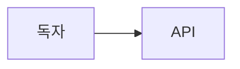

# 본문에 저장되는 Markdown

웹은 GFM Markdown에 내부 이미지·위키·주석·수식·Mermaid·안전 접기를 더함. MCP의 `body`에는 아래 **완성된 원문**을 보냄. CodeMirror는 원문을 그대로 저장하므로 `/표` 같은 문자열을 자동 블록 명령으로 해석하지 않음.

## 기본 블록과 인라인

```markdown
# 큰 제목
## 중간 제목
### 작은 제목

문단에 **굵게**, *기울임*, ~~취소선~~, `inline code`, [일반 링크](https://example.com)를 사용.

- 글머리
1. 번호
- [ ] 할 일
- [x] 끝난 일

> 인용

---
```

첫 줄이 머리글인 GFM 표는 **머리글 다음 구분 행**이 있어야 실제 표로 저장됨. 정렬은 `:---` 왼쪽, `:---:` 가운데, `---:` 오른쪽. 셀의 문자 `|`는 `\|`로 이스케이프. 표는 CodeMirror에서 원문으로 편집하고 오른쪽 미리보기에서 렌더를 확인.

```markdown
| 이름 | 의미 | 값 |
| :--- | :---: | ---: |
| API | 응답 | 200 |
| A\|B | 두 값 | 2 |
```

언어 지정 코드는 fenced block. 코드 안의 이미지·위키·주석 표기는 참조가 아님. 정확한 소문자 `mermaid` 정보 문자열의 독립 fence만 다이어그램으로 렌더됨. `Mermaid`나 다른 옵션이 붙은 fence는 일반 코드. 코드·도식은 닫는 fence까지 작성.

````markdown
```kotlin
val answer = 42
```


````

KaTeX 수식은 한 줄 안의 엄격한 `$x^2$` 또는 단독 `$$` 줄로 감싼 블록. 인라인 `$` 바로 뒤나 닫는 `$` 바로 앞에 공백을 넣지 않음. 코드·이미지 설명의 달러는 수식 아님. TeX가 지원하는 구문인지 미리보기 확인.

```markdown
면적은 $\pi r^2$ 입니다.

$$
\int_0^1 x^2\,dx=\frac{1}{3}
$$
```

## 내부 첨부 이미지

`blog_upload_image`로 JPEG/PNG를 업로드하고 READY 응답의 ID를 사용. 내부 렌더는 `attachment:<양수 안전 정수 ID>` 주소만 허용하며 원격 이미지 URL은 내부 첨부가 아님. 새 독립 이미지 블록의 원문 형식:

```markdown


```

설명은 대체 텍스트와 캡션에 같이 사용. 선택적 `dark=<양수 안전 정수 ID>`는 `w`·`a` 앞에 두며 다크 테마에서 해당 첨부로 자동 교체. `dark`가 없으면 두 테마 모두 기본 첨부 사용. 이미지 편집에서 설명·폭·정렬을 바꾸어도 다크 첨부 연결 보존. ID 상한은 `9007199254740991`.

`w`는 20~100 정수 퍼센트, `a`는 `left`/`center`/`right`. `w` 값은 원문에서 직접 20~100 정수로 지정. 설명에 Markdown 특수문자·`|`가 있으면 이스케이프. 옛 ``은 100% 가운데로 표시됨.

실제 표시 가능한 이미지의 기본·다크 ID를 모두 `attachmentIds`에 오름차순·중복 없이 포함. 위 두 예시를 함께 쓰면 `attachmentIds: [42, 52, 53]` 선언 필요. 일반 링크의 URL, 코드 예시, 주석 본문, 수식·HTML 안의 이미지 문자열은 포함하지 않음. 참조 스타일 이미지 `![설명][키]`는 정의의 주소가 유효한 경우에만 포함하므로 그 형식을 사용했다면 미리보기와 선언을 세심히 대조.

## 위키 링크와 주석

`[[정확한 글 제목]]` 또는 `[[정확한 글 제목|보이는 글자]]`. 대상은 slug가 아니라 제목. `blog_resolve_wiki_targets`는 한 번에 최대 20개를 출간 글과 대조하며 관리자에게 대상 존재 여부와 주소를 돌려줌. 본문의 실제 위키 제목을 등장 순서대로 중복 없이 `wikiTargets`에 넣음. 최대 128개, 제목은 공백을 다듬은 1~200 codepoint. 표시명은 비어 있으면 안 되며 2048 codepoint 이하. 참조는 코드·이미지 설명·일반 링크·HTML 안에서 세지 않음. 유효한 주석 본문 속 위키 링크는 선언 대상이 될 수 있으므로 확인 필요.

`[* 내용]`은 자동 번호의 익명 주석. `[*A 내용]`은 이름 A의 정의, `[*A]`는 같은 주석의 재참조. 이름 있는 주석은 문서 안의 유효한 정의가 있어야 렌더됨. 주석 본문은 한 줄의 짧은 안전한 인라인 Markdown(최대 2048자); 복잡한 블록·이미지·HTML은 일반 원문으로 남을 수 있음.

```markdown
이 결정은 이전 글[[캐시 설계|설계 기록]]에 근거합니다.[* 측정 범위는 공개 요청만 포함]
동일한 근거를 다시 씁니다.[*근거 측정 날짜: 2026-09-27] 다음 문단에도 표시.[*근거]
```

## 접기

새 접기는 안전한 `<details><summary>제목</summary>…</details>` 원문. 안쪽에 Markdown 문단·목록·표·이미지 등을 둘 수 있음. 기존 접기 원문은 그대로 보존하고 오른쪽 미리보기에서 표시를 확인. 이미지·위키 선언은 접기 **안쪽의 실제 표시 내용**까지 포함해야 함.

```html
<details>
<summary>실험 기록</summary>

| 조건 | 결과 |
| --- | --- |
| A | 통과 |

</details>
```

## 선언의 정확도

관리자 편집기는 원문 렌더 결과를 기준으로 첨부·위키 선언을 확인. MCP 서버의 `McpBodyDeclarations`는 단순 문단·위키·독립 내부 이미지에서만 완전 일치를 강제함. 표, 링크, 참조 정의, 코드, 수식, 주석, HTML, 접기, 이스케이프가 있으면 `complete=false`; 반환된 후보 목록은 **전체 목록이 아님**. 그 경우 완성 원문을 미리보기로 점검하고 두 배열을 명시적으로 유지. 원본 글의 코드 예시 속 가짜 링크를 선언에 추가하거나 이전 선언을 무심코 상속하지 않음.
